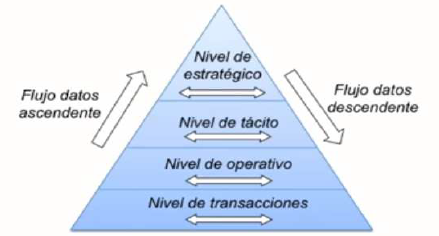
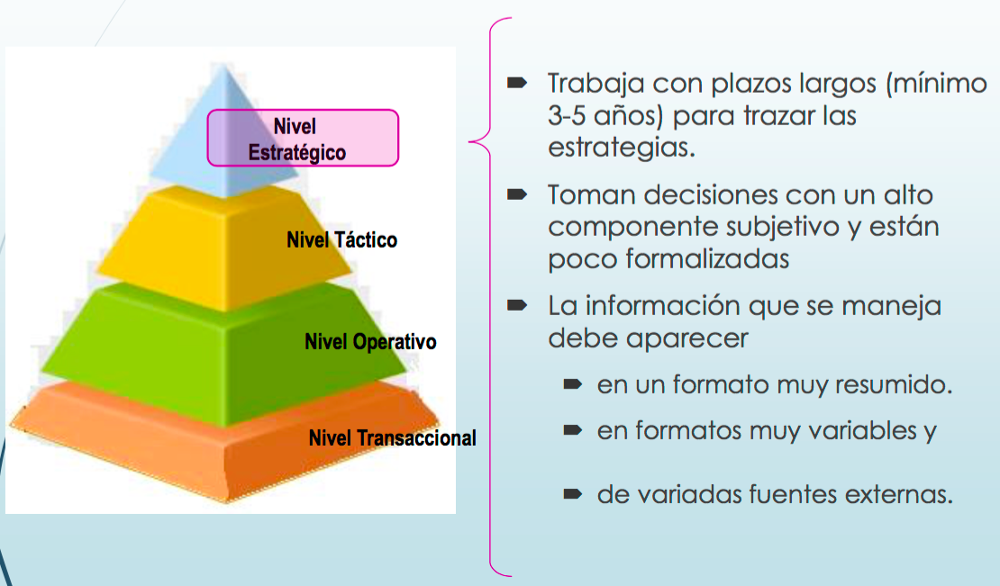
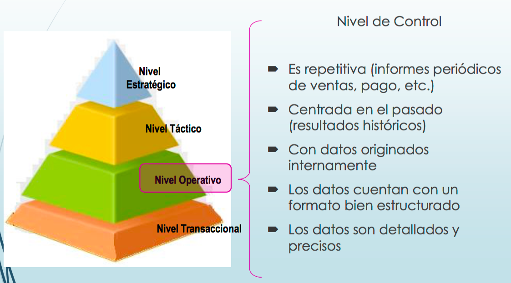
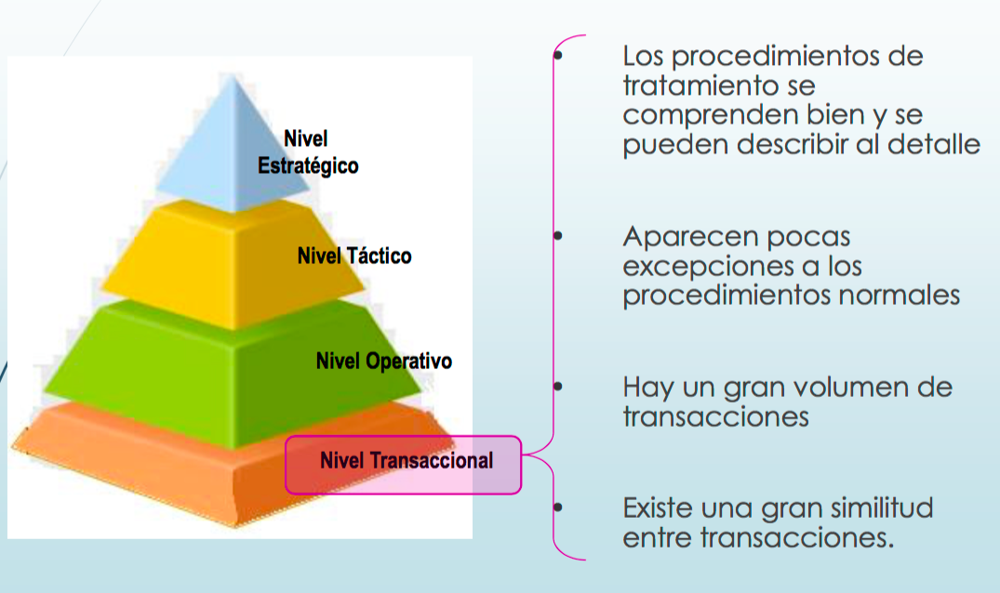

La informática consiste básicamente en el procesamiento automático de la información. Si una empresa tiene como una de sus principales actividades la generación, gestión y análisis de cierta información, parece lógico pensar que la tecnología de la información va a desempeñar un papel importante en la gestión empresarial.

La informática hace mucho más que ayudar a las empresas a crear presentaciones profesionales y reportes de ventas impresionantes. Los ordenadores pueden automatizar tareas que consumen mucho tiempo, dando ideas a los desarrolladores para crear programas que resuelvan una gran variedad de problemas. Ya seas dueño de una joyería o de una multinacional como Sony, la informática te ayudará a mejorar la gestión de tu negocio.

<figure markdown="span" align="center">
  { width="50%"  }
  <figcaption>Informática en la Empresa.</figcaption>
</figure>

Veamos algunas de las **formas en que la informática puede ayudar**te a gestionar tu empresa.

## Gestión de Datos

Las tareas de **gestión de datos son la base de muchas de las actividades que realizan las empresas**. La informática permite organizar y manipular grandes cantidades de información de forma productiva. Las empresas pueden usar bases de datos para monitorizar sus operaciones.

Independientemente del tamaño de tu empresa, es probable que trabajes con información y necesites almacenarla. Los sitios web de comercio electrónico también utilizan software de bases de datos para vender productos e incluso permitir que las personas se registren en sus plataformas. Si tu empresa tiene un sitio web, puedes configurar el software de gestión de datos tú mismo o contratar a una empresa para que lo haga por ti.

## Gestión de Oficina y Almacén

Muchas empresas obtienen ingresos mediante la compra y venta de productos con un margen de beneficio, y la informática ayuda a **gestionar** todo ese **inventario** y **materiales** de manera **eficiente**. Los grandes almacenes, por ejemplo, utilizan software de gestión de inventario sofisticado que puede ser desarrollado por sus propios departamentos de IT o adaptaciones de productos estándar. Estas aplicaciones permiten a las compañías asegurarse de que los productos estén disponibles en las tiendas cuando los clientes los necesitan. Los ordenadores también son útiles para rastrear y administrar suministros básicos como papel de impresora, lápices y otros materiales de oficina.

## Gestión de Personal

**Comunicarse** con un compañero que está en la oficina de al lado no suele ser un problema, pero coordinar reuniones cuando las personas están en distintas ubicaciones puede ser un desafío. El software informático permite **realizar reuniones** virtuales a través de Internet y facilita que todos en la empresa compartan un calendario común. Algunas empresas buscan aumentar la productividad controlando los ordenadores que usan sus empleados. Monitorearlos permite hacer seguimiento de las horas facturables e identificar actividades rentables. Si haces seguimiento del tiempo o planificación de reuniones, una herramienta de software puede ayudarte.

## Gestión de Contabilidad y Facturación

Cuando llega la temporada de impuestos, estos pueden prepararse accediendo a los registros financieros mantenidos durante el año en un ordenador. El software de contabilidad ayuda a gestionar el dinero, crear presupuestos, seguir ventas y controlar el uso de recursos. Estas aplicaciones ofrecen soluciones para empresas de todos los tamaños. Incluso puedes encontrar programas de contabilidad y facturación accesibles desde la web, algunos gratuitos hasta cierto límite. Si los miembros de tu organización necesitan acceder y compartir información contable desde múltiples ubicaciones, esta puede ser una solución ideal. También encontrarás programas de hojas de cálculo útiles para tareas como listas de asistencia o gestión de nóminas.

## **Ventajas** de aplicar la informática a la gestión empresarial

- **Reducción de errores** humanos
- **Ahorro** de **tiempo** y **costes**
- **Mejora** en la toma de **decisiones**
- **Acceso** remoto a la **información**
- Mayor **seguridad** y trazabilidad
- **Automatización** de procesos repetitivos

La informática no solo mejora la eficiencia operativa, sino que también permite a las empresas adaptarse a entornos cambiantes, responder con agilidad a las demandas del mercado y ofrecer un mejor servicio al cliente.

## Sistemas de Información Empresarial

Los sistemas de información (SI) son herramientas que permiten la automatización de tareas, la organización de la información y la mejora de procesos en la empresa. Se estructuran en niveles jerárquicos que responden a diferentes necesidades operativas, tácticas y estratégicas.

### Niveles de los Sistemas de Información

<figure markdown="span" align="center">
  { width="85%"  }
  <figcaption>Pirámide de los Sistemas de Información.</figcaption>
</figure>

| Nivel | Tipo de Sistema | Ejemplos |
|-------|------------------|----------|
| Estratégico | ESS (Executive Support Systems), BI (Business Intelligence) | SAP BI, Power BI |
| Táctico | DSS (Decision Support Systems) | Sistemas de análisis predictivo |
| Operativo | MIS (Management Information Systems) | Informes periódicos, KPIs |
| Transaccional | TPS (Transaction Processing Systems), OAS (Office Automation Systems) | ERP, CRM, DMS |

- Nivel Estratégico
- 
<figure markdown="span" align="center">
  { width="85%"  }
  <figcaption>Pirámide de los Sistemas de Información. Nivel Estratégico</figcaption>
</figure>

- Nivel Táctico

<figure markdown="span" align="center">
  { width="85%"  }
  <figcaption>Pirámide de los Sistemas de Información. Nivel Táctico</figcaption>
</figure>

- Nivel Operativo
  
<figure markdown="span" align="center">
  { width="85%"  }
  <figcaption>Pirámide de los Sistemas de Información. Nivel Operativo</figcaption>
</figure>

- Nivel Transanccional 

<figure markdown="span" align="center">
  { width="85%"  }
  <figcaption>Pirámide de los Sistemas de Información. Nivel Transaccional</figcaption>
</figure>

### Tipos de Sistemas de Información

#### TPS – Transaction Processing System

Los sistemas de procesamiento de transacciones son los sistemas empresariales básicos que sirven al nivel de operaciones y de transacciones de la organización. Efectúan y registran las transacciones diarias rutinarias. Ejemplos típicos son las entradas y salidas de pedidos, o los sistemas de reserva de líneas aéreas. Algunas de las propiedades o características de estos sistemas son que automatizan tareas operativas en una organización, y se basan en cálculos y procesos sencillos.

Además, deben ser de respuesta rápida, fiables e inflexible, puesto que no pueden aceptar información distinta a la establecida.

#### OAS – Office Automation System

Los sistemas de automatización de oficinas consisten en aplicaciones destinadas a ayudar al trabajo diario del administrativo de una organización, como los procesadores de textos, las hojas de cálculo, los editores de presentaciones, etc., que agrupados forman las suites ofimáticas, utilizadas para aumentar la productividad de la empresa.

Algunos OAS conocidos son Microsoft Office, iWork (propiedad de Apple), y LibreOffice, con licencia libre. Además, las últimas tendencias utilizan la operatividad en la nube, mediante paquetes como Google Docs en Google Drive, o el propio Microsoft Office 365. En sistemas móviles Android también existen suites ofimáticas como las propias de Microsoft, Apple y Google.

Tanto los TPS como los OAS son sistemas que operan a nivel de transacciones, es decir, en el nivel más bajo de la pirámide de funcionamiento vista anteriormente.

#### **MIS** – Management Information System

Los sistemas de gestión de información son un tipo de sistemas de información que recopilan y procesan información de diferentes fuentes tales como los TPS para ayudar en la toma de decisiones en lo referente a la gestión de la organización.

Sirven a los administradores interesados en resultados semanales, mensuales y anuales y suelen contestar a preguntas estructuradas que se conocen con mucha antelación. Funcionarían en el nivel operativo, para tomar decisiones a corto plazo. 

#### **DSS** – Decision Support System

Los sistemas de apoyo a la toma de decisiones combinan datos y modelos analíticos avanzados o herramientas de análisis de datos, para apoyar la toma de decisiones semiestructurada y no estructurada y que cambian rápidamente.

Se basa en el análisis multidimensional que permite profundizar en la información hasta llegar a un alto nivel de detalle para pronosticar lo que puede ocurrir en el futuro, análisis de tendencias, análisis prospectivo, etc. Se emplearían en el tercer nivel piramidal visto antes, el táctico.

#### ESS – Executive Support System

Los sistemas de apoyo a ejecutivos están diseñados para apoyar la toma de decisiones no estructuradas, mediante gráficos y comunicaciones avanzados. Estos sistemas filtran, comprimen y rastrean datos cruciales.

Permiten hacer estimaciones de ventas a 5 años, diseñar el plan operativo, hacer previsiones de presupuestos y estimaciones de beneficios de los próximos años. Son, por tanto, sistemas para toma de decisiones a largo plazo, y operarían en el nivel estratégico de la pirámide anterior, en la cima de la pirámide. 

#### BI – Business Intelligence

El BI o Inteligencia Empresarial o Inteligencia de Negocios, es el conjunto de procesos requeridos para ofrecer una solución informática que nos permita analizar cómo está funcionando una empresa de forma que se optimice su funcionamiento mediante la toma de decisiones pertinentes. Se apoya en gran medida en el Big Data con el análisis de datos y el desarrollo de los mismos.
Podemos distribuir las soluciones de inteligencia de negocio en tres categorías:

- Herramientas para la gestión de datos (del inglés, data management tools).    Permiten desde la depuración y estandarización de datos de procedencia diversa hasta su extracción, transformación y traslado a un determinado sistema.
- Las aplicaciones para descubrir nuevos datos (del inglés, data discovery applications). Permiten recopilar y evaluar nueva información (datamining o minería de datos), y aplicar sobre esa información nueva o sobre la ya disponible técnica de análisis predictivo para realizar proyecciones de futuro.
- Herramientas de reporting. Una vez recopilada y tratada toda esa información preexistente o nueva, ayudan a las empresas a visualizarla de manera gráfica e intuitiva. También sirven para integrarla en cuadros de mando que midan si se cumplen o no determinados KPIs (Key Performance Indicator), o pueden incluso generar todo tipo de informes de reporting.
Todos los ERPs actuales ofrecen herramientas BI, además como ejemplo tenemos QLinkView, Microsoft Power BI, Oracle BI, SAP BI, IBM BI… 

### Elementos de un **Sistema de Información**

- **Procedimientos**: Conjunto de reglas y métodos que definen cómo se debe operar el sistema.
- **Información**: Datos estructurados que se convierten en conocimiento útil para la empresa.
- **Usuarios**:

    - *Directos*: Empleados que interactúan con el sistema.
    - *Indirectos*: Clientes, proveedores, socios.
    - *Administradores*: Responsables del mantenimiento y configuración.
    - *Directivos*: Toman decisiones basadas en la información proporcionada.
  
- **Equipos**: Hardware y software que soportan el funcionamiento del sistema.

### Importancia de los ***SI*** en la empresa

Los sistemas de información permiten:

- Automatizar procesos
- Mejorar la eficiencia operativa
- Facilitar la toma de decisiones
- Reducir costes
- Aumentar la competitividad
- Cumplir con normativas y estándares

Su correcta implementación y uso son fundamentales para el éxito de cualquier organización moderna.

---

_Licenciado bajo la [Licencia Creative Commons Atribución Compartir Igual 4.0](http://creativecommons.org/licenses/by-sa/4.0/)_

