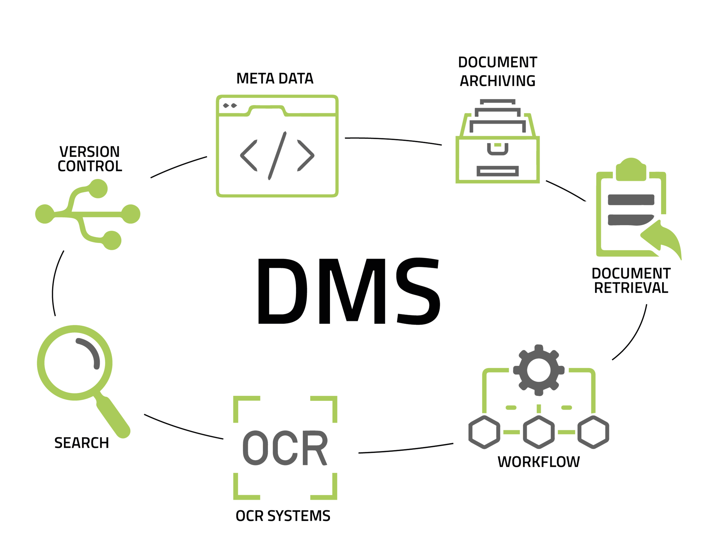
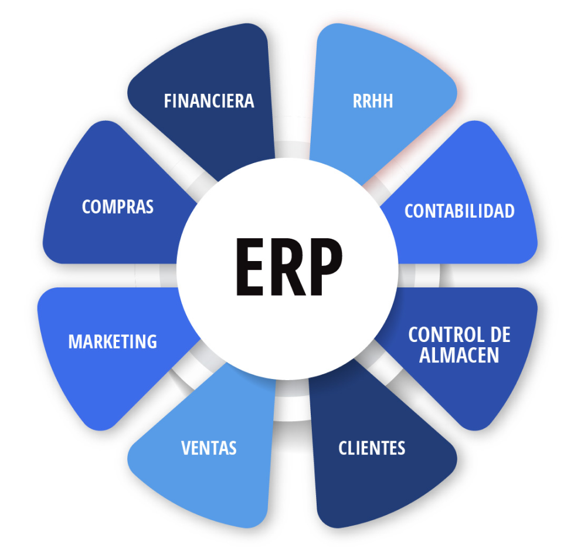
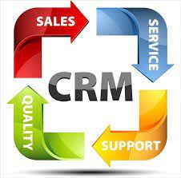
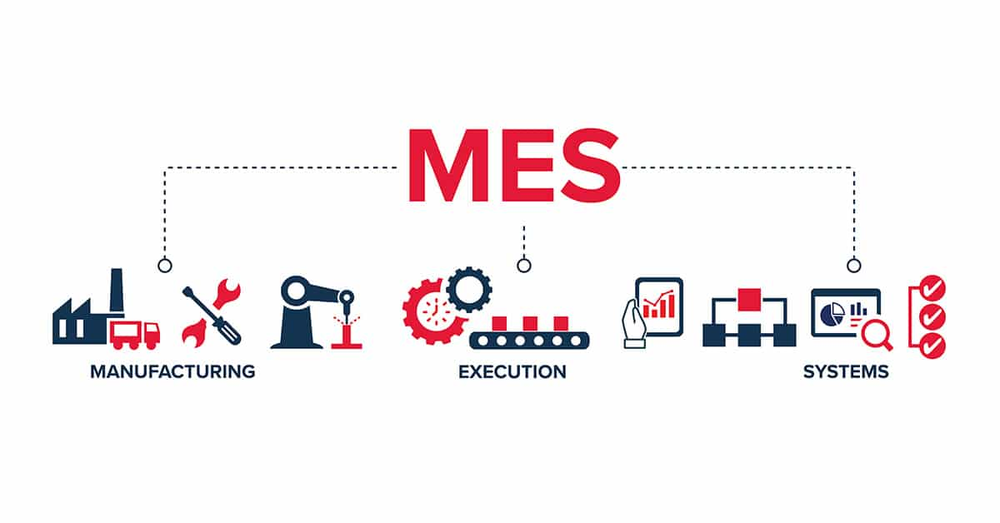
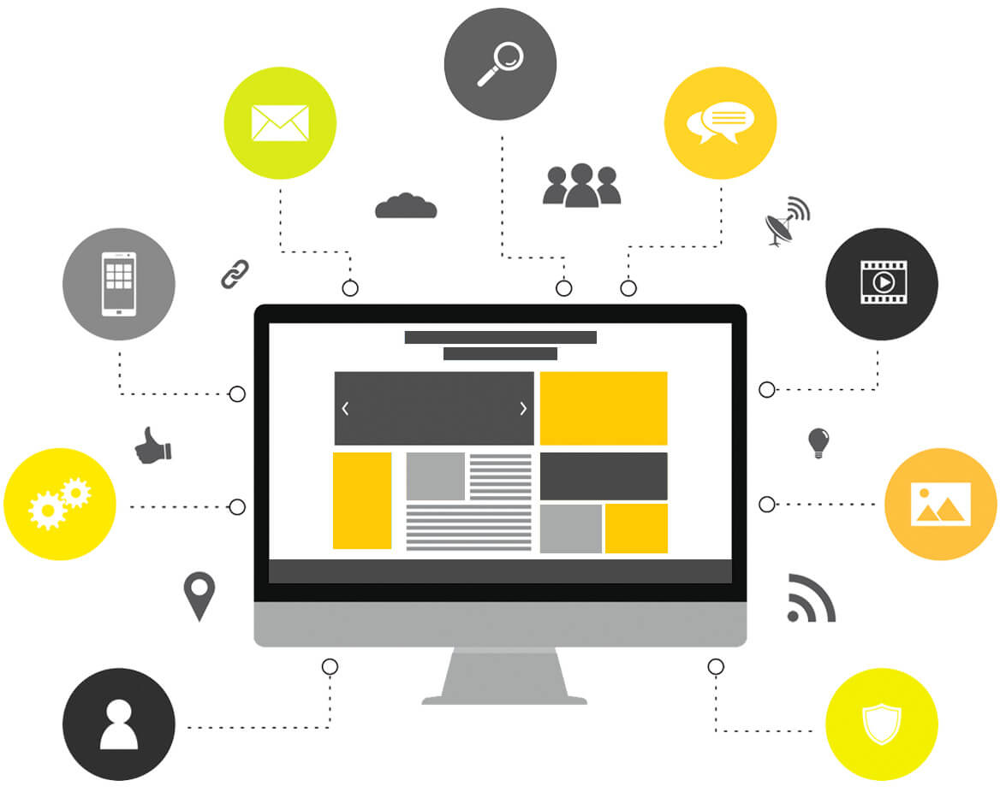

Los sistemas clave dentro de un sistema empresarial son los siguientes: 

## **DMS** – Document Management System

Un sistema de gestión documental (DMS) es un software que permite almacenar, gestionar y controlar documentos electrónicos. Su objetivo es facilitar el acceso, la seguridad, la trazabilidad y la colaboración en torno a la documentación de la empresa.

### Características principales

- **Almacenamiento centralizado**: Todos los documentos se guardan en un repositorio único.
- **Control de versiones**: Se mantiene un historial de cambios y versiones anteriores.
- **Seguridad**: Gestión de permisos, cifrado y auditoría de accesos.
- **Búsqueda avanzada**: Indexación por metadatos, contenido y etiquetas.
- **Integración**: Compatible con ERP, CRM y otros sistemas empresariales.

!!!Example "Ejemplos de DMS"

    - Alfresco
    - OpenKm
    - SharePoint
    - DocuWare
    - M-Files
    - ¿Administrador de Archivos?

<figure markdown="span" align="center">
  { width="65%"  }
  <figcaption>Sistema de Gestión Documental (DMS).</figcaption>
</figure>

---

## ERP – Enterprise Resource Planning

Un ERP es un sistema de planificación de recursos empresariales que integra todos los procesos de negocio en una única plataforma. Está compuesto por módulos que gestionan áreas como finanzas, producción, logística, recursos humanos, ventas, compras, etc.

### Características del ERP

- **Integral**: Cubre todas las áreas funcionales de la empresa.
- **Modular**: Cada módulo puede activarse según las necesidades.
- **Adaptable**: Se configura según el tamaño y sector de la empresa.
- **Interconectado**: Los datos fluyen entre módulos sin duplicidad.

### Tipos de ERP

- **A medida**: Desarrollado específicamente para una empresa.
- **Estándar**: Solución genérica adaptada a múltiples sectores.
- **Local**: Instalado en servidores propios.
- **En la nube**: Acceso remoto, mantenimiento externo.
- **Vertical**: Especializado en un sector (salud, educación, etc.).
- **Horizontal**: Aplicable a cualquier tipo de empresa.
- **Código abierto**: Libre acceso al código fuente.
- **Propietario**: Licencia cerrada, soporte del fabricante.

### Módulos comunes

- Finanzas y contabilidad
- Gestión de inventario
- Producción y planificación
- Recursos humanos
- Ventas y marketing
- Compras y proveedores
- Atención al cliente

!!!Example  "Ejemplos de ERP"

    - SAP
    - Microsoft Dynamics 365
    - Oracle E-Business Suite
    - Odoo
    - Sage X3

<figure markdown="span" align="center">
  { width="65%"  }
  <figcaption>Planificación de Recursos Empresariales (ERP).</figcaption>
</figure>

---

## CRM – Customer Relationship Management

El CRM es un sistema que permite gestionar las relaciones con los clientes, desde el primer contacto hasta el servicio postventa. Su objetivo es mejorar la experiencia del cliente, aumentar la fidelización y optimizar las estrategias de marketing y ventas.

### Tipos de CRM

- **Operativo**: Automatiza procesos comerciales como ventas, atención al cliente y marketing.
- **Analítico**: Analiza datos de clientes para identificar patrones, segmentar mercados y predecir comportamientos.
- **Colaborativo**: Facilita la comunicación entre departamentos y canales (teléfono, email, redes sociales).

### Funcionalidades clave

- Gestión de contactos y cuentas
- Seguimiento de oportunidades de venta
- Automatización de campañas de marketing
- Servicio de atención al cliente
- Informes y análisis de rendimiento

!!!Example  "Ejemplos de CRM"

    - Salesforce
    - SugarCRM
    - VTiger
    - Microsoft Dynamics 365
    - Zoho CRM
    - HubSpot

<figure markdown="span" align="center">
  { width="75%"  }
  <figcaption>Gestión de Relaciones con Clientes (CRM).</figcaption>
</figure>

## Otros Sistemas Empresariales

Además de los sistemas ERP, CRM y DMS, existen otras soluciones tecnológicas que permiten gestionar áreas específicas de la empresa con gran eficacia.

### MES – Manufacturing Execution System

El MES es un sistema de ejecución de fabricación que permite controlar y monitorizar la producción en tiempo real. Su objetivo es mejorar la eficiencia, la trazabilidad y la calidad en los procesos industriales.

#### Funcionalidades del MES

- Control de órdenes de producción
- Registro de tiempos y consumos
- Supervisión de maquinaria y operarios
- Gestión de calidad y trazabilidad
- Integración con ERP y sistemas SCADA

!!!Example "Ejemplo destacado"

    **MesBook**, una solución española que ofrece control total de la planta de producción con enfoque en eficiencia y rentabilidad. Valenciana fruto de [Lanzadera](https://lanzadera.es/)

<figure markdown="span" align="center">
  { width="65%"  }
  <figcaption>Manufacturing Execution System.</figcaption>
</figure>

### BI – Business Intelligence

La inteligencia de negocio (BI) es el conjunto de herramientas y metodologías que permiten transformar datos en información útil para la toma de decisiones estratégicas.

#### Componentes de BI

- **ETL (Extract, Transform, Load)**: Procesos para extraer datos de múltiples fuentes, transformarlos y cargarlos en almacenes de datos.
- **Data Warehouse**: Almacén centralizado de datos estructurados.
- **Dashboards**: Paneles visuales con indicadores clave (KPIs).
- **Minería de datos**: Técnicas estadísticas para descubrir patrones ocultos.

!!!Example "Ejemplos de herramientas BI"

    - Power BI
    - Tableau
    - QlikView
    - SAP BusinessObjects
    - Elastic stack

<figure markdown="span" align="center">
  { width="55%"  }
  <figcaption> Business Intelligence.</figcaption>
</figure>

### Webs Corporativas y eCommerce

Las plataformas web permiten a las empresas tener presencia online, ofrecer información institucional y vender productos o servicios a través de tiendas virtuales.

#### Funcionalidades comunes

- Catálogo de productos
- Carrito de compra
- Pasarela de pago
- Gestión de pedidos y envíos
- Integración con ERP y CRM

!!!Example "Ejemplos de plataformas *eCommerce*"

    - Magento
    - PrestaShop
    - WooCommerce
    - Shopify

<figure markdown="span" align="center">
  { width="75%"  }
  <figcaption> Web Corporativa.</figcaption>
</figure>

### Sistemas Específicos por Área

#### Recursos Humanos (RRHH)

- Gestión de nóminas
- Control de asistencia
- Evaluación de desempeño
- Formación y desarrollo
- Reclutamiento y selección

#### Contabilidad y Finanzas

- Presupuestos
- Balances
- Cuentas por cobrar y pagar
- Declaraciones fiscales
- Auditorías

#### Calidad

- Gestión de normas ISO
- Control de calidad en procesos
- Auditorías internas
- No conformidades

#### Mantenimiento

- Mantenimiento preventivo y correctivo
- Gestión de activos
- Planificación de intervenciones
- Registro de incidencias

#### Gestión de Proyectos

- Planificación de tareas
- Asignación de recursos
- Control de tiempos y costes
- Seguimiento de hitos
- Informes de avance

#### BPMS – Business Process Management System

Sistema para modelar, automatizar y optimizar procesos de negocio. Permite definir flujos de trabajo, asignar responsabilidades y medir resultados.

**Ejemplos**: Bizagi, BonitaSoft, Appian

---

_Licenciado bajo la [Licencia Creative Commons Atribución Compartir Igual 4.0](http://creativecommons.org/licenses/by-sa/4.0/)_

