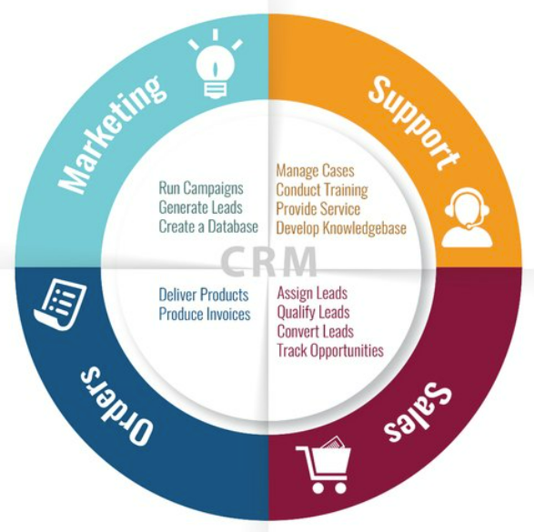

## ¿Qué es un ERP?

??? Tip "Youtube: ¿Qué es un ERP y para qué sirve?"

    

      <iframe width="560" height="315" src="https://www.youtube.com/embed/UDgLVvF9EXE?si=sp2Kr-HAJ5x1oiO9" title="YouTube video player" frameborder="0" allow="accelerometer; autoplay; clipboard-write; encrypted-media; gyroscope; picture-in-picture; web-share" referrerpolicy="strict-origin-when-cross-origin" allowfullscreen></iframe>
    

   

Un ERP (Enterprise Resource Planning o Planificación de Recursos Empresariales) es un sistema diseñado para planificar, modelar y automatizar la mayoría de los procesos de una empresa, tales como: finanzas, área comercial, logística, producción, contabilidad, inventario, etc.

Organiza y unifica toda la información de la empresa en un solo lugar, facilitando así las tareas empresariales. El ERP utiliza una arquitectura modular, y cada módulo se encarga de gestionar un área diferente: finanzas, comercial, logística, producción, contabilidad, inventario…

<figure markdown="span" align="center">
  { width="75%"  }
  <figcaption>Modulos ERP.</figcaption>
</figure>

## Ventajas de un sistema ERP

Las principales ventajas de estos sistemas son:

- Automatización de los procesos empresariales.  
- Disponibilidad de la información de la empresa en una misma plataforma.  
- Integración de las distintas bases de datos en un único programa.  
- Ahorro de tiempo y costes.

Además, el ERP ofrece integración con soluciones de BI (Business Intelligence), lo que permite generar informes sobre el estado de la empresa directamente a partir de los datos del sistema ERP. Esto proporciona un conocimiento detallado y actualizado que resulta esencial para analizar y mejorar procesos internos como marketing, ventas, organización y otros aspectos clave.

## ¿Qué empresas necesitan un sistema ERP?

Un sistema ERP es adecuado para todo tipo de empresas, tanto multinacionales como pymes. Gracias a los diferentes módulos personalizables, cualquier empresa —independientemente de sus procesos o del sector al que pertenezca— puede adaptar su propio ERP.

Existen proveedores especializados en la implementación de determinados ERPs, ya sea por tipo de producto o sector, lo que permite obtener mejores resultados tras su adquisición.

---

## ¿Qué es un CRM?

Un CRM (Customer Relationship Management o Gestión de Relaciones con Clientes) es una solución orientada a gestionar tres áreas básicas: gestión comercial, marketing y atención al cliente o postventa.

El uso de un CRM forma parte de una estrategia centrada en el cliente, en la que todas las acciones tienen como objetivo final mejorar el servicio y la relación con los clientes actuales y potenciales.

La herramienta CRM y la orientación al cliente ofrecen resultados demostrables, tanto por una gestión comercial estructurada que mejora la productividad en ventas, como por el conocimiento profundo del cliente que permite campañas de marketing más efectivas.

Las funciones de atención al cliente de un CRM también fomentan la fidelización y satisfacción del cliente, lo que tiene un impacto muy positivo en términos de ventas recurrentes y cruzadas.

<figure markdown="span" align="center">
  { width="85%"  }
  <figcaption>CRM.</figcaption>
</figure>

---

## Propuesta debate

🔍 Investiga algunos ERPs actuales disponibles en el mercado.

---

_Licenciado bajo la [Licencia Creative Commons Atribución Compartir Igual 4.0](http://creativecommons.org/licenses/by-sa/4.0/)_