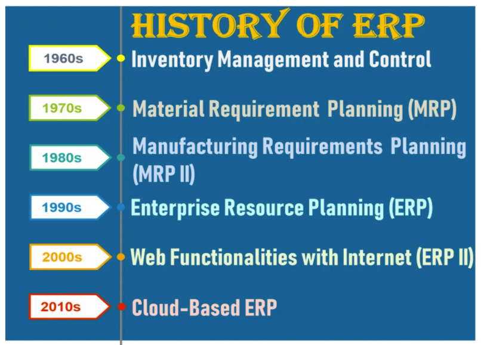
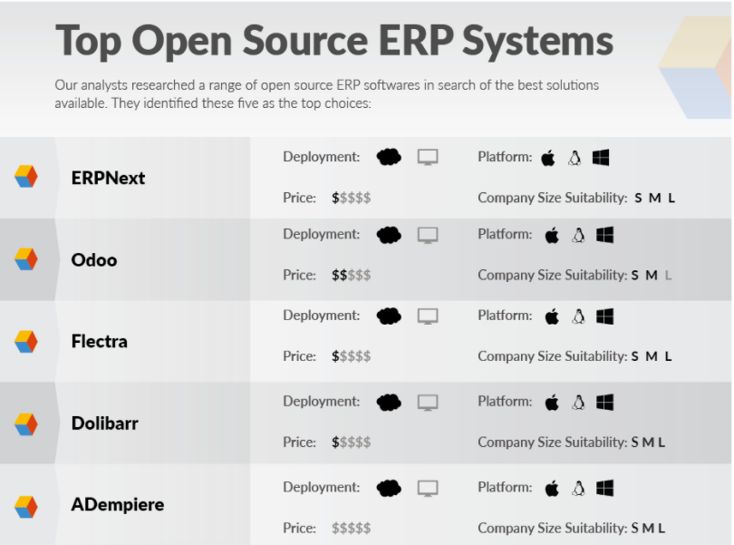
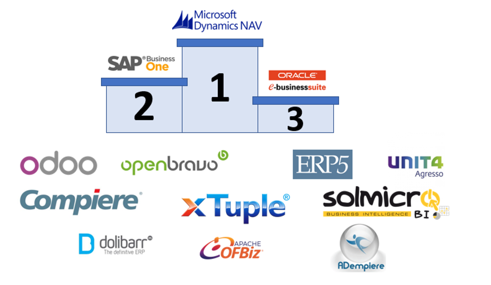

## Historia del ERP

Los sistemas ERP han evolucionado con el tiempo de la siguiente manera:

Los antecedentes del ERP fueron los sistemas MRP (Material Requirements Planning – Planificación de Requerimientos de Materiales).

- En los años 50, los sistemas MRP permitían realizar operaciones como: facturación, administración de nóminas, control de inventario...
- En los años 60 y 70, los MRP evolucionaron ayudando a reducir costes.
- En los años 80, los MRP pasaron a llamarse MRP II (Manufacturing Resource Planning – Planificación de Recursos de Manufactura).
- En los años 90, el MRP II se expandió a áreas como Recursos Humanos, Finanzas, Gestión de Proyectos... dando lugar al ERP.

<figure markdown="span" align="center">
  { width="85%"  }
  <figcaption>Historia del ERP.</figcaption>
</figure>

---

## Clasificación de los ERP

### Según el diseño

- **ERP a medida**: Es la solución más costosa, ya que se desarrolla específicamente para una empresa concreta. Se adapta al 100% al negocio, pero su principal inconveniente es el alto coste.
- **ERP estándar**: Tiene la ventaja de estar probado y ser más fácil de implementar. Gracias a sus módulos adicionales, es altamente personalizable y más económico que uno a medida. Muy utilizado por pequeñas empresas.

### Según la instalación

- **ERP local**: Los servidores y dispositivos están instalados en la propia empresa. Su uso se limita a los equipos donde está instalado.
- **ERP en la nube**: Los servidores están alojados en la nube, lo que permite acceder desde cualquier dispositivo con conexión a Internet. La información se guarda en los servidores del proveedor, que suelen realizar copias de seguridad para evitar pérdidas.

### Según solución vertical u horizontal

- **ERP vertical**: Diseñado específicamente para un sector concreto. Por ejemplo, bodegas y hospitales suelen usar este tipo de ERP.
- **ERP horizontal**: Puede servir para cualquier empresa, aunque requiere más adaptación que uno vertical.

### Según el tipo de software

- **ERP de código abierto**: Permite acceder libremente al código fuente, lo que facilita su modificación sin pagar al desarrollador. Requiere personal informático capacitado. Su principal inconveniente es el tiempo necesario para desarrollar los módulos personalizados.

<figure markdown="span" align="center">
  { width="85%"  }
  <figcaption>ERP de Código Abierto.</figcaption>
</figure>

- **ERP de código privado**: No permite acceso al código fuente. Solo puede ser modificado por los desarrolladores. Las pymes suelen optar por este tipo de ERP, ya que no requieren funcionalidades muy específicas.

<figure markdown="span" align="center">
  { width="85%"  }
  <figcaption>Ranking ERPs.</figcaption>
</figure>

---

## Características de los ERP

Las principales características de un sistema ERP son:

- **Integral**: Todas las áreas de la empresa se comunican e intercambian información durante la ejecución de los procesos. La gestión y control deben estar integrados para evitar duplicidades y asegurar eficiencia y trazabilidad.
- **Modular**: Cada empresa tiene procesos y departamentos distintos. El ERP debe permitir elegir los componentes necesarios: compras, ventas, materiales, finanzas, almacén, recursos humanos, etc.
- **Adaptable**: Debe poder configurarse según los procesos, estándares y parámetros específicos de cada empresa.

---

## Actividad 2

📌 Clasifica los ERPs que has investigado en la actividad 1 según sus características.

---

_Licenciado bajo la [Licencia Creative Commons Atribución Compartir Igual 4.0](http://creativecommons.org/licenses/by-sa/4.0/)_