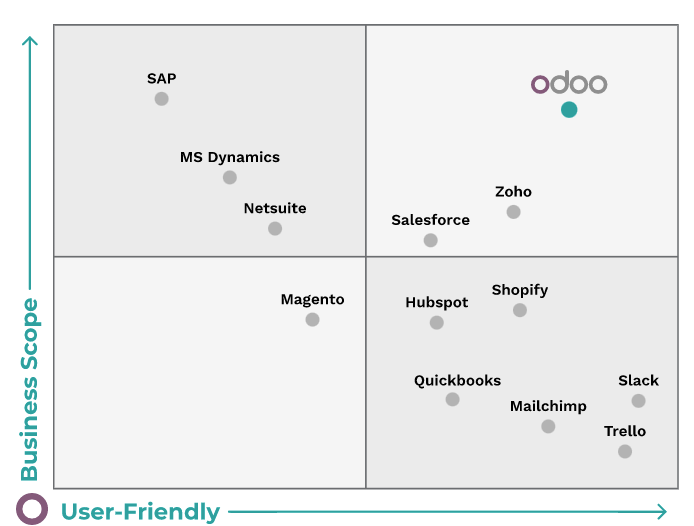
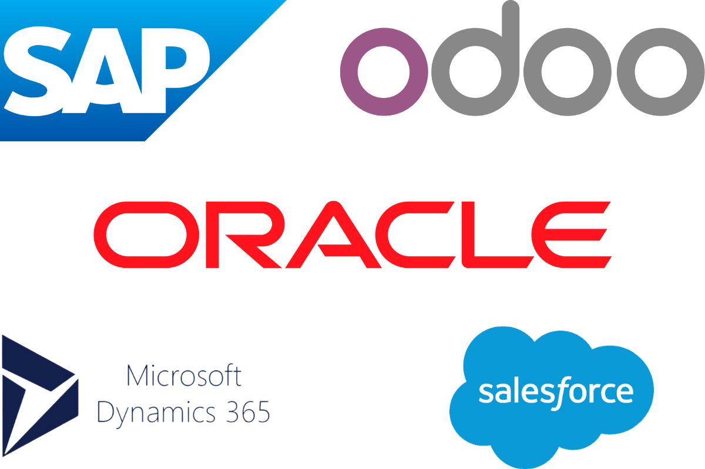

## Comparativa entre ERPs

Los ERPs propietarios son elegidos por muchas empresas por la seguridad que ofrece trabajar con grandes compañías especializadas en desarrollo de software. Además, estos ERPs suelen ser más intuitivos en su uso gracias a interfaces más refinadas.

Sin embargo, las pequeñas y medianas empresas no tienen necesidades tan complejas; buscan módulos flexibles y personalizables. Esto hace que los ERPs de software libre sean más atractivos para este tipo de empresas.

Para resolver problemas de soporte y facilidad de uso, las organizaciones que desarrollan ERPs de software libre ofrecen tutoriales que ayudan al usuario a entender el entorno de aplicación. Además, gracias al crecimiento de este tipo de soluciones, los desarrolladores están creando software cada vez más estético y manejable. Al tener acceso al código fuente, los errores pueden compartirse y corregirse por otros usuarios.

## Costes e implementación

Software como SAP u Oracle requiere una gran inversión inicial, no solo por la compra de la licencia, sino también por los costes derivados del proceso de implementación. Muchas empresas, tanto grandes como pequeñas, no pueden asumir estos gastos, por lo que optan por ERPs como Odoo o Dolibarr.

El proceso de implementación con software propietario es más sencillo en cuanto a complejidad, pero suele ser más lento que con software de código abierto. La mayoría de estos ERPs son modulares, lo que permite a las empresas instalar solo los módulos necesarios, reduciendo así el tiempo de instalación.

## Tendencias del mercado

En cuanto a la situación del mercado, los ERPs de código abierto están ganando terreno frente a las soluciones propietarias. Aunque llegaron más tarde, han conseguido ponerse al día.

Además de los factores mencionados y las posibilidades que ofrecen, otro punto clave que ha contribuido a su éxito ha sido el desarrollo de aplicaciones compatibles con ERPs existentes. Es decir, estos sistemas de gestión de software libre han logrado trabajar conjuntamente con módulos ofrecidos por ERPs propietarios.

Incluso en un escenario donde todos los consumidores optaran por software propietario, la presencia del software libre como alternativa reduce los precios, aumentando su valor. Esta compatibilidad se deriva de los efectos de red: las relaciones entre empresas, como clientes y proveedores en logística y compras, hacen que estas interconexiones sean un factor competitivo clave.

## Elección del ERP

Al elegir entre un software u otro, es importante tener en cuenta diversos factores y definir claramente las necesidades que queremos cubrir en nuestra empresa tras la instalación de un ERP.

<figure markdown="span" align="center">
  { width="85%"  }
  <figcaption>Matriz de decisión de ERPs.</figcaption>
</figure>

Claro, Sergio. Aquí tienes la sección completada con una descripción detallada de la tabla y comentarios avanzados que contextualizan y enriquecen el análisis de los principales sistemas ERP-CRM del mercado:

## Principales Sistemas ERP-CRM del Mercado

<figure markdown="span" align="center">
  { width="50%"  }
  <figcaption>Logos de principales ERPs.</figcaption>
</figure>

A continuación se presentan algunos de los principales sistemas ERP y CRM disponibles actualmente. Esta tabla resume sus tipos y una breve descripción que permite identificar sus principales características y enfoques empresariales.

| Sistema                | Tipo     | Descripción breve                                                                 |
|------------------------|----------|-----------------------------------------------------------------------------------|
| SAP ERP                | ERP      | Solución robusta para grandes empresas, altamente personalizable.                |
| Oracle NetSuite        | ERP      | ERP en la nube, ideal para medianas empresas.                                     |
| Microsoft Dynamics 365 | ERP/CRM  | Plataforma integrada que combina ERP y CRM.                                       |
| Salesforce             | CRM      | Líder en gestión de relaciones con clientes, basado en la nube.                  |
| Zoho CRM               | CRM      | Solución asequible para pymes, con buena integración.                            |
| Odoo                   | ERP/CRM  | Software libre modular, adaptable a múltiples necesidades.                       |
| Sage X3                | ERP      | ERP orientado a la gestión financiera y producción.                              |

La tabla muestra una clara diferenciación entre sistemas orientados a la planificación de recursos empresariales (ERP) y aquellos centrados en la gestión de relaciones con clientes (CRM). Algunos productos, como **Microsoft Dynamics 365** y **Odoo**, ofrecen una solución híbrida que permite integrar ambos mundos, lo cual es especialmente útil para empresas que buscan una plataforma unificada.

**Escalabilidad y tamaño empresarial**

- **SAP ERP** y **Oracle NetSuite** están diseñados para empresas medianas y grandes, con necesidades complejas de gestión financiera, logística y producción.
- **Zoho CRM** y **Odoo**, por su flexibilidad y coste reducido, son opciones atractivas para pymes y startups que requieren una solución funcional sin grandes inversiones iniciales.

**Modelo de despliegue**

- **Salesforce**, **NetSuite** y **Zoho CRM** operan bajo modelos SaaS (Software as a Service), lo que facilita su implementación y mantenimiento, al tiempo que reduce la necesidad de infraestructura local.
- **SAP ERP** y **Sage X3** suelen requerir instalaciones locales o híbridas, lo que implica mayor control pero también mayor complejidad técnica.

**Licenciamiento y comunidad**
- **Odoo** destaca por su modelo de código abierto, lo que permite personalizaciones profundas y una comunidad activa que contribuye a su evolución.
- En contraste, **SAP**, **Salesforce** y **Microsoft Dynamics** operan bajo licencias propietarias, con soporte profesional y garantías de servicio, aunque a un coste más elevado.

**Integración y compatibilidad**
- **Microsoft Dynamics 365** se integra de forma nativa con el ecosistema de Microsoft (Office, Azure, Power BI), lo que lo convierte en una opción estratégica para empresas que ya utilizan estas tecnologías.
- **Salesforce** ofrece una amplia gama de integraciones con herramientas de marketing, atención al cliente y análisis de datos, siendo especialmente fuerte en entornos comerciales.

**Reflexión Técnica**

La elección de un sistema ERP-CRM no debe basarse únicamente en su popularidad o coste, sino en una evaluación profunda de los procesos internos de la empresa, su proyección de crecimiento, y la capacidad técnica del equipo para implementar y mantener la solución. Además, es fundamental considerar aspectos como:

- Requisitos de hardware y software
- Capacidad de personalización
- Soporte técnico y formación
- Seguridad y cumplimiento normativo (GDPR, ISO, etc.)

### Tipos de Licencia de los Sistemas ERP-CRM

Los sistemas ERP-CRM pueden distribuirse bajo diferentes modelos de licencia:

- **Propietaria**: Requiere pago por uso o suscripción. Ejemplo: SAP, Salesforce.
- **Software Libre / Open Source**: Código abierto, permite modificación y distribución. Ejemplo: Odoo, ERPNext.
- **Freemium**: Versión gratuita con funcionalidades limitadas, ampliables mediante pago. Ejemplo: Zoho CRM.
- **SaaS (Software as a Service)**: Acceso mediante suscripción en la nube. Ejemplo: NetSuite, Dynamics 365.

Tabla Comparativa de tipo de licencia de Sistemas ERP-CRM

| Característica         | SAP ERP     | Odoo         | Salesforce   | Dynamics 365 | Oracle NetSuite |
|------------------------|-------------|--------------|--------------|---------------|------------------|
| Tipo                   | ERP         | ERP/CRM      | CRM          | ERP/CRM       | ERP              |
| Licencia               | Propietaria | Libre        | SaaS         | SaaS          | SaaS             |
| Escalabilidad          | Alta        | Media-Alta   | Alta         | Alta          | Alta             |
| Personalización        | Completa    | Modular      | Alta         | Alta          | Alta             |
| Integración            | Compleja    | Sencilla     | Excelente    | Excelente     | Excelente        |
| Coste                  | Elevado     | Bajo-Medio   | Medio-Alto   | Medio-Alto    | Medio-Alto       |
| Comunidad/Soporte      | Amplio      | Activa       | Profesional  | Profesional   | Profesional      |

### Sistemas Operativos Recomendados

Cada sistema ERP-CRM tiene requisitos específicos de sistema operativo, que dependen de su arquitectura, modelo de despliegue (local o en la nube), y compatibilidad con otros componentes del sistema.

| Sistema ERP-CRM         | SO Recomendado                          |
|--------------------------|------------------------------------------|
| **SAP ERP**              | Windows Server, Linux                   |
| **Odoo**                 | Linux (Ubuntu, Debian)                  |
| **Salesforce**           | Web-based (independiente del SO)        |
| **Dynamics 365**         | Windows Server, Web-based               |
| **Zoho CRM**             | Web-based                               |
| **Oracle NetSuite**      | Web-based (independiente del SO)        |

La tabla presentada ofrece una visión clara y comparativa de los sistemas operativos recomendados para distintos ERP-CRM, destacando cómo el modelo de despliegue influye directamente en los requisitos técnicos. Se observa que las soluciones tradicionales como **SAP ERP** y **Odoo** requieren entornos específicos (Windows Server o distribuciones Linux), mientras que las plataformas modernas basadas en la nube —como **Salesforce**, **Zoho CRM** y **Oracle NetSuite**— eliminan esa dependencia, permitiendo acceso multiplataforma desde cualquier sistema operativo con navegador web.

Este enfoque refleja la evolución del software empresarial hacia modelos SaaS, donde la infraestructura local pierde protagonismo frente a la flexibilidad, escalabilidad y accesibilidad que ofrece la nube. Además, facilita la adopción en organizaciones con entornos heterogéneos, reduciendo barreras técnicas y mejorando la experiencia del usuario final.

En conjunto, la tabla sirve como herramienta útil para orientar decisiones de implementación según las capacidades del entorno informático disponible.

### Sistemas Gestores de Bases de Datos asociados a los principales ERP-CRM

Los sistemas ERP-CRM requieren una base de datos robusta, escalable y segura para almacenar y gestionar grandes volúmenes de información empresarial. La elección del SGBD influye directamente en el rendimiento, la capacidad de integración y la escalabilidad del sistema.

| Sistema ERP-CRM         | SGBD Compatible/Recomendado         |
|--------------------------|-------------------------------------|
| **SAP ERP**              | SAP HANA, Oracle, SQL Server        |
| **Oracle NetSuite**      | Oracle Cloud Infrastructure (OCI)   |
| **Odoo**                 | PostgreSQL                          |
| **Salesforce**           | Propietario (multi-tenant)          |
| **Microsoft Dynamics 365** | SQL Server                        |
| **Zoho CRM**             | Propietario                         |

- **SAP ERP**
    - **SAP HANA** es el SGBD nativo y recomendado por SAP. Se trata de una base de datos en memoria que permite procesamiento en tiempo real, ideal para entornos de alta demanda.
    - **Oracle** y **SQL Server** son compatibles en versiones anteriores o en instalaciones híbridas, aunque SAP está migrando progresivamente hacia HANA como estándar.
    - **Ventajas**: rendimiento extremo, análisis predictivo, integración con SAP BW y SAP Fiori.
    - **Consideraciones**: requiere hardware certificado y conocimientos avanzados en administración de bases en memoria.

- **Oracle NetSuite**
    - Utiliza la infraestructura de **Oracle Cloud Infrastructure (OCI)**, con bases de datos Oracle altamente optimizadas para SaaS.
    - Arquitectura multitenant, escalable y segura, con replicación automática y recuperación ante desastres.
    - **Ventajas**: rendimiento empresarial, integración nativa con otros servicios Oracle (Analytics, Autonomous DB).
    - **Consideraciones**: acceso limitado al backend, pero con potentes herramientas de personalización mediante SuiteScript y SuiteAnalytics.

- **Odoo**
    - Utiliza **PostgreSQL** como único motor de base de datos soportado oficialmente.
    - PostgreSQL ofrece una excelente relación rendimiento/estabilidad, con soporte para transacciones ACID, extensiones como PostGIS y una comunidad activa.
    - **Ventajas**: código abierto, alta fiabilidad, fácil de escalar horizontalmente.
    - **Consideraciones**: se recomienda ajustar parámetros como `work_mem`, `shared_buffers` y `effective_cache_size` para entornos productivos.

- **Salesforce**
    - Opera sobre una arquitectura **multi-tenant** con un sistema de base de datos propietario altamente optimizado para entornos SaaS.
    - No se tiene acceso directo al SGBD, pero se interactúa mediante APIs (REST, SOAP) y herramientas como SOQL (Salesforce Object Query Language).
    - **Ventajas**: alta disponibilidad, replicación automática, escalabilidad global.
    - **Consideraciones**: las limitaciones de consulta y almacenamiento deben ser gestionadas cuidadosamente en grandes volúmenes de datos.

- **Microsoft Dynamics 365**
    - Utiliza **SQL Server** como base de datos principal, tanto en instalaciones locales como en entornos cloud (Azure SQL).
    - SQL Server permite integración con Power BI, Azure Synapse y otras herramientas del ecosistema Microsoft.
    - **Ventajas**: seguridad avanzada, replicación, análisis OLAP, compatibilidad con T-SQL.
    - **Consideraciones**: se recomienda configurar índices, particiones y planes de mantenimiento para optimizar el rendimiento.

- **Zoho CRM**
    - Utiliza un sistema de base de datos **propietario**, diseñado para operar en la nube bajo arquitectura SaaS.
    - Al igual que Salesforce, el acceso se realiza mediante APIs y herramientas de integración como Zoho Creator o Zoho Analytics.
    - **Ventajas**: simplicidad de uso, integración nativa con otros productos Zoho.
    - **Consideraciones**: limitado acceso a la estructura interna de la base de datos, lo que puede dificultar auditorías o migraciones complejas.

---

_Licenciado bajo la [Licencia Creative Commons Atribución Compartir Igual 4.0](http://creativecommons.org/licenses/by-sa/4.0/)_