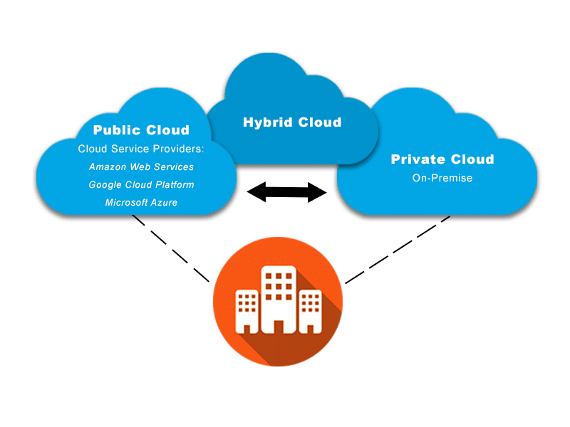
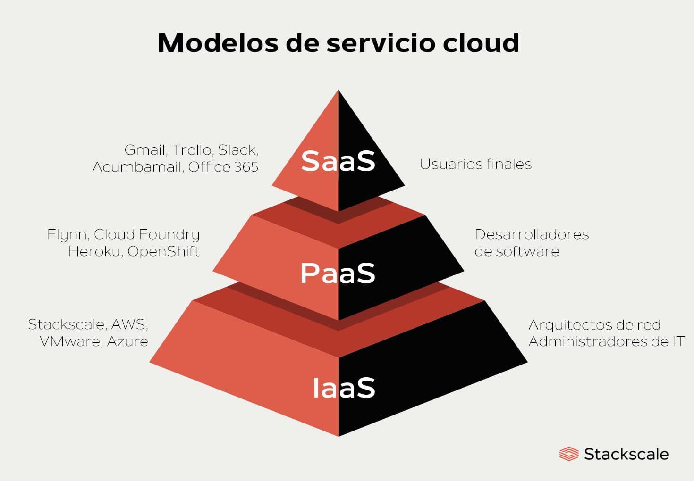

## Tipos de Despliegue de Sistemas Empresariales

Además de los modelos de servicio, es fundamental entender cómo se **despliegan** los sistemas empresariales en función de la infraestructura disponible y las necesidades de la organización.

### On-Premise (Local)

El software se instala y ejecuta en servidores propios de la empresa, dentro de sus instalaciones físicas.

**Características**:

- Control total sobre los datos y la infraestructura  
- Requiere inversión en hardware, licencias y personal técnico  
- Mayor personalización y adaptación a procesos internos  
- Ideal para empresas con políticas estrictas de seguridad o sin acceso fiable a internet  

**Ventajas**:

- Máximo control y privacidad  
- Integración profunda con sistemas internos  
- Sin dependencia de terceros  

**Inconvenientes**:

- Costes elevados de instalación y mantenimiento  
- Escalabilidad limitada  
- Actualizaciones más lentas  

### Cloud (En la nube)

El software se aloja en servidores externos gestionados por un proveedor. Se accede a través de internet.

**Características**:

- Modelo de pago por uso o suscripción  
- Escalabilidad inmediata  
- Mantenimiento delegado al proveedor  
- Acceso desde cualquier lugar  

**Ventajas**:

- Reducción de costes iniciales  
- Flexibilidad y movilidad  
- Actualizaciones automáticas  

**Inconvenientes**:

- Dependencia de conexión  
- Menor control sobre los datos  
- Riesgos de seguridad si no se gestiona adecuadamente  

### Híbrido

Combina elementos de los modelos on-premise y cloud. Algunas aplicaciones o datos se alojan localmente, mientras que otros se gestionan en la nube.

**Características**:

- Permite mantener datos sensibles en local y aprovechar la nube para otras funciones  
- Ideal para empresas en transición hacia la nube  
- Requiere una arquitectura bien diseñada para evitar duplicidades y problemas de integración  

**Ventajas**:

- Equilibrio entre control y flexibilidad  
- Optimización de costes  
- Adaptación progresiva a la nube  

**Inconvenientes**:

- Mayor complejidad técnica  
- Necesidad de sincronización entre entornos  
- Posibles problemas de compatibilidad  

<figure markdown="span" align="center">
  { width="85%"  }
  <figcaption>Modelos de despliegue: On-Premise, Cloud y Híbrido.</figcaption>
</figure>

---

## Modelos de Servicio en la Nube

La computación en la nube ha revolucionado la forma en que las empresas acceden, gestionan y explotan sus sistemas de información. Permite utilizar recursos informáticos a través de internet sin necesidad de infraestructura propia, lo que facilita la escalabilidad, el mantenimiento y el acceso remoto.

### **SaaS** – Software as a Service

El software se ofrece como un servicio accesible desde cualquier navegador. El proveedor se encarga del mantenimiento, actualizaciones y seguridad.

**Ejemplos**: ERP en la nube como Odoo Online, CRM como Salesforce, herramientas ofimáticas como Microsoft 365 o Google Workspace.

**Ventajas**:

- No requiere instalación local  
- Acceso desde cualquier dispositivo  
- Coste por suscripción  
- Actualizaciones automáticas  

**Inconvenientes**:

- Menor personalización  
- Dependencia de conexión a internet  
- Posibles restricciones de integración  

### **PaaS** – Platform as a Service

Se ofrece una plataforma completa para desarrollar, probar y desplegar aplicaciones. Incluye sistema operativo, servidor web, base de datos y herramientas de desarrollo.

**Ejemplos**: Google App Engine, Microsoft Azure App Services, Heroku

**Ventajas**:

- Entorno listo para desarrollo  
- Escalabilidad automática  
- Reducción de costes de infraestructura  

**Inconvenientes**:

- Dependencia del proveedor  
- Limitaciones en tecnologías soportadas  

### **IaaS** – Infrastructure as a Service

Proporciona infraestructura virtual: servidores, almacenamiento, redes, etc. El cliente gestiona el sistema operativo y las aplicaciones.

**Ejemplos**: Amazon Web Services (AWS), Microsoft Azure, Google Cloud Platform

**Ventajas**:

- Control total sobre la configuración  
- Escalabilidad bajo demanda  
- Pago por uso  

**Inconvenientes**:

- Mayor complejidad técnica  
- Requiere personal especializado  

<figure markdown="span" align="center">
  { width="85%"  }
  <figcaption>Modelos de servicio en la nube: SaaS, PaaS, IaaS.</figcaption>
</figure>

---

_Licenciado bajo la [Licencia Creative Commons Atribución Compartir Igual 4.0](http://creativecommons.org/licenses/by-sa/4.0/)_