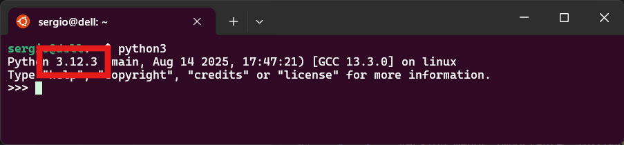

Empezamos esta sección con una serie de contenidos dedicados a aprender **Python**, el lenguaje de programación que vamos a utilizar para crear los módulos de **Odoo**. 

Antes de nada contextualicemos qué es **Python** y como ha llegado hasta aquí.

## Un poco de historia

Para empezar, qué mejor manera que conocer qué es Python y cuáles son sus principales características, que lo han convertido en uno de los lenguajes más utilizados hoy en día.

<figure markdown="span" align="center">
  { width="90%"  }
  <figcaption>Guido van Rossum</figcaption>
</figure>


Todo comenzó con [**Guido van Rossum**](https://es.wikipedia.org/wiki/Guido_van_Rossum), un desarrollador holandés que, a finales de los años 80, decidió crear casi por hobby un lenguaje de scripting. Es decir, un lenguaje pensado más para el trabajo en sistemas que para la creación de aplicaciones completas. Su objetivo era que tuviera una sintaxis similar a **C** y que además fuera fácil tanto de aprender como de utilizar.

La primera versión de este lenguaje, que llamó **Python** en honor al grupo cómico [*Monty Python*](https://es.wikipedia.org/wiki/Monty_Python), no tuvo una gran acogida inicial. Sin embargo, sentó las bases de lo que hoy es Python: un lenguaje muy versátil y ampliamente extendido.

Durante todo este tiempo, han colaborado muchas personas en el proyecto, pero Guido seguía siendo el coordinador principal. De hecho, tenía un título honorífico: **BDFL** (*Benevolent Dictator For Life*), lo que le otorgaba la última palabra sobre las decisiones del proyecto. No obstante, desde mediados de 2018, Guido se retiró de ese cargo para quedarse en un segundo plano.

## Definiendo **Python**

La mejor manera de definir **Python** es como un **lenguaje de programación de propósito general**. Esto puede parecer contradictorio después de haber comentado que nació como lenguaje de scripts, pero aunque ese fue su punto de partida, Python pronto se convirtió en un lenguaje capaz de aplicarse a la creación de casi cualquier tipo de aplicación.

Se utiliza para desarrollar videojuegos, gestionar microcontroladores, construir elementos del stack web, crear scripts, y últimamente, en áreas tan populares como la **inteligencia artificial** o la **ciencia de datos**.

Es un lenguaje de **alto nivel**, y en este caso, **interpretado**, no compilado. Esto implica, por un lado, mayores tiempos de ejecución y la necesidad de incluir siempre el intérprete para su ejecución. Pero por otro lado, esa misma necesidad facilita la **multiplataforma**: cualquier sistema que tenga un intérprete puede ejecutar código Python.

Además, Python posee una licencia libre llamada [**PSFL**](https://es.wikipedia.org/wiki/Python_Software_Foundation_License) (*Python Software Foundation License*). Aunque no es la licencia [*GPL*](https://es.wikipedia.org/wiki/GNU_General_Public_License), permite realizar modificaciones del código que no sean libres, y es compatible con GPL, ya que permite trabajar con otros códigos desarrollados bajo esa licencia.

### Características técnicas

Entrando en las características técnicas, una de las más llamativas es que Python es un lenguaje **multiparadigma**, soportando:

- Programación funcional  
- Programación orientada a objetos  
- Programación estructurada clásica  

También soporta **tipado dinámico**, lo que permite al programador despreocuparse de la asignación del tipo de variable. Es el propio intérprete quien infiere el tipo a partir del valor asignado.

Incluye un **garbage collector** (recolector de basura) que limpia automáticamente las estructuras de datos que ocupan memoria y ya no están en uso.

Es un lenguaje **extensible**, lo que significa que se le pueden añadir nuevas características mediante **módulos** o **paquetes**. Un módulo no es más que un fichero de código Python que puede ser reutilizado en nuestros programas.

Además, es posible crear módulos no solo en Python, sino también en lenguajes como **C++**, que pueden ser considerados como módulos del sistema. Existe también el concepto de **paquete**, que podemos entender como un conjunto de módulos con un objetivo común.

Para gestionar estos paquetes, Python incluye una herramienta llamada **pip**, algo similar a **npm** en Node.js. [Esta herramienta permite gestionar los paquetes de Python](https://www.tecmint.com/install-pip-in-linux/) comportandose de una forma muy similar a como lo hacen los diferentes gestores de repositorios de linux: `apt`, `snap`, `yum`...

Por último, el código escrito en Python es muy **legible**. Por ejemplo, se eliminan las típicas llaves que definen bloques en lenguajes como C o Java, y se utiliza la **indentación obligatoria** para definir qué elementos pertenecen a un bloque.

### Implantación

Las características que hemos comentado anteriormente hacen que la **implantación de Python** sea muy grande hoy en día. De hecho, es uno de los lenguajes mejor considerados en la mayoría de rankings ([TIOBE](https://www.tiobe.com/tiobe-index/), [LinkedIn](https://www.linkedin.com/pulse/most-popular-programming-languages-2025-vibidsoft-bkd1f), [Stackoverflow](https://survey.stackoverflow.co/2025/technology/)) que valoran lenguajes de programación.

Estos índices tienen en cuenta factores como:

- La popularidad entre los programadores  
- La cantidad de ofertas laborales que requieren conocimientos en Python  
- Los sueldos que se pagan a los desarrolladores que lo dominan  

¿Y por qué ocurre esto? Entre muchas razones, destaca que su **curva de aprendizaje es muy suave**, lo que permite que pueda ser utilizado en entornos académicos para introducir la programación. También es ideal para **desarrolladores eventuales**, es decir, personas que no se dedican 100% a programar, pero que de vez en cuando necesitan crear algún pequeño programa para resolver problemas puntuales.

Además, Python posee una **gran cantidad de módulos y paquetes**, lo que facilita encontrar soluciones ya desarrolladas para necesidades concretas de una aplicación. Por supuesto, es **portable**, lo que significa que puede funcionar en muchos sistemas operativos, de hecho en los sistemas GNU/Linux como [Ubuntu](https://ubuntu.com/) suele estar preinstalado.

Y por último, se ha convertido en uno de los lenguajes más habituales en campos como la **ciencia de datos** y la **inteligencia artificial**, gracias a la enorme cantidad de paquetes disponibles para trabajar en estos ámbitos, como `TensorFlow`, `Keras` o `Pandas`.

### Algunas desventajas

Pero no todo es perfecto. Python tiene una serie de **inconvenientes**, pocos, pero importantes a tener en cuenta cuando se elige como lenguaje principal para un proyecto.

- **Velocidad de ejecución**: Python es un lenguaje interpretado, lo que lo hace más lento que los lenguajes compilados. Para ciertas tareas esto puede no ser relevante, pero en otras puede ser crítico.
- **Consumo de memoria**: No es un lenguaje liviano ni optimizado para trabajar con poca memoria. Su consumo puede ser elevado en comparación con otros lenguajes.
- **Limitaciones en móviles y front-end web**: Aunque existen frameworks como `Flask` o `Django` para el desarrollo *backend*, el trabajo en la parte de *frontend* o en entornos como `WebAssembly` es muy limitado, por no decir prácticamente nulo.

### Alternativas y soluciones

Algunos de estos inconvenientes, especialmente los relacionados con la lentitud, pueden ser **solucionados parcialmente** mediante alternativas técnicas.

#### Intérpretes alternativos

El intérprete original de Python está escrito en C, y muchas veces lo encontrarás como **CPython**. Sin embargo, existen otras implementaciones pensadas para máquinas virtuales específicas:

- **Jython**: Implementación escrita en Java que permite ejecutar Python sobre la máquina virtual de Java (JVM).
- **IronPython**: Similar a Jython, pero para la plataforma .NET, ejecutándose sobre el CLR.
- **PyPy**: Implementación escrita en Python, útil cuando se quiere trabajar directamente sobre el propio código del lenguaje.

#### Compiladores cruzados

También existen herramientas conocidas como **cross-compilers** o **compiladores cruzados**, que convierten código Python en C. Por ejemplo:

- **Cython**: Convierte código Python en C, que luego puede ser compilado de forma nativa para una máquina concreta, eliminando la necesidad del intérprete.
- **OpenInstaller**: Genera un único paquete ejecutable que incluye tanto el código Python como el intérprete. Para el usuario final, se presenta como un simple fichero `.exe`.

### Versiones de Python

Para finalizar, conviene conocer cómo se identifican las versiones de Python. Cada versión se compone de **tres números**: **X**.**Y**.**Z**

- **X**: Versión mayor. Son incompatibles entre sí. Por ejemplo, un código pensado para Python 2 no se ejecutará en Python 1, y lo mismo ocurre entre Python 2 y Python 3.
- **Y**: Versión menor importante. Introduce novedades en el lenguaje, pero mantiene compatibilidad con la versión mayor correspondiente.
- **Z**: Versión de mantenimiento. Corrige errores y fallos de seguridad.

<figure markdown="span" align="center">
  { width="90%"  }
  <figcaption>Versión ejecutada de Python</figcaption>
</figure>


Actualmente, la versión 1 está completamente obsoleta. Sin embargo, siguen en producción tanto la versión 2 como la versión 3. La idea es que Python 2 quede obsoleto pronto, pero existe un gran parque de aplicaciones desarrolladas con esa versión, y la migración a Python 3 no es sencilla. Por eso, muchos sistemas aún incorporan intérpretes para ambas versiones.


## Comparativa Python vs. Java

Teniendo en cuenta que se ha trabajado `Java` en otros módulos en el primer curso, es interesante ver las diferencias básicas entre `Java` y `Python`

| Característica         | Java                          | Python                        |
|------------------------|-------------------------------|-------------------------------|
| Tipado                 | Estático                      | Dinámico                      |
| Sintaxis               | Verbosa                       | Concisa                       |
| Compilación            | Compilado a bytecode          | Interpretado                  |
| Declaración de variables | Obligatoria                  | Implícita                     |
| Manejo de excepciones  | Obligatorio en muchos casos   | Opcional                      |
| Orientación a objetos  | Obligatoria                   | Opcional                      |

### Ejemplo comparativo

Como siempre se dice, un ejemplo vale más que mil palabras.

**Java**
```java
int x = 5;
System.out.println(x);
```

**Python**
```python
x = 5
print(x)
```

Continuemos centrándonos en las características principales de Python


## Instalación de Python

### Windows
1. Visita [https://www.python.org/downloads/](https://www.python.org/downloads/)
2. Descarga el instalador para Windows.
3. Ejecuta el instalador y asegúrate de marcar la opción "Add Python to PATH".

### macOS
Puedes instalar Python usando Homebrew:
```bash
brew install python
```

### Linux
En la mayoría de distribuciones, puedes instalar Python con:
```bash
sudo apt update
sudo apt install python3
```

### Verificación de la instalación

Para verificar que Python está correctamente instalado, abre una terminal y ejecuta:

```bash
python --version
```
o

```bash
python3 --version
```

## Primeros pasos en Python

Puedes iniciar el intérprete interactivo escribiendo `python` o `python3` en la terminal. 

<figure markdown="span" align="center">
  { width="90%"  }
  <figcaption>Primeros pasos en Python. Ejecutando desde terminal</figcaption>
</figure>

También puedes guardar tus programas en archivos `.py` y ejecutarlos.

<figure markdown="span" align="center">
  { width="90%"  }
  <figcaption>Primeros pasos en Python. Ejecutando script</figcaption>
</figure>

## Comentarios

Es fundamental el uso de comentarios en nuestro código. En Python existen básicamente dos modos de introducir comentarios, en una línea mediante `#` y de varias líneas mediante tres dobles comillas (`"""`) en lineas anterior y posterior: 

```python
# Esto es un comentario de línea

"""
Esto es un comentario
de varias líneas
"""
```

## Tipos de datos básicos

Antes de empezar a escribir código en Python, es fundamental entender cómo maneja la información. Todo lenguaje de programación necesita representar datos: números, textos, valores lógicos... y Python lo hace de forma sencilla y muy intuitiva.

En esta sección vamos a conocer los **tipos de datos básicos** que forman la base de cualquier programa en Python. Estos tipos permiten almacenar y manipular información de forma eficiente, y son el punto de partida para construir estructuras más complejas como listas, diccionarios o clases.

Una característica muy particular de Python es que las **variables no tienen un tipo fijo**, sino que el tipo se **asigna dinámicamente** en función del valor que contienen. Esto significa que una misma variable puede almacenar un número entero en un momento dado, y más adelante contener una cadena de texto, sin necesidad de declararlo explícitamente.

```python
x = 5        # x es un entero
x = "Hola"   # ahora x es una cadena
```

Este comportamiento se conoce como **tipado dinámico**, y aunque facilita mucho la escritura de código, también requiere que el programador esté atento al tipo de dato que está manipulando en cada momento para evitar errores inesperados.


### Números

Los número pueden ser de diferente tipo. 

```python
entero = 10
flotante = 3.14
complejo = 2 + 3j
```

Tal y como se asigne un valor u otro, el interprete ya asigna el tipo adecuado a la variable 

#### Operadores aritméticos

Por supuesto podemos realizas diferentes operaciones matemáticas:

| Operador | Descripción         | Ejemplo       | Resultado |
|----------|---------------------|---------------|-----------|
| `+`      | Suma                | `5 + 3`       | `8`       |
| `-`      | Resta               | `5 - 2`       | `3`       |
| `*`      | Multiplicación      | `4 * 2`       | `8`       |
| `/`      | División flotante   | `5 / 2`       | `2.5`     |
| `//`     | División entera     | `5 // 2`      | `2`       |
| `%`      | Módulo (resto)      | `5 % 2`       | `1`       |
| `**`     | Potencia            | `2 ** 3`      | `8`       |

El tipo de la variable resultante tras la realización de una operación matemática, será el tipo más complejo, o sea si se hacer una suma de un *entero* y un *flotante*, el resultado será un *flotante*.

### Cadenas de texto  (`str`)

La definición de líneas se puede realizar tanto con comillas dobles (`"`) como con comillas simples ( `'`):

```python
nombre = "Sergio"
saludo = 'Hola'
```

Podemos definir cadenas típicas de una palabra o línea o de varias líneas:

```python
cadena = "Hola, mundo"
texto_multilinea = '''Esto es
una cadena
multilínea'''
```
#### Concatenación

```python
nombre = "Sergio"
mensaje = "Hola " + nombre
print( mensaje)
print( "Esta también es otra cadena concatenada con comas, ", nombre, "¿se entiende?")
```

#### Alternativa moderna: **f-strings**

Desde Python 3.6, puedes usar **f-strings** para insertar valores dentro de cadenas de forma más limpia y legible. Este tipo de cadenas se define anteponiendo un `f` a la cadena, de forma que las variables ya no las ponemos entre comillas, sino que las incluimos entre llaves `{}`:

```python
nombre = "Sergio"
edad = 25
print(f"{nombre} tiene {edad} años")
```

### Tipado dinámico y variables como objetos

En Python, todo dato que usamos en un programa (ya sea un número, una cadena de texto o un valor lógico) está representado por un **objeto**. Esto significa que cada variable que creamos no es simplemente un contenedor de datos, sino una instancia de una clase que define su comportamiento.

Cuando creamos una variable en Python, lo que realmente estamos haciendo es **crear una referencia a un objeto**. Por ejemplo:

```python
x = 10
print(type(x))  # <class 'int'>
```

Aquí, `x` no es simplemente un número: es una referencia a un objeto de la clase `int`. Si luego cambiamos el valor de `x` por una cadena, el tipo también cambia:

```python
x = "Hola"
print(type(x))  # <class 'str'>
```

Este comportamiento se llama **tipado dinámico**, y es una de las características más distintivas de Python. Aunque facilita mucho la escritura de código, también puede provocar errores si no se tiene cuidado al mezclar tipos.

Uno de los errores más frecuentes ocurre al intentar **concatenar cadenas con otros tipos de datos**. Por ejemplo:

```python
edad = 25
print("Tengo " + edad + " años")  # ❌ Error
```

Este código lanza un error porque estamos intentando sumar (`+`) una cadena (`str`) con un entero (`int`). Para solucionarlo, debemos convertir el número a cadena:

```python
print("Tengo " + str(edad) + " años")  # ✅ Correcto
```

**Funciones útiles de conversión**

Python incluye varias funciones para convertir entre tipos de datos. Aquí tienes las más comunes:

| Función     | Convierte a... | Ejemplo de uso             |
|-------------|----------------|-----------------------------|
| `str()`     | Cadena (`str`) | `str(123)` → `"123"`        |
| `int()`     | Entero (`int`) | `int("42")` → `42`          |
| `float()`   | Decimal (`float`) | `float("3.14")` → `3.14` |
| `bool()`    | Booleano (`bool`) | `bool("")` → `False`      |

!!!tip "Consejo para realizar operaciones entre variables"

    Antes de realizar operaciones entre variables, asegúrate de que los tipos son compatibles. Si no lo son, usa funciones de conversión para evitar errores.


!!!tip "Ejemplos de uso de métodos asociados a objetos en las variables"

    No profundizaremos mucho en el tema, pero tal y como se ha comentado toda variable es considerada un objeto por lo que tiene asociado implicitamente una serie de métodos 

    ```python
    texto = "Python DAM"
    print(len(texto))            # Longitud
    print(texto.upper())         # Mayúsculas
    print(texto.lower())         # Minúsculas
    print(texto.replace("DAM", "2025"))  # Reemplazo
    print(texto[0:6])            # Slicing
    ```

### Booleanos
```python
verdadero = True
falso = False
```

## Entrada por consola: `input()`

La entrada por consola se realiza mediante el comando `input()`

```python
nombre = input()  # Sin mensaje al usuario 

nombre = input("Introduce tu nombre: ") # Con mensaje al usuario
print(f"Bienvenido, {nombre}")
```

Debemos tener cuidad si queremos hacer **conversión de tipos** puesto que todas las entradas son cadenas, por lo tanto si necesitamos recoger un valor entero (`int`) entonces debemos utilizar la función de conversion `int()`

```python
edad = int(input("Introduce tu edad: "))
print(f"Tu edad es {edad}")
```

## Buenas prácticas y estilo: Convenciones **PEP8**

La PEP8 es una guía que indica las convenciones estilísticas a seguir para escribir código Python. Se trata de un conjunto de recomendaciones cuyo objetivo es ayudar a escribir código más legible y abarca desde cómo nombrar variables, al número máximo de caracteres que una línea debe tener.

Recomendaciones más importantes.

    - Usa 4 espacios por nivel de indentación.
    - Nombres de variables en minúsculas y con guiones bajos: `nombre_usuario`
    - Comentarios claros y útiles.
    - Usa docstrings para documentar funciones y clases.

Más info: [El libro de Python. Python PEP8: Escribiendo Código Fácil de Leer](https://ellibrodepython.com/python-pep8)