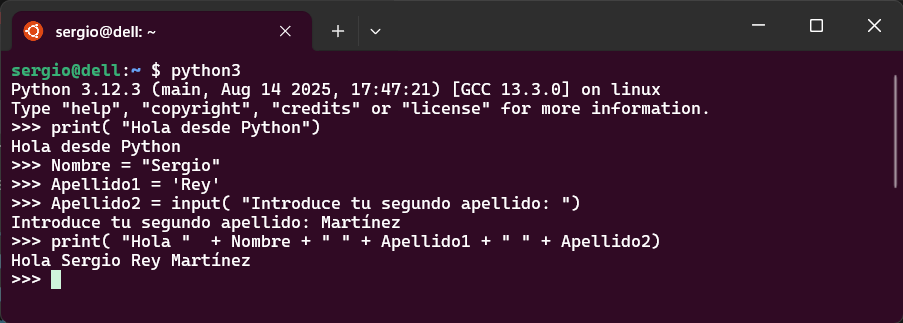
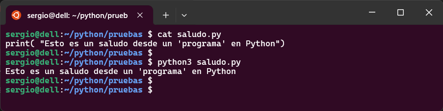

A continuación tenemos una breve introducción a Python, desde su instalación al trabajo inicial con el lenguaje.

## Instalación de Python

### Windows
1. Visita [https://www.python.org/downloads/](https://www.python.org/downloads/)
2. Descarga el instalador para Windows.
3. Ejecuta el instalador y asegúrate de marcar la opción "Add Python to PATH".

### macOS
Puedes instalar Python usando Homebrew:
```bash
brew install python
```

### Linux
En la mayoría de distribuciones, puedes instalar Python con:
```bash
sudo apt update
sudo apt install python3
```

## Verificación de la instalación

Para verificar que Python está correctamente instalado, abre una terminal y ejecuta:

```bash
python --version
```
o

```bash
python3 --version
```

## Primeros pasos en Python

Puedes iniciar el intérprete interactivo escribiendo `python` o `python3` en la terminal. 

<figure markdown="span" align="center">
  { width="90%"  }
  <figcaption>Primeros pasos en Python. Ejecutando desde terminal</figcaption>
</figure>

También puedes guardar tus programas en archivos `.py` y ejecutarlos.

<figure markdown="span" align="center">
  { width="90%"  }
  <figcaption>Primeros pasos en Python. Ejecutando script</figcaption>
</figure>

## Tipos de datos básicos

Antes de empezar a escribir código en Python, es fundamental entender cómo maneja la información. Todo lenguaje de programación necesita representar datos: números, textos, valores lógicos... y Python lo hace de forma sencilla y muy intuitiva.

En esta sección vamos a conocer los **tipos de datos básicos** que forman la base de cualquier programa en Python. Estos tipos permiten almacenar y manipular información de forma eficiente, y son el punto de partida para construir estructuras más complejas como listas, diccionarios o clases.

Una característica muy particular de Python es que las **variables no tienen un tipo fijo**, sino que el tipo se **asigna dinámicamente** en función del valor que contienen. Esto significa que una misma variable puede almacenar un número entero en un momento dado, y más adelante contener una cadena de texto, sin necesidad de declararlo explícitamente.

```python
x = 5        # x es un entero
x = "Hola"   # ahora x es una cadena
```

Este comportamiento se conoce como **tipado dinámico**, y aunque facilita mucho la escritura de código, también requiere que el programador esté atento al tipo de dato que está manipulando en cada momento para evitar errores inesperados.

Vamos allá: empezamos por los números.

### Números
```python
entero = 10
flotante = 3.14
complejo = 2 + 3j
```

### Cadenas de texto
```python
cadena = "Hola, mundo"
texto_multilinea = '''Esto es
una cadena
multilínea'''
```

### Booleanos
```python
verdadero = True
falso = False
```

### Listas
```python
lista = [1, 2, 3, "cuatro", True]
```

### Tuplas
```python
tupla = (1, 2, 3)
```

### Conjuntos
```python
conjunto = {1, 2, 3, 3}
```

### Diccionarios
```python
diccionario = {"nombre": "Ana", "edad": 30}
```

## Las variables son objetos

En Python, todo dato que usamos en un programa (ya sea un número, una cadena de texto o un valor lógico) está representado por un **objeto**. Esto significa que cada variable que creamos no es simplemente un contenedor de datos, sino una instancia de una clase que define su comportamiento.

Cuando creamos una variable en Python, lo que realmente estamos haciendo es **crear una referencia a un objeto**. Por ejemplo:

```python
x = 10
print(type(x))  # <class 'int'>
```

Aquí, `x` no es simplemente un número: es una referencia a un objeto de la clase `int`. Si luego cambiamos el valor de `x` por una cadena, el tipo también cambia:

```python
x = "Hola"
print(type(x))  # <class 'str'>
```

Este comportamiento se llama **tipado dinámico**, y es una de las características más distintivas de Python. Aunque facilita mucho la escritura de código, también puede provocar errores si no se tiene cuidado al mezclar tipos.

Uno de los errores más frecuentes ocurre al intentar **concatenar cadenas con otros tipos de datos**. Por ejemplo:

```python
edad = 25
print("Tengo " + edad + " años")  # ❌ Error
```

Este código lanza un error porque estamos intentando sumar (`+`) una cadena (`str`) con un entero (`int`). Para solucionarlo, debemos convertir el número a cadena:

```python
print("Tengo " + str(edad) + " años")  # ✅ Correcto
```

**Funciones útiles de conversión**

Python incluye varias funciones para convertir entre tipos de datos. Aquí tienes las más comunes:

| Función     | Convierte a... | Ejemplo de uso             |
|-------------|----------------|-----------------------------|
| `str()`     | Cadena (`str`) | `str(123)` → `"123"`        |
| `int()`     | Entero (`int`) | `int("42")` → `42`          |
| `float()`   | Decimal (`float`) | `float("3.14")` → `3.14` |
| `bool()`    | Booleano (`bool`) | `bool("")` → `False`      |

> 🎓 **Consejo para tus alumnos**: Antes de realizar operaciones entre variables, asegúrate de que los tipos son compatibles. Si no lo son, usa funciones de conversión para evitar errores.

Alternativa moderna: **f-strings**

Desde Python 3.6, puedes usar **f-strings** para insertar valores dentro de cadenas de forma más limpia y legible. Este tipo de cadenas se define anteponiendo un `f` a la cadena, de forma que las variables ya no las ponemos entre comillas, sino que las incluimos entre llaves `{}`:

```python
nombre = "Sergio"
edad = 25
print(f"{nombre} tiene {edad} años")  # ✅ Muy recomendable
```

---

En la siguiente sección veremos cómo trabajar con cadenas de texto y qué operaciones básicas podemos realizar con ellas.
```

¿Quieres que prepare una hoja de ejercicios con errores típicos para que los alumnos los corrijan? También puedo incluir ejemplos con `input()` para que practiquen la conversión desde datos introducidos por el usuario.


## Estructuras de control

### Condicionales
```python
if edad >= 18:
    print("Eres mayor de edad")
elif edad > 13:
    print("Eres adolescente")
else:
    print("Eres niño")
```

### Bucles
```python
for i in range(5):
    print(i)

while condicion:
    hacer_algo()
```

## Funciones
```python
def saludar(nombre):
    print(f"Hola, {nombre}!")
```

