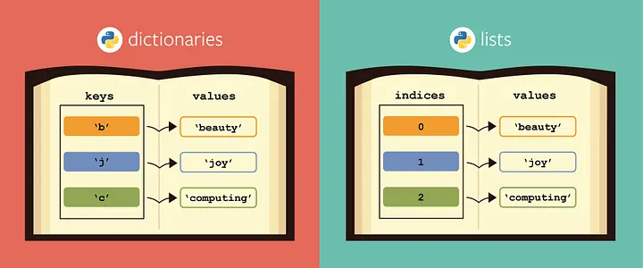

Python ofrece estructuras de datos versátiles que permiten organizar y manipular información de forma eficiente. En esta sesión trabajaremos con listas, diccionarios, tuplas y conjuntos, y aprenderemos a recorrerlos e incluso transformarlos con comprensiones de listas.

## Listas en Python

Las listas son una de las estructuras de datos más utilizadas en Python. Permiten almacenar múltiples elementos en una sola variable, manteniendo el orden en que fueron añadidos y ofreciendo gran flexibilidad para modificarlos, recorrerlos o aplicar operaciones sobre ellos.

Una lista puede contener cualquier tipo de dato: números, cadenas, booleanos, e incluso otras listas o estructuras más complejas. Además, se pueden mezclar tipos dentro de una misma lista, aunque no siempre es recomendable por cuestiones de claridad y mantenimiento.

### Creación y acceso a elementos

Las listas se definen entre corchetes `[]` y los elementos se separan por comas. El acceso se realiza mediante índices, empezando desde 0. También se pueden usar índices negativos para contar desde el final.


!!!example "Ejemplo de creación de listas"

    ```python
    # Creamos una lista con nombres de frutas
    frutas = ["manzana", "plátano", "naranja"]

    # Accedemos al primer elemento (índice 0)
    print(frutas[0])  # manzana

    # Accedemos al último elemento usando índice negativo
    print(frutas[-1])  # naranja
    ```

### Modificación de elementos

Las listas son **mutables**, lo que significa que sus elementos pueden cambiar después de haber sido creados. Esto permite actualizar valores fácilmente sin tener que crear una nueva lista.


!!!example "Ejemplo de modificación de listas

    ```python
    # Cambiamos el segundo elemento
    frutas[1] = "pera"

    print(frutas)  # ['manzana', 'pera', 'naranja']
    ```

### Añadir elementos

El método `append()` agrega un nuevo elemento al final de la lista. Es uno de los métodos más utilizados cuando se construyen listas dinámicamente, como al leer datos del usuario o procesar resultados.

!!!example "Ejemplo para añadir elementos a listas"

    ```python
    # Añadimos una nueva fruta al final de la lista
    frutas.append("kiwi")

    print(frutas)  # ['manzana', 'pera', 'naranja', 'kiwi']
    ```


### Insertar en una posición específica

El método `insert()` permite colocar un elemento en una posición concreta, desplazando los demás hacia la derecha. Es útil cuando se quiere mantener un orden específico.

!!!example "Ejemplo de inserción en posición específica"

    ```python
    # Insertamos una fruta en la segunda posición (índice 1)
    frutas.insert(1, "melón")

    print(frutas)  # ['manzana', 'melón', 'pera', 'naranja', 'kiwi']
    ```

### Eliminar elementos

Con `remove()` se elimina la primera aparición del valor indicado. Si el valor no existe, se genera un error. Para evitarlo, se puede comprobar antes con `in`.


!!!example "Ejemplo borrado de elementos"

    ```python
    # Eliminamos el elemento "naranja"
    frutas.remove("naranja")

    print(frutas)  # ['manzana', 'melón', 'pera', 'kiwi']
    ```

Las listas ofrecen métodos como `count()` para contar elementos, `sort()` para ordenarlos, y `reverse()` para invertir el orden. Estas operaciones son muy útiles en tareas de análisis y presentación de datos.

### Comprensiones de listas

Las comprensiones de listas permiten crear nuevas listas de forma compacta y expresiva, aplicando condiciones o transformaciones.

!!!example "Ejemplo de generación de listas de forma automática"

    ```python
    # Creamos una lista de cuadrados del 1 al 5
    cuadrados = [x**2 for x in range(1, 6)]
    print(cuadrados)  # [1, 4, 9, 16, 25]

    # Filtramos solo los pares
    pares = [x for x in range(10) if x % 2 == 0]
    print(pares)  # [0, 2, 4, 6, 8]
    ```

Esta técnica es útil para generar listas a partir de otras, aplicar filtros o realizar cálculos en una sola línea.

### Resumen de operaciones útiles

Las listas en Python no solo permiten almacenar múltiples elementos, sino que también ofrecen una serie de métodos integrados que facilitan su manipulación. Estos métodos permiten añadir, eliminar, ordenar, buscar y transformar los elementos de forma sencilla.

| Método         | Descripción                                                                 | Ejemplo                                      | Resultado                        |
|----------------|------------------------------------------------------------------------------|----------------------------------------------|----------------------------------|
| `append(x)`    | Añade el elemento `x` al final de la lista                                  | `lista.append("uva")`                        | `["manzana", "pera", "uva"]`     |
| `insert(i, x)` | Inserta el elemento `x` en la posición `i`                                  | `lista.insert(1, "melón")`                   | `["manzana", "melón", "pera"]`   |
| `remove(x)`    | Elimina la primera aparición del elemento `x`                               | `lista.remove("pera")`                       | `["manzana", "melón"]`           |
| `pop()`        | Elimina y devuelve el último elemento                                       | `lista.pop()`                                | `["manzana", "melón"]`           |
| `pop(i)`       | Elimina y devuelve el elemento en la posición `i`                           | `lista.pop(0)`                               | `["melón", "pera"]`              |
| `count(x)`     | Devuelve cuántas veces aparece el elemento `x`                              | `lista.count("pera")`                        | `1`                              |
| `index(x)`     | Devuelve el índice de la primera aparición del elemento `x`                 | `lista.index("pera")`                        | `2`                              |
| `sort()`       | Ordena la lista de forma ascendente (alfabética o numérica)                 | `lista.sort()`                               | `["manzana", "pera", "uva"]`     |
| `reverse()`    | Invierte el orden de los elementos                                          | `lista.reverse()`                            | `["uva", "pera", "manzana"]`     |
| `clear()`      | Elimina todos los elementos de la lista                                     | `lista.clear()`                              | `[]`                             |
| `copy()`       | Devuelve una copia superficial de la lista                                  | `nueva_lista = lista.copy()`                 | `["manzana", "pera", "uva"]`     |


!!!example "Ejemplo combinado"

    Este ejemplo muestra cómo combinar varios métodos para construir y modificar una lista paso a paso. El resultado final sería una lista ordenada con los elementos actualizados.

    ```python
    # Lista inicial
    frutas = ["manzana", "pera", "naranja"]

    # Añadir una fruta
    frutas.append("kiwi")

    # Insertar en posición 1
    frutas.insert(1, "melón")

    # Eliminar una fruta
    frutas.remove("naranja")

    # Ordenar la lista
    frutas.sort()

    # Mostrar resultado final
    print(frutas)
    ```

### Ejercicio básico

Para finalizar con las listas, vamos a realizar un ejercicio para practicar los métodos `append()`, `insert()`, `pop()` y la modificación por índice, consolidando el uso básico de listas en Python.

???question "Crea una lista con tres colores. Añade un cuarto color, cambia el segundo por otro, inserta uno en la primera posición, elimina el último y muestra la lista final por pantalla."

    ```python
    # Lista inicial
    colores = ["rojo", "verde", "azul"]

    # Añadir un cuarto color
    colores.append("amarillo")

    # Cambiar el segundo color
    colores[1] = "morado"

    # Insertar en la primera posición
    colores.insert(0, "negro")

    # Eliminar el último color
    colores.pop()

    # Mostrar la lista final
    print(colores)
    ```


---

## Diccionarios en Python

Los **diccionarios** son una estructura de datos fundamental en Python que permite almacenar información en forma de **pares clave-valor**. A diferencia de las listas, donde cada elemento tiene una posición numérica (índice), en los diccionarios cada valor está asociado a una **clave única** que actúa como identificador.

Esta estructura es especialmente útil cuando se necesita representar entidades con atributos, como un usuario con nombre, edad y correo, o un producto con precio, stock y categoría. En contextos de desarrollo modular o aplicaciones como ***Odoo***, los diccionarios se asemejan a registros o modelos de datos, lo que los convierte en una herramienta clave para organizar y manipular información.

<figure markdown="span" align="center">
  { width="85%"  }
  <figcaption>Diccionarios vs Listas</figcaption>
</figure>


### Definición de Diccionarios

Un diccionario se define entre llaves `{}`, y cada par clave-valor se separa por dos puntos `:`. Las claves suelen ser cadenas de texto, aunque también pueden ser números o tuplas inmutables.


!!!example "Definición de diccionario"

    ```python
    # Diccionario que representa un usuario
    usuario = {
        "nombre": "Sergio",
        "edad": 25,
        "correo": "sergio@example.com"
    }
    ```

    En este ejemplo, `"nombre"`, `"edad"` y `"correo"` son claves, y sus valores son `"Sergio"`, `25` y `"sergio@example.com"` respectivamente.


### Acceso a valores

Para acceder a un valor, se utiliza la clave entre corchetes:

```python
print(usuario["nombre"])  # Sergio
```

Si se intenta acceder a una clave que no existe, se genera un error `KeyError`. Para evitarlo, se puede usar el método `get()`.

```python
print(usuario.get("población"))  # None
```

---

### Modificación y ampliación

Los diccionarios son **mutables**, lo que significa que se pueden modificar, añadir o eliminar elementos después de su creación.

!!!example "Ejemplo de modificación y ampliación de diccionario"

    ```python
    # Modificar un valor existente
    usuario["edad"] = 26

    # Añadir una nueva clave
    usuario["población"] = "Valencia"
    ```

### Métodos más importantes

A continuación se presentan los métodos más útiles para trabajar con diccionarios, junto con su propósito y ejemplos prácticos.

- **`get(clave)`**

Devuelve el valor asociado a la clave indicada. Si no existe, devuelve `None` o un valor por defecto si se especifica.

!!!example "Ejemplo de uso de `get()`"

    ```python
    print(usuario.get("correo"))         # sergio@example.com
    print(usuario.get("teléfono", "N/D"))  # N/D
    ```

Ideal para acceder a claves opcionales sin provocar errores.


- **`keys()`**, **`values()`**, **`items()`**

Estos tres métodos devuelven vistas del contenido del diccionario, ya sean las claves, los valores o ambos:

!!!example "Ejemplo de usos de **`keys()`**, **`values()`**, **`items()`** "

    ```python
    print(usuario.keys())    # dict_keys(['nombre', 'edad', 'correo', 'población'])
    print(usuario.values())  # dict_values(['Sergio', 26, 'sergio@example.com', 'Valencia'])
    print(usuario.items())   # dict_items([('nombre', 'Sergio'), ('edad', 26), ...])
    ```

Son útiles para recorrer el diccionario con bucles `for`:

!!!example "Ejemplo de recuperación de diccionario con un `for`"

    ```python
    for clave, valor in usuario.items():
        print(f"{clave}: {valor}")
    ```

- `update()`

Permite añadir o modificar múltiples claves a la vez, pasando otro diccionario como argumento.

!!!example "Ejemplo de actualización de varias claves a la vez"

    ```python
    usuario.update({
        "edad": 27,
        "teléfono": "600123456"
    })
    ```

Muy útil para fusionar información o actualizar registros.


- **`pop(clave)`**

Elimina la clave indicada y devuelve su valor. Si no existe, lanza un error.

!!!example "Ejemplo de eliminación de uso de `pop()`"

    ```python
    correo = usuario.pop("correo")
    print(correo)  # sergio@example.com
    ```

Se puede usar para extraer datos y limpiar el diccionario.

- **`clear()`**

Elimina todos los elementos del diccionario, dejándolo vacío.

!!!example "Ejemplo de uso de `clear()`"

    ```python
    usuario.clear()
    print(usuario)  # {}
    ```

- **`copy()`**

Devuelve una copia superficial del diccionario. Es útil para duplicar estructuras sin modificar el original.

!!!example "Ejemplo de uso de `copy()`"

    ```python
    usuario_copia = usuario.copy()
    ```

- **Tabla de métodos**

| Método             | Descripción                                                                 | Ejemplo                                      | Resultado                                  |
|--------------------|------------------------------------------------------------------------------|----------------------------------------------|--------------------------------------------|
| `get(clave)`       | Devuelve el valor asociado a la clave, o `None` si no existe                | `usuario.get("edad")`                        | `25`                                        |
| `keys()`           | Devuelve una vista con todas las claves                                     | `usuario.keys()`                             | `dict_keys(['nombre', 'edad'])`            |
| `values()`         | Devuelve una vista con todos los valores                                    | `usuario.values()`                           | `dict_values(['Sergio', 25])`              |
| `items()`          | Devuelve una vista con pares clave-valor                                    | `usuario.items()`                            | `dict_items([('nombre', 'Sergio'), ...])`  |
| `update()`         | Añade o modifica claves con nuevos valores                                  | `usuario.update({"edad": 26})`               | `{'nombre': 'Sergio', 'edad': 26}`         |
| `pop(clave)`       | Elimina la clave indicada y devuelve su valor                               | `usuario.pop("edad")`                        | `25`                                        |
| `clear()`          | Elimina todos los elementos del diccionario                                 | `usuario.clear()`                            | `{}`                                        |
| `copy()`           | Devuelve una copia superficial del diccionario                              | `nuevo = usuario.copy()`                     | `{'nombre': 'Sergio', 'edad': 25}`         |

### 🧩 Ejemplo y ejercicio de uso

En el siguiente ejemplo se muestra cómo consultar, modificar y eliminar información de un diccionario de forma segura y eficiente.

!!!example "Ejemplo combinado de operaciones con diccionarios"

    ```python
    producto = {
        "nombre": "Teclado",
        "precio": 29.99,
        "stock": 100
    }

    # Mostrar claves y valores
    for clave, valor in producto.items():
        print(f"{clave}: {valor}")

    # Actualizar precio
    producto["precio"] = 24.99

    # Añadir categoría
    producto["categoría"] = "Periféricos"

    # Eliminar stock
    producto.pop("stock")

    print(producto)
    ```

Ahora intenta realizar el siguiente ejercicio sin mirar la solucíón. 

!!!question "Ejercicio básico: Diccionario de producto"

    Crea un diccionario llamado `producto` que contenga la siguiente información:

    - `"nombre"`: `"Ratón óptico"`
    - `"precio"`: `19.95`
    - `"stock"`: `50`

    y a continuación, realiza las siguientes operaciones:

    1. Muestra el nombre del producto por pantalla.
    2. Modifica el precio a `17.50`.
    3. Añade una nueva clave `"marca"` con el valor `"Logitech"`.
    4. Elimina la clave `"stock"` del diccionario.
    5. Muestra el diccionario completo al final.

    > Pistas   

    >  - Usa corchetes `[]` para acceder y modificar valores.
    >  - Usa `del` para eliminar una clave.
    >  - Usa `print()` para mostrar resultados.

    ???quote "Solución"

        ```python
        # Paso 1: Crear el diccionario inicial
        producto = {
            "nombre": "Ratón óptico",
            "precio": 19.95,
            "stock": 50
        }

        # Paso 2: Mostrar el nombre del producto
        print(producto["nombre"])  # Ratón óptico

        # Paso 3: Modificar el precio
        producto["precio"] = 17.50

        # Paso 4: Añadir la clave "marca"
        producto["marca"] = "Logitech"

        # Paso 5: Eliminar la clave "stock"
        del producto["stock"]

        # Paso 6: Mostrar el diccionario completo
        print(producto)
        ```
    ---

--- 

## Tuplas

Las tuplas son colecciones ordenadas pero inmutables. Se usan cuando los datos no deben cambiar, como coordenadas o fechas.

```python
# Definimos una tupla con coordenadas
coordenada = (10.5, 20.3)

# Accedemos a sus elementos por índice
print(coordenada[0])  # 10.5
```

Las tuplas se comportan como listas, pero no pueden modificarse. Esto las hace útiles para representar datos constantes.


### 🧩 Ejemplo y ejercicio de uso

En el siguiente ejemplo se muestra cómo crear una tupla, acceder a sus elementos y utilizarla para representar datos que no deben modificarse.

!!!example "Ejemplo combinado de uso de tuplas"

    ```python
    # Tupla que representa una coordenada en el plano
    coordenada = (10.5, 20.3)

    # Acceder a los elementos por índice
    x = coordenada[0]
    y = coordenada[1]

    print(f"La coordenada X es {x}")
    print(f"La coordenada Y es {y}")

    # Mostrar la tupla completa
    print("Coordenada completa:", coordenada)
    ```

Las tuplas son útiles cuando se necesita agrupar datos que no deben cambiar, como coordenadas, fechas o combinaciones fijas. A diferencia de las listas, no se pueden modificar ni añadir elementos una vez creadas.

Ahora intenta realizar el siguiente ejercicio sin mirar la solución.

!!!question "Ejercicio básico: Tupla de datos personales"

    Crea una tupla llamada `persona` que contenga la siguiente información:

    - Nombre: `"Sergio"`
    - Edad: `25`
    - Ciudad: `"Alberic"`

    y a continuación, realiza las siguientes operaciones:

    1. Muestra el nombre por pantalla.
    2. Muestra la edad por pantalla.
    3. Muestra la ciudad por pantalla.
    4. Muestra la tupla completa.

    > Pistas

    > - Usa índices para acceder a los elementos: `persona[0]`, `persona[1]`, etc.
    > - Usa `print()` para mostrar resultados.

    ???quote "Solución"

        ```python
        # Paso 1: Crear la tupla
        persona = ("Sergio", 25, "Alberic")

        # Paso 2: Mostrar el nombre
        print("Nombre:", persona[0])

        # Paso 3: Mostrar la edad
        print("Edad:", persona[1])

        # Paso 4: Mostrar la ciudad
        print("Ciudad:", persona[2])

        # Paso 5: Mostrar la tupla completa
        print("Datos completos:", persona)
        ```

---

## Sets (Conjuntos)

Los **conjuntos son colecciones no ordenadas y sin elementos duplicados**. Se utilizan para eliminar duplicados o realizar operaciones de pertenencia.

```python
# Creamos un conjunto de colores
colores = {"rojo", "verde", "azul", "rojo"}

# Mostramos el conjunto
print(colores)  # {'rojo', 'verde', 'azul'}

# Añadimos un nuevo color
colores.add("amarillo")
```

Los **sets eliminan automáticamente los duplicados** y permiten operaciones como unión, intersección y diferencia.

### Métodos más importantes

A continuación se presentan los métodos más útiles para trabajar con conjuntos (`set`) en Python, junto con su propósito y ejemplos prácticos.

- **`add(elemento)`**

**Añade** un nuevo elemento al conjunto. Si el elemento ya existe, no se añade de nuevo (los sets no permiten duplicados).

!!!example "Ejemplo de uso de `add()`"

    ```python
    colores = {"rojo", "verde"}
    colores.add("azul")
    print(colores)  # {'rojo', 'verde', 'azul'}
    ```

Ideal para construir conjuntos dinámicamente sin preocuparse por duplicados.

- **`discard(elemento)`**

**Elimina** el elemento indicado si existe. Si no está presente, no lanza error.

!!!example "Ejemplo de uso de `discard()`"

    ```python
    colores = {"rojo", "verde"}
    colores.discard("rojo")
    colores.discard("amarillo")  # No lanza error
    print(colores)  # {'verde'}
    ```

Útil para eliminar elementos sin necesidad de comprobar si existen.

- **`remove(elemento)`**

**Elimina** el elemento indicado. Si no existe, lanza un error `KeyError`.

!!!example "Ejemplo de uso de `remove()`"

    ```python
    colores = {"rojo", "verde"}
    colores.remove("verde")
    print(colores)  # {'rojo'}
    ```

Se recomienda usar `discard()` si no se quiere gestionar errores manualmente.

- **`pop()`**

**Elimina y devuelve** un elemento aleatorio del conjunto. Como los sets no están ordenados, no se puede predecir cuál será eliminado.

!!!example "Ejemplo de uso de `pop()`"

    ```python
    colores = {"rojo", "verde", "azul"}
    eliminado = colores.pop()
    print("Elemento eliminado:", eliminado)
    print("Conjunto restante:", colores)
    ```

Útil para vaciar progresivamente un conjunto o extraer elementos sin orden específico.

- **`clear()`**

**Elimina todos** los elementos del conjunto, dejándolo vacío.

!!!example "Ejemplo de uso de `clear()`"

    ```python
    colores = {"rojo", "verde"}
    colores.clear()
    print(colores)  # set()
    ```

Ideal para reiniciar la colección sin crear una nueva variable.

- **`copy()`**

Devuelve una **copia** superficial del conjunto. Es útil para **duplicar** conjuntos sin modificar el original.

!!!example "Ejemplo de uso de `copy()`"

    ```python
    colores = {"rojo", "verde"}
    copia = colores.copy()
    print(copia)  # {'rojo', 'verde'}
    ```

- **`union(set2)`**

Devuelve un nuevo conjunto con **todos los elementos** de ambos conjuntos, sin duplicados.

!!!example "Ejemplo de uso de `union()`"

    ```python
    a = {"rojo", "verde"}
    b = {"azul", "verde"}
    resultado = a.union(b)
    print(resultado)  # {'rojo', 'verde', 'azul'}
    ```

- **`intersection(set2)`**

Devuelve un conjunto con los **elementos comunes** entre ambos conjuntos.

!!!example "Ejemplo de uso de `intersection()`"

    ```python
    a = {"rojo", "verde"}
    b = {"verde", "azul"}
    comunes = a.intersection(b)
    print(comunes)  # {'verde'}
    ```

- **`difference(set2)`**

Devuelve los elementos que están en el **primer conjunto pero no en el segundo**.

!!!example "Ejemplo de uso de `difference()`"

    ```python
    a = {"rojo", "verde", "azul"}
    b = {"verde", "amarillo"}
    exclusivos = a.difference(b)
    print(exclusivos)  # {'rojo', 'azul'}
    ```

### Tabla de métodos

| Método                | Descripción                                                                 | Ejemplo                          | Resultado                         |
|-----------------------|------------------------------------------------------------------------------|----------------------------------|-----------------------------------|
| `add(x)`              | Añade el elemento `x` al conjunto                                            | `s.add("azul")`                  | `{"rojo", "verde", "azul"}`       |
| `discard(x)`          | Elimina `x` si existe, sin error si no está                                 | `s.discard("rojo")`              | `{"verde"}`                       |
| `remove(x)`           | Elimina `x`; lanza error si no existe                                       | `s.remove("verde")`              | `{"rojo"}`                        |
| `pop()`               | Elimina y devuelve un elemento aleatorio                                    | `s.pop()`                        | Elemento eliminado                |
| `clear()`             | Elimina todos los elementos del conjunto                                    | `s.clear()`                      | `set()`                           |
| `copy()`              | Devuelve una copia superficial del conjunto                                 | `nuevo = s.copy()`               | `{"rojo", "verde"}`               |
| `union(set2)`         | Devuelve un conjunto con todos los elementos de ambos conjuntos             | `a.union(b)`                     | `{"rojo", "verde", "azul"}`       |
| `intersection(set2)`  | Devuelve los elementos comunes entre dos conjuntos                          | `a.intersection(b)`              | `{"verde"}`                       |
| `difference(set2)`    | Devuelve los elementos que están en el primero pero no en el segundo        | `a.difference(b)`                | `{"rojo", "azul"}`                |


### 🧩 Ejemplo y ejercicio de uso

En el siguiente ejemplo se muestra cómo crear un conjunto, añadir y eliminar elementos, y realizar operaciones típicas como unión, intersección y diferencia entre conjuntos.

!!!example "Ejemplo combinado de operaciones con sets"

    ```python
    # Creamos dos conjuntos de colores
    colores_a = {"rojo", "verde", "azul"}
    colores_b = {"azul", "amarillo", "negro"}

    # Añadir un nuevo color
    colores_a.add("blanco")

    # Eliminar un color
    colores_b.discard("negro")

    # Unión de conjuntos
    todos_colores = colores_a.union(colores_b)

    # Intersección de conjuntos
    comunes = colores_a.intersection(colores_b)

    # Diferencia de conjuntos
    exclusivos_a = colores_a.difference(colores_b)

    print("Todos los colores:", todos_colores)
    print("Colores comunes:", comunes)
    print("Colores exclusivos de A:", exclusivos_a)
    ```

Los sets son útiles cuando se necesita trabajar con colecciones **sin duplicados** y realizar operaciones de comparación entre grupos de elementos. A diferencia de las listas, no mantienen el orden y no permiten elementos repetidos.

Ahora intenta realizar el siguiente ejercicio sin mirar la solución.

!!!question "Ejercicio básico: Conjunto de animales"

    Crea un conjunto llamado `animales` con los siguientes elementos:

    - `"perro"`
    - `"gato"`
    - `"loro"`
    - `"gato"` (duplicado intencionado)

    y a continuación, realiza las siguientes operaciones:

    1. Añade el animal `"conejo"` al conjunto.
    2. Elimina `"perro"` del conjunto.
    3. Crea otro conjunto llamado `animales_domésticos` con `"gato"`, `"conejo"` y `"pez"`.
    4. Muestra la intersección entre ambos conjuntos.
    5. Muestra la diferencia entre `animales` y `animales_domésticos`.

    > Pistas

    > - Usa `add()` para añadir elementos.
    > - Usa `discard()` para eliminar sin error.
    > - Usa `intersection()` y `difference()` para comparar conjuntos.

    ???quote "Solución"

        ```python
        # Paso 1: Crear el conjunto inicial
        animales = {"perro", "gato", "loro", "gato"}  # El duplicado se elimina automáticamente

        # Paso 2: Añadir "conejo"
        animales.add("conejo")

        # Paso 3: Eliminar "perro"
        animales.discard("perro")

        # Paso 4: Crear el segundo conjunto
        animales_domésticos = {"gato", "conejo", "pez"}

        # Paso 5: Intersección
        comunes = animales.intersection(animales_domésticos)
        print("Animales comunes:", comunes)

        # Paso 6: Diferencia
        exclusivos = animales.difference(animales_domésticos)
        print("Animales exclusivos:", exclusivos)
        ```

---

## Iteración sobre colecciones

Tal y como hemos visto en las listas, todas estas estructuras pueden recorrerse con bucles `for`, lo que permite procesar sus elementos uno a uno.

```python
# Recorremos una lista de nombres
nombres = ["Ana", "Luis", "Marta"]

for nombre in nombres:
    print(f"Hola, {nombre}")
```

Recorrer una colección permite aplicar lógica sobre cada elemento, como mostrarlo, modificarlo o filtrarlo.


## Tabla resumen de estructuras de datos o colecciones

Sintetizando, estas son las estructuras que hemos visto.

| Tipo         | Nombre técnico         | Mutabilidad | Orden | Duplicados | Ejemplo               |
|--------------|------------------------|-------------|-------|------------|------------------------|
| Lista        | `list`                 | Mutable     | Sí    | Sí         | `["a", "b", "c"]`      |
| Diccionario  | `dict`                 | Mutable     | Sí    | No (claves únicas) | `{"a": 1, "b": 2}` |
| Tupla        | `tuple`                | Inmutable   | Sí    | Sí         | `("a", "b", "c")`      |
| Conjunto     | `set`                  | Mutable     | No    | No         | `{"a", "b", "c"}`      |

Donde 

- **Mutabilidad**: indica si una colección puede modificarse después de creada. Las listas, diccionarios y conjuntos son mutables; las tuplas no lo son.
- **Orden**: determina si los elementos mantienen el orden en que fueron añadidos. Listas, tuplas y diccionarios (desde Python 3.7) conservan el orden; los conjuntos no.
- **Duplicados**: señala si se permiten elementos repetidos. Listas y tuplas sí los permiten; conjuntos y diccionarios no (las claves deben ser únicas).
