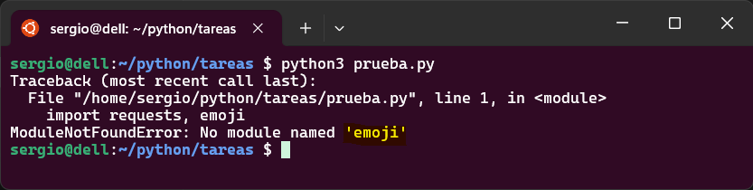
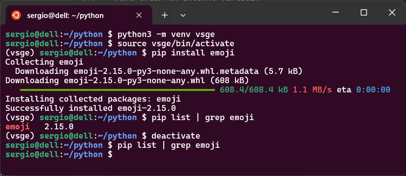

En este apartado nos centraremos en saber qué son los módulos en Python y cómo se utilizan para organizar y reutilizar código. Se explicará cómo importar módulos estándar como `math` o `datetime`, así como cómo crear y utilizar módulos propios. El objetivo es que se comprenda la importancia de dividir el código en partes funcionales y cómo acceder a funciones, clases o variables definidas en otros archivos mediante distintas formas de importación.

Además, se introducirá el uso de paquetes externos mediante el gestor `pip`, que permite instalar librerías desarrolladas por terceros. Se aprenderá a instalar, listar y desinstalar paquetes, así como a utilizar herramientas como `pip freeze` para capturar las dependencias de un proyecto. Se busca que el alumno sea capaz de incorporar nuevas funcionalidades a sus programas sin necesidad de desarrollarlas desde cero, aprovechando el ecosistema abierto de Python.

Por último, se abordará la creación y gestión de entornos virtuales con `venv`, una herramienta fundamental para trabajar en proyectos profesionales. Se aprenderá a crear un entorno aislado, activarlo, instalar paquetes dentro de él y generar un archivo `requirements.txt` para compartir las dependencias. El objetivo es que comprenda cómo evitar conflictos entre proyectos y cómo mantener un entorno limpio y controlado para cada desarrollo.

Básicamente, los contenidos que vamos a abordar en esta sección son:

- Uso de `import`, `from ... import ...`, y alias con `as`.
- Instalación de paquetes con `pip install`.
- Listado y desinstalación de paquetes (`pip list`, `pip uninstall`).
- Creación de entornos virtuales con `venv`.
- Activación y uso de entornos virtuales.
- Archivo `requirements.txt` para compartir dependencias.

## Introducción a los módulos

Un **módulo** en Python es simplemente un archivo `.py` que contiene funciones, clases o variables que pueden ser reutilizadas en otros programas. Python incluye muchos módulos estándar como `math`, `random` o `datetime`, y también permite crear los tuyos propios.

!!!example "Importación de módulo `math`"

    ```python
    import math
    print(math.sqrt(25))  # 5.0
    ```

También puedes importar solo una parte del módulo:

!!!example "Importación de función `pi` de módulo `math`"

    ```python
    from math import pi
    print(pi)  # 3.141592...
    ```

Y puedes usar alias para acortar nombres:

!!!example "Ejemplo de uso de alias para identificar un módulo"

    ```python
    import datetime as dt
    print(dt.datetime.now())
    ```

!!!tip "Información sobre los módulos en Python"

    La fuente más fiable y completa. En ella puedes consultar todos los módulos estándar, sus funciones, clases y ejemplos de uso.

    [https://docs.python.org/es/3/library/index.html](https://docs.python.org/es/3/library/index.html)

    Por ejemplo, si quieres saber qué ofrece el módulo `math`, puedes ir directamente a:

    [https://docs.python.org/es/3/library/math.html](https://docs.python.org/es/3/library/math.html)


## Uso de módulos propios en Python

Compro programadores, podemos crear módulos (archivos) donde definimos funciones que después vamos a reutilizar en nuestro/s proyectos. 

Cuando tienes funciones definidas en un archivo como `utils.py`, puedes reutilizarlas en otros archivos del mismo proyecto importándolas. No necesitas hacer nada especial para “exportarlas”: basta con que estén definidas correctamente y que el archivo esté en la misma carpeta (o en una ruta accesible).

Por ejemplo, veamos el caso de si tenemos un fichero para módulos y otro principal

!!!example "Uso de modulos propios"

    Supongamos que tenemos esta estructura:

    ```plaintext
    mi_proyecto/
    ├── utils.py
    └── main.py
    ```

    Y en `utils.py` tenemos:

    ```python
    def saludar(nombre):
        return f"Hola, {nombre}!"

    def sumar(a, b):
        return a + b
    ```

    Entonces en `main.py` puedes importar esas funciones así:

    ```python
    from utils import saludar, sumar

    print(saludar("Sergio"))
    print(sumar(3, 5))
    ```

    También puedes importar todo el módulo:

    ```python
    import utils

    print(utils.saludar("Lucía"))
    print(utils.sumar(10, 7))
    ```

Ambas formas son válidas. La primera importa funciones específicas, la segunda importa el módulo completo.

### 🧩 Ejemplo y ejercicio de uso

Veamos el siguiente ejemplo

!!!example "Ejemplo de uso de módulos propios"

    **Archivo `utils.py`**

    ```python
    def convertir_mayusculas(texto):
        return texto.upper()

    def obtener_longitud(texto):
        return len(texto)
    ```

    **Archivo `main.py`**

    ```python
    from utils import convertir_mayusculas, obtener_longitud

    frase = "Hola desde Alberic"
    print(convertir_mayusculas(frase))       # HOLA DESDE ALBERIC
    print(obtener_longitud(frase))           # 18
    ```

Este ejemplo muestra cómo separar funciones en un módulo y usarlas desde otro archivo.

!!!question "Ejercicio: Crear módulo de utilidades y usarlo desde otro archivo"

    Crea un archivo llamado `utils.py` que contenga las siguientes funciones:

    - `es_par(n)`: devuelve `True` si el número es par.
    - `formatear_nombre(nombre)`: devuelve el nombre con la primera letra en mayúscula y el resto en minúscula.

    Luego crea otro archivo llamado `main.py` que:

    1. Importe las funciones desde `utils.py`.
    2. Pida al usuario un número y un nombre.
    3. Muestre si el número es par.
    4. Muestre el nombre formateado.

    > Pistas  
    > - Usa `input()` para recoger datos.  
    > - Usa `from utils import ...` para importar funciones.  
    > - Usa `int()` para convertir el número.

    ???quote "Solución"

        **Archivo `utils.py`**

        ```python
        def es_par(n):
            return n % 2 == 0

        def formatear_nombre(nombre):
            return nombre.capitalize()
        ```

        **Archivo `main.py`**

        ```python
        from utils import es_par, formatear_nombre

        numero = int(input("Introduce un número: "))
        nombre = input("Introduce tu nombre: ")

        if es_par(numero):
            print("El número es par.")
        else:
            print("El número es impar.")

        print("Nombre formateado:", formatear_nombre(nombre))
        ```


## Instalación de paquetes con `pip`

`pip` es el gestor de paquetes oficial de Python. Permite instalar librerías externas que no vienen incluidas por defecto. Por ejemplo, para instalar la librería `requests`:

```bash
pip install requests
```

Una vez instalada, puedes usarla en tu código:

!!!example "Ejemplo de uso de librería `request`

```python
import requests
respuesta = requests.get("https://www.google.com")
print(respuesta.status_code)
```

Si intentamos hacer el `import` de un paquete no instalado en el sistema, entonces tendremos un error.

<figure markdown="span" align="center">
  { width="75%"  }
  <figcaption>Error por falta de librería "emoji"</figcaption>
</figure>

Para ver qué paquetes tienes instalados:

```bash
pip list
```

Para desinstalar uno:

```bash
pip uninstall <<nombre_paquete>>
```

---

## Entornos virtuales

Un **entorno virtual** es una carpeta aislada que contiene su propia instalación de Python y sus propios paquetes. Esto evita conflictos entre proyectos y permite mantener cada uno con sus dependencias específicas.

Esto nos permite crear aplicaciones y tener instalados todos los paquetes de forma aislada, de forma que los paquetes de una aplicación no interfieren con los de otra. Esto puede parecer trivial, pero no lo es, puesto que podemos usar diferentes versiones de paquetes en aplicaciones diferentes.

Para crear un entorno virtual:

```bash
python -m venv mi_entorno
```

Esto crea una carpeta llamada `mi_entorno`. Para activarlo:

- En Windows:
  ```bash
  mi_entorno\Scripts\activate
  ```
- En macOS/Linux:
  ```bash
  source mi_entorno/bin/activate
  ```

Una vez activado, puedes instalar paquetes con `pip` y quedarán guardados solo en ese entorno.

Para salir del entorno:

```bash
deactivate
```

Veamos un ejemplo que clarificará cómo se aplica:

<figure markdown="span" align="center">
  { width="75%"  }
  <figcaption>Entorno Virtual en Python</figcaption>
</figure>

En el ejemplo anterior podemos ver los siguientes pasos:

1. Se crea un entorno virtual `vsge` y se activa
2. Se instala el paquete `emogi`
3. Se comprueba que el paquete esta instalado
4. Se sale del entorno virtual
5. Se comprueba que el paquete `emogi` no esta instalado, por lo que se demuestra que solo queda instalado si se utiliza con el entorno activo.

### Trabajando con entornos virtuales

La forma más aconsejable y profesional de organizar un proyecto con entorno virtual es **trabajar en una carpeta base del proyecto** y tener el entorno virtual como una **subcarpeta dentro de ella**. Esto permite mantener el código fuente, los archivos de configuración, los datos y el entorno virtual **bien separados y estructurados**, lo que facilita el mantenimiento, la colaboración y el despliegue.

De hecho podemos decir que tenemos una estructura base típica a la hora de crear un proyecto en Python que sería similar a la mostrada en el siguiente ejemplo

!!!example "Estructura recomendada"

    ```plaintext
    mi_proyecto/
    ├── venv/                 ← entorno virtual (subcarpeta)
    ├── main.py               ← código principal
    ├── utils.py              ← módulos propios
    ├── requirements.txt      ← dependencias del proyecto
    ├── README.md             ← documentación
    └── datos/                ← archivos de entrada/salida
    ```

Esta estructura permite que el entorno virtual esté contenido dentro del proyecto, pero **no mezclado con el código**. También facilita que puedas subir tu proyecto a GitHub o compartirlo sin incluir el entorno virtual (que suele añadirse al `.gitignore`).

En el siguiente apartado hablaremos el archivo `requirements.txt`

### Usos típicos de los entornos virtuales

Un entorno virtual no es solo para instalar paquetes. También te permite:

- **Usar una versión específica de Python** (si lo creas con `pyenv` o herramientas similares).
- **Ejecutar scripts con dependencias aisladas**, sin interferencias de otros proyectos.
- **Probar diferentes versiones de librerías** sin afectar tu sistema.
- **Instalar herramientas de desarrollo** como linters, formateadores o frameworks sin contaminar el entorno global.

O sea, el entorno virtual es como una “burbuja” donde puedes trabajar con total libertad, sabiendo que todo lo que instales o configures queda dentro de esa carpeta.


## Archivo `requirements.txt`

Este archivo contiene la lista de paquetes necesarios para un proyecto. Se puede generar automáticamente:

```bash
pip freeze > requirements.txt
```

Y se puede usar para instalar todos los paquetes en otro entorno:

```bash
pip install -r requirements.txt
```

Esto es muy útil para compartir proyectos con otros desarrolladores o para desplegar en servidores. En vez de estar instalando manualmente todos los paquetes, mediante este fichero el servidor sabe qué paquetes debe instalar (automáticamente).

!!!example "Ejemplo de uso"

    Contenido de fichero `requirements.txt`

    ```bash
    # Crear entorno virtual
    python -m venv entorno_web

    # Activar entorno (Windows)
    entorno_web\Scripts\activate

    # Instalar Flask
    pip install flask

    # Guardar dependencias
    pip freeze > requirements.txt

    # Desactivar entorno
    deactivate
    ```

El ejemplo crear un flujo que permite preparar un proyecto web con *Flask* sin afectar otros proyectos.


## 🧩 Ejemplo y ejercicio de uso

!!!question "Ejercicio: Preparar entorno para proyecto de análisis de datos"

    Imagina que vas a empezar un proyecto de análisis de datos en Python.  
    Crea un entorno virtual llamado `analisis`, instala los paquetes `pandas` y `matplotlib`, y guarda las dependencias en un archivo `requirements.txt`.

    > Pistas  
    > - Usa `python -m venv` para crear el entorno.  
    > - Activa el entorno antes de instalar los paquetes.  
    > - Usa `pip freeze` para generar el archivo.

    ???quote "Solución"

        ```bash
        # Crear entorno virtual
        python -m venv analisis

        # Activar entorno (Windows)
        analisis\Scripts\activate

        # Instalar paquetes
        pip install pandas matplotlib

        # Guardar dependencias
        pip freeze > requirements.txt

        # Desactivar entorno
        deactivate
        ```
