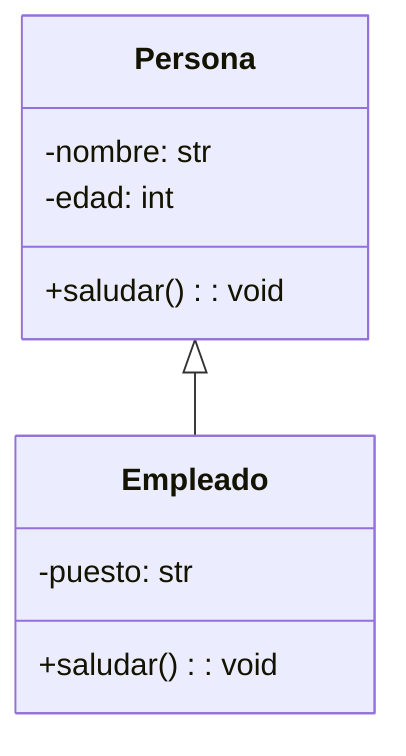

En esta última sesión, nos familiarizaremos con los fundamentos de la programación orientada a objetos en Python, un paradigma que permite modelar problemas del mundo real mediante clases y objetos. Se explicará cómo definir clases, crear instancias, y utilizar atributos y métodos para encapsular comportamiento. El objetivo es que se comprenda cómo organizar el código en estructuras más robustas y reutilizables.

También se abordarán conceptos clave como el constructor `__init__`, el uso de `self`, y la distinción entre atributos de instancia y métodos. Se aprenderá a crear objetos con estado propio y a manipularlos mediante funciones internas que definen su comportamiento. Se busca que se entienda cómo se relacionan los objetos entre sí y cómo se puede construir lógica más compleja a partir de clases simples.

Por último, se introducirá el concepto de herencia, que permite crear nuevas clases a partir de otras ya existentes, reutilizando y extendiendo funcionalidades. Se explicará cómo sobrescribir métodos, cómo usar `super()` y cómo aplicar estos principios para evitar duplicación de código y mejorar la mantenibilidad de los programas.

Básicamente, los contenidos que vamos a abordar en esta sección son:

- Definición de clases y objetos
- Atributos de instancia y uso de `self`
- Métodos internos y constructor `__init__`
- Creación y uso de instancias
- Herencia entre clases
- Sobrescritura de métodos y uso de `super()`


## Introducción a la POO en Python

La programación orientada a objetos permite representar entidades como “objetos” que tienen **estado** (atributos) y **comportamiento** (métodos). En Python, se define una clase con la palabra clave `class`, y se crean objetos como instancias de esa clase.

!!!example "Ejemplo de Objerto Persona"

    ```python
    class Persona:
        def __init__(self, nombre, edad):
            self.nombre = nombre
            self.edad = edad

        def saludar(self):
            print(f"Hola, soy {self.nombre} y tengo {self.edad} años.")
    ```

Aquí, `__init__` es el **constructor**, que se ejecuta al crear el objeto. `self` representa la instancia actual, y permite acceder a sus atributos y métodos.

```python
p1 = Persona("Sergio", 30)
p1.saludar()
```

## Herencia entre clases

Una clase puede **heredar** de otra para reutilizar su comportamiento. Por ejemplo:


!!!example "Ejemplo de objeto Empleado, heredado de Persona"

    ```python
    class Empleado(Persona):
        def __init__(self, nombre, edad, puesto):
            super().__init__(nombre, edad)
            self.puesto = puesto

        def saludar(self):
            print(f"Hola, soy {self.nombre}, trabajo como {self.puesto}.")
    ```

La clase `Empleado` hereda de `Persona`, pero redefine el método `saludar`. El uso de `super()` permite llamar al constructor de la clase base.

## 🧩 Ejemplo y ejercicio de uso

Veamos un ejemplo básico que muestra cómo una clase hija puede sobrescribir el comportamiento de la clase padre. En este caso, redefinimos la clase Animal como Perro.

!!!example "Clase Perro redefina a Animal"

    ```python
    class Animal:
        def __init__(self, nombre):
            self.nombre = nombre

        def hablar(self):
            print(f"{self.nombre} hace un sonido.")

    class Perro(Animal):
        def hablar(self):
            print(f"{self.nombre} dice: ¡Guau!")

    mascota = Perro("Toby")
    mascota.hablar()  # Toby dice: ¡Guau!
    ```

!!!question "Ejercicio: Crear clase `Coche` con atributos y método"

    Crea una clase llamada `Coche` que tenga los siguientes atributos:

    - `marca`
    - `modelo`
    - `año`

    La clase debe tener:

    1. Un constructor que reciba esos tres valores.
    2. Un método llamado `mostrar_info()` que imprima los datos del coche en una sola línea.

    Luego crea una instancia de la clase y llama al método para mostrar la información.

    > Pistas  
    > - Usa `__init__` para inicializar los atributos.  
    > - Usa `self` para acceder a los atributos dentro del método.  
    > - Usa `print()` para mostrar los datos formateados.

    ???quote "Solución"

        ```python
        class Coche:
            def __init__(self, marca, modelo, año):
                self.marca = marca
                self.modelo = modelo
                self.año = año

            def mostrar_info(self):
                print(f"{self.marca} {self.modelo} ({self.año})")

        mi_coche = Coche("Toyota", "Corolla", 2020)
        mi_coche.mostrar_info()  # Toyota Corolla (2020)
        ```


## Encapsulamiento y visibilidad

En Python, no existe una protección estricta de atributos como en otros lenguajes, pero se usan **convenciones** para indicar que un atributo no debe modificarse directamente.

- `_atributo`: indica que es de uso interno (convención).
- `__atributo`: activa name *mangling* (ocultación parcial).
- `@property`: permite acceder a atributos como si fueran públicos, pero controlando su lectura y escritura.

!!!example "Ejemplo de encapsulamiento con `@property`"

    ```python
    class Persona:
        def __init__(self, nombre):
            self._nombre = nombre

        @property
        def nombre(self):
            return self._nombre

        @nombre.setter
        def nombre(self, nuevo):
            if nuevo:
                self._nombre = nuevo
    ```

Esto permite validar o controlar el acceso a los atributos sin exponerlos directamente.

---

## Relación entre objetos

Una clase puede contener instancias de otras clases como atributos. Esto permite modelar relaciones entre entidades.

!!!example "Ejemplo de composición: Coche con Motor"

    ```python
    class Motor:
        def __init__(self, tipo):
            self.tipo = tipo

    class Coche:
        def __init__(self, marca, motor):
            self.marca = marca
            self.motor = motor

    m = Motor("eléctrico")
    c = Coche("Tesla", m)
    print(c.motor.tipo)  # eléctrico
    ```

Este patrón se llama **composición** y es clave para construir sistemas complejos a partir de componentes simples.

---

## Diagrama conceptual básico

!!!info "Esquema de clases con herencia"



Este diagrama muestra cómo `Empleado` hereda de `Persona` y añade nuevos atributos y métodos.

---

## 🧪 Actividad de refuerzo: Biblioteca

!!!question "Ejercicio: Composición y listas de objetos"

    Crea una clase `Libro` con los siguientes atributos:

    - `titulo`
    - `autor`
    - `anio`

    Luego crea una clase `Biblioteca` que contenga una lista de libros y un método `mostrar_catalogo()` que imprima todos los títulos disponibles.

    > Pistas  
    > - Usa una lista como atributo interno (`self.libros = []`).  
    > - Añade libros con un método `agregar_libro(libro)`.  
    > - Recorre la lista con un bucle `for`.

    ???quote "Solución"

        ```python
        class Libro:
            def __init__(self, titulo, autor, anio):
                self.titulo = titulo
                self.autor = autor
                self.anyo = anio

        class Biblioteca:
            def __init__(self):
                self.libros = []

            def agregar_libro(self, libro):
                self.libros.append(libro)

            def mostrar_catalogo(self):
                for libro in self.libros:
                    print(f"{libro.titulo} ({libro.anio}) - {libro.autor}")

        # Ejemplo de uso
        biblio = Biblioteca()
        biblio.agregar_libro(Libro("1984", "George Orwell", 1949))
        biblio.agregar_libro(Libro("El Principito", "Antoine de Saint-Exupéry", 1943))
        biblio.mostrar_catalogo()
        ```


