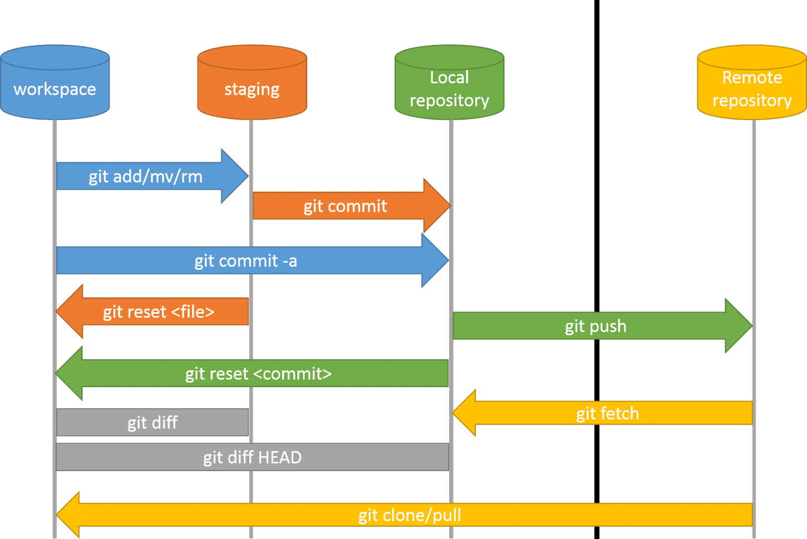

## Sistemas de control de versiones

Cuando trabajas en un proyecto (una aplicación, un juego, un módulo, etc.), es normal que hagas muchos cambios: corregir errores, añadir funciones, reorganizar archivos.  
El control de versiones (VCS, *Version Control System*) es una herramienta que te permite:

- Llevar un historial de cambios: saber qué se cambió, cuándo y por qué.
- Volver atrás si algo sale mal (deshacer, recuperar versiones antiguas).
- Trabajar en equipo sin pisar el trabajo de otros.
- Tener copias de seguridad distribuidas (cada colaborador tiene el repositorio completo).

**`Git`** es un sistema de control de versiones muy popular, distribuido y eficiente.


!!!note "Nota: Distribuido"

    **Distribuido** quiere decir que cada desarrollador tiene una copia completa del repositorio (historial, ramas, archivos). No dependes de un servidor central para trabajar localmente.


### Git
Git es __un sistema de control de versiones libre y distribuido__ diseñado para gestionar proyectos pequeños y grandes
con rapidez y eficiencia. El objetivo principal de Git es controlar y gestionar los cambios realizados
en una gran cantidad de archivos de una forma fácil y eficiente.

Git fue diseñado en 2005 por Linus Torvalds, creador del kernel del sistema operativo Linux, y desde entonces
se ha convertido en una herramienta fundamental e imprescindible en la gestión de código fuente en proyectos colaborativos.

Git se basa en __repositorios__, que se inicializan en un directorio concreto y contienen toda la información
de los cambios realizados en todo el árbol de directorios y archivos a partir de ese directorio.

Los principales objetivos y características de Git son:

- __Control de versiones__: Git realiza un seguimiento de las modificaciones a los archivos a lo largo del tiempo,
    lo que permite a los desarrolladores ver y recuperar versiones anteriores de su código.
    Esta característica es esencial para trabajar en equipos y para solucionar problemas o errores.
- __Distribuido__: Cada copia de un repositorio Git contiene todo el historial de cambios y puede operar de manera independiente.
    Esto facilita el trabajo sin conexión y la colaboración en equipos distribuidos.
- __Rama y fusión__: Git facilita la creación de ramas (_branching_) para desarrollar funcionalidades
    o solucionar problemas sin afectar la rama principal.
    Después, puedes fusionar (_merge_) las ramas de nuevo en la rama principal cuando estén listas.
- __Gestión de conflictos__: Git ofrece herramientas para gestionar conflictos en caso de que dos o más personas hayan realizado
    cambios en la misma parte del código.
    Los desarrolladores pueden resolver estos conflictos manualmente.
- __Colaboración__: Git facilita la colaboración en proyectos de código abierto o en equipos,
    ya que permite a múltiples personas trabajar en el mismo proyecto de manera eficiente.
    Plataformas como GitHub, GitLab y Bitbucket se utilizan comúnmente para alojar repositorios Git en línea y colaborar en proyectos.
- __Código abierto y gratuito__: Git es de código abierto y gratuito, lo que significa que cualquiera puede usarlo sin coste y contribuir al desarrollo de la herramienta.


### Usaremos el terminal
En estos apuntes, utilizaremos la terminal para interactuar con Git, pero esto no significa que sea la única manera de hacerlo.
De hecho, prácticamente todos los entornos de desarrollo modernos tienen integración con Git, lo que permite realizar
las mismas operaciones que proporciona la terminal, pero de forma más visual e intuitiva.

No obstante, es importante conocer cómo funcionan los comandos de Git en la terminal, por distintas razones:

- __Portabilidad__: La terminal es un entorno común en todos los sistemas operativos y en cualquier entorno de desarrollo.
- __Flexibilidad__: La terminal permite realizar operaciones más avanzadas y personalizadas que las interfaces gráficas.
- __Comprensión__: Permite entender cómo funcionan los comandos de Git y los procesos que realiza en el sistema.


## Trabajando con `git`

A la hora de trabajar con git, debemos tener en cuenta una serie de conceptos previos

### Tres áreas dentro de un repositorio

Para entender cómo trabaja Git, es útil saber que el repositorio (local) está dividido en tres estados o “áreas”:

1. **Directorio de trabajo (working directory)**  
   Es la copia de los archivos que ves y modificas en tu sistema. Por ejemplo, el código fuente que editas.

2. **Área de preparación (staging area o índice / index)**  
   Es una “zona intermedia” donde marcas los cambios que quieres incluir en el próximo commit. Aquí decides qué cambios van o no van al commit.

3. **Repositorio local (.git)**  
   Guarda los commits, el historial, las ramas, etc. Cuando haces `git commit`, los contenidos del área de preparación se almacenan aquí.

Visualmente:

<figure markdown="span" align="center">
  { width="85%"  }
  <figcaption>Áreas de un repositorio Git.</figcaption>
</figure>


### Flujo básico de trabajo

El flujo de trabajo que sigue la gestión de un repositorio local es: 

1. Modificar archivos en tu directorio de trabajo.
2. Usar `git add` para moverlos al *staging*.
3. Hacer `git commit` para registrar esos cambios como una versión nueva.
4. Si trabajas con repositorio remoto, haces `git push` para subir esos commits al servidor.
5. Puedes recuperar cambios de otros con `git pull` o `git fetch`.

<figure markdown="span" align="center">
  { width="85%"  }
  <figcaption>Flujo de trabajo git + repositorio.</figcaption>
</figure>


## instalación de `git`

La instalación de Git es un paso esencial para comenzar a trabajar con control de versiones en proyectos de desarrollo. En sistemas **Ubuntu o derivados de Debian**, el proceso es muy sencillo: basta con abrir una terminal y ejecutar el comando 

```bash
sudo apt install git
```

Esto instalará la versión disponible en los repositorios oficiales. Una vez instalado, puedes verificarlo con 

```bash
git --version
```
También es posible compilar Git desde el código fuente si se requiere una versión más reciente, aunque esto implica pasos adicionales.

En **Windows**, la forma más práctica de instalar Git es descargando el instalador desde la página oficial [git-scm.com](https://git-scm.com/book/es/v2/Inicio---Sobre-el-Control-de-Versiones-Instalaci%C3%B3n-de-Git). El asistente de instalación permite configurar opciones como el editor por defecto, la integración con Git Bash y el comportamiento de línea de comandos. Tras completar la instalación, puedes abrir Git Bash o usar Git desde PowerShell o CMD. 

Para más detalles, instrucciones específicas por sistema operativo y recomendaciones de configuración, se recomienda consultar la [documentación oficial de Git](https://git-scm.com/book/es/v2/Inicio---Sobre-el-Control-de-Versiones-Instalaci%C3%B3n-de-Git).


## Comandos esenciales

| Comando | Qué hace | Nota / explicación didáctica |
|---|---|---|
| `git init` | Inicializa un repositorio Git en la carpeta actual | Crea una carpeta oculta `.git` que gestionará todo el historial |
| `git clone <url>` | Crea una copia local de un repositorio remoto | Clonas todo el historial desde otro repositorio |
| `git add <archivo>` | Añade uno o varios archivos al área de preparación | Le dices a Git “este cambio lo quiero incluir en el próximo commit” |
| `git commit -m "mensaje"` | Crea un nuevo commit con los cambios del staging | Cada commit tiene un mensaje que explica qué cambiaste |
| `git status` | Muestra el estado actual: archivos modificados, en staging, sin seguimiento | Es muy útil para saber qué está listo para commit |
| `git log` | Muestra el historial de commits | Puedes ver fechas, autor, mensaje |
| `git diff` | Muestra diferencias entre versiones | Por ejemplo, lo que cambiaste desde el último commit |


<figure markdown="span" align="center">
  { width="85%"  }
  <figcaption>Flojo de trabajo con git + comandos.</figcaption>
</figure>


### Inicializar repositorio
```bash
git init
```
Crea un nuevo repositorio local.

### Clonar repositorio
```bash
git clone URL
```
Descarga un repositorio remoto.

### Estado del repositorio
```bash
git status
```
Muestra los archivos modificados y no rastreados.

### Añadir archivos
```bash
git add archivo.txt
```
Agrega archivos al área de preparación.

<figure markdown="span" align="center">
  { width="85%"  }
  <figcaption>Inicialización de repositorio git.</figcaption>
</figure>

En la figura anterior, se puede ver como hemos creado un repositorio y se han añadido los ficheros nuevos creado al repositorio.

!!!tip "Añadir archivos nuevos"

    No necesitamos recordar todos los archivos nuevos cuando vamos a añadirlos al repositorio. Podemos sustituir el nombre de todos los archivos por un `.` (punto):

    ```bash
    git add .
    ```

    Con esta orden nos incluirá todos los archivos nuevos, incluidos los que se encuentren en las diferentes subcarpetas.

### Confirmar cambios
```bash
git commit -m "Descripción del cambio"
```
Guarda los cambios en el historial.

### Ver historial

```bash
git log
```
Muestra los commits realizados.

<figure markdown="span" align="center">
  { width="85%"  }
  <figcaption>Guardando los cambios realizados.</figcaption>
</figure>

En esta ilustración guardamos los cambios mediante `commit` y podemos observar como esto cambios se han guardado correctamente.

Si el historial es muy largo, podemos utilizar el parámetro `-n` para indicar la cantidad de commits que queremos ver, e incluso si utilizamos --oneline tenemos esta información en un única líneas para que sea más sencillo buscar el cambio deseado

```bash
git log -n3 --oneline
```


### Revertir cambios
```bash
git checkout -- archivo.txt
```
Revierte cambios en un archivo desde el último commit

### Revertir commit
```bash
git revert ID_commit
```
Crea un nuevo commit que revierte el anterior.

### Resetear a un commit anterior
```bash
git reset --hard ID_commit
```
Vuelve el repositorio al estado de un commit anterior.

La diferencia entre las dos últimas ordenes, es que la primera revierte creando un nuevo commit en el historial, mientras que la segunda elimina los commits desde el punto indicado.

## El archivo `.gitignore`

El archivo `.gitignore` es una herramienta fundamental en Git que permite **excluir archivos o carpetas del control de versiones**, evitando que se agreguen, rastreen o suban al repositorio. Aquí tienes una explicación clara y completa:

- Es un archivo de texto que contiene **patrones de nombres de archivos o carpetas** que Git debe ignorar.
- Se coloca normalmente en la raíz del repositorio, aunque también puede haber `.gitignore` en subdirectorios.
- Git lo consulta al decidir qué archivos **no deben ser rastreados ni incluidos en commits**.

Las razones más importantes para usar `.gitignore` son :

- Para **evitar subir archivos innecesarios o sensibles**, como:
  - Archivos temporales (`*.log`, `*.tmp`)
  - Carpetas de dependencias (`node_modules/`, `venv/`)
  - Archivos compilados (`*.class`, `*.pyc`, `*.o`)
  - Configuraciones locales (`.env`, `.vscode/`, `.idea/`)
  - Archivos del sistema (`Thumbs.db`, `.DS_Store`)

!!!example "Ejemplo de contenido de `.gitignore`"

    Contenido ejemplo de fichero `.gitignore`:
    ```gitignore
    # Ignorar archivos de log
    *.log

    # Ignorar carpetas de dependencias
    node_modules/
    venv/

    # Ignorar archivos de configuración local
    .env
    .vscode/

    # Ignorar archivos compilados
    *.class
    *.pyc
    *.o
    ```

**Consideraciones importantes**

- **No afecta archivos ya rastreados**: Si un archivo ya fue añadido al repositorio, `.gitignore` no lo eliminará. Debes usar `git rm --cached archivo` para dejar de rastrearlo.
- Puedes tener un `.gitignore` **global** para todos tus proyectos, configurado en `~/.config/git/ignore` o mediante:

```bash
git config --global core.excludesFile ~/.gitignore_global
```

!!!info "Para más detalles técnicos"
    - [documentación oficial de Git](https://git-scm.com/docs/gitignore)
    - [guía práctica en español](https://www.freecodecamp.org/espanol/news/gitignore-explicado-que-es-y-como-agregar-a-tu-repositorio/).


!!!note "Recuerda estas buenas prácticas iniciales"

    - Haz *commits* pequeños y coherentes (cada *commit* debe tener sentido por sí solo).
    - Escribe mensajes de commit claros: “Corrección bug X”, “Añadida funcionalidad Y”.
    - Usa `.gitignore` para excluir archivos innecesarios (archivos temporales, binarios, claves, etc.).
    - Practica el uso de `git status` frecuentemente para tener control del estado del repositorio.

