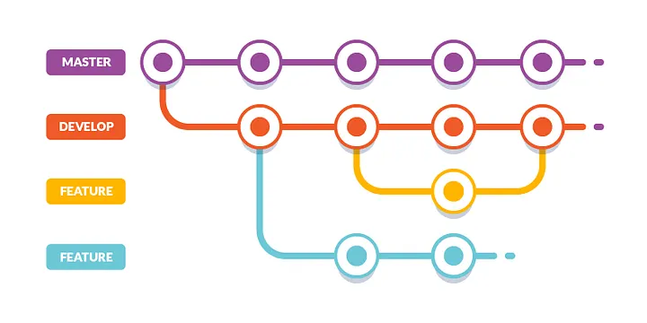
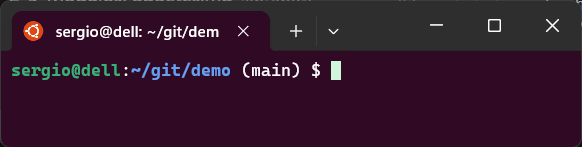
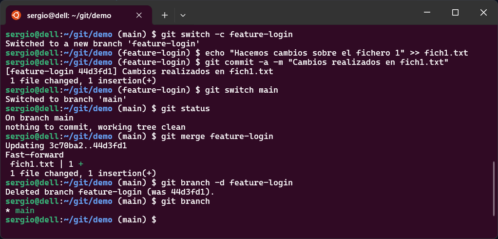

Trabajar con ramas es una de las ventajas más potentes de Git: te permite desarrollar funcionalidades, corregir errores o experimentar sin afectar la rama principal.

## Concepto de rama

- Una rama (*branch*) es simplemente un puntero que apunta a un commit.
- La rama principal suele llamarse `main` o `master` (aunque puedes cambiar el nombre).
- Cuando creas una rama nueva, Git crea un nuevo puntero que “se mueve” a medida que haces commits en esa rama.

Imagina una línea de tiempo:

<figure markdown="span" align="center">
  { width="85%"  }
  <figcaption>Ramas locales en git.</figcaption>
</figure>

En este gráfico podemos ver que podemos tener varias ramas en nuestro proyecto que al mismo tiempo pueden volver a ramificarse en otras ramas y volver a unirse.


!!!tip "Mostrar la rama actual de Git en el *prompt* de Linux"

    Cuando trabajamos con varios proyectos y ramas, es muy útil que el *prompt* de la terminal muestre en qué rama de Git estamos.  
    Puede ser muy interesante aplicar este truco antes de trabajar con ramas.

    Veamos los pasos para activar el *prompt* de Git

    1. Abre tu archivo `~/.bashrc` y añade esta función **antes** de definir el `PS1`:

        ```bash
        parse_git_branch() {
          git rev-parse --is-inside-work-tree &>/dev/null || return
          branch=$(git symbolic-ref --short HEAD 2>/dev/null)
          [ -n "$branch" ] && echo "($branch)"
        }
        ```

    2. Modificar el prompt (`PS1`). Justo después, modifica la línea que define `PS1`. Por ejemplo:

        ```bash
        PS1='\u@\h:\w $(parse_git_branch)\$ '
        ```

    3. Guarda los cambios y recarga el archivo:

        ```bash
        source ~/.bashrc
        ```
    Tendrán un resultado similar al siguiente, donde verás entre parentesis en qué rama te encuentras.

    <figure markdown="span" align="center">
      { width="80%"  }
    </figure>

!!!note "Ventajas de usar ramas"
    - Trabajo aislado: puedes trabajar en nuevas funcionalidades sin afectar el código estable.
    - Experimentación: puedes probar ideas nuevas sin miedo.
    - Colaboración: cada desarrollador puede tener su rama y luego fusionar al proyecto principal.

## Comandos de ramas

| Comando | Qué hace |
|---|---|
| `git branch nombre_rama`  |  Crea una rama llamada `nombre_rama` (no cambia a ella, solo la crea). |
| `git switch nombre_rama`  |  Cambia la rama activa a `nombre_rama` (antes era `git checkout nombre_rama`). |
| `git switch -c nombre_rama` |  Crea y cambia a la rama nueva en un solo paso. |
| `git branch` | Muestra ramas de repositorio actual |
| `git show-branch` | Muestra ramas de repositorio actual de una forma pseudo gráfica. |
| `git branch -d nombre_rama`  |  Elimina la rama local `nombre_rama` si ya ha sido fusionada o no tiene cambios pendientes.|
| `git merge` | Combina cambios de otra rama en la actual |
| `git diff` | Muestra diferencias entre dos ramas |
| *Fast-forward merge* | Cuando la rama actual puede avanzar sin conflictos |
| *Commit de merge* | Se crea cuando hay líneas de desarrollo paralelas |


### Crear y cambiar ramas
```bash
git branch nueva-rama
git switch nueva-rama
```
o también en un único paso

```bash
git switch -c nueva-rama
```

!!!note "git switch vs git checkout"

    En Git, `git switch` es el comando moderno y recomendado para cambiar de rama, mientras que `git checkout` es el comando más antiguo que también permite hacerlo, pero con funciones adicionales que pueden generar confusión. 


### Fusionar ramas
```bash
git merge rama-a-fusionar
```

### Eliminar ramas
```bash
git branch -d nombre-rama
```

### Ver diferencias
```bash
git diff
```
Muestra los cambios no confirmados.

### Ver ramas 
```bash
git branch
```
Muestra las ramas que tiene el repositorio.


## Flujo típico con ramas

1. Estás en la rama principal `main`.
2. Creas una rama para tratar una nueva funcionalidad:
   ```
   git switch -c feature-login
   ```
3. Trabajas, haces commits en `feature-login`.
4. Cuando esté lista la funcionalidad, cambias de nuevo a `main`:
   ```
   git switch main
   ```
5. Fusionas (merge) la rama:
   ```
   git merge feature-login
   ```
6. Si quieres, borras la rama `feature-login`:
   ```
   git branch -d feature-login
   ```

<figure markdown="span" align="center">
  { width="85%"  }
  <figcaption>Ejemplo de trabajo con ramas.</figcaption>
</figure>

### Fusiones (`merge`) y conflictos

- `git merge rama_origen` fusiona los cambios de la rama indicada en la rama actual.
- Si los cambios no se solapan, el merge es automático (fast-forward o commit de merge).
- Si hay conflictos, Git te avisará y tendrás que resolverlos manualmente.
- Después de resolver conflictos, haces `git add` de los archivos modificados y luego `git commit`.


### Ejemplo práctico: creación, trabajo y fusión de ramas en Git

Este ejemplo muestra paso a paso cómo trabajar con ramas en Git utilizando un ejemplo sencillo.
Incluye comandos, explicaciones y esquemas gráficos para visualizar la evolución del repositorio.

#### Crear el repositorio inicial

```bash
# Creamos una carpeta y entramos
mkdir demo-git
cd demo-git

# Inicializamos el repositorio Git
git init

# Creamos un archivo inicial
echo "Proyecto base" > README.md
git add README.md
git commit -m "Commit inicial con README"
```

**Estado del repositorio:**

```
A ← main
```

*(Solo existe la rama `main`, con un único commit “A”)*


#### Crear la rama `login` y trabajar en ella

```bash
# Crear y cambiar a la rama 'login'
git switch -c login

# Simulamos una modificación
echo "Funcionalidad login" > login.py
git add login.py
git commit -m "Añadido módulo login"
```

**Estructura actual:**

```
A ← main
 \
  B ← login
```

#### Crear otra rama `perfil` desde `main`

Primero volvemos a la rama principal y creamos otra:

```bash
git switch main
git switch -c perfil
echo "Funcionalidad perfil de usuario" > perfil.py
git add perfil.py
git commit -m "Añadido módulo perfil de usuario"
```

**Estructura actual:**

```
A ← main
 ├── B ← login
 └── C ← perfil
```

*(Cada rama tiene un nuevo commit diferente partiendo del mismo punto A.)*


#### Fusionar la rama `login` en `main`

Volvemos a `main` y fusionamos los cambios de `login`:

```bash
git switch main
git merge login
```

**Después del merge:**

```
A — B ← main, login
 \
  C ← perfil
```

- La rama `main` ahora incluye los cambios de `login`.  
- Si no hay conflictos, Git hace un *fast-forward merge* (mueve el puntero `main` al commit B).  


#### Fusionar la rama `perfil`

Ahora fusionamos la segunda rama:

```bash
git merge perfil
```

**Resultado (merge normal):**

```
      B ← login
     / \
A ——┤   M ← main
     \ /
      C ← perfil
```

- `M` es un **commit de merge** que combina el trabajo de las dos ramas.  
- La historia se une en un punto común.  

#### Limpiar ramas ya fusionadas

```bash
git branch -d login
git branch -d perfil
```

**Resultado final:**

```
A — B — M ← main
```

*(El proyecto tiene la funcionalidad de `login` y `perfil` integradas en la rama principal.)*


!!!tip "Buenas prácticas con ramas"
    - Usa nombres descriptivos (feature-login, bugfix-42, hotfix-crash).
    - No dejes ramas locales sin usar por mucho tiempo.
    - Antes de fusionar, asegúrate de que estén actualizadas con la rama principal.
    - Haz *pull* o *fetch* en la rama principal antes de crear nuevas ramas, para partir de la versión más reciente.
