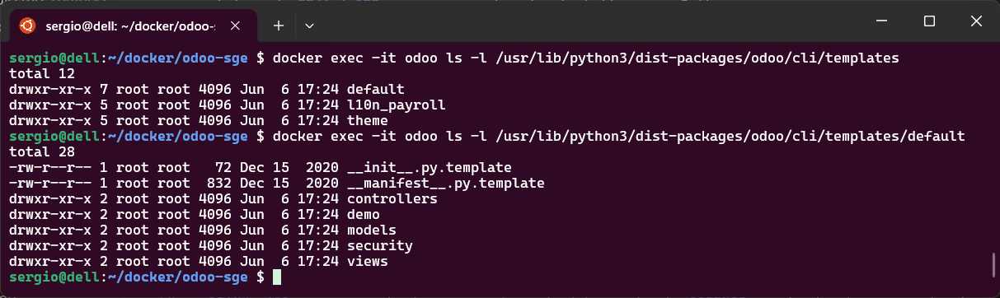
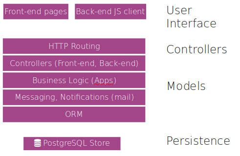

Hemos hecho una introducción creando unos módulos de prueba en Odoo. Ahora vamos a profundizar y explicar qué es cada uno de los elementos y cómo se utilizar, al menos con una profundidad mínima para poder desarrollar módulos básicos.

## Los módulos

Tanto el servidor como los clientes son módulos. Todos están guardados en una base de datos. Todo lo que se pueda hacer para modificar ***Odoo*** se hace en módulos.

### Composición de un módulo

Los módulos de ***Odoo*** amplían o modifican partes del *Modelo-Vista-Controlador*. De esta manera, un módulo puede tener:

- **Objetos de negocio**: Son la parte del modelo, definidos en clases de Python según una sintaxis propia del ORM de ***Odoo***.
- **Archivos de datos**: Son archivos XML que pueden definir datos, vistas o configuraciones.
- **Controladores web**: Gestionan las peticiones de los navegadores web.
- **Datos estáticos**: Imágenes, CSS o JavaScript utilizados por la interfaz web. Es necesario que los datos estáticos se guarden en el directorio **static**. Por ejemplo, el icono del módulo va en `static/description/icon.png`.

### Estructura de archivos de un módulo

Ya vimos en la sección anterior alguna de las características de los módulos: 

- Todos los módulos están en un directorio definido en la opción **--addons-path** o en el archivo de configuración, normalmente `addons`. Cada módulo esta un un subdirectorio dentro de esta carpeta y por lo que puede haber más de un directorio.
- Un módulo de Python se declara en un archivo de **manifest** (`__manigest__.py`) que da información sobre el módulo, lo que hace, los módulos de los que depende y cómo se debe instalar o actualizar. [Manifest in Odoo](https://www.odoo.com/documentation/8.0/reference/module.html#reference-module-manifest)
- Un módulo es un paquete de Python que necesita un archivo **\_\_init\_\_.py** para instanciar todos los archivos Python.

### Creación de módulos

También hemos visto que podemos crear un módulo de forma manual añadiendo cada una de las carpetas y ficheros de configuración o vimos que para ayudar al programador, ***Odoo*** contiene le comando `scaffold` para crear módulos vacíos. Este crea la estructura de archivos necesaria para empezar a trabajar:

    $ odoo scaffold <nombre_del_módulo> <dónde_crearlo>

Posteriormente veremos más sobre `scaffold`, pero si quieres más información puedes recurrir al [Manual oficial Scaffolding](https://www.odoo.com/documentation/8.0/reference/cmdline.html#scaffolding)

El parámetro **scaffold** puede tener la opción **-t** para indicar el directorio de la *plantilla*. Esta está hecha utilizando **jinja2**, que es un motor de plantillas para Python.

Las *plantillas* están en el directorio de instalación de Odoo, en el directorio **cli**. En nuestro caso: **cli/templates/** dentro del directorio de instalación de ***Odoo***.

<figure markdown="span" align="center">
  { width="75%"  }
  <figcaption>Plantillas de módulos Odoo utilizadas por `scaffold`.</figcaption>
</figure>

Como podemos observar, el ejemplo de la sección anterior *HolaMundo_V3" tiene exactamente esta estructura.

Podemos crear una nueva *plantilla* copiando el directorio `default` o `theme` y modificando los archivos. Esto puede ser útil si siempre hacemos módulos con la misma plantilla. Por ejemplo, para poner nuestro logo, copyright, etc.

## ORM

El **ORM** ("*Object-Relational Mapping*" o "*Mapeo Objeto-Relacional*") es una técnica de programación que permite convertir datos entre sistemas incompatibles utilizando lenguajes de programación orientados a objetos. En ***Odoo***, el **ORM** permite a los desarrolladores trabajar con la base de datos de manera más intuitiva y eficiente, sin necesidad de escribir consultas SQL directamente.

El **ORM** es como una capa de abstracción que mapea las tablas de la base de datos a clases de Python y las filas de esas tablas a instancias de esas clases. Esto significa que puedes manipular los datos de la base de datos utilizando objetos y métodos de Python, lo que simplifica enormemente el desarrollo y mantenimiento del código.

<figure markdown="span" align="center">
  { width="75%"  }
  <figcaption>ORM dentro de la arquitectura de Odoo.</figcaption>
</figure>


Con ORM en Odoo se puede 
- **Definición de modelos**: Puedes definir modelos de datos utilizando clases de Python. Cada modelo corresponde a una tabla en la base de datos.
- **Operaciones CRUD**: El ORM proporciona métodos para realizar operaciones CRUD (Crear, Leer, Actualizar, Eliminar) de manera sencilla. Por ejemplo, puedes crear un nuevo registro utilizando el método `create()`, leer registros con el método `search()`, actualizar registros con el método `write()`, y eliminar registros con el método `unlink()`.
- **Relaciones entre modelos**: Puedes definir relaciones entre modelos, como relaciones uno a muchos, muchos a uno, y muchos a muchos, utilizando campos específicos como `One2many`, `Many2one`, y `Many2many`.
- **Validaciones y restricciones**: Puedes definir validaciones y restricciones en los modelos para asegurar la integridad de los datos. Por ejemplo, puedes utilizar el decorador `@api.constrains` para definir restricciones personalizadas.

A continuación se muestra un **ejemplo** sencillo de cómo definir un modelo en ***Odoo*** utilizando el **ORM**:

```python
from odoo import models, fields, api

class ModeloEjemplo(models.Model):
    _name = 'modelo.ejemplo'
    _description = 'Descripción de modelo de ejemplo'

    name = fields.Char(string='Nombre', required=True)
    descripcion = fields.Text(string='Descripción')
    fecha = fields.Date(string='Fecha')

    @api.constrains('name')
    def _check_nombre(self):
       for record in self:
          if len(record.name) < 3:
             raise ValidationError('El nombre debe tener al menos 3 caracteres.')
```

En este ejemplo:

- Definimos un modelo llamado `ModeloEjemplo` que corresponde a una tabla en la base de datos.
- El modelo tiene tres campos: `nombre`, `descripcion`, y `fecha`.
- Utilizamos el decorador `@api.constrains` para definir una restricción que asegura que el campo `nombre` tenga al menos 3 caracteres.

Mediante **ORM**, ***Odoo*** mapea sus objetos en una base de datos, evitando al programador la mayoría de consultas SQL. De esta manera, el desarrollo de los módulos es muy rápido y se evitan errores de programación.

Los modelos se crean como clases de Python que extienden la clase **[models.Model](https://www.odoo.com/documentation/master/developer/reference/backend/orm.html)**, que contiene los campos y métodos útiles para trabajar con el ORM.

!!! Nota

    Los modelos, al heredar de **models.Model**, necesitan obligatoriamente asignar valores a algunas variables, como por ejemplo **\_name**.

***Odoo*** considera que un modelo es la referencia a una o más tablas en la base de datos. Un modelo no es una fila en la tabla, es toda la tabla.

> En programación, el **Modelo** es una forma de relacionar el programa con la base de datos. Es de más alto nivel que las consultas directas a la base de datos y que las **clases y objetos** respecto a la programación orientada a objetos. El modelo une en un único concepto las **estructuras de datos**, las **restricciones de integridad** y las opciones de **manipulación** de los datos.

Los modelos en ***Odoo*** pueden

- Heredar de **models.Model** y ser los normales, mapeados y permanentes en la base de datos. 
- Pueden ser **models.TransientModel**, que son iguales pero no tienen persistencia definitiva en la base de datos. Estos son los recomendados para crear `wizards`. 
- También pueden ser **models.AbstractModel** para definir modelos abstractos que luego serán heredados.

En Odoo, existen tres tipos principales de modelos que heredan de clases base diferentes según su propósito, se trata de `models.Model`, `models.TransientModel` y `models.AbstractModel`:

- `models.Model` se trata de Modelos persistentes. Representa una tabla real en la base de datos. Los datos almacenados en este modelo son permanentes. Por ejemplo Clientes, productos, facturas, etc.
- `models.TransientModel` son datos temporales (como asistentes o formularios rápidos), por lo tanto es un modelo no persistente. Los registros se eliminan automáticamente después de un tiempo (por defecto, 7 días). Se utilizan para Wizards, asistentes de importación/exportación, formularios temporales.
- `models.AbstractModel` que son modelos base reutilizables, o sea, se trata de modelos abstractos que no crea una tabla en la base de datos. Se utiliza para definir funcionalidades comunes que pueden ser heredadas por otros modelos.

Comparativa rápida

| Característica         | `models.Model` | `models.TransientModel` | `models.AbstractModel` |
|------------------------|----------------|--------------------------|-------------------------|
| Persistencia           | Sí             | No (temporal)            | No                      |
| Crea tabla en BD       | Sí             | Sí                       | No                      |
| Uso típico             | Datos reales   | Formularios/Wizards      | Funcionalidad común     |
| Eliminación automática | No             | Sí                       | No                      |

## Inspeccionar los modelos

Para ver los modelos existentes, se puede acceder a la base de datos PostgreSQL o consultar en *Configuración > Estructura de la base de datos > Modelos* dentro del modo desarrollador.

Cabe destacar el campo *modules*, donde se indican los módulos instalados en los que se define o hereda el modelo observado.

## Fields

Las "columnas" del modelo son los fields (campos). Estos pueden ser de datos normales como Integer, Float, Boolean, Date, Char... o especiales como Many2one, One2many, Related...

Hay algunos fields reservados:

- **id** (Id): identificador único para un registro en su modelo.
- **create_date** (Datetime): fecha de creación del registro.
- **create_uid** (Many2one): usuario que creó el registro.
- **write_date** (Datetime): fecha de la última modificación del registro.
- **write_uid** (Many2one): usuario que realizó la última modificación.

Hay otros fields que podemos declarar y que tienen propiedades especiales. Estos son los más importantes:

- **name**: es el campo utilizado para el **Identificador Externo** o cuando se hace referencia en los many2one en la vista.
- **active**: indica si el registro está activo. Permite ocultar productos que ya no se necesitan, por ejemplo.
- **sequence**: permite definir el orden de los registros a mostrar en una lista.

Los fields se declaran con un constructor:

```python
from odoo import models, fields

class LessMinimalModel(models.Model):
    _name = 'test.model2'

    name = fields.Char()
```

Tienen unos atributos comunes:

- **string** (unicode, por defecto: el nombre del field): la etiqueta que verán los usuarios en la vista.
- **required** (bool, por defecto: False): si es *True*, el campo no puede quedar vacío.
- **help** (unicode, por defecto: ''): en los formularios proporciona ayuda al usuario para rellenar el campo.
- **index** (bool, por defecto: False): pide a ***Odoo*** que sea el índice de la base de datos. En otro caso, el ORM crea un campo **id**.

Y algunos, sobre todo los especiales, tienen atributos particulares.

Ejemplo completo:

```python
class AModel(models.Model):

    _name = 'a_name'

    name = fields.Char(
       string="Name",                   # Etiqueta opcional del campo
       compute="_compute_name_custom",  # Convierte el campo en calculado
       store=True,                      # Si es calculado, almacena el resultado
       select=True,                     # Fuerza índice en el campo
       readonly=True,                   # El campo será solo lectura en las vistas
       inverse="_write_name",           # Al actualizar, dispara esta función
       required=True,                   # Campo obligatorio
       translate=True,                  # Habilita traducción
       help='blabla',                   # Texto de ayuda
       company_dependent=True,          # Convierte columnas a ir.property
       search='_search_function',       # Búsqueda personalizada, usado sobre todo con compute
       copy=True                        # Si se puede copiar con el método copy()
    )

    # La clave string no es obligatoria
    # Por defecto usará el nombre de la propiedad capitalizado

    name = fields.Char()  # Definición válida
```

Si queremos **valores por defecto**, se pueden indicar como un atributo del field.

```python
name = fields.Char(default='Alberto')
```
o
```python
name = fields.Char(default=a_fun)
...
def a_fun(self):
    return self.do_something()
```
### Campos normales

Estos son los campos para datos normales que proporciona Odoo:

- `Integer`
- `Char`
- `Text`
- `Date`: Muestra un calendario en la vista.
- `Datetime`
- `Float`
- `Boolean`
- `Html`: Guarda un texto, pero se representa de manera especial en el cliente.
- `Binary`: Para guardar, por ejemplo, imágenes. Utiliza codificación base64 al enviar los archivos al cliente. En realidad los guarda en **/var/lib/odoo/.local/share/Odoo/filestore** y la ruta a los archivos la indica la tabla **ir_attachment** junto con el id, nombre del campo y el modelo.
- `Image` (Odoo13): En el caso de imágenes, acepta los atributos **max_width** y **max_height** donde se puede indicar en píxeles que debe redimensionar la imagen a ese tamaño máximo.
- Sele`ction: Muestra un select con las opciones indicadas.

```python
type = fields.Selection([('1','Básico'),('2','Intermedio'),('3','Completado')])
aselection = fields.Selection(selection='a_function_name') # Se puede llamar a una función que define las opciones.
```

### Campos relacionales

Las relaciones entre los modelos (en definitiva, entre las tablas de la base de datos) también las simplifica el **ORM**. Así, las relaciones 1 a muchos se hacen en lo que Odoo llama ***Many2one*** y las relaciones Muchos a Muchos se hacen con ***Many2many***. Las relaciones muchos a muchos, en una base de datos relacional, implican una tercera tabla intermedia, pero en Odoo no tenemos que preocuparnos de estos detalles si no queremos, el mapeo de los objetos lo detectará y creará las tablas, claves y restricciones de integridad necesarias. Vamos a repasar uno a uno estos campos:

#### Reference

Una referencia arbitraria a un modelo y un campo.

```python
aref = fields.Reference([('model_name', 'String')])
aref = fields.Reference(selection=[('model_name', 'String')])
aref = fields.Reference(selection='a_function_name')

# Fragmento de test_new_api:
reference = fields.Reference(string='Documento relacionado', selection='_reference_models')
@api.model
def _reference_models(self):
    models = self.env['ir.model'].search([('state', '!=', 'manual')])
    return [(model.model, model.name)
            for model in models
            if not model.model.startswith('ir.')]
```

Los campos reference no son muy utilizados, ya que normalmente las relaciones entre modelos son siempre las mismas.

#### Many2one

Relación con otro modelo

```python
arel_id = fields.Many2one('res.users')
arel_id = fields.Many2one(comodel_name='res.users')
an_other_rel_id = fields.Many2one(comodel_name='res.partner', delegate=True)
```

En este caso:

    ----------              -----------
    | País   |  uno         |  Ciudad | 
    ---------- -----        -----------
    | * id   |     |        | * id    |
    | * name |     | muchos | * name  |
    ----------     ---------| * país  |
                            -----------

El código resultante sería:

```python
class ciudad(models.Model):
    _name = 'mon.ciutat'
    pais = fields.Many2one("mon.pais", string='País', ondelete='restrict')
```

**delegate** está en True para hacer que los campos del modelo apuntado sean accesibles desde el modelo actual.

También acepta **context** y **domain** como en la vista. Así queda disponible para todas las posibles vistas.

Otro argumento adicional es **ondelete** que permite definir el comportamiento al borrar el elemento referenciado: **set null**, **restrict** o **cascade**.

> `ondelete cascade` borra los hijos a nivel de PostgreSQL, pero no elimina en External Id, eso se hace en unlink(), pero no ejecuta unlink() de los hijos. Por tanto, si queremos que se eliminen por completo, hay que heredar el unlink del padre y añadir la llamada al de los hijos.

#### One2many

Inversa del Many2one. Necesita la existencia de un Many2one en el otro modelo:

```python
arel_ids = fields.One2many('res.users', 'arel_id')
arel_ids = fields.One2many(comodel_name='res.users', inverse_name='arel_id')
```

Un One2many funciona porque hay un many2one en el otro modelo. Así, siempre hay que especificar el nombre del modelo y el nombre del campo Many2one del modelo que hace referencia al actual, como se puede ver en el ejemplo.

En el ejemplo anterior, quedaría así:

```python
class pais(models.Model):
    _name = 'mon.pais'
    ciudades = fields.One2many('mon.ciutat', 'pais', string='Ciudades')
```

!!! Nota
        
    Es importante entender que el **One2many** no implica datos adicionales en la base de datos y siempre es calculado como un ''select'' en la base de datos donde el id del modelo actual coincida con el **Many2one** (clave foránea) del otro modelo. Esto hace que no tenga sentido hacer *One2many* computed o poner un domain para restringir los que se pueden añadir.

!!! Tip

    Los *One2many* pueden tener domain para no mostrar los que no cumplen una condición, esto no significa que no exista esa relación.

#### Many2many

Relación muchos a muchos.

```python
arel_ids = fields.Many2many('res.users')
arel_ids = fields.Many2many(
    comodel_name='res.users', # El modelo con el que se relaciona
    relation='table_name', # (opcional) el nombre de la tabla intermedia
    column1='col_name', # (opcional) el nombre en la tabla intermedia de la columna de este modelo
    column2='other_col_name')  # (opcional) el nombre de la columna del otro modelo.
```

El primer ejemplo suele funcionar directamente, pero si queremos tener más de una relación Many2many entre los dos mismos modelos, hay que usar la sintaxis completa donde especificamos el nombre de la relación y el nombre de las columnas que identifican los dos modelos. Recuerda que una relación Many2many implica una tabla intermedia y estamos especificando sus claves foráneas.

!!! Tip

    También es necesario especificar la tabla intermedia si se hace una relación **Many2many** al propio modelo.

    Un **Many2many** implica una tabla intermedia. Si queremos añadir atributos a esta relación, hay que crear explícitamente el modelo intermedio.

    El **many2many** puede ser ''computed'' y en el cálculo se puede ordenar o filtrar. Un Many2many computed no crea la tabla intermedia.


#### Related

Un campo de otro modelo, necesita una relación Many2one. Así se pueden aprovechar las funcionalidades de guardado, como búsquedas o referencias en funciones. En términos de bases de datos, un campo related rompe la tercera forma normal. Esto suele ser problemático, pero Odoo tiene mecanismos para que no pase nada. De todas formas, si nos preocupa esto, con store=False no guarda nada en la tabla.

```python
participant_nick = fields.Char(
    string='Nick name',
    store=True,
    related='partner_id.name'
```

Un campo related puede ser de cualquier tipo. Por ejemplo, many2one:

```python
sala = fields.Many2one(
    'cine.sala', 
    related='sessio.sala', 
    store=True, 
    readonly=True)
```

#### Many2oneReference

Un **Many2one** donde también se guarda el modelo al que hace referencia con el atributo: **model_field**. Más [info](https://www.odoo.com/documentation/18.0/developer/reference/backend/orm.html#pseudo-relational-fields)

#### One2one

Los campos **One2one** no existen en Odoo. Pero si queremos esta funcionalidad podemos usar varias técnicas:

-   Hacer dos campos Many2many y restringir con constrains que solo puede existir una relación. Problemas:
    -   En la vista no podemos poner un widget como en el Many2one y es complicado evitar relaciones cruzadas.
    -   Se puede poner un **limit** en la vista, pero seguirá comportándose como un Many2many.
-   Hacer dos Many2one y restringir con constrains o sql constrains que solo puede existir una relación mutua. (Hay que sobreescribir los métodos create y write para que se cree la asociación automáticamente). Problemas:
    -   Si sobreescribimos el write de ambos, se puede producir una llamada recursiva sin fin y es complicado evitar referencias cruzadas.
-   Hacer un Many2one y en el otro modelo un Many2one computed que busque en los del primer modelo. Para poder editar en ambos hay que hacer una función inversa para el campo computed. Esta es una de las opciones más elegantes. 

!!! Examle "One2one"

    ```python
    class orderline(models.Model):
        _name = 'sale.order.line'
        _inherit = 'sale.order.line'
        booking = fields.Many2one('reserves.bookings')
        
        _sql_constraints = [
        ('booking_uniq', 'unique(booking)', 'Ya existe otra línea de pedido para esta reserva'),
        ]

    class bookings(models.Model):
        _name = 'reserves.bookings'

        name = fields.Char()
        order_line = fields.Many2one('sale.order.line', compute='_get_order_line', inverse='_set_order_line')

        @api.multi
        def _get_order_line(self):
            for b in self:
                b.order_line = self.env['sale.order.line'].search([('booking.id','=',b.id)]).id

        @api.one
        def _set_order_line(self):
            o = self.order_line.id
            self.env['sale.order.line'].search([('id','=',o)]).write({'booking':self.id})
    ```

-   Hacer un Many2one y un One2many y restringir el máximo del One2many ([+info](https://stackoverflow.com/questions/32801526/how-to-create-a-one2one-relationship-in-odoo-8)). Problemas:
    -   Los mismos que en los dos many2many. Es más simple restringir las relaciones cruzadas.
-   Hacer una herencia múltiple (+info](http://blog.odoobiz.com/2014/10/openerp-one2one-relational-field-example.html)). Problemas:
    -   Esta es, en teoría, la forma más oficial de hacerlo, pero obliga a crear siempre la relación y los modelos en un orden determinado.

#### Filtros (Domains)

En ocasiones es necesario añadir un filtro en el código python para que un campo **relacional** no pueda tener ciertas referencias. El comportamiento del domain es diferente según el tipo de campo.

-   **Domain en Many2one**: Filtra los elementos del modelo referenciado que pueden ser elegidos para el campo:

```python
parent = fields.Many2one('game.resource', domain="[('template', '=', True)]")
```

-   **Domain en Many2many**: La lista de elementos a elegir se filtra según el domain:

```python
allowed_value_ids = fields.Many2many(
    comodel_name="x",
    compute="_compute_allowed_value_ids"
)

def _compute_allowed_value_ids(self):
    for record in self:
        record.allowed_value_ids = self.env["x"].search(...)

value_id = fields.Many2many(
    comodel_name="x",
    domain="[('id', 'in', allowed_value_ids)]",
)
```

-   **Domain en One2many**: Al ser una relación que depende de otro Many2one, no se puede filtrar, si ponemos un domain, solo dejará de mostrar los que no cumplen el domain, pero no dejan de existir.


### Fields Computed 

Muchas veces queremos que el contenido de un campo sea calculado en el momento en que lo vamos a visualizar. Todos los tipos de campos pueden ser *computed* (calculados). Veamos algunos ejemplos:

!!! Example "Ejemplo"

    ```python
    # Este campo no se guarda en la base de datos 
    # y siempre se recalcula cuando ejecutamos una acción que lo muestra
    taken_seats = fields.Float(string="Plazas ocupadas", compute='_taken_seats')   

    # El decorador @api.depends() indica que se llamará a la función 
    # siempre que se modifiquen los campos seats y attendee_ids. 
    # Si no lo ponemos, solo se recalcula al recargar la acción.
    @api.depends('seats', 'attendee_ids')  
    def _taken_seats(self):          
        # El for recorre self, que es un recordset con todos los elementos del modelo mostrados 
        # por la vista. Si es un tree, serán todos los visibles y si es un form, será un singleton.
        for r in self:  
            # r es un singleton y se puede acceder a los campos como variables del objeto.      
            if not r.seats: 
                r.taken_seats = 0.0 
            else:
                r.taken_seats = 100.0 * len(r.attendee_ids) / r.seats
    ```

En este ejemplo se ve cómo el campo *float* `taken_seats` se calcula en una función privada `_taken_seats`. Es interesante observar el *for* porque recorre todas las instancias a las que hace referencia el modelo. Esta función solo se ejecutará una vez aunque tenga que calcular todos los elementos de una lista. Por eso, la propia función es la que debe iterar los elementos de **self**. **self** es un `recordset`, es decir, es como una lista en la que cada elemento es un registro del modelo. Si el campo *computed* se llama al entrar en un formulario, el recordset tendrá solo un elemento, pero si el campo *computed* se ve en una lista (tree), puede que sean varios registros. Es importante recordar hacer el **for record in self:** aunque pensemos que el campo *computed* solo lo utilizaremos en un formulario.

:

!!! Example "Ejemplo de campos **computed** de todos los tipos"

    ```python
    # -*- coding: utf-8 -*-

    from openerp import models, fields, api, tools
    from datetime import date, datetime

    class pruebas_computed(models.Model):
        _name = 'pruebas_computed.pruebas_computed'

        name = fields.Char()
        value = fields.Integer()
        image = fields.Binary(string="Imagen original")
        computedfloat = fields.Float(compute="_value_pc", store=True)
        computedchar = fields.Char(compute="_value_pc", store=False)
        medium_image = fields.Binary(compute="_redimensionar", store=True)
        small_image = fields.Binary(compute="_redimensionar", store=True)
        computedm2o = fields.Many2one('res.partner', compute="_value_pc", store=False)
        computedm2m = fields.Many2many(comodel_name='product.template', compute="_value_pc", store=False)
        computeddate = fields.Date(compute="_value_pc", store=False)
        computeddatetime = fields.Datetime(compute="_value_pc", store=False)
        
        description = fields.Text()

        @api.depends('value')
        def _value_pc(self):
            for r in self:
                r.computedfloat = float(r.value) / 100 
                r.computedchar = "(" + str(r.value) + ")"
                r.computedm2o = self.env['res.partner'].search([('id', '=', r.value)]).id # Many2one espera un id, que es un campo Integer. 
                print('\033[93m' + str(self.env['product.product'].search([('id', '>', r.value)]).ids) + '\033[0m')
                r.computedm2m = self.env['product.template'].search([('id', '>', r.value)]).ids # Many2many espera un array de ids o un recordset. 
                # El código comentado a continuación hace lo mismo, por si queremos hacer otras cosas dentro del for.
                # ids = []
                # for t in self.env['product.template'].search([('id','>',r.value)]):
                #     ids.append(t.id)
                # r.computedm2m = ids

                # r.computeddate = date.today() # Esto depende de Python
                r.computeddate = fields.date.today() # Recomendamos este, ya que es propio de la clase fields de Odoo
                # r.computeddate = datetime.now()
                r.computeddatetime = fields.datetime.now()
            

        @api.depends('image')
        def _redimensionar(self):
            for r in self:
                image_original = r.image
                if image_original:
                    images = tools.image_get_resized_images(image_original)
                    r.medium_image = images['image_medium']                        
                    r.small_image = images['image_small']                
                else:
                    r.medium_image = ""                        
                    r.small_image = ""
    ```

    ([Código completo](https://github.com/xxjcaxx/SGE-Odoo-2016-2017/tree/master/proves_computed))

!!! Note

    En el apartado del `controlador` se explican más detalles de las funciones en python-odoo.

#### Buscar y escribir en campos computed

Con **api.depends** podemos hacer que los campos calculados puedan ser buscados o referenciados desde otros modelos, ya que podemos indicar que sí se guarden en la base de datos. Si se guarda en la base de datos, no se recalcula hasta que no cambia el contenido del *field* del que depende. Pero si el campo calculado no depende de valores estáticos de otros *fields* y/o necesitamos que siempre se calcule, no tenemos muchas opciones elegantes. Una de ellas puede ser hacer dos campos, uno calculado **store=False** y otro no, y hacer un *write* en la función. Otra posibilidad es hacer una función pública que pueda ser llamada desde otro modelo. La más elegante, aunque no siempre funciona, es utilizar la opción **search** y asignarle una función que debe retornar un dominio de búsqueda. El problema es que no acepta mucha complejidad, ya que supone una búsqueda por toda la base de datos y puede ser muy ineficiente.

Por defecto no se puede escribir en un campo *computed*. No tiene mucho sentido en la mayoría de los casos, ya que es un campo que depende de otros. Pero puede ser que, a veces, queramos escribir el resultado y que modifique el campo origen. Imaginemos, por ejemplo, que sabemos el precio final y queremos que calcule el precio sin IVA. Para hacerlo, la mejor manera es crear una función y hacer que esté en la opción **inverse**.

!!! Example "Ejemplo:"

    ```python
    preu = fields.Float('Precio', compute="_get_price", search='_search_price', inverse='_set_price')

    @api.depends('pelicula', 'descuento')
    def _get_price(self):
        for r in self:
            price = r.pelicula.precio
            price = price - (price * r.descuento / 100)
            r.preu = price

    def _search_price(self, operator, value): # De momento este search solo es para ==
        precios = self.search([]).mapped(lambda e: [e.id, e.pelicula.precio - (e.pelicula.precio * e.descuento / 100)]) # Un buen ejemplo de mapped en lambda
        print(precios)
        p = [num[0] for num in precios if num[1] == value]  # condición if en una lista python sin hacer un for (list comprehension)
        # también se puede probar en un filter() de python
        print(p)
        # p es una lista de las id que ya cumplen la condición, por tanto solo hay que hacer que la id esté en la lista.
        return [('id', 'in', p)]

    def _set_price(self):
        self.pelicula.precio = self.preu  # Esto es un ejemplo, pero está mal, ya que modificas el precio de la peli en todas las sesiones
    ```

Documentación oficial: [https://www.odoo.com/documentation/master/developer/reference/backend/orm.html](https://www.odoo.com/documentation/master/developer/reference/backend/orm.html)

### Valores por defecto

En ***Odoo*** es muy fácil definir valores por defecto, ya que es un argumento más en el constructor de los campos:

```python
name = fields.Char(default="Desconocido")
user_id = fields.Many2one('res.users', default=lambda self: self.env.user)
start_date = fields.Date(default=fields.Date.today())
active = fields.Boolean(default=True)
def compute_default_value(self):
    return self.get_value()
a_field = fields.Char(default=compute_default_value)
```

Si queremos, por ejemplo, poner la fecha del momento de crear, no podemos hacer esto:

```python
start_date = fields.Date(default=fields.Date.today())  # INCORRECTO
```

Porque calcula la fecha en el momento de actualizar el módulo, no al crear el elemento en el modelo. Hay que hacer:

```python
start_date = fields.Date(default=lambda self: fields.Date.today())  # CORRECTO
```

o

```python
start_date = fields.Datetime(default=lambda self: fields.Datetime.now()) # CORRECTO
```

El valor por defecto no puede depender de un campo que se está creando en ese momento. En ese caso se puede utilizar un **on_change**.

En caso de tener muchos valores por defecto o que dependan del contexto, se puede utilizar la función **default_get** que ya tienen los modelos.

```python
@api.model
def default_get(self, default_fields):
    result = super(SelectSalePrice, self).default_get(default_fields)
    if self._context.get('default_picking_id') is not None:
        result['picking_id'] = self._context.get('default_picking_id')
    return result
```

Lo que hace esta función es un poco avanzado de momento, ya que hace uso del `context` y la herencia para añadir un valor por defecto al diccionario que retorna esta función en la clase *Model*.

### Restricciones (constrains)

Los objetos pueden incorporar, de forma opcional, restricciones de integridad, adicionales a las de la base de datos. ***Odoo*** valida estas restricciones en las modificaciones de datos y, en caso de violación, muestra una pantalla de error.

```python
from odoo.exceptions import ValidationError

@api.constrains('age')
def _check_something(self):
    for record in self:
        if record.age > 20:
            raise ValidationError("El registro es demasiado antiguo: %s" % record.age)
    # todos los registros pasaron la prueba, no retornar nada
```

En ocasiones, cuando tenemos claro cómo haríamos esta restricción en SQL, tal vez nos resulte más interesante hacer una restricción de base de datos con una **sql constraint**. Estas se definen con 3 strings **(name, sql_definition, message)**. Por ejemplo:

```python
_sql_constraints = [
    ('name_uniq', 'unique(name)', 'Mensaje de advertencia personalizado'),
    ('contact_uniq', 'unique(contact)', 'Mensaje de advertencia personalizado')
]
```

En este caso, se trata de una restricción de unicidad, que es más sencilla de implementar que realizar una búsqueda en Python.

## Archivos de datos

Cuando desarrollamos un módulo en Odoo, podemos definir datos que se almacenarán en la base de datos. Estos datos pueden ser necesarios para el funcionamiento del módulo, para demostración o incluso formar parte de la vista.

!!! Tip

    Algunos módulos solo existen para insertar datos en Odoo.


Todos los archivos de datos son en formato XML y tienen una estructura como la siguiente:

```xml
<odoo>
    <record model="{nombre_modelo}" id="{identificador_registro}">
        <field name="{nombre_campo}">{valor}</field>
    </record>
</odoo>
```

Dentro de las etiquetas **odoo** podemos encontrar una etiqueta **record** por cada fila de la tabla que queremos introducir. Es necesario especificar el modelo y el id. El **id** es un identificador externo, que no tiene por qué coincidir con la clave primaria que el ORM utilizará después. Cada **field** tendrá un nombre y un valor.

### Identificadores Externos (External Ids)

Todos los registros de la base de datos tienen un identificador único en su tabla, el **id**, que es un número autoincremental asignado por la base de datos. Sin embargo, si queremos referenciarlo en archivos de datos u otros lugares, no siempre conocemos ese id. La solución de Odoo son los **Identificadores Externos**. Se trata de una tabla que relaciona cada id de cada tabla con un nombre. Es el modelo **ir.model.data**. Para encontrarlos, accede a:

`Ajustes > Técnico > Secuencias e identificadores > Identificadores externos`

Ahí encontrarás la columna **Complete ID**.

Para encontrar los *id* al crear archivos de demostración o de datos, podemos ir al menú, pero esos ids cambian de una instalación a otra. Por tanto, es recomendable utilizar los **external id**. Para obtenerlo, puedes activar el modo desarrollador y abrir el menú **Ver metadatos**.

En los datos de demo, los **external ids** se utilizan para no depender de los ids, que pueden variar al ser autoincrementales. Para que funcione, hay que usar el atributo **ref**:

```xml
<field name="product_id" ref="product.product1"/>
```

!!! Tip

    Se recomienda usar el atributo `id` en el record, aunque no sobrescribe el id real, sirve para declarar el External Id y es más fácil referenciarlo después.

> Ver también la función **ref()** del ORM.

### Expresiones

A veces queremos que los campos se calculen cada vez que se actualiza el módulo. Esto se puede hacer con el atributo **eval**, que evalúa una expresión de Python.

```xml
<field name="date" eval="(datetime.now()+timedelta(-1)).strftime('%Y-%m-%d')"/>
<field name="product_id" eval="ref('product.product1')"/> <!-- Equivalente al ejemplo anterior -->
<field name="price" eval="ref('product.product1').price"/>
<field name="avatar" model="school.template" eval="obj().env.ref('school.template_student1').image" />
```

Para los campos *x2many*, se puede usar eval para asignar una lista de elementos:

```xml
<field name="tag_ids" eval="[(6,0,[ref('vehicle_tag_leasing'),ref('fleet.vehicle_tag_compact'),ref('fleet.vehicle_tag_senior')])]" />
```

Observa que hemos pasado una tupla con un 6, un 0 y una lista de refs. Las tuplas pueden ser:

- (0, _, {'field': value}): Crea un nuevo registro y lo vincula.
- (1, id, {'field': value}): Actualiza los valores en un registro ya vinculado.
- (2, id, _): Desvincula y elimina el registro.
- (3, id, _): Desvincula pero no elimina el registro de la relación.
- (4, id, _): Vincula un registro ya existente.
- (5, _, _): Desvincula pero no elimina todos los registros vinculados.
- (6, _, [ids]): Reemplaza la lista de registros vinculados.

### Datos para campos Binary e Image

Algunos datos como imágenes o archivos pueden incluirse en los registros. Hay dos formas:

- Convertir el archivo a Base64 y pegar el resultado en el campo.
- Añadir el atributo `type="base64"` y el atributo `file="modulo/demo/archivo"`.

```xml
<field name="image_1920" type="base64" file="ejemplo/demo/caritas/1000.jpg"/>
```

Observa que la ruta parte desde el directorio del módulo.

### Eliminar registros

Con la etiqueta **delete** se pueden especificar los elementos a eliminar usando el external ID o mediante una búsqueda:

```xml
<delete model="cine.sessio" id="sessio_cine1_1"></delete>
```

!!! Danger "Cuidado"

    Si falla la actualización con datos de demo, es posible que Odoo desactive la posibilidad de volver a instalarlos. Esto es el campo demo de ir.module.module, que es de solo lectura, por lo que hay que modificarlo manualmente en la base de datos:

    `update ir_module_module set demo = 't' where name='school';`

Más información: [https://www.odoo.com/documentation/master/developer/reference/backend/data.html](https://www.odoo.com/documentation/master/developer/reference/backend/data.html)

Aquí tienes el fragmento corregido, traducido al castellano y formateado correctamente en Markdown:

---

## Acciones y menús

Si quieres conocer en más detalle cómo funcionan las acciones en Odoo, consulta el artículo **Acciones y menús en Odoo**.

El cliente web de **Odoo** contiene menús en la parte superior y a la izquierda. Estos menús, al ser activados, muestran otros menús y las pantallas del programa. Cuando pulsamos en un menú, la pantalla cambia porque hemos ejecutado una acción.

Una acción básicamente tiene:

- **type**: El tipo de acción y cómo debe interpretarse. Cuando se define en XML, no es necesario especificar el tipo, ya que lo indica el modelo en el que se guarda.
- **name**: El nombre, que puede mostrarse o no en pantalla. Se recomienda que sea legible para humanos.

Las acciones y los menús se declaran en archivos de datos XML o directamente si una función devuelve un diccionario que las define. Las acciones pueden ser llamadas de tres maneras:

- Haciendo clic en un menú.
- Haciendo clic en botones de las vistas (deben estar conectados con acciones).
- Como acciones contextuales en los objetos.

De esta forma, el cliente web puede saber qué acción debe ejecutar si recibe alguna de estas cosas:

- **false**: Indica que se debe cerrar el diálogo actual.
- **Una cadena de texto**: Con la etiqueta de la **acción de cliente** a ejecutar.
- **Un número**: Con el ID o ID externo de la acción a buscar en la base de datos.
- **Un diccionario**: Con la definición de la acción, que no está ni en XML ni en la base de datos. Generalmente, se utiliza para llamar a una acción al finalizar una función.

---

### Acciones tipo *window*

Las acciones de tipo *window* son registros del modelo **ir.actions.act_window**. Sin embargo, los menús que las llaman pueden declararse de forma más rápida mediante la etiqueta **menuitem**:

```xml
<record model="ir.actions.act_window" id="action_list_ideas">
    <field name="name">Ideas</field>
    <field name="res_model">idea.idea</field>
    <field name="view_mode">tree,form</field>
</record>

<menuitem id="menu_ideas" parent="menu_root" name="Ideas" sequence="10"
          action="action_list_ideas"/>
```

!!! Tip

    Las acciones deben declararse en el XML antes que los menús que las utilizan.

!!! Example "Ejemplo"

    ``` xml

    <?xml version="1.0" encoding="UTF-8"?>
    <openerp>
        <data>
            <!-- window action -->
            <!--
                The following tag is an action definition for a "window action",
                that is an action opening a view or a set of views
            -->
            <record model="ir.actions.act_window" id="course_list_action">
                <field name="name">Courses</field>
                <field name="res_model">openacademy.course</field>
                <field name="view_type">form</field>
                <field name="view_mode">tree,form</field>
                <field name="help" type="html">
                    <p class="oe_view_nocontent_create">Create the first course
                    </p>
                </field>
            </record>

            <!-- top level menu: no parent -->
            <menuitem id="main_openacademy_menu" name="Open Academy"/>
            <!-- A first level in the left side menu is needed
                before using action= attribute -->
            <menuitem id="openacademy_menu" name="Open Academy"
                    parent="main_openacademy_menu"/>
            <!-- the following menuitem should appear *after*
                its parent openacademy_menu and *after* its
                action course_list_action -->
            <menuitem id="courses_menu" name="Courses" parent="openacademy_menu"
                    action="course_list_action"/>
            <!-- Full id location:
                action="openacademy.course_list_action"
                It is not required when it is the same module -->
        </data>
    </openerp>
    ```

Solo el tercer nivel de menús puede tener asociada una acción. El primer nivel es el menú superior y el segundo no es "clicable".


!!! Tip

    
    Lo que hemos visto en esta sección es la definición de una acción en XML como parte de la vista, pero una acción no es más que una forma cómoda de escribir muchas cosas que hará el cliente en JavaScript para pedir algo al servidor.
    Las acciones separan y simplifican el desarrollo de la interfaz de usuario del cliente web. Un menú o botón en HTML activa una función JavaScript que, en principio, no sabe qué hacer. Esta solicita la definición de su acción. Una vez cargada, queda claro todo lo que debe solicitar (vistas, contexto, dominios, vistas de búsqueda, lugar donde cargarlo todo...). Entonces solicita las vistas y, con ayuda de estas y de los campos, solicita los registros que son los datos a mostrar.
    Por tanto, una acción es la definición —sin programar JavaScript— de lo que debe hacer el cliente. Odoo permite declarar acciones como respuesta de funciones. Estas acciones no están en la base de datos, pero se envían igualmente al cliente, que las trata como si fueran acciones normales. Un ejemplo de esto son las acciones que devuelven los botones de los wizards. De hecho, podemos hacer que un botón devuelva una acción y, por tanto, abra una vista diferente.


## La vista 

Per saber més sobre les vistes i cómo millorar-les, consulta l\'article
de **La vista en Odoo**


## Herència

El framework d\'Odoo facilita el mecanisme de l'herència per tal que els
programadors puguin adaptar mòduls existents i garantir a la vegada que
les actualitzacions dels mòduls no destrossin les adequacions
desenvolupades.

L'herència es pot aplicar en els tres components del patró MVC:

-   En el model: possibilita ampliar les classes existents o dissenyar
    noves classes a partir de les existents.
-   En la vista: possibilita modificar el comportament de vistes
    existents o dissenyar noves vistes.
-   En el controlador: possibilita sobreescriure els mètodes existents o
    dissenyar-ne de nous.

OpenObject proporciona tres mecanismes d'herència: l'herència de classe,
l'herència per prototip i l'herència per delegació.

| **Mecanisme**     | **Característiques** | **Com es defineix** |
|------------------|----------------------|---------------------|
| **De classe** | - Herència simple. <br>- La classe original queda substituïda o ampliada.  <br>- Afegeix noves funcionalitats (atributs i/o mètodes) a la classe original.  <br>- Les vistes definides sobre la classe original continuen funcionant.  <br>- Permet sobreescriure mètodes de la classe original.  <br>- En PostgreSQL, continua mapada en la mateixa taula que la classe original, ampliada amb els nous atributs que pugui incorporar. | - S'utilitza l'atribut `_inherit` en la definició de la nova classe Python: `_inherit = 'obj'`.  <br>- El nom de la nova classe ha de continuar sent el mateix que el de la classe original: `_name = 'obj'`. |
| **Per prototip** | - Herència simple.  <br>- Aprofita la definició de la classe original (com si fos un «prototipus»).  <br>- La classe original continua existint.  <br>- Afegeix noves funcionalitats (atributs i/o mètodes) a les aportades per la classe original.  <br>- Les vistes definides sobre la classe original no existeixen (cal dissenyar-les de nou).  <br>- Permet sobreescriure mètodes de la classe original.  <br>- En PostgreSQL, queda mapada en una nova taula. | - S'utilitza l'atribut `_inherit` en la definició de la nova classe Python: `_inherit = 'obj'`.  <br>- Cal indicar el nom de la nova classe: `_name = 'nou_nom'`. |
| **Per delegació** | - Herència simple o múltiple.  <br>- La nova classe «delega» certs funcionaments a altres classes que incorpora a l'interior.  <br>- Els recursos de la nova classe contenen un recurs de cada classe de la que deriven.  <br>- Les classes base continuen existint.  <br>- Afegeix les funcionalitats pròpies (atributs i/o mètodes) que correspongui.  <br>- Les vistes definides sobre les classes bases no existeixen a la nova classe.  <br>- En PostgreSQL, queda mapada en diferents taules: una taula per als atributs propis, mentre que els recursos de les classes derivades resideixen en les taules corresponents a les dites classes. | - S'utilitza l'atribut `_inherits` en la definició de la nova classe Python: `_inherits = {'obj': 'field_id'}`.  <br>- Cal indicar el nom de la nova classe: `_name = 'nou_nom'`. |


    ```{figure} imgs/Inheritance_methods.png
    :scale: 100 %
    :alt: Herència

    Diferents modes d'herència
    ```

### Herència en el Model 

El disseny d'un model d'Odoo heretat és paregut al disseny d'un no heretat; únicament hi ha dues diferències:

-   Apareix l'atribut **\_inherit** o **\_inherits** per indicar
    l'objecte (herència simple) o els objectes (herència múltiple) dels
    quals deriva el nou objecte. La sintaxi a seguir és:

`_inherit = 'nom.objecte.del.que.es.deriva'`\
`_inherits = {'nom.objecte1':'nom_camp_FK1', ...}`

-   En cas d'herència simple, el nom (atribut \_name) de l'objecte
    derivat pot coincidir o no amb el nom de l'objecte pare. També és
    possible no indicar l'atribut \_name, fet que indica que el nou
    objecte manté el nom de l'objecte pare.

L'herència simple (\_inherit) amb atribut \_name idèntic al de l'objecte
pare, s'anomena herència de classe i en ella el nou objecte substitueix
l'objecte pare, tot i que les vistes sobre l'objecte pare continuen
funcionant. Aquest tipus d'herència, la més habitual, s'utilitza quan es
vol afegir *fields* i/o modificar propietats de dades existents i/o
modificar el funcionament d'alguns mètodes. En cas d'afegir dades,
aquestes s'afegeixen a la taula de la base de dades en la qual estava
mapat l'objecte pare.


**Exemple d\'herència de classe** L'herència de classe la trobem en
molts mòduls que afegeixen dades i mètodes a objectes ja existents, com
per exemple, el mòdul comptabilitat (account) que afegix dades i mètodes
a l'objecte res.partner. Fixem-nos en el contingut del mòdul account:

``` python
    class res_partner(Model.model):
    _inherit = 'res.partner'
    debit_limit = fields.float('Payable limit')
    ...
```

Podeu comprovar que la taula res_partner d'una empresa sense el mòdul
account instal·lat no conté el camp debit_limit, que en canvi sí que hi
apareix una vegada instal·lat el mòdul.

Odoo té molts mòduls que deriven de l'objecte res.partner per afegir-hi
característiques i funcionalitats.

L'herència simple (\_inherit) amb atribut **\_name** diferent al de
l'objecte pare, s'anomena **herència per prototip** i en ella es crea un
nou objecte que aglutina les dades i mètodes que tenia l'objecte del
qual deriva, juntament amb les noves dades i mètodes que pugua
incorporar el nou objecte. En aquest cas, sempre es crea una nova taula
a la base de dades per mapar el nou objecte.

**Exemple d\'herència per prototip** L'herència per prototip és difícil
de trobar en els mòduls que incorpora ***Odoo***. Un exemple el tenim en el
mòdul base_calendar en el qual podem observar el mòdul comptabilitat
(account) que afegix dades i mètodes a l'objecte res.partner. Fixem-nos
en el contingut del mòdul account:

``` python
    class res_alarm(Model.model):
    _name = 'res.alarm'
    ...
    class calendar_alarm(Model.model):
    _name = 'calendar.alarm'
    _inherit = 'res.alarm'
    ...
```

En una empresa que tingui el mòdul base_calendar instal·lat podeu
comprovar l'existència de la taula res_alarm amb els camps definits a
l'apartat \_atributs de la classe res_alarm i la taula calendar_alarm
amb camps idèntics als de la taula res_alarm més els camps definits a
l'apartat \_atributs de la classe calendar_alarm.

```{tip}
L'herència per prototip és la tradicional en els llenguatges orientats a objectes, ja que crea una nova classe vinculada
```
L'herència múltiple (\_inherits) s'anomena herència per delegació i
sempre provoca la creació d'una nova taula a la base de dades. L'objecte
derivat ha d'incloure, per cada derivació, un camp many2one apuntant
l'objecte del qual deriva, amb la propietat **ondelete=\'cascade**\'.
L'herència per delegació obliga que cada recurs de l'objecte derivat
apunte a un recurs de cadascun dels objectes dels quals deriva i es pot
donar el cas que hi hagi diversos recursos de l'objecte derivat que
apunten a un mateix recurs per algun dels objectes dels quals deriva.

``` python
    class res_alarm(Model.model):
    _name = 'res.alarm'
    ...
    class calendar_alarm(Model.model):
    _name = 'calendar.alarm'
    _inherits = {'res.alarm':'alarm_id'}
    ...
```

### Herència en la vista 

L'herència de classe possibilita continuar utilitzant les vistes
definides sobre l'objecte pare, però en moltes ocasions interessa
disposar d'una versió retocada. En aquest cas, és molt millor heretar de
les vistes existents (per afegir, modificar o eliminar camps) que
reemplaçar-les completament.

``` xml
 <field name="inherit_id" ref="id_xml_vista_pare"/>
```

En cas que la vista id_xml_vista_pare estiga en un mòdul diferent del
que estem dissenyant, cal afegir el nom del mòdul al davant:

``` xml
 <field name="inherit_id" ref="modul.id_xml_vista_pare"/>
```

El motor d'herència d'OpenObject, en trobar una vista heretada, processa
el contingut de l'element arch. Per cada fill d'aquest element que
tingui algun atribut, OpenObject cerca a la vista pare una etiqueta amb
atributs coincidents (excepte el de la posició) i, a continuació,
combina els camps de la vista pare amb els de la vista heretada i
estableix la posició de les noves etiquetes a partir dels següents
valors:

-   inside (per defecte): els valors s'afegeixen "dins" de l'etiqueta.
-   after: afegeix el contingut després de l'etiqueta.
-   before: afegeix el contingut abans de l'etiqueta.
-   replace: reemplaça el contingut de l'etiqueta.
-   attributes: Modifica [els
    atributs](https://www.odoo.com/es_ES/forum/ayuda-1/question/xpath-how-to-replace-attributes-only-and-not-the-full-field-38192).

**Reemplaçar**

``` xml
 <field name="arch" type="xml">
   <field name="camp" position="replace">
     <field name="nou_camp" ... />
   </field>
 </field>
```

**Esborrar**

``` xml
 <field name="arch" type="xml">
   <field name="camp" position="replace"/>
 </field>
```

**Inserir nous camps**

``` xml
 <field name="arch" type="xml">
    <field name="camp" position="before">
       <field name="nou_camp" .../>
    </field>
 </field>

 <field name="arch" type="xml" style="font-family:monospace">
    <field name="camp" position="after">
       <field name="nou_camp" .../>
    </field>
 </field>
```

**Fer combinacions**

``` xml
 <field name="arch"type="xml">
   <data>
     <field name="camp1" position="after">
       <field name="nou_camp1"/>
     </field>
     <field name="camp2" position="replace"/>
     <field name="camp3" position="before">
        <field name="nou_camp3"/>
     </field>
   </data>
 </field>
```

Per definir la posició dels elements que afegim, podem utilitzar una
expresió **xpath**:

``` xml
 <xpath expr="//field[@name='order_line']/tree/field[@name='price_unit']" position="before">
 <xpath expr="//form/*" position="before">
  <header>
    <field name="status" widget="statusbar"/>
  </header>
 </xpath>
```

És posssible que necessitem una vista totalment nova de l\'objecte
heredat. Si fem un action normal en l\'XML es veuran els que més
prioritat tenen. Si volem especificar quina vista volem en concret hem
d\'utilitzar **view_ids**, observem aquest exemple:

``` xml
        <record model="ir.actions.act_window" id="terraform.player_action_window">
            <field name="name">Players</field>
            <field name="res_model">res.partner</field>
            <field name="view_mode">tree,form,kanban</field>
            <field name="view_ids" eval="[(5, 0, 0),
            (0, 0, {'view_mode': 'tree', 'view_id': ref('terraform.player_tree')}),
            (0, 0, {'view_mode': 'form', 'view_id': ref('terraform.player_form')}),]" />
        </record>
```

En **(0,0,{registre_a\_crear})** li diguem que a eixe Many2many hi ha
que afegir un nou registre amb eixes dades en concret. El que necessita
és el **view_mode** i el **view_id**, com en els records anteriors.

Si es vol especificar una vista search es pot inclourer la etiqueta
**search_view_id**:

``` xml
 <field name="search_view_id" ref="cine.pos_order_line_search_view"/>  
```

**Domains**

Si volem que el action heredat sols mostre els elements que volem, s\'ha
de ficar un domain en el action:

``` xml
<field name="domain"> [('isplayer','=',True)]</field> 
```

Amés, es pot dir que, per defecte, quan es crea un nou registre a través
d\'aquest action, tinga el field a True:

``` xml
<field name="context">{'default_is_player': True}</field>
```

**Filtre per defecte**

El problema en la solució anterior és que lleva la possibilitat de veure
el que no tenen aquest field a True i cal anar per un altre action a
modificar-los. Si volem poder veure tots, podem crear un filtre en la
vista search i en l\'action dir que volem aquest filtre per defecte:

``` xml
<!--   En la vista search -->
...
    <search>
        <filter name="player_partner" string="Is Player" domain="[('is_player','=',True)]" />
    </search>
...
<!-- En l'action -->
            <!--  <field name="domain"> [('is_player','=',True)]</field> -->
            <field name="domain"></field>
            <field name="context">{'default_is_player': True, 'search_default_player_partner': 1}</field>
```

Per tant, un action complet per a vistes personalitzades i amb filtres quedarà com aquest:

``` xml
        <record model="ir.actions.act_window" id="terraform.player_action_window">
            <field name="name">Players</field>
            <field name="res_model">res.partner</field>
            <field name="view_mode">tree,form,kanban</field>
            <field name="domain"></field>
            <field name="context">{'default_is_player': True, 'search_default_player_partner': 1}</field>
            <field name="view_ids" eval="[(5, 0, 0),
            (0, 0, {'view_mode': 'tree', 'view_id': ref('terraform.player_tree')}),
            (0, 0, {'view_mode': 'form', 'view_id': ref('terraform.player_form')}),]" />
        </record>
```

### Herència en el controlador 

L'herència en el controlador és un mecanisme conegut, ja que l'apliquem
de forma inconscient quan ens veiem obligats a sobreescriure els mètodes
de la capa ORM d'OpenObject en el disseny de molts mòduls.

```{tip}
Funció super()

El llenguatge Python recomana utilitzar la funció super() per invocar el mètode de la classe base quan s’està sobreescrivint en una classe derivada, en lloc d’utilitzar la sintaxi nomClasseBase.metode(self…).
```
L'efecte de l'herència en el controlador es manifesta únicament quan cal
sobreescriure algun dels mètodes de l'objecte del qual es deriva i per a
fer-ho adequadament cal tenir en compte que el mètode sobreescrit en
l'objecte derivat:

-   De vegades vol substituir el mètode de l'objecte base sense
    aprofitar-ne cap funcionalitat: el mètode de l'objecte derivat no
    invoca el mètode sobreescrit.
-   De vegades vol aprofitar la funcionalitat del mètode de l'objecte
    base: el mètode de l'objecte derivat invoca el mètode sobreescrit.

Exemples:

[Sobreescriure el mètode
**create**](http://www.odoo.yenthevg.com/override-create-functions-odoo/):

``` python
class res_partner(models.Model):
    _inherit = 'res.partner'
    passed_override_write_function = fields.Boolean(string='Has passed our super method')
 
    @api.model
    def create(self, values):
        # Override the original create function for the res.partner model
        record = super(res_partner, self).create(values)
 
        # Change the values of a variable in this super function
        record['passed_override_write_function'] = True
        print 'Passed this function. passed_override_write_function value: ' + str(record['passed_override_write_function'])
 
        # Return the record so that the changes are applied and everything is stored.
    return record
```

## El controlador 

Part del controlador l\'hem mencionat al parlar dels camps **computed**.
No obstant, cal comentar les facilitats que proporciona ***Odoo*** per a no
tindre que accedir dirèctament a la base de dades.

La capa **ORM** d'Odoo facilita uns mètodes que s'encarreguen del
mapatge entre els objectes Python i les taules de PostgreSQL. Així,
disposem de mètodes per crear, modificar, eliminar i cercar registres a
la base de dades.

En ocasions, pot ser necessari alterar l'acció automàtica de cerca --
creació -- modificació -- eliminació facilitada per ***Odoo*** i haurem de
sobreescriure els corresponents mètodes en les nostres classes.

Els programadors en el framework d\'Odoo hem de conèixer els mètodes
subministrats per la capa ORM i hem de dominar el disseny de mètodes
per:

-   Poder definir camps funcionals en el disseny del model.
-   Poder definir l'acció que cal executar en modificar el contingut
    d'un field d'una vista form (@api.onchange)
-   Poder alterar les accions automàtiques de cerca, creació,
    modificació i eliminació de recursos.

Una darrera consideració a tenir en compte en l'escriptura de mètodes i
funcions en ***Odoo*** és que els textos de missatges inclosos en mètodes i
funcions, per poder ser traduïbles, han de ser introduïts amb la sintaxi
\_(\'text\') i el fitxer .py ha de contenir from tools.translate import
\_ a la capçalera.

### API de l\'ORM 

```{tip}
**Interactuar en la terminal**
    $ ***Odoo*** shell -d castillo -u containers

Observa cóm hem ficat el paràmetre '''shell'''. Les coses que se fan en la terminal no són persistents en la base de dades fins que no s'executa '''self.env.cr.commit()'''. Dins de la terminal podem obtindre ajuda dels mètodes d'Odoo amb help(), per exemple: help(tools.image)
Amb el següent exemple, podem arrancar ***Odoo*** sense molestar a l'instància que està en marxa redefinint els ports:

    $ ***Odoo*** shell -c /path/to/odoo.conf --xmlrpc-port 8888 --longpolling-port 8899

https://asciinema.org/a/123126 (Asciinema amb alguns exemples)
```

Un mètode creat dins d\'un model actua sobre tots els elements del model
que estiguen actius en el moment de cridar al mètode. Si és un tree,
seran molts i si és un form sols un. Però en qualsevol cas és una
\'llista\' d\'elements i es diu **recordset**.

Bàsicament la interacció amb els models en el controlador es fa amb els
anomenats **recordsets** que són col·leccions d\'objectes sobre un
model. Si iterem dins dels recordset , obtenim els **singletons**, que
són objectes individuals de cada línia en la base de dades.

``` python
def do_operation(self):
    print self # => a.model(1, 2, 3, 4, 5)
    for record in self:
        print record # => a.model(1), then a.model(2), then a.model(3), ...
```

Podem accedir a tots els fields d\'un model sempre que estem en un
singleton, no en un recordset:

``` python
>>> record.name
Example Name
>>> record.company_id.name
Company Name
>>> record.name = "Bob"
```

Intentar llegir o escriure un field en un recordset donarà un error.
Accedir a un **many2one, one2many o many2many** donarà un recordset.

#### Set operations 

Els recordsets es poden combinar amb operacions específiques que són les
típiques dels conjunts:

-   **record in set** retorna si el record està en el set
-   **set1 \| set2** Unió de sets
-   **set1 & set2** Intersecció de sets
-   **set1 - set2** Diferència de sets

Amés, un recordset no té elements repetits i permet accedir a recordsets
dins d\'ell. Per exemple:

``` python
>>> record.students.classrooms
```

Dona la llista de totes les classes de tots els estudiants i sense
repetir cap.

#### Programació funcional en l\'ORM 

Python té una serie de funcions que permeten iterar una llista i aplicar
una funció als elements. Les més utilitzades són map(), filter(),
reduce(), sort(), zip()\... ***Odoo*** treballa en recordsets, no llistes, i
té les seues funcions pròpies per a imitar aquestes:

-   **filtered()** Filtra el recordset de manera que sols tinga els
    records que complixen una condició.

``` python
records.filtered(lambda r: r.company_id == user.company_id)
records.filtered("partner_id.is_company")
```

-   **sorted()** Ordena segons uns funció, se defineix una funció lambda
    (key) que indica que s\'ordena per el camp name:

``` python
# sort records by name
records.sorted(key=lambda r: r.name)
records.sorted(key=lambda r: r.name, reverse=True)
```

-   **mapped()** Li aplica una funció a cada recordset i retorna un
    recordset amb els canvis demanats:

``` python
# returns a list of summing two fields for each record in the set
records.mapped(lambda r: r.field1 + r.field2)
# returns a list of names
records.mapped('name')
# returns a recordset of partners
record.mapped('partner_id')
# returns the union of all partner banks, with duplicates removed
record.mapped('partner_id.bank_ids')
```

Aquestes funcions són útils per a fer tècniques de [programació
funcional](https://docs.python.org/3.7/howto/functional.html)

#### Enviroment

L\'anomenat enviroment o **env** guarda algunes dades contextuals
interessants per a treballar amb l\'ORM, com ara el cursor a la base de
dades, l\'usuari actual o el context (que guarda algunes metadades).

Tots els recordsets tenen un enviroment accesible amb env. Quant volem
crear un recordset dins d\'un altre, podem usar env:

``` python
>>> self.env['res.partner']
res.partner
>>> self.env['res.partner'].search([['is_company', '=', True], ['customer', '=', True]])
res.partner(7, 18, 12, 14, 17, 19, 8, 31, 26, 16, 13, 20, 30, 22, 29, 15, 23, 28, 74)
```

El primer cas crea un recordset buit però que fa referència a
res.partner i es poden fer les funcions de l\'ORM que necessitem.

##### Context

El context és un diccionari de python que conté dades útils per a totes
les vistes i els mètodes. Les funcions d\'Odoo reben el context i el
consulten si cal. Context pot tindre de tot, però quasi sempre té al
menys el user ID, l\'idioma o la zona temporal. Quant ***Odoo*** va a
renderitzar una vista XML, consulta el context per veure si ha
d\'aplicar algun paràmetre.

``` python
print(self.env.context)
```

Al llarg de tot aquest manual utilitzem sovint paràmetres del context.
Aquests són els paràmetres que hem utilitzat en algun moment:

-   active_id : self.\_context.get(\'active_id\') es tracta de l\'id de
    l\'element del model que està en pantalla.
-   active_ids : Llista de les id seleccionats en un tree.
-   active_model : El model actual.
-   default\_`<field>`{=html} : En un action o en un one2many es pot
    assignar un valor per defecte a un field.
-   search_default\_`<filter>`{=html} : Per aplicar un filtre per
    defecte a la vista en un **action**.
-   group_by : Dins d\'un camp **filter** per a crear agrupacions en les
    vistes **search**.
-   graph_mode : En les vistes **graph**, aquest paràmetre canvia el
    **type**
-   context.get : En les vistes es pot treure algunes dades del context
    per a mostrar condicionalment o per als *domains*

El context va passant d\'un mètode a un altre o a les vistes i, de
vegades volem modificar-lo.

Imaginem que volem fer un botó que obriga un
wizard, però volem passar-li **paràmetres**
al wizard. En els botons i fields relacionals es pot especificar un
context:

``` xml
<button name="%(reserves.act_w_clients_bookings)d" type="action" string="Select bookings" context="{'b_fs':bookings_fs}"/>
```

Eixe action obre un wizard, que és un model transitori en el que podem
definir un field amb els continguts del context:

``` python
def _default_bookings(self):
         return self._context.get('b_fs')
bookings_fs = fields.Many2many('reserves.bookings',readonly=True, default=_default_bookings)
```

Aquest many2many tindrà els mateixos elements que el form que l\'ha
cridat. (Això és com el
**default\_** en els
One2many, però fet a mà)

També es pot utilitzar aquesta manera d\'enviar un recordset per un
context per al **domain** d\'un field Many2one o Many2many:

``` python
def _domain_bookings(self):
         return [('id','=',self._context.get('b_fs').ids)]
bookings_fs = fields.Many2many('reserves.bookings',readonly=True, domain=_default_bookings)
```

En ocasions necessitem especificar valors per defecte i filtres per
defecte en un **action**. Per exemple, quan implementem l\'herència,
volem que els nous registres que es facen en el nostre **action**
tinguem un valor per defecte. En el següent exemple, en la primera línia
és el que es sol fer en la Herència i en la segona estem
especificant un External ID amb **ref()**
dins d\'un eval.

``` python
        <field name="context">{'default_is_player': True, 'search_default_player_partner': 1}</field>
        <field name="context" eval="{'default_partner_id':ref('base.main_partner'), 'company_hide':False, 'default_company_id':ref('base.main_company'), 'search_default_my_bank':1}"/>
```

El context és un diccionari inmutable (frozendict) que no pot ser
alterat en funcions. no obstant, si volem modificar el context actual
per enviar-lo a un action o cridar a una funció d\'un model amb un altre
context, es pot fer amb
**[with_context](https://www.odoo.com/documentation/11.0/reference/orm.html#odoo.models.Model.with_context)**:

``` python
# current context is {'key1': True}
r2 = records.with_context({}, key2=True)
# -> r2._context is {'key2': True}
r2 = records.with_context(key2=True)
# -> r2._context is {'key1': True, 'key2': True}
```

Si és precís modificar el context es pot fer:

``` python
 self.env.context = dict(self.env.context)
 self.env.context.update({'key': 'val'})
```
o

``` python
 self = self.with_context(get_sizes=True)
 print self.env.context
```

Però no funciona més enllà del recordset actual. És a dir, no modifica
el context en el que s\'ha cridat.

Si el que volem és passar el valor d\'un field per context a un botó
dins d\'una \'subvista\', podem utilitzar el paràmetre **parent**, que
funciona tant en en **domain**, **attr**, com en context. Ací tenim un
exemple de tree dins d\'un field amb botons que envíen per context coses
del pare:

``` xml
 <field name="movies" >
    <tree>
        <field name="photo_small"/>
        <field name="name"/>
        <field name="score" widget='priority'/>
        <button name="book_it" string="Book it" type="object" context="{'b_client':parent.client,'b_day':parent.day}"/>
     </tree>
```

Podem passar el context per un action i el podem utilitzar en la vista,
ja que tenim l\'objecte **context** disponible en QWeb. Si, per exemple,
volem retornar un action que cride a una vista i un field tinga un
domain passat per context:

``` python
     return {
            'name': 'Travel wizard action',
            'type': 'ir.actions.act_window',
            'res_model': self._name,
            'res_id': self.id,
            'view_mode': 'form',
            'target': 'new',
            'context': dict(self._context, cities_available_context= (self.cities_available.city).ids),
        }
```

``` xml
           <field name="destiny"
                  domain = "[('id','in',context.get('cities_available_context',[]))]"
                  />
```

#### Mètodes de l\'ORM 

##### search()

A partir d\'un **domain** de Odoo, proporciona un recordset amb tots els
elements que coincideixen:

``` python
>>> # searches the current model
>>> self.search([('is_company', '=', True), ('customer', '=', True)])
res.partner(7, 18, 12, 14, 17, 19, 8, 31, 26, 16, 13, 20, 30, 22, 29, 15, 23, 28, 74)
>>> self.search([('is_company', '=', True)], limit=1).name
'Agrolait'
```

```{tip}
 Es pot obtindre la quantitat d'elements amb el mètode '''search_count()'''
```
``` python
Parameters
    args -- A search domain. Use an empty list to match all records.
    offset (int) -- number of results to ignore (default: none)
    limit (int) -- maximum number of records to return (default: all)
    order (str) -- sort string
    count (bool) -- if True, only counts and returns the number of matching records (default: False)
```

##### create()

Te dona un recordset a partir d\'una definició de varis fields:

``` python
>>> self.create({'name': "New Name"})
res.partner(78)
```

El mètode **create** s\'utilitza sovint per a ser sobreescrit en
herència per fer coses en el moment de la creació. Ací tenim un exemple
en el que modifiquem el **create** d\'un model per crear una instància
associada amb una imatge predefinida:

``` python
     @api.model
     def create(self, values):
        new_id = super(player, self).create(values)
        print values
        name_player = new_id.name
        img = self.env['mmog.fortress'].search([('name','=','f1')])[0].icon
        self.env['mmog.fortress'].create({'name':name_player+"-fortress",'level':1,'soldiers':100,'population':10,'food':1000,'integrity':100,'id_player':new_id.id,'icon':img})
        return new_id
```

##### write()

Escriu uns fields dins de tots els elements del recordset, no retorna
res:

``` python
self.write({'name': "Newer Name"})
```

**Escriure en un many2many**:

La manera més senzilla és passar una llista d\'ids. Però si ja
existeixen elements abans, necessitem uns codis especials (vegeu
[Odoo#Expressions](Odoo#Expressions "wikilink")):

Per exemple:

``` python
 self.sessions = [(4,s.id)] 
 self.write({'sessions':[(4,s.id)]})
 self.write({'sessions':[(6,0,[ref('vehicle_tag_leasing'),ref('fleet.vehicle_tag_compact'),ref('fleet.vehicle_tag_senior')] )]})
```

##### browse()

A partir d\'una llista de ids, retorna un recordset.

``` python
>>> self.browse([7, 18, 12])
res.partner(7, 18, 12)
```

##### exists()

Retorna si un record en concret encara està en la base de dades.

``` python
if not record.exists():
    raise Exception("The record has been deleted")
o:
records.may_remove_some()
# only keep records which were not deleted
records = records.exists()
```

En el segon exemple, refresca un recordset amb aquells que encara
existixen.

##### ref()

Retorna un singleton a partir d\'un **External ID**

``` python
>>> env.ref('base.group_public')
res.groups(2)
```

##### ensure_one()

S\'asegura de que el record en concret siga un singleton.

``` python
records.ensure_one()
# is equivalent to but clearer than:
assert len(records) == 1, "Expected singleton"
```

##### unlink()

Esborra de la base de dades els elements del recordset actual.

Exemple de cóm sobreescriure el mètode unlink per a esborrar en cascada:

``` python
    def unlink(self):
        for x in self:
            x.catid.unlink()
        return super(product_uom_class, self).unlink()
```

**read()** Es tracta d\'un mètode de baix nivell per llegir un field en
concret dels records. És preferible emprar browse()

*\'name_search(name=*, args=None, operator=\'ilike\', limit=100)\'\'\' →
records Search for records that have a display name matching the given
name pattern when compared with the given operator, while also matching
the optional search domain (args).

This is used for example to provide suggestions based on a partial value
for a relational field. Sometimes be seen as the inverse function of
name_get(), but it is not guaranteed to be.

This method is equivalent to calling search() with a search domain based
on display_name and then name_get() on the result of the search.

**ids** Llista dels ids del recordset actual.

**sorted(key=None, reverse=False)** Retorna el recordset ordenat per un
criteri.

**display_name**. Aquest atribut, per defecte, mostra el field **name**
si està. Es pot sobreescriure `_compute_display_name` per mostrar un altre camp o mescla
d\'ells. També es pot canviar `_rec_name` per indicar un field distint de `name`.

**copy()** Crea una còpia del singleton i permet aportar nous valors per
als fields de la copia.

En els fields **One2many** no es pot copiar per defecte, però es pot dir
**copy=True**.

##### onchange

Si volem que un valor siga modificat en temps real quant modifiquem el
valor d\'un altre field sense encara haver guardat, podem usar els
mètodes **on_change**.

```{tip}
 Els camps '''computed''' ja tenen el seu propi onchange, per tant, no cal fer-lo
```

```{tip}
 Ha quedat "deprecated" retornar un domain https://github.com/odoo/odoo/pull/41918#issuecomment-824946980
```

En onchange es modifica el valor d\'un o més camps dirèctament i, si cal
un filtre o un missatge, es fa en el return:

``` python
return {
    'warning': {'title': "Warning", 'message': "What is this?", 'type': 'notification'},
}
```

Si el **type** és **notification** es mostrarà en una notificació, en un
altre cas, en un dialog. (Odoo 13)

Exemples:

``` python
# onchange handler
@api.onchange('amount', 'unit_price')
def _onchange_price(self):
    # set auto-changing field
    self.price = self.amount * self.unit_price
    # Can optionally return a warning and domains
    return {
        'warning': {
            'title': "Something bad happened",
            'message': "It was very bad indeed",
        }
    }

@api.onchange('seats', 'attendee_ids')
def _verify_valid_seats(self):
     if self.seats < 0:
         return {
             'warning': {
                 'title': "Incorrect 'seats' value",
                 'message': "The number of available seats may not be negative",
             },          }
     if self.seats < len(self.attendee_ids):
          return {
             'warning': {
                 'title': "Too many attendees",
                 'message': "Increase seats or remove excess attendees",
             },
         }
```

```{tip}
Si l'usuari s'equivoca introduint algunes dades, ***Odoo*** proporciona varies maneres d'evitar-lo: 
* Constraints
* onchange amb missatge d'error i restablint els valors originals
* Sobreescriptura del mètode write o create per comprovar coses abans de guardar 
```


##### Cron Jobs 

Cal crear un record en el model ir.cron, per exemple:

``` xml
        <record model="ir.cron" forcecreate="True" id="game.cron_update">
            <field name="name">Game: Cron Update</field>
            <field name="model_id" ref="model_game_player"/>
            <field name="state">code</field>
            <field name="code">model.update_resources()</field>
            <field name="user_id" ref="base.user_root"/>
            <field name="interval_number">1</field>
            <field name="interval_type">minutes</field>
            <field name="numbercall">-1</field>
            <field name="activity_user_type">specific</field>
            <field name="doall" eval="False" />
        </record>
```

I un mètode amb el \@api.model i aquests arguments:

``` python
    @api.model
    def update_resources(self):
        ...
```

**ir.cron** té un many2one amb **ir.actions.server** i, al ser creat,
crea l\'acció de servidor corresponent. És important ficar en el
manifest que depén de **mail**, ja que és un mòdul preinstal·lat que
hereta i afegeix camps a **ir.actions.server**.

<https://poncesoft.blogspot.com/2018/05/creacion-metodos-automatizados-en-odoo.html>
<https://webkul.com/blog/creating-cron-server-action-odoo-11/>
<https://odoo-development.readthedocs.io/en/latest/odoo/models/ir.cron.html>

### Els Decoradors 

Com es veu, abans de moltes funcions es fica \@api.depends,
\@api.multi\...

Els decoradors modifiquen la forma en la que és cridada la funció. Entre
altres coses, modifiquen el contingut de **self**, les vegades que se
crida i quant se crida.

-   **\@api.depends()** Aquest decorador crida a la funció sempre que el
    camp del que depén siga modificat. Encara que el camp diga
    *store=True*. Per defecte, **self** és un recordset, per tant, cal
    fer un for.
-   **\@api.model** S\'utilitza per a funcions que afecten al model i no
    als recordsets.
-   **\@api.constrains()** S\'utilitza per a comprovar les *constrains*.
    Self és un recordset. Com que quasi sempre es crida en un form,
    funciona si utilitzem self directament. Però cal fer for, ja que pot
    ser cridat en un recordset quant modifiquem camps en grup.
-   **\@api.onchange()** S\'executa cada vegada que modifiquem el field
    indicat en la vista. En aquest, com que es crida quant es modifica
    un form, sempre **self** serà un singleton. Però si fiquem un for no
    passa res.

### Càlculs en dates 

Odoo gestiona les dates com a strings. Per una altra banda, python té el
seu propi tipus de dades anomenat datetime, date i timedelta entre
altres. Això pot provocar dificultats per a fer cálculs en dates. Odoo
proporciona algunes ferramentes mínimes per facilitar aquesta tasca.

Primer de tot, anem a importar datetime:

``` python
from ***Odoo*** import models, fields, api
from datetime import datetime, timedelta
```

El primer que necessitem saber és cóm transformar de date o datetime
d'Odoo a python. En definitva, passar de string a datetime.

Tenim un field datetime declarat de la següent manera:

``` python
start_date = fields.Datetime()
```

En la base de dades guardarà un string amb el format: \'%Y-%m-%d
%H:%M:%S\'. Per tant, si volem transformar aquesta data en string a un
objecte datetime.datetime tenim que ejecutar el constructor de la classe
amb aquests paràmetres:

``` python
fmt = '%Y-%m-%d %H:%M:%S'
data = datetime.strptime(self.start_date,fmt)
```

És a dir, transforma un string en aquest format al tipus de dades
datetime.datetime oficial de python.

Per no tindre que especificar el format cada vegada, ***Odoo*** dona una
ferramenta més facil. La classe **fields.Datetime** té un mètode per
generar un datetime.datetime de un string:

``` python
data = fields.Datetime.from_string(self.start_date)
```

De la mateixa manera passa al contrari:

``` python
fmt = '%Y-%m-%d %H:%M:%S'
self.start_date = data.strftime(fmt)
vs
self.start_date = fields.Datetime.to_string(data)
```

**A continuació, anem a veure cóm incrementar una data en un temps:**

En el format d'Odoo (fields.Datetime) no es pot, cal passar a
datetime.datetime per sumar el temps i després tornar a passar a
fields.Datetime. Per sumar o restar temps a un datetime.datetime cal
utilitzar una classe anomenada datetime.timedelta. Aquesta classe
representa una duració o la diferència entre dues dates. Per exemple,
aquest constructor representa molt bé les opcions que es poden ficar per
crear un timedelta:

``` python
un_any = timedelta(weeks=40, days=84, hours=23, minutes=50, seconds=600) 
```

Aquest exemple d'Odoo mostra cóm afegir 3 dies a un field:

``` python
data=fields.Datetime.from_string(self.start_date)
data=data+timedelta(hours=3)
self.end_date=fields.Datetime.to_string(data)
```

O si es vol fer sols en mètodes python:

``` python
fmt = '%Y-%m-%d %H:%M:%S'
data = datetime.strptime(self.start_date,fmt)
data=data+timedelta(hours=3)
self.end_date=data.strftime(fmt)
```

**Ara anem a veure cóm calcular el temps que ha passat entre dues
dates:**

Solució amb **relativedelta**:

``` python
from datetime import datetime, timedelta
from dateutil.relativedelta import relativedelta

start=fields.Datetime.from_string(self.start_date)
end=fields.Datetime.from_string(self.end_date)

relative=relativedelta(start,end)
print r.years
print r.months
print r.days
print r
```

El problema és que dona la data per separat. No sol ser molt útil per a
Odoo on necessitem la diferència sols en dies, hores o minuts.

Solució sols amb **Datetime**:

``` python
from datetime import datetime
 
start=fields.Datetime.from_string(self.start_date)
end=fields.Datetime.from_string(self.end_date)
 
print (end-start).days * 24 * 60
print (end-start).total_seconds()/60/60/24
```

Solució amb **Unix timestamp**

``` python
d1_ts = time.mktime(d1.timetuple())
d2_ts = time.mktime(d2.timetuple())

print int(d2_ts-d1_ts) / 60
```

La solució és la mateixa, sols és per si necessiteu algun càlcul
intermedi que necessite la data en un Integer.

El resultat de restar dos datetime és un timedelta. Podem demanar els
dies i segons com en el relative delta, però amés té una funció per
traure els segons totals i després fer els càlculs que necessitem.

**Consultar si una data és anterior a una altra:**

Les dates en format Datetime o Date es poden comparar:

``` python
d3=fields.Datetime.from_string(self.d3)
d4=datetime.now()
if d3 < d4:
   print "La data és anterior"
```

També es pot calcular si és del mateix dia, sols cal transformar de
datetime a date:

``` python
d3=d3.date()
d4=d4.date()

if d3 == d4 :
   ….
```

Si volem saber si són del mateix més o any, es pot calcular la
diferència i veure si en dies és major o menor de 30, per exemple. Però
si volem major precisió, en aquest cas es recomana utilitar
relativedelta.


## Misc.

-   Si volem fer un print en colors, podem ficar un caracter de escape:
    \\033\[93m i \\033\[0m al final
-   Traure la menor potència de 2 major o igual a un número:
    <http://stackoverflow.com/a/14267557>

Distintes alertes:


Odoo pot mostrar distintes alertes en funció del que necessitem. Totes
estan en openerp.exceptions

Si entrem en el mode shell del debug podem executar aquest comandament:

    >>> help(openerp.exceptions)

Una vegada dins podem detectar:

`AccessDenied`\
`DeferredException`\
`QWebException`\
`RedirectWarning`\
`except_orm`\
`        AccessError`\
`        MissingError`\
`        UserError`\
`        ValidationError`

Normalment són utilitzats pel ***Odoo*** sense necessitat de que els cridem
nosaltres. Però en ocasion pot ser útil.

Per exemple, si volem mostrar un Warning perquè úsuari ha fet alguna
cosa mal. (Normalment es fa un onchange que ja pot tornar el warning)

``` python
from openerp import _
from openerp.exceptions import Warning
[...]
raise Warning(_('Alguna cosa ha fallat!'))
```

O si volem Donar opcions a l\'usuari amb RedirectWarning:

``` python
 action = self.env.ref('base.action_res_users')
 msg = _("You cannot create a new user from here.\n To create new user please go to configuration panel.")
 raise openerp.exceptions.RedirectWarning(msg, action.id, _('Go to the configuration panel'))
```

En aquest exemple, per al missatge, utilitza la barra baixa **\_()** per
a obtindre la traducció en cas de que existisca. **self.env.ref()**
retorna l\'objecte referit amb una id externa. En aquest cas, un action.

En el cas de les Constrains també s\'ha de llançar un Validation error.

Funcions lambda:


En moltes ocasions, cal cridar a alguna funció de l\'ORM o similar
passant com a paràmetre una funció lambda. La raó és que si passem una
variable, esta queda establerta en temps de càrrega i no es modifica. La
funció sempre recalcula.

La sintaxi de la funció lambda és:

``` python
a = lambda x,y: x*y
a(2,3)
6
```

On les primeres x,y són els arguments que rep la funció, després el que
calcula.

Cal recordar que les funcions lambda són de una sola línia de codi. Si
volem alguna cosa més sofisticada hem de cridar a una funció normal.


Si volem que el nostre mòdul tinga configuració podem afegir-la com a un
field més del model **res.control.settings**. Aquest ja s\'encarrega de
centralitzar opcions de configuració. Per a que aparega en el menú de
configuració també podem afegir-lo heretant en la vista:

``` python
class config(models.TransientModel):
    _inherit = 'res.config.settings'
    players = fields.Char(string='players',
                             config_parameter="expanse.players")


    def reset_universe(self):
        print("reset",self)
```

``` xml
 <record id="res_config_settings_view_form_inherit" model="ir.ui.view">
            <field name="name">res.config.settings.view.form.</field>
            <field name="model">res.config.settings</field>
            <field name="priority" eval="25" />
            <field name="inherit_id" ref="base.res_config_settings_view_form" />
            <field name="arch" type="xml">
                <xpath expr="//div[hasclass('settings')]" position="inside">
                    <div class="app_settings_block" data-string="Expanse Settings" string="Expanse Settings" data-key="expanse">
                        <div id="players">
                            <h2>Expanse</h2>
                            <button type="object" name="reset_universe" string="Reset Universe"  class="btn-primary"/>
                        </div>

                    </div>
                </xpath>

            </field>
        </record>
```

Si en data-key posem el nom del mòdul, afegirà l\'icona al menú de
settings.
