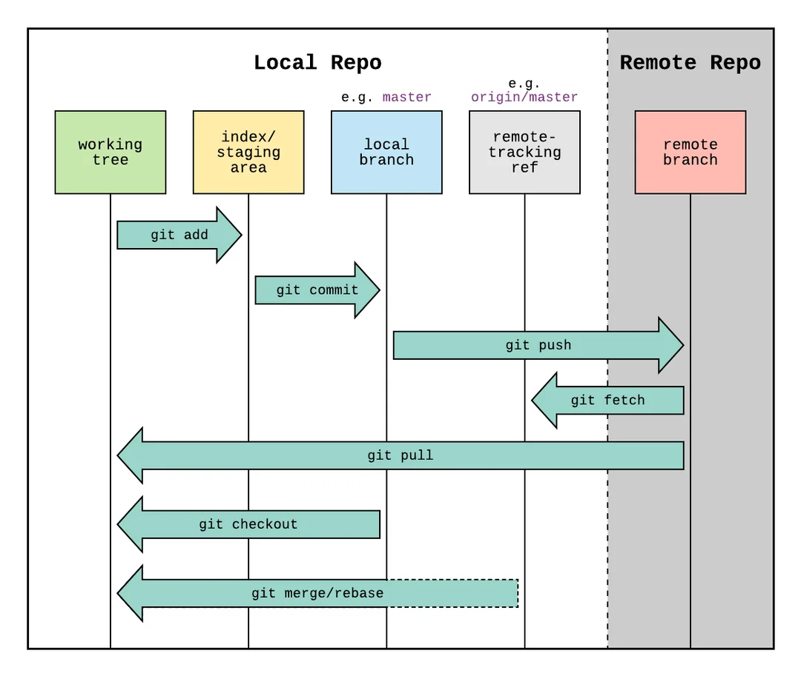

Hasta ahora hemos trabajado localmente. Pero muchas veces querrás compartir tu trabajo o colaborar con otros mediante repositorios remotos (GitHub, GitLab, Bitbucket…).

## Conceptos clave en Git remoto: remoto, tracking, branch remoto

- **Remoto (remote)**: copia del repositorio en un servidor. Generalmente se llama `origin`.
- **Branch remoto**: referencia local que apunta al estado conocido de una rama en el remoto, por ejemplo `origin/main`.
- **Tracking branch**: rama local enlazada con una rama remota, lo que permite usar `git pull` y `git push` sin parámetros adicionales.


### 1. Remoto (`remote`)

En Git, un “remoto” no es más que un alias para un repositorio alojado en otro lugar, normalmente en un servidor como GitHub. El nombre más habitual es `origin`, aunque puedes tener varios (por ejemplo, `upstream` si estás colaborando con otro proyecto). Este alias permite que tu repositorio local sepa dónde enviar y recibir cambios.

- Es una **referencia a un repositorio alojado en un servidor**, como GitHub, GitLab o Bitbucket.
- No es una copia completa, sino un vínculo que permite sincronizar cambios.
- El nombre por defecto es `origin`, pero puedes tener varios remotos (`upstream`, `backup`, etc.).
- Se configura con:

```bash
git remote add origin https://github.com/usuario/repositorio.git
```
Este comando vincula tu proyecto local con el repositorio remoto. A partir de aquí, puedes sincronizar tu trabajo con el servidor.


### 2. Branch remoto (`remote branch`)

Cuando haces `git fetch`, Git no descarga directamente los archivos, sino que actualiza referencias locales que apuntan al estado actual de las ramas en el remoto. Estas referencias se llaman *ramas remotas* y tienen nombres como `origin/main` o `origin/feature-x`.

- No puedes modificar directamente `origin/main`.
- Es una “foto” del estado de la rama en el servidor.
- Se actualiza con `git fetch`, no con `git pull`.

```bash
git branch -r
```

Este comando te muestra todas las ramas remotas conocidas. Son útiles para saber qué hay en el servidor sin tocar tu copia local.


### 3. *Tracking branch*

Aquí es donde Git se vuelve realmente cómodo. Una *tracking branch* es una rama local que está vinculada a una rama remota. Esto significa que puedes usar comandos como `git pull` o `git push` sin tener que especificar a qué rama te refieres: Git ya lo sabe.

Por ejemplo, si creas una rama local basada en `origin/main` con:

```bash
git checkout --track origin/main
```

Git configura automáticamente el seguimiento. Ahora, cuando haces `git push`, Git sabe que debe enviar los cambios a `origin/main`. Y cuando haces `git pull`, sabe de dónde traer las actualizaciones.

Puedes verificar qué ramas están siguiendo a cuáles con:

```bash
git branch -vv
```

Comprender estos vínculos permite trabajar de forma más fluida y evitar errores comunes como “¿por qué no se suben mis cambios?” o “¿por qué me dice que no encuentra la rama?”. En entornos educativos, donde los estudiantes clonan repositorios, hacen prácticas y suben correcciones, tener bien configuradas las *tracking branches* evita confusiones y facilita la evaluación.

<figure markdown="span" align="center">
  { width="85%"  }
  <figcaption>Conceptos básico repositorios remotos.</figcaption>
</figure>

Flechas verdes punteadas que indican las **tracking branches**, es decir, el vínculo entre la rama local y su correspondiente rama remota.


## Conectando un repositorio remoto

Para vincular tu repositorio local con uno remoto (por ejemplo, en GitHub), usa el siguiente comando:

```bash
git remote add origin <url-del-repositorio>
```

Esto crea una referencia llamada `origin` que apunta a la URL del repositorio remoto. Es una convención común usar `origin` como nombre por defecto, aunque puedes usar cualquier otro identificador si lo necesitas.

Para verificar que el remoto se ha configurado correctamente:

```bash
git remote -v
```
Este comando muestra las URLs asociadas al remoto, tanto para `fetch` (descargar) como para `push` (subir).

Para comprobar tanto ramas locales como remotas

```bash
git branch -a
```


### Obtener cambios del remoto

Una vez conectado el remoto, puedes sincronizar tu repositorio local con los cambios que haya en el servidor:

- **`git fetch origin`**  
  Descarga los cambios del remoto pero **no los fusiona** con tu rama actual. Es útil para revisar antes de aplicar.

- **`git pull`**  
  Realiza un `fetch` seguido de un `merge` (o `rebase`, si está configurado). Es el comando más común para actualizar tu rama local con los últimos cambios del remoto.


### Enviar cambios al remoto

Para subir tus commits locales al repositorio remoto:

```bash
git push origin nombre_rama
```

Esto envía los cambios de la rama especificada (`nombre_rama`) al remoto `origin`.

Si es la primera vez que subes esa rama y no existe en el remoto, debes establecer una relación de rastreo:

```bash
git push -u origin nombre_rama
```

El parámetro `-u` configura la rama local para que rastree automáticamente la rama remota, lo que permite usar simplemente `git push` o `git pull` en el futuro sin especificar el nombre del remoto ni de la rama.


### Crear una rama local desde una remota

```bash
git fetch origin
git switch -c nueva_rama origin/rama_remota
```


### Eliminar una rama remota

```bash
git push origin --delete nombre_rama
git remote prune origin
```

---

### Ejemplo paso a paso

1. Crea una rama: `git switch -c feature-nueva`
2. Haz commits.
3. Conecta el remoto: `git remote add origin https://github.com/usuario/mi-repo.git`
4. Sube: `git push -u origin feature-nueva`
5. Crea un *pull request* en GitHub.
6. Si alguien actualiza `main`: `git pull`


## Uso de **GitHub** con Git

**GitHub** es una plataforma en línea que permite alojar repositorios Git y colaborar en proyectos de software. Funciona como un “repositorio remoto” donde puedes subir tu código, compartirlo con otros, gestionar versiones, reportar errores y trabajar en equipo. GitHub se basa en Git, el sistema de control de versiones distribuido que permite llevar un historial completo de los cambios realizados en un proyecto.

### Requisitos previos

Antes de comenzar a trabajar con GitHub desde tu equipo local, asegúrate de tener lo siguiente:

- Git instalado y funcionando correctamente (`git --version`)
- Una cuenta activa en [GitHub](https://github.com)
- Un repositorio local creado con `git init` o clonado desde GitHub


A continuación crearemos un repositorio en [Github](https://github.com/) y veremos cómo podemos usarlo para almacenar el repositorio Git que tenemos en nuestra máquina local.

Para ello veremos 

- Cómo crear el repositorio en [https://github.com/](https://github.com).
- Cómo preparar la autentificación para conectar el repositorio remoto con el local
- Cómo clonar o conectar los repositorios local y remoto.

<figure markdown="span" align="center">
  { width="85%"  }
  <figcaption>Trabajando con GitHub.</figcaption>
</figure>


!!!tip "Tutoriales recomendados para aprender a usar GitHub"

    - [Documentación oficial de GitHub (en español)](https://docs.github.com/es/repositories/creating-and-managing-repositories/cloning-a-repository) — Precisa y actualizada.
    - [Video: Crear y clonar repositorio con GitHub Desktop](https://www.youtube.com/watch?v=x03HP-z6brc) — Ideal para principiantes.
    - [Chuck's Academy: Creación y clonación de repositorios](https://www.chucksacademy.com/es/topic/git-github/creacion-y-clonacion-de-repositorios) — Explica tanto Git local como GitHub remoto.
    - [FreeCodeCamp en español](https://www.freecodecamp.org/espanol/news/como-crear-y-sincronizar-repositorios-con-git-y-github/) — Incluye ejemplos y vídeos subtitulados.


### Crear el repositorio en GitHub

Para crear un nuevo, por supuesto debemos tener una cuenta en [https://github.com/](https://github.com) y seguir los siguientes pasos:


1. Accede a [github.com](https://github.com) e inicia sesión.
2. Haz clic en el botón **"New"** o ve a [https://github.com/new](https://github.com/new).
3. Rellena los campos:
   - **Repository name**: nombre del proyecto.
   - **Description** (opcional).
   - Elige **Public** o **Private**.
   - Marca “Add a README file” si quieres incluirlo.
   - Opcional: añade `.gitignore` y licencia.
4. Haz clic en **"Create repository"**.

### Autenticación en GitHub

Desde 2021, GitHub **ya no permite autenticación por contraseña** al usar Git desde la terminal. 

Debes autenticarte mediante uno de estos métodos:

#### 1. **Token de acceso personal (PAT)**
- Se genera desde tu cuenta de GitHub en [Settings → Developer settings → Personal access tokens](https://github.com/settings/tokens)
- Al hacer `git push` o `git clone`, se te pedirá usuario y contraseña: usa tu usuario de GitHub y el token como contraseña.

!!!tip "Cómo generar un token clásico en GitHub"

    1. Accede a la configuración de tokens
         - Ve a:  [https://github.com/settings/tokens](https://github.com/settings/tokens)
         - Haz clic en **"Generate new token (classic)"**
    2. Configura el token
         - **Nombre**: elige uno descriptivo (por ejemplo, “Token para Git en SGE”)
         - **Expiración**: puedes elegir 30 días, 90 días o sin expiración
         - **Permisos mínimos necesarios**:
             - `repo` → acceso completo a tus repositorios (lectura, escritura, clonación)
             - (Opcional) `read:org` si trabajas con repositorios en organizaciones
    3. Generar y guardar el token
        - Haz clic en **"Generate token"**. GitHub te mostrará el token **una sola vez**.  
        - **Cópialo y guárdalo** en un lugar seguro (gestor de contraseñas o archivo `.token`).
    4. Usar el token al clonar por HTTPS
        
        Cuando hagas:

        ```bash
        git clone https://github.com/usuario/repositorio.git
        ```

        Git te pedirá:

        ```
        Username for 'https://github.com': tu_usuario
        Password for 'https://tu_usuario@github.com': pega_el_token
        ```

        - **Usuario**: tu nombre de usuario en GitHub (no tu correo)
        - **Contraseña**: el token generado

        Puedes guardar el token para no tener que escribirlo cada vez:

        ```bash
        git config --global credential.helper store
        ```


#### 2. **Clave SSH**
- Genera una clave SSH con:
  ```bash
  ssh-keygen -t ed25519 -C "tuemail@example.com"
  ```
- Añade la clave pública (`~/.ssh/id_ed25519.pub`) en GitHub → *Settings → SSH and GPG keys*
- Usa la URL SSH del repositorio (por ejemplo: `git@github.com:usuario/repositorio.git`) en lugar de la URL HTTPS.

Ambos métodos son seguros y válidos. El uso de SSH es más cómodo si trabajas frecuentemente desde el mismo equipo.


### Clonar un repositorio de GitHub

Esto crea una copia local completa del repositorio, incluyendo su historial de versiones.

Los pasos para clonar un repositorio GitHub en local usando la línea de comandos es la siguiente.

1. Copia la URL del repositorio (botón verde “Code” → HTTPS).
2. Abre la terminal y navega a la carpeta donde quieres clonar:
   ```bash
   cd ~/Documentos/proyectos
   ```
3. Ejecuta el comando:
   ```bash
   git clone https://github.com/usuario/nombre-del-repositorio.git
   ```
4. Accede a la carpeta clonada:
   ```bash
   cd nombre-del-repositorio
   ```

También es posible usar herramientas como [GitHub Desktop](https://desktop.github.com/download/), pero no vamos a usar este tipo de herramientas en nuestro curso.

### Conectar un repositorio local con GitHub

También podemos hacer el paso contrario, crear un repositorio local en el que ya tenemos un trabajo hecho y después  vincularlo con tu repositorio local usando:

```bash
git remote add origin https://github.com/usuario/repositorio.git
```

Esto crea una referencia llamada `origin` que apunta al repositorio remoto. Para confirmar que la conexión se ha establecido correctamente:

```bash
git remote -v
```

Este comando muestra las URLs configuradas para subir (`push`) y descargar (`fetch`) cambios.

## Operaciones básicas para gestión de repositorios remotos GitHub

<figure markdown="span" align="center">
  { width="85%"  }
  <figcaption>Trabajando con GitHub.</figcaption>
</figure>

### Subir cambios al repositorio remoto

Cuando hayas hecho commits en tu repositorio local, puedes subirlos a GitHub con:

```bash
git push origin nombre_rama
```

Si es la primera vez que subes esa rama, añade el parámetro `-u` para establecer una relación de seguimiento:

```bash
git push -u origin nombre_rama
```

Esto permite que en el futuro puedas usar simplemente `git push` sin especificar el remoto ni la rama.


### Obtener cambios del remoto

Para mantener tu repositorio local actualizado con los cambios que se hagan en GitHub:

- **`git fetch origin`**  
  Descarga los cambios del remoto, pero **no los aplica** automáticamente. Es útil para revisar antes de fusionar.

- **`git pull`**  
  Descarga y **fusiona** los cambios del remoto con tu rama actual. Es el comando más común para sincronizar tu trabajo.


## El archivo `.gitignore` en sistemas de control de versiones con Git

El archivo `.gitignore` constituye una herramienta esencial en la gestión de proyectos versionados con Git. Su función principal es indicar al sistema qué archivos o directorios deben ser excluidos del seguimiento, evitando que se incluyan en los commits y, por tanto, en el historial del repositorio. Esta exclusión resulta especialmente útil para preservar la limpieza del repositorio, reducir el ruido técnico y evitar la incorporación de archivos irrelevantes, temporales o específicos del entorno local de desarrollo.

En contextos educativos o institucionales, donde los proyectos pueden ser compartidos entre múltiples usuarios y entornos, el uso adecuado de `.gitignore` contribuye a mantener la coherencia del repositorio y a prevenir conflictos derivados de configuraciones locales o archivos generados automáticamente.


### Funcionamiento y sintaxis

El archivo `.gitignore` se ubica habitualmente en la raíz del repositorio, aunque Git permite definir archivos `.gitignore` adicionales en subdirectorios para aplicar reglas específicas a determinadas rutas. Su contenido consiste en una lista de patrones que describen los nombres de archivos o carpetas que deben ser ignorados por Git.

Ejemplos de patrones comunes incluyen:

- Archivos temporales o de registro: `*.log`, `*.tmp`
- Directorios de configuración de editores: `.vscode/`, `.idea/`
- Archivos compilados o generados: `*.class`, `*.pyc`, `dist/`, `build/`

Los patrones pueden incluir comodines (`*`, `?`) y rutas relativas. Los comentarios se indican con el símbolo `#`.

!!!example "Ejemplo de fichero `.gitignore`"

    Fichero `.gitignore` en la raíz del proyecto git

    ```
    # Ignorar archivos temporales
    *.log
    *.tmp

    # Ignorar carpetas de configuración local
    .vscode/
    .idea/

    # Ignorar archivos compilados
    *.class
    *.pyc
    ```

    Git lee este archivo cada vez que evalúa qué cambios hay en tu proyecto. Si un archivo coincide con algún patrón de .gitignore, simplemente lo ignora.

### Consideraciones prácticas

El uso de `.gitignore` debe guiarse por criterios técnicos que favorezcan la reproducibilidad del proyecto y la claridad del repositorio. Se recomienda:

- Excluir archivos que no aportan valor al código fuente ni a la documentación compartida.
- Evitar la exclusión de archivos necesarios para la ejecución o comprensión del proyecto por parte de otros usuarios.
- Utilizar plantillas específicas por lenguaje o entorno, disponibles en repositorios como [github.com/github/gitignore](https://github.com/github/gitignore), para facilitar la configuración inicial.
- Revisar cuidadosamente los patrones amplios que podrían excluir archivos relevantes por error.


### Eliminación de archivos ya versionados

En caso de que un archivo haya sido añadido al repositorio antes de ser incluido en `.gitignore`, Git continuará rastreándolo. Para que deje de hacerlo, es necesario eliminarlo del índice sin borrarlo del sistema de archivos:

```bash
git rm --cached nombre-del-archivo.ext
```

Una vez ejecutado este comando, Git respetará la regla definida en `.gitignore` y omitirá dicho archivo en futuros commits.

  El uso correcto de `.gitignore` no solo mejora la calidad técnica del repositorio, sino que también facilita la colaboración entre estudiantes y docentes, al evitar la propagación de configuraciones locales, archivos innecesarios o elementos que dificulten la evaluación y el mantenimiento del proyecto. 


## Actividad práctica

Version 1: 

1. Crear un nuevo repositorio en GitHub (sin README ni .gitignore)  
2. En tu equipo local
   ```bash
   mkdir mi-proyecto
   cd mi-proyecto
   git clone  https://github.com/usuario/mi-proyecto.git
   ```


Versión 2: 

1. Crear un nuevo repositorio en GitHub (sin README ni .gitignore)
2. En tu equipo local:
   ```bash
   mkdir mi-proyecto
   cd mi-proyecto
   git init
   ```
3. Crear un archivo `README.md` y hacer el primer commit:
   ```bash
   echo "# Mi Proyecto" > README.md
   git add README.md
   git commit -m "Primer commit"
   ```
4. Conectar con GitHub:
   ```bash
   git remote add origin https://github.com/usuario/mi-proyecto.git
   git pull --rebase origin main    # esto solo si hay algo en el repositorio
   git push -u origin main
   ```
5. Verificar que el archivo aparece en GitHub


!!!tip "Buenas prácticas con remotos"

    - Haz `git fetch` o `git pull` antes de trabajar.
    - No hagas *push* directo a `main`.
    - Usa ramas por funcionalidad.
    - Limpia ramas remotas obsoletas.

