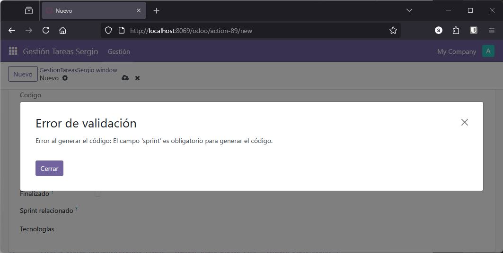

En este apartado se aborda el manejo de excepciones y la gestión de mensajes de log en Odoo, aspectos fundamentales para garantizar la robustez y mantenibilidad del código. Se explicará cómo lanzar excepciones de manera controlada y cómo registrar información relevante en el log, utilizando los distintos niveles de severidad que ofrece el framework.

## Manejo de excepciones en Odoo

Odoo proporciona un conjunto de excepciones específicas que permiten gestionar errores de forma estructurada. Para profundizar en este tema, se recomienda consultar la [documentación oficial de Odoo sobre gestión de errores](https://www.odoo.com/documentation/18.0/es/developer/reference/frontend/error_handling.html).

Siguiendo con nuestro ejemplo, supongamos que sobre el campo calculado `codigo` que genera un identificador único para cada tarea, dependiendo del valor del atributo `sprint`. Es posible que durante la generación de este código se produzca un error, por lo que resulta conveniente capturar la excepción y notificar al usuario de manera adecuada.

Primero, es necesario importar la excepción correspondiente en el fichero de modelos `models.py`:

```python
from odoo.exceptions import ValidationError
```

A continuación, se recomienda envolver la lógica de generación del código en un bloque `try-except`, lanzando una excepción de validación en caso de error:

```python
# Lógica para generar el campo code con excepciones
try:
    # Si no tiene sprint asignado, directamente generamos un error
    if not self.sprint:
        raise ValueError("El campo 'sprint' es obligatorio para generar el código.")
    # si no, le generamos un nombre tarea a partir del nombre del sprint
    tarea.codigo = str(tarea.sprint.name).upper()+"_"+str(tarea.id)

except Exception as e:
    raise ValidationError(f"Error al generar el código: {str(e)}")
```

!!! Nota

    El uso de excepciones específicas, como `ValidationError`, permite mostrar mensajes claros al usuario y facilita la depuración del código.

<figure markdown="span" align="center">
  { width="75%"  }
  <figcaption>Mensaje de excepción por validación</figcaption>
</figure>


Si se desea forzar una excepción para fines de prueba, puede intentarse acceder a un campo inexistente o provocar un error deliberado. Al crear una tarea, se mostrará el mensaje de validación definido.

Por ejemplo si cambiamos la línea 

```py
    tarea.codigo = str(tarea.sprint.name).upper()+"_"+str(tarea.id)
```

por 

```py
    tarea.codigo = str(tarea.sprint.name).upper()+"_"+str(tarea.id_)
```

introduciendo el campo `id_` que efectivamente no existe, entonces también generamos un error. 


<figure markdown="span" align="center">
  { width="75%"  }
  <figcaption>Mensaje de excepción por un error</figcaption>
</figure>


Seguro que durante el desarrollo de este módulo, no hemos encontrado con errores que podríamos haber capturado de forma adecuada.

## Gestión de mensajes de log

El registro de mensajes en el log es esencial para el seguimiento y diagnóstico de la aplicación. Odoo utiliza el módulo estándar de Python `logging`, que permite definir distintos niveles de severidad: `DEBUG`, `INFO`, `WARNING` y `ERROR`.

Para utilizar el sistema de log, es necesario importar el módulo y crear un logger asociado al módulo actual:

```python
import logging
```

Crearemos una variable para recoger acceder y recoger los logs

```py
_logger = logging.getLogger(__name__)
```

Con esto se crea una instancia de un logger utilizando el módulo estándar `logging` de Python. La función `getLogger(__name__)` obtiene un logger con el nombre del módulo actual, lo que permite identificar fácilmente de dónde provienen los mensajes de registro (logs) en aplicaciones grandes.

Al asignar este logger a la variable `_logger`, se puede utilizar en el resto del código para registrar mensajes de diferentes niveles (información, advertencia, error, etc.), facilitando la depuración y el seguimiento del comportamiento de la aplicación. Esta es una práctica común para mantener un registro estructurado y claro de los eventos que ocurren durante la ejecución del programa.


A continuación, se pueden registrar mensajes en el log según el nivel deseado:

```python
_logger.debug("Mensaje de depuración")
_logger.info("Mensaje informativo")
_logger.warning("Mensaje de advertencia")
_logger.error("Mensaje de error")
```

!!! Nota

    Los mensajes de nivel `DEBUG` solo serán visibles si el nivel de log está configurado adecuadamente en el archivo de configuración de Odoo.

Por ejemplo, para habilitar el nivel de depuración, añada la siguiente línea en el archivo de configuración (`odoo.conf`):

```ini
log_level = debug
```

Tras modificar la configuración, reinicie el servicio de Odoo para aplicar los cambios.

En entornos de desarrollo, el archivo de log suele estar mapeado a un directorio local mediante Docker Compose, lo que facilita su consulta y análisis.

## Conclusiones

El manejo adecuado de excepciones y la correcta gestión de mensajes de log son prácticas recomendadas en el desarrollo de módulos para Odoo. Permiten detectar y resolver errores de manera eficiente, así como mantener un registro detallado del comportamiento de la aplicación, contribuyendo así a la calidad y mantenibilidad del software.