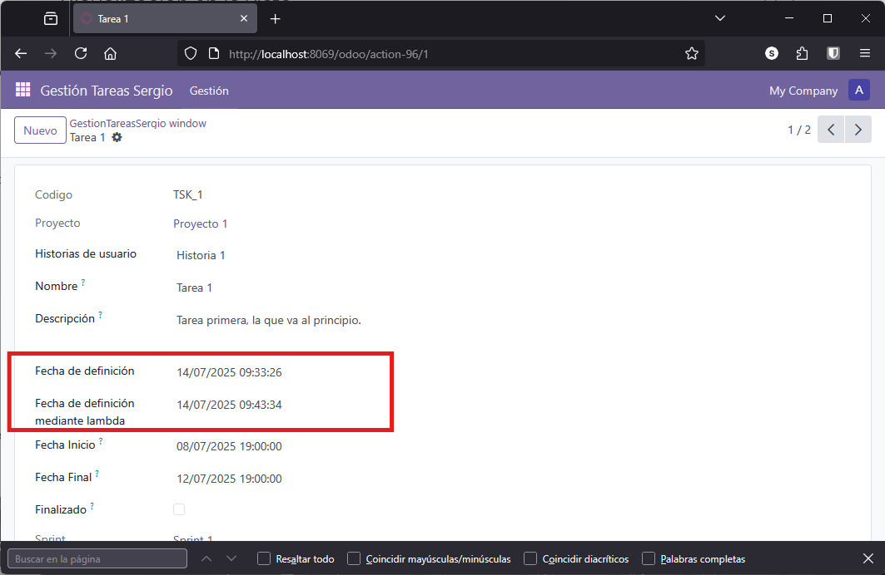

En este apartado se abordará la creación de **campos con valores por defecto** en Odoo, diferenciándolos de los campos computados y mostrando diversas formas de establecer estos valores. 

## Campos con valores por defecto

Los **campos con valores por defecto** permiten asignar un valor inicial a un campo cuando se crea un nuevo registro. A diferencia de los campos computados, el usuario puede modificar este valor tras la creación del registro. Existen varias formas de definir valores por defecto en Odoo:

### 1. Asignación directa de valores por defecto

Supongamos que en el modelo `Sprint` existe un campo `duracion` de tipo entero. Se puede establecer un valor por defecto por ejemplo de 2 semanas o 14 días de la siguiente manera:

```python
duracion = fields.Integer(
  string="Duración (días)",
  default=14
)
```

!!! Nota  

    El valor asignado a `default` debe coincidir con el tipo de dato del campo. Por ejemplo, para campos de tipo `Char` o `Text`, el valor debe ir entre comillas.

Al reiniciar el servicio y actualizar el módulo, los nuevos registros de `Sprint` tendrán por defecto una duración de 15 días, aunque el usuario podrá modificar este valor al crear o editar el registro.

### 2. Valores por defecto calculados mediante función

También es posible calcular el valor por defecto utilizando una función. Por ejemplo, en el modelo `Tarea`, supongamos que queremos definir un campo `fecha_definicion` que guarde la fecha de creación de la tarea. Esto lo podemos realizar de la siguiente forma:

```python
from datetime import datetime

class tareas_sergio(models.Model):
    _name = 'gestion_tareas_sergio.tareas_sergio'
    # ...

    # primero definición de la función
    def get_fecha_definicion(self):
      return datetime.now()

    # después definimos cl campo que la usa
    fecha_definicion = fields.Datetime(
      string="Fecha de definición",
      default=get_fecha_definicion

)
```

Puede parecer que esto es un *campo computado*, pero hay unas **diferencias con los campos computados:**  

- En los campos computados, se utiliza el parámetro `compute` y el nombre de la función entre comillas (`compute='_compute_field'`).
- En los campos con valor por defecto, la función se pasa **sin comillas** y se ejecuta una sola vez al crear el registro.
- Para los valores por defecto, primero debemos definir las funciones puesto que deben existir antes de ser usadas. Para los campos computados a usar **comillas**, cuando la va a utilizar el sistema la busca, por lo que puede ser definida con posterioridad
- El usuario puede modificar el valor por defecto, mientras que en los campos computados el valor es gestionado automáticamente por Odoo y no es editable por el usuario.

### 3. Uso de funciones *lambda* para valores por defecto

Cuando la lógica para calcular el valor por defecto es sencilla, se puede utilizar una función *lambda*. 

Por ejemplo:

```python
from datetime import datetime

class tareas_sergio(models.Model):
    _name = 'gestion_tareas_sergio.tareas_sergio'
    # ...
    fecha_definicion = fields.Datetime(
      string="Fecha de definición",
      default=lambda self: datetime.now()
)
```

Esto simplifica el código y permite mantener la definición del campo más concisa, puesto que no necesitamos definir la función a parte antes de la definición del campo.

## Visualización en la vista

Para que el usuario pueda ver y modificar el valor por defecto, es necesario incluir el campo en la vista correspondiente. Por ejemplo, en la siguiente vista de formulario de `Tareas` se han añadidos dos campos:

```xml
<field name="fecha_definicion"/>
<field name="fecha_definicion_lambda"/>
```
En el siguiente ejemplo, se pueden ver los dos campos con dos fechas diferentes, puesto que cada fecha se a asignado en el momento en que se ha reiniciado el servidor y se ha encontrado por primera vez el valor por defecto definido.

<figure markdown="span" align="center">
  { width="75%"  }
  <figcaption>Valores por defecto</figcaption>
</figure>