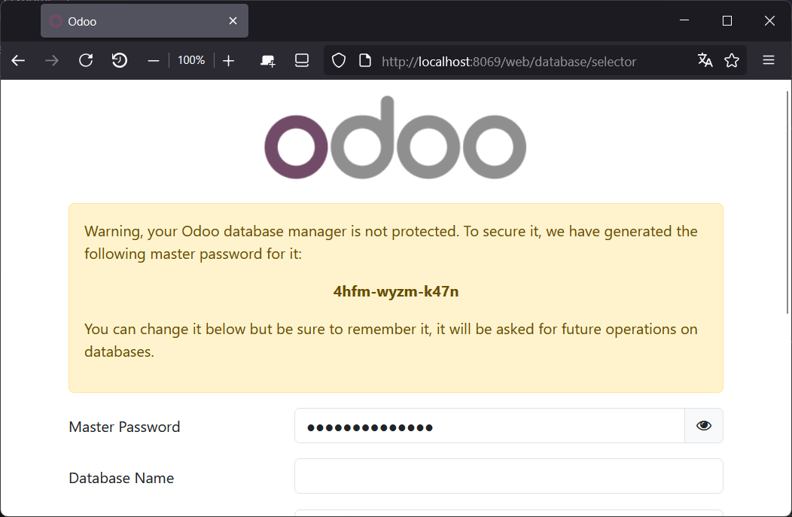
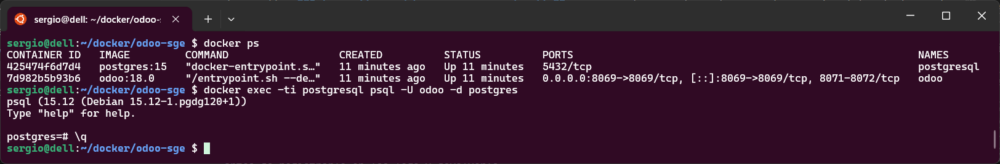
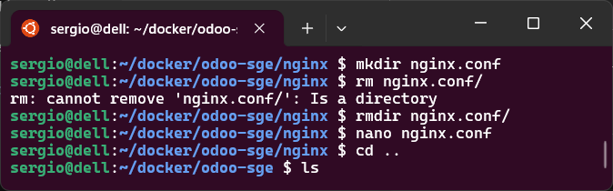

# Instalar con Docker

!!! tip "Revisa siempre la documentación oficial, ahí tendrás los últimos cambios" 
     [Documentación oficial de Odoo funcionando bajo docker](https://registry.hub.docker.com/_/odoo/)

Desplegar `Odoo` con Docker permite instalar y gestionar el sistema de manera más sencilla, sin necesidad de configurar manualmente dependencias o bases de datos. Docker encapsula `Odoo` en un *contenedor*, que es como una caja autosuficiente con todo lo necesario para funcionar, haciendo que sea más fácil de ejecutar en cualquier servidor u ordenador sin problemas de compatibilidad. Esto también facilita la creación de entornos de desarrollo y producción consistentes, permite actualizaciones y pruebas sin riesgo de afectar el sistema principal y optimiza el uso de recursos. Además, con Docker es posible desplegar `Odoo` junto con otros servicios necesarios, como PostgreSQL, con un solo archivo de configuración.

!!! Nota
    En clase trabajaremos finalmente con Docker Compose, el texto siguiente sirve para entender la configuración final, pero no es necesario hacerlos en el trabajo diario. La configuración definitiva la haremos con Docker Compose.

## Instalar un *docker* con `Odoo`

En *Docker* es muy sencillo desplegar `Odoo`, aunque debemos tener en cuenta que para que Odoo funcione necesitamos tener instada la base de datos PostgreSQL. Así pues debemos:

1. Instalamos ***PosggreSQL*** y la ponemos en marcha
2. Instalamos ***Odoo***, le decimos quien es la base de datos y lo ponemos en marcha.

Para hacer esto,  tan solo hace falta estos comandos:

**Primero**, se inicia un docker que contenga que inicie un servicio de la base de datos **PostgreSQL**

```bash
docker run -d -e POSTGRES_USER=odoo -e POSTGRES_PASSWORD=odoo -e POSTGRES_DB=postgres --name db postgres:15
```

!!! note ""

    Donde: 

    - `docker run`: Inicia un nuevo contenedor.

    - `-d`: Ejecuta el contenedor en segundo plano (modo *detached*).

    - `-e POSTGRES_USER=odoo`: Define la variable de entorno `POSTGRES_USER`, que crea un usuario llamado `odoo`.

    - `-e POSTGRES_PASSWORD=odoo`: Define la contraseña del usuario `odoo`.

    - `-e POSTGRES_DB=postgres`: Crea una base de datos llamada `postgres`.

    - `--name db`: Asigna el nombre `db` al contenedor, lo que facilita su referencia desde otros contenedores (como el de Odoo).

    - `postgres:15`: Especifica la imagen de PostgreSQL versión 15.


**Después** se inicia una instancia de **Odoo** utilizando la base de datos anterior

```bash
docker run -p 8069:8069 --name odoo --link db:db -t odoo
```

!!! note ""

    Donde:

      - `docker run`: Inicia un nuevo contenedor a partir de una imagen.

      - `-p 8069:8069`: Mapea el puerto 8069 del contenedor al puerto 8069 del host. Esto permite acceder a Odoo desde el navegador en http://localhost:8069.

      - `--name odoo`: Asigna el nombre odoo al contenedor. Esto facilita su referencia en otros comandos.

      - `--link db:db`: Crea un enlace entre este contenedor (odoo) y otro contenedor llamado db. El alias db:db significa que dentro del contenedor de Odoo, podrá acceder al contenedor de base de datos usando el nombre db. Observar que el alias `db` hace referencia a la base de datos iniciada anteriormente.

      - `-t`: Asigna un pseudo-TTY, útil para ver la salida del contenedor en la terminal. A menudo se combina con -i (-it) para interacción.

      - `odoo`: Es el nombre de la imagen de Docker que se usará para crear el contenedor. Puede ser una imagen oficial de Odoo o una personalizada


!!! Tip
  
    Se podría iniciar tantos ***Odoo*** como se quiera cambiando el nombre del contenedor. Dos contenedores no pueden tener el mismo nombre.

    Por ejemplo

    ```bash
    docker run -d -e POSTGRES_USER=odoo -e POSTGRES_PASSWORD=odoo -e POSTGRES_DB=postgres --name db-demo postgres:latest
    docker run -p 8069:8069 --name odoo-demo --link db-demo:db -t odoo
    ```

    Con estos comandos iniciamos contenedores llamados **db-demo** y **odoo-demo** respectivamente

Y para finalizar e iniciar la instancia de ***Odoo***, si estamos dentro de la ejecución del comando que inició el docker, entonces pulsamos **`Ctrl+X`**, y si no estamos acoplados a la ejecución: 

```bash
docker stop odoo
```

Si no estamos acoplasdos o **attached** podemos hacer 

```bash
docker attach odoo
```

y veremos la salida de la ejecución del docker 

Y para iniciar de nuevo el contenedor hacemos 

```bash
docker start -a odoo
```

Si no queremos estar *attached* con la ejecución del contenedor, no ponemos la `-a`

Recordar tambien, que podemos ejecutar haciendo 

```bash
docker run -d
```

pero en este caso, el `run` reinicializa todo frente al `start` que mantiene el estado de la última ejecución. 


Para acceder solo hay que ir a la **dirección del anfitrión:8069** ([http://localhost:8069/](http://localhost:8069)), o sea, que el servicio de ***Odoo*** es accesible a través del puerto 8069. En el comando se puede ver como se han redireccionado los puertos con `-p 8069:8069`

<figure markdown="span" align="center">
  { width="75%"  }
  <figcaption>Primera imagen al acceder al Odoo.</figcaption>
</figure>


### Creación de módulos de Odoo usando Docker

Nuestro objetivo final, será el de crear módulos nuevos o heredados de los ya existente con nuestra propias necesidades.

El problema de esta ejecución es que si perdemos el contenedor, perdemos todo lo que hemos hecho en el. Por lo tanto la solución será enlazar carpeta locales con carpetas (o volúmenes) del contenedor, de forma que la información no se encontrará físicamente en el contenedor, si no en la carpeta que elijamos.

Así pues, para crear nuestros módulos podemos generarlos en un directorio fuera del contenedor y ejecutarlo de esta manera:

```bash
docker run -v odoo-data:/var/lib/odoo -d -p 8069:8069 --name odoo --link db:db -t odoo
```

y lo mismo deberíamos haber hecho con el contenedor de PostgreSQL:

```bash
docker run -d -v odoo-db:/var/lib/postgresql/data -e POSTGRES_USER=odoo -e POSTGRES_PASSWORD=odoo -e POSTGRES_DB=postgres --name db postgres:15
```

Mientras estamos desarrollando nuevos módulos, necesitaremos reiniciar el servicio y arrancarlo actualizando un módulo. Primero debemos parar el contenedor, después iniciarlo indicando que queremos entrar a la consola y finalmente actualizar el módulo.

```bash
docker stop odoo
docker start -a odoo
docker exec odoo odoo --config /etc/odoo/odoo.conf -u nombremodulo -d nombasededatos -r odoo -w odoo --db_host 172.17.0.2 --db_port 5432
```

### Mejorando la creación de módulos

Como se puede ver, el último comando es un poco complicado. Por tanto, vamos a hacerlo de forma más ordenada. Para ello necesitamos un archivo propio de configuración de `Odoo` al que llamaremos **odoo.conf**. Podemos utilizar esta plantilla:

```bash
docker exec odoo cat /etc/odoo/odoo.conf > odoo.conf
```

Lo que hemos hecho es copiar el archivo que tiene el contenedor por defecto. Si lo analizamos, no indica correctamente dónde está la base de datos, ya que esa información la pasamos con el parámetro **\--link** del **docker run**. Nosotros tenemos que crear un directorio, poner dentro el archivo, editarlo y añadir esta información:

```js
db_user = odoo
db_password = odoo
db_host = 172.17.0.2
db_port = 5432
```

Ahora ya podemos arrancar el contenedor con todo:

```bash
docker stop odoo
docker run --volumes-from odoo -v /home/jose/modules/:/mnt/extra-addons -v /home/jose/config/:/etc/odoo -p 8069:8069 --name odoo2 --link db:db -t odoo
```

Observamos que tenemos un directorio para nuestros módulos, otro con el archivo de configuración, la redirección del puerto, el nombre del nuevo módulo, el enlace a la base de datos y el tipo de contenedor.

Por último, mientras tenemos en marcha el servicio, en otra terminal podemos ejecutar:

```bash
docker exec odoo odoo -u nombremodulo -d nombasededatos
```

Aun con esta mejora, no va a ser una tarea sencilla la gestión de nuestro sistema, por lo que se antoja imprescindible buscar nuevas soluciones

## Usando **`Docker Compose`**

El método anterior supone la ejecución de un **docker run**/**start** muy complejo por el motivo de que se debe ejecutar cada contenedor con una única línea, y además tenemos que iniciar los servicios de uno en uno en orden. Esto es un trabajo tedioso, que se puede automatizar y además es propenso a que tengamos errores. 

Para evitar errores, podemos usar un [docker compose](https://docs.docker.com/compose/) que tiene una configuración como la que sigue:

```yaml
services:
#Definimos el servicio Web, en este caso Odoo
  odoo_dev_dam:
    #Indicamos que imagen de Docker Hub utilizaremos
    image: odoo:19
    container_name: odoo_dev_dam
    #Indicamos que depende de "db", por lo cual debe ser procesada primero "db"
    depends_on:
        - postgres_dev_dam

    # Port Mapping: indicamos que el puerto 8069 del contenedor se mapeara con el mismo puerto en el anfritrion
    # Permitiendo acceder a Odoo mediante http://localhost:8069
    ports:
      - 8069:8069

    # Mapeamos el directorio de los contenedores (como por ejemplo" /mnt/extra-addons" )
    # en un directorio local (como por ejemplo en un directorio "./volumesOdoo/addons")
    # situado en el lugar donde ejecutemos "Docker compose"
    volumes:
      - ./data/addons:/mnt/extra-addons
      - ./data/odoo_config:/etc/odoo
      - ./data/odoo/filestore:/var/lib/odoo/filestore
      - ./data/odoo/sessions:/var/lib/odoo/sessions
    #Indicamos que el contenedor funcionara con usuario root y no con usuario odoo
    user: root
    # Definimos variables de entorno de Odoo
    environment:
      - HOST=postgres_dev_dam
      - USER=odoo
      - PASSWORD=odoo
    # Indica que pasa ese parametro al arrancar el servicio Odoo
    command: -c /etc/odoo/odoo.conf --dev=all  
    networks:
      - network_dev_dam

#Definimos el servicio de la base de datos
  postgres_dev_dam:
    image: postgres:15
    container_name: postgres_dev_dam
    # Definimos variables de entorno de PostgreSQL
    environment:
      - POSTGRES_PASSWORD=odoo
      - POSTGRES_USER=odoo
      - POSTGRES_DB=postgres
    # Mapeamos el directorio del contenedor "var/lib/postgresql/data" en un directorio "./volumesOdoo/dataPostgreSQL"
    # situado en el lugar donde ejecutemos "Docker compose"
    volumes:
      - postgres_data_volume:/var/lib/postgresql/data    
      #  - ./data/dataPostgreSQL:/var/lib/postgresql/data
      - ./data/backups:/backups                                    # Para guardar backups de la base de datos directamente
    networks:
      - network_dev_dam

volumes:
  postgres_data_volume:

networks:
  network_dev_dam:
    driver: bridge
```

Observamos que declaramos dos servicios y que **odoo** depende de **db**. También hay que indicar qué red utilizan y el resto de datos que normalmente ponemos en el **run**.

También podemos ver que hay unas secciones de volumes donde por ejemplo, para `odoo` tenemos 3 volúmenes o carpetas que el contenedor tiene redireccionadas a carpetas locales:

  - `odoo-web-data` será un volumen en nuestra máquina que se crea de forma automática y que reemplaza la carpeta del contenedor `/var/lib/odoo`
  - `./config` que quiere decir tendremos una subcarpeta donde estará la configuración de odoo, en vez de estar dentro del contenedor en `/etc/odoo`
  - `./addons` que contienen los módulos (oficiales y los que crearemos) y lo tendremos en local en vez de en el contenedor en `/mnt/extra-addons`

Por otra parte, dentro de esta configuración también es interesante que hemos preparado ***Odoo*** para poder trabajar en modo *desarrollador*, esto es gracias al comando `--dev=all` que veremos posteriormente con más detalle.
Una vez vistas estas puntualizaciones, para montar el sistema: 

1. Creamos una carpeta con el nombre que queramos, por ejemplo `odoo-compose`.
2. Dentro de esta carpeta creamos un archivo llamado **docker-compose.yml** con el contenido descrito anteriormente.
3. Desde el terminal, nos ubicamos en la carpeta comentada y solo hay que ejecutar cada vez:

```bash
docker compose up -d
```

En el caso definido en el fichero de configuración **docker-compose.yml**, necesitamos un archivo `odoo.conf` que podemos extraer de un contenedor sin el volumen de `./config`.

Este fichero de configuración por defecto, lo podemos obtener por internet, o seguimos los siguientes pasos donde creamos un docker con odoo, le extraemos el fichero de configuración y lo paramos y eliminamos:

```bash
docker run -d --name odoo-temp odoo:18.0
docker cp odoo-temp:/etc/odoo/odoo.conf ./config/odoo.conf
docker rm -f odoo-temp
```

Veamos la secuencia de creación del sistema y copia del fichero de configuración por defecto:


<figure markdown="span" align="center">
  { width="75%"  }
  <figcaption>Obtención de fichero de configuración odoo.conf.</figcaption>
</figure>


Hemos asociado un volumen a las carpetas de los dos contenedores y por otra parte tenemos en la carpeta del docker compose los directorios `config` y `addons`. Esto permite compartir el código y la configuración de ***Odoo*** sin compartir demasiados archivos o los datos privados de la base de datos. Para compartir solo hay que comprimir o subir a `Git` la carpeta contenedora de los archivos y carpetas que estamos creando.


Si queremos entrar en la base de datos PostgreSQL para hacer cosas manualmente, podemos ejecutar:

```bash
docker exec -ti postgresql psql -U odoo -d postgres
```

Ejecutamos el comando ***psql*** de forma interactiva en la base de datos `postgres` y con el usuario `odoo`.

<figure markdown="span" align="center">
  { width="95%"  }
  <figcaption>Verificando que la base de datos esta en marcha.</figcaption>
</figure>


En ocasiones es interesante revisar **logs** por si tenemos algún problema. Para ver los **logs** podemos hacer si no estamos *attached* con la ejecución del docker, también podemos hacer :

```bash
docker logs odoo -f
```

Con este comando filtramos solo los mensajes de *logs* de *odoo*. 

!!! tip
     Los logs se ven en color gracias a poner `tty:true` en el archivo de configuración.


### Activando `Odoo` en Modo desarrollador

Como se puede ver, hemos configurado un directorio para los módulos en `./addons`. En este directorio haremos los `scaffold`. 

!!! Nota
     Un **scaffold** es una herramienta que te permite generar automáticamente la estructura básica de un módulo personalizado. Es como un "esqueleto" inicial que incluye todos los archivos y carpetas necesarios para empezar a desarrollar un módulo

Además, hemos añadido al comando `--dev=all` a la ejecución de `docker`. Esto simplifica mucho el desarrollo, ya que muchos de los cambios provocan un reinicio del servidor y actualización de algunas partes de los módulos.

La opción `--dev <feature,feature,...,feature>` en Odoo permite activar varias características útiles para el desarrollo. **Esta opción no debe usarse en producción**, ya que está pensada exclusivamente para facilitar la tarea de los desarrolladores. A continuación, se explican las opciones disponibles:

- **all**: Activa todas las funcionalidades de desarrollo descritas a continuación.
- **xml**: Carga las plantillas *QWeb* directamente desde los archivos XML en lugar de la base de datos. Si una plantilla se modifica en la base de datos, no se volverá a cargar desde el archivo XML hasta la próxima actualización o reinicio. Además, las plantillas no se traducen cuando se usa esta opción.
- **reload**: Reinicia el servidor automáticamente cuando se detecta un cambio en un archivo Python.
- **qweb**: Permite interrumpir la ejecución de una plantilla *QWeb* si un nodo contiene `t-debug="debugger"`, lo que facilita la depuración.
- **(i)p(u)db**: Activa un depurador de Python (como `pdb`, `ipdb` o `pudb`) cuando se produce un error inesperado, antes de registrarlo en los logs y devolverlo.
- **werkzeug**: Muestra la traza completa del error en la página web cuando se produce una excepción, algo muy útil para identificar problemas en el código.

Esta opción es muy útil durante el desarrollo, ya que facilita la depuración de código, la recarga en caliente de archivos y la revisión de errores de manera más visual. 

Sin embargo, está limitada en ciertos aspectos. Por ejemplo, vuelve a ejecutar el Python pero no crea nuevos modelos o campos. Tampoco actualiza todos los XML, solo el contenido de las vistas en `ir.ui.view` que ya se han registrado actualizando el módulo. Por tanto, no siempre sirve y menos en las etapas iniciales de la creación de módulos.

Como el comando con `--dev=all` no actualiza la base de datos, la creación de nuevas vistas, nuevos modelos o campos no se actualizará y dará errores. Una solución es añadir al comando:

```yaml
command: ["--dev=all", "-u", "modulo", "-d", "basededatos"]
```

Pero solo cuando ya existe la base de datos y el módulo está instalado. En caso de arrancar docker con este comando por primera vez, se creará la base de datos con una configuración estándar que no nos interesa, en inglés, sin datos de demo y con usuario/contraseña admin/admin.

Además, solo se ejecutará cuando arranquemos Docker, por lo tanto, hay que hacer un `docker-compose down` y volver a arrancar los contenedores de nuevo. 

!!! tip "Configuración de VSCode"

     Para no tener que estar reiniciando `docker` desde la línea de comando, podemos añadir a `Visual Studio Code` una extensión como **VS Code Action Buttons**. Una vez instalada esta extensión, vamos la configuración de la extensión y completamos el `json`  de configuración así:

     ```json
     "commands": [
     {
          "name": "$(triangle-right) Run Odoo",
          "color": "purple",
          "singleInstance": true,
          "command": "docker-compose down && docker-compose up -d && docker logs odoo -f"
     },
     {
          "name": "$(triangle-right) Rerun Odoo",
          "color": "purple",
          "singleInstance": true,
          "command": "docker-compose restart odoo && docker logs odoo -f"
     }
     ],
     ```

     El primer comando lo reinicia todo, tanto la base de datos como Odoo y elimina los contenedores para recrearlos. 

     Esto puede solucionar algunos problemas. Pero en principio, el segundo reinicia solo el contenedor Odoo sin recrearlo. Es más rápido y también actualiza la base de datos. El comando se puede utilizar en una terminal si no queremos hacer los botones o estamos en un entorno sin interfaz gráfica.


### Creación de un nuevo módulo

Uno de nuestros objetivos en el curso será el de dotar de nuevas funcionalidades personalizadas a el ERP base que ofrece *Odoo*, por lo tanto deberemos aprender a crear nuevos módulos.

Veamos de forma sencilla cómo crear módulos nuevos y posteriormente profundizaremos durante el curso:

Para crear un móudulo ejecutamos hacemos un **scaffold** que hemos comentado antes, damos un nombre al módulo (en este caso *pruebas*) y le decimos que los vamos a ubicar en la carpeta `extra-addons` del contenedor que se encuentra redireccionada a la carpeta `./addons` que tenemos en la uticación del *docker-compose*

```bash
docker exec -ti odoo odoo scaffold pruebas /mnt/extra-addons
```

Posteriormente es aconsejable dar permisos para poder acceder a esta carpeta. Debemos tener en cuenta siempre los permisos para que tanto el proceso *docker* que se ejecuta como `root` como nosotros con nuestro usuario podemos acceder a la carpeta.

```bash
docker exec -ti odoo chmod 777 -R /mnt/extra-addons/pruebas
```

y podemos comprobar como se ha creado una carpeta `pruebas` que contiene la estructura de nuestro nuevo módulo

<figure markdown="span" align="center">
  { width="75%"  }
  <figcaption>Creación de módulo de pruebas.</figcaption>
</figure>


!!! tip

     Si queremos ejecutar el `shell` de *Odoo* podemos ejecutar el comando:

     ```bash
     docker compose exec odoo odoo shell -d pruebas --db_host db --db_password odoo
     ```

     Aquí estamos diciendo que ejecute en el contenedor odoo el comando odoo especificando la base de datos y el host y password de postgres. Es necesario especificar la base de datos porque Docker Compose crea múltiples contenedores Docker basándose en la configuración del archivo `docker-compose.yml`. En este caso, hay varios contenedores en ejecución, uno que corre **Odoo**, otro que corre **PostgreSQL**, y posiblemente otros más.


Por último, debemos tener en cuenta que cada contenedor es una máquina virtual separada con su propia dirección IP, por lo que si ejecutas este comando:

```bash
docker exec -it odoo_odoo_1 bash -c "odoo shell -d postgres"
```

Odoo intentará conectarse a la base de datos **usando `localhost`**, pero en este contexto, `localhost` se refiere al propio contenedor de Odoo, no al de PostgreSQL.

Para solucionarlo, debes indicar explícitamente el **host de la base de datos** y la **contraseña** en el comando.

Para ello, podemos ejecutar el siguiente comando *docker* que nos lista las IP de los contenedores que tenemos activos.

```bash
docker ps -q | xargs -n 1 docker inspect --format '{{.Name}} - {{range .NetworkSettings.Networks}}{{.IPAddress}}{{end}}'
```

<figure markdown="span" align="center">
  { width="95%"  }
  <figcaption>Listando IPs de contenedores activos.</figcaption>
</figure>

## Poner en producción con Docker

Si podemos dejar corriendo un Docker en un servidor con conexión a Internet y los puertos expuestos, ya estaría en producción. Sin embargo, esto supone varios problemas de seguridad y rendimiento.

### Docker de Nginx

Podemos añadir al archivo de Docker Compose la configuración de un contenedor *Nginx*. Este implementará HTTPS y hará de proxy a Odoo.

!!! Nginx

     Un servidor ***Nginx*** (pronunciado "engine-x") es un software de servidor web de alto rendimiento que también puede funcionar como:

     - Servidor proxy inverso
     - Balanceador de carga
     - Servidor de correo (limitado)
     - Proxy para protocolos como HTTP, HTTPS, SMTP, POP3 y IMAP

Usaremos un archivo *Dockerfile* basado en la imagen oficial de *Nginx*, pero adaptada a nuestras necesidades. Los certificados se generan de manera automática y están autofirmados.

Aunque los navegadores muestran un aviso de error, la información sigue viajando de forma segura. Lo que ocurre es que no hay ninguna autoridad certificadora que haya validado el certificado (no es lo mismo un certificado autofirmado que ninguna protección).

Se podría hacer un script con *CertBot* para utilizar *Let's Encrypt* y renovar el certificado cada tres meses.

En *Nginx*, definimos la misma carpeta para HTTP y HTTPS, intentando simplificar al máximo la configuración y automatizar la creación tanto de la imagen como del contenedor con scripts.

El primer paso es crear nuestra clave y certificado autofirmado dentro de un directorio *nginx* junto al resto de archivos de los dockers:

```bash
mkdir nginx
cd nginx
openssl req -x509 -sha256 -nodes -newkey rsa:2048 -keyout ser.key -out ser.pem
```

Después creamos un `Dockerfile` dentro de la misma carpeta. Este archivo servirá para ejecutar ciertos comandos cada vez que se lance el docker:

```dockerfile
FROM nginx

RUN rm -f /etc/nginx/conf.d/default.conf
COPY nginx.conf /etc/nginx/conf.d/
COPY ser.key /etc/nginx/
COPY ser.pem /etc/nginx/

EXPOSE 80 443

CMD ["nginx", "-g", "daemon off;"]
```

Añadiremos al `docker-compose.yml`:

```yaml
  nginx:
    build:
      context: ./nginx
      dockerfile: Dockerfile  # este campo es opcional si el archivo se llama así
    container_name: nginx
    depends_on:
      - odoo
    ports:
      - "80:80"
      - "443:443"
```

Falta crear el `nginx.conf` que será la configuración:

```nginx
# odoo server
upstream odoo {
  server odoo:8069;
}
upstream odoochat {
  server odoo:8072;
}
# Se han definido los upstream a localhost y a los puertos determinados

# http -> https (todas las peticiones por HTTP se redirigen a HTTPS)
server {
   listen 80;
   server_name _;
   # Si tuviéramos nombre de dominio lo pondríamos, en otro caso: _
   rewrite ^(.*) https://$host$1 permanent;
}

server {
  listen 443 ssl;
  server_name _;
  # La _ porque en el ejemplo no tenemos dominio, como arriba
  proxy_read_timeout 720s;
  proxy_connect_timeout 720s;
  proxy_send_timeout 720s;

  # Add Headers for odoo proxy mode
  proxy_set_header X-Forwarded-Host $host;
  proxy_set_header X-Forwarded-For $proxy_add_x_forwarded_for;
  proxy_set_header X-Forwarded-Proto $scheme;
  proxy_set_header X-Real-IP $remote_addr;

  # SSL parameters
  ssl_certificate /etc/nginx/ser.pem;
  ssl_certificate_key /etc/nginx/ser.key;
  # IMPORTANTE: poner bien las rutas de los certificados
  ssl_session_timeout 30m;
  ssl_protocols TLSv1 TLSv1.1 TLSv1.2;
  ssl_ciphers 'ECDHE-RSA-AES128-GCM-SHA256:ECDHE-ECDSA-AES128-GCM-SHA256:ECDHE-RSA-AES256-GCM-SHA384:ECDHE-ECDSA-AES256-GCM-SHA384:DHE-RSA-AES128-GCM-SHA256:DHE-DSS-AES128-GCM-SHA256:kEDH+AESGCM:ECDHE-RSA-AES128-SHA256:ECDHE-ECDSA-AES128-SHA256:ECDHE-RSA-AES128-SHA:ECDHE-ECDSA-AES128-SHA:ECDHE-RSA-AES256-SHA384:ECDHE-ECDSA-AES256-SHA384:ECDHE-RSA-AES256-SHA:ECDHE-ECDSA-AES256-SHA:DHE-RSA-AES128-SHA256:DHE-RSA-AES128-SHA:DHE-DSS-AES128-SHA256:DHE-RSA-AES256-SHA256:DHE-DSS-AES256-SHA:DHE-RSA-AES256-SHA:AES128-GCM-SHA256:AES256-GCM-SHA384:AES128-SHA256:AES256-SHA256:AES128-SHA:AES256-SHA:AES:CAMELLIA:DES-CBC3-SHA:!aNULL:!eNULL:!EXPORT:!DES:!RC4:!MD5:!PSK:!aECDH:!EDH-DSS-DES-CBC3-SHA:!EDH-RSA-DES-CBC3-SHA:!KRB5-DES-CBC3-SHA';
  ssl_prefer_server_ciphers on;

  # log
  access_log /var/log/nginx/odoo.access.log;
  error_log /var/log/nginx/odoo.error.log;

  # Redirect requests to odoo backend server
  location / {
    proxy_redirect off;
    proxy_pass http://odoo;
  }
  location /longpolling {
      proxy_pass http://odoochat;
  }

  # common gzip
  gzip_types text/css text/less text/plain text/xml application/xml application/json application/javascript;
  gzip on;
}
```

### Workers
Por defecto, Odoo es `multithread`. Esto significa que puede mantener varios hilos de ejecución. Sin embargo, es algo ineficiente en producción si tienes muchos usuarios. Es mejor, además, que sea `multi-processing` para poder distribuir la carga entre distintos procesadores o núcleos (no disponible en Windows).

Para conseguirlo, solo hay que indicar en el archivo de configuración odoo.conf

<figure markdown="span" align="center">
  { width="60%"  }
  <figcaption>Edición del fichero de configuración de Odoo.</figcaption>
</figure>

Añadiremos al final la cantidad de `workers` que queremos, además de otros parámetros:

```yaml
[options]
limit_memory_hard = 1677721600
limit_memory_soft = 629145600
limit_request = 8192
limit_time_cpu = 600
limit_time_real = 1200
max_cron_threads = 1
workers = 8
```

Como regla aproximada, se pueden calcular los workers óptimos como 1 worker por cada 6 usuarios simultáneos y el doble + 1 de workers por CPU. Así, si tenemos un servidor con 4 núcleos, 8 threads y unos 60 usuarios simultáneos:

* 60/6 ≈ 10 workers
* 4*2+1 = 9 workers que soporta la máquina
* En este caso, se pueden utilizar 8 workers + 1 para el cron
* La RAM, de forma simple, se puede estimar en 1GB por worker. Sin embargo, hay peticiones que no necesitan más de 150MB. Según la documentación de Odoo, para 9 workers: 9 * ((0.8*150) + (0.2*1024)) ≈ 3GB de RAM mínimo.

