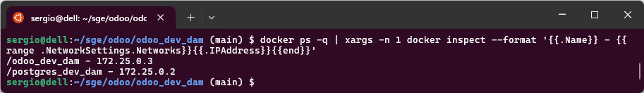

En este curso trabajaremos con **Odoo** desplegado mediante **Docker Compose**. Esta aproximación nos proporciona múltiples ventajas para el desarrollo:

- **Entorno consistente**: Todos trabajamos con la misma configuración
- **Fácil compartición**: Podemos compartir nuestro trabajo fácilmente
- **Aislamiento**: No afecta al sistema operativo principal
- **Portabilidad**: Funciona igual en cualquier sistema operativo
- **Copias de seguridad sencillas**: Los datos están organizados en carpetas locales

!!! info "¿Por qué Docker Compose?"
    Docker Compose nos permite definir toda la infraestructura de Odoo (servidor web + base de datos) en un único archivo de configuración, facilitando enormemente su gestión y despliegue.

## Métodos de Instalación

Existen varios métodos para instalar Odoo:

### 1. Instalación Nativa en Ubuntu/Debian

Odoo proporciona repositorios oficiales llamados **Nightly** que permiten instalar el sistema directamente en Ubuntu o Debian. Esta opción es válida para servidores en producción pero **no la usaremos en el curso** por las siguientes razones:

- Requiere configuración manual de dependencias
- Dificulta compartir el trabajo entre compañeros
- Problemas de compatibilidad entre diferentes sistemas
- Complica las copias de seguridad

!!! tip "Instalación nativa - Solo referencia"
    Si en el futuro necesitas instalar Odoo de forma nativa, puedes consultar el [Anexo: Instalación en Ubuntu](#anexo-instalacion-en-ubuntu) al final de este documento.

### 2. Docker Compose 

**Este es el método que utilizaremos en clase**. Docker Compose nos permite:

- Desplegar Odoo y PostgreSQL con un único comando
- Tener todos los datos organizados en carpetas locales
- Compartir proyectos fácilmente (solo compartir carpetas)
- Realizar copias de seguridad simplemente copiando directorios
- Trabajar en modo desarrollo con recarga automática

## Instalación con Docker Compose

### Prerrequisitos

Antes de comenzar, asegúrate de tener instalado:

- **Docker**: [Guía de instalación oficial](https://docs.docker.com/engine/install/)
- **Docker Compose**: Normalmente viene incluido con Docker Desktop
- **Editor de código**: Recomendamos Visual Studio Code

!!! warning "Verifica la instalación"
    Comprueba que Docker está correctamente instalado ejecutando:
    ```bash
    docker --version
    docker compose version
    ```

### Estructura del Proyecto

Vamos a crear una estructura de carpetas organizada para nuestro entorno de desarrollo de Odoo:

```
proyecto-odoo/
├── docker-compose.yml          # Configuración de los contenedores
├── data/
│   ├── addons/                 # Nuestros módulos personalizados
│   ├── odoo_config/           # Configuración de Odoo
│   │   └── odoo.conf          # Archivo de configuración principal
│   ├── odoo/
│   │   ├── filestore/         # Archivos subidos (imágenes, documentos)
│   │   └── sessions/          # Sesiones de usuario
│   └── backups/               # Copias de seguridad de la BD
```

### Paso 1: Crear la Estructura de Carpetas

Crea una carpeta para tu proyecto y la estructura básica:

```bash
mkdir proyecto-odoo
cd proyecto-odoo
mkdir -p data/addons data/odoo_config data/odoo/filestore data/odoo/sessions data/backups
```

### Paso 2: Crear el archivo docker-compose.yml

Crea un archivo llamado `docker-compose.yml` en la raíz del proyecto con el siguiente contenido:

```yaml
services:
  # Servicio principal: Odoo
  odoo_dev_dam:
    image: odoo:19                    # Versión de Odoo a utilizar
    container_name: odoo_dev_dam
    depends_on:
      - postgres_dev_dam              # Espera a que PostgreSQL esté listo
    
    ports:
      - "8069:8069"                   # Puerto para acceder: http://localhost:8069
    
    volumes:
      # Carpetas locales mapeadas al contenedor
      - ./data/addons:/mnt/extra-addons
      - ./data/odoo_config:/etc/odoo
      - ./data/odoo/filestore:/var/lib/odoo/filestore
      - ./data/odoo/sessions:/var/lib/odoo/sessions
    
    user: root                        # Necesario para desarrollo
    
    environment:
      - HOST=postgres_dev_dam         # Nombre del servicio de base de datos
      - USER=odoo
      - PASSWORD=odoo
    
    # Modo desarrollo: recarga automática de cambios
    command: -c /etc/odoo/odoo.conf --dev=all
    
    networks:
      - network_dev_dam

  # Servicio de base de datos: PostgreSQL
  postgres_dev_dam:
    image: postgres:15
    container_name: postgres_dev_dam
    
    environment:
      - POSTGRES_USER=odoo
      - POSTGRES_PASSWORD=odoo
      - POSTGRES_DB=postgres
    
    volumes:
      - postgres_data_volume:/var/lib/postgresql/data
      - ./data/backups:/backups       # Para copias de seguridad
    
    networks:
      - network_dev_dam

# Definición de volúmenes persistentes
volumes:
  postgres_data_volume:               # Volumen para los datos de PostgreSQL

# Definición de red interna
networks:
  network_dev_dam:
    driver: bridge
```

!!! info "Explicación de la configuración"
    - **odoo_dev_dam**: Contenedor con el servidor Odoo
    - **postgres_dev_dam**: Contenedor con la base de datos PostgreSQL
    - **volumes**: Carpetas compartidas entre tu sistema y los contenedores
    - **networks**: Red interna para comunicación entre contenedores
    - **--dev=all**: Activa el modo desarrollo con recarga automática

### Paso 3: Crear el Archivo de Configuración

Necesitamos crear el archivo de configuración personalizado de Odoo. Crea el archivo `odoo.conf` en la carpeta `data/odoo_config/`:

```bash
nano data/odoo_config/odoo.conf
```

O créalo con tu editor favorito y pega el siguiente contenido:

```properties
[options]
; ------------------------------------------------------------------
;  Clave Maestra: ¡CAMBIA ESTO POR UNA CONTRASEÑA SEGURA!
; ------------------------------------------------------------------
admin_passwd = Clave_Maestra_Segura_1234

; ------------------------------------------------------------------
;  Rutas de Addons
; ------------------------------------------------------------------
; Esta es la línea más importante. 
; 1. Le dice a Odoo que mire en /mnt/extra-addons (donde tu .yml monta ./data/addons)
; 2. Le dice que también mire en los addons oficiales.
addons_path = /mnt/extra-addons, /usr/lib/python3/dist-packages/odoo/addons

; ------------------------------------------------------------------
;  Conexión a la Base de Datos
; ------------------------------------------------------------------
; Estos valores DEBEN coincidir con tu docker-compose.yml
db_host = postgres_dev_dam
db_user = odoo
db_password = odoo
db_port = 5432

; ------------------------------------------------------------------
;  Rutas de Datos (Alineadas con tus volúmenes)
; ------------------------------------------------------------------
; Le decimos a Odoo cuál es su directorio de datos principal
data_dir = /var/lib/odoo

; ------------------------------------------------------------------
;  Opciones de Desarrollo (Opcionales pero útiles)
; ------------------------------------------------------------------
; Para que los cambios en vistas (XML) se apliquen sin reiniciar
dev_mode = xml

; Si quieres que Odoo instale/actualice "mi_modulo" al arrancar:
; init = mi_modulo
; Si quieres que actualice todos los módulos de tu carpeta de addons:
; upgrade = all
```

!!! warning "Importante: Clave Maestra"
    La **clave maestra** (`admin_passwd`) protege las operaciones críticas como crear, duplicar o eliminar bases de datos. **Cámbiala por una contraseña segura**.

!!! info "Explicación de la configuración"
    - **admin_passwd**: Contraseña maestra para gestión de bases de datos
    - **addons_path**: Rutas donde Odoo busca módulos (primero personalizados, luego oficiales)
    - **db_host/db_user/db_password**: Credenciales de PostgreSQL (coinciden con docker-compose.yml)
    - **data_dir**: Directorio principal de datos de Odoo
    - **dev_mode**: Activa recarga automática de cambios en XML

### Paso 5: Verificar que Todo Funciona

Comprueba que los contenedores están en ejecución:

```bash
docker compose ps -d
```

Deberías ver algo similar a:


<figure markdown="span" align="center">
  { width="85%"  }
  <figcaption>Arranque contenedores Odoo.</figcaption>
</figure>

### Paso 6: Acceder a Odoo

Abre tu navegador y ve a: **http://localhost:8069**

<figure markdown="span" align="center">
  { width="85%"  }
  <figcaption>Primer arranque de Odoo.</figcaption>
</figure>

Deberías ver la pantalla de creación de base de datos de Odoo.

!!! warning "Primera configuración"
    - **Master Password**: Por defecto es `admin`, cámbiala si lo deseas, por ejemplo la que tienes en el fichero `odoo.conf`
    - **Database Name**: Elige un nombre descriptivo (ej: `proyecto_dam`)
    - **Email**: Tu email (usuario administrador)
    - **Password**: Contraseña para el usuario admin
    - **Language**: Español
    - **Country**: Spain
    - **Demo data**: ✅ Marca esta opción para tener datos de ejemplo. Esta opción es muy útil para hacer pruebas, puesto que Odoo nos carga datos de demostración. Si hacemos una instalación para producción no es aconsejable activar esta opción.

## Modo Desarrollo en Odoo

La configuración que hemos preparado incluye el parámetro `--dev=all`, que activa múltiples funcionalidades para desarrollo:

### Características del Modo Desarrollo

| Opción | Descripción |
|--------|-------------|
| **all** | Activa todas las funcionalidades de desarrollo |
| **xml** | Carga plantillas QWeb desde archivos XML en lugar de BD |
| **reload** | Reinicia el servidor al detectar cambios en archivos Python |
| **qweb** | Permite depuración de plantillas QWeb |
| **pdb** | Activa depurador Python en caso de error |
| **werkzeug** | Muestra traza completa de errores en el navegador |

!!! warning "Solo para desarrollo"
    **Nunca uses `--dev=all` en producción**. Estas opciones reducen el rendimiento y exponen información sensible de depuración.

### Limitaciones del Modo --dev=all

El modo desarrollo tiene algunas limitaciones importantes:

- ❌ **No crea nuevos modelos o campos** automáticamente
- ❌ **No actualiza todos los XML**, solo vistas ya registradas
- ✅ **Sí recarga código Python** automáticamente
- ✅ **Sí actualiza contenido de vistas** existentes

Para crear nuevos modelos o campos, necesitarás **actualizar el módulo manualmente** (lo veremos más adelante).

## Trabajando con el Sistema

### Ver los Logs

Para ver los mensajes de log de Odoo en tiempo real:

```bash
docker logs odoo_dev_dam -f
```

El parámetro `-f` (follow) mantiene el log abierto mostrando mensajes nuevos.

Para salir, pulsa `Ctrl+C`.

### Parar el Sistema

Para parar simplemente

```bash
docker compose stop
```
Esto detiene los contenedores sin eliminar nada.

Si hacemos 

```bash
docker compose down
```

Esto para y elimina los contenedores, pero **mantiene los datos** en los volúmenes.

### Reiniciar Odoo

Si lo hemos parado anteriormente mediante `stop`, ahora simplemente hacemos

```bash
docker compose start odoo_dev_dam
```

Si en un momento determinado necesitmos reiniciar Odoo (sin tocar la base de datos):

```bash
docker compose restart odoo_dev_dam
```

### Reiniciar Todo

Para reiniciar completamente el sistema:

```bash
docker compose down -v  
docker compose up -d
```

- `-v` elimina los volúmenes de los contenedores, o sea, todos los datos.

### Acceder a la Base de Datos

Si necesitas ejecutar comandos SQL directamente en PostgreSQL:

```bash
docker exec -it postgres_dev_dam psql -U odoo -d postgres
```

Comandos útiles de PostgreSQL:

```sql
\l                          -- Listar bases de datos
\c nombre_base_datos        -- Conectar a una base de datos
\dt                         -- Listar tablas
\q                          -- Salir
```

<figure markdown="span" align="center">
  { width="85%"  }
  <figcaption>Prueba de conexión con la base de datos PostgreSQL.</figcaption>
</figure>

### Listar IPs de los Contenedores

Para ver las direcciones IP de los contenedores:

```bash
docker ps -q | xargs -n 1 docker inspect --format '{{.Name}} - {{range .NetworkSettings.Networks}}{{.IPAddress}}{{end}}'
```

<figure markdown="span" align="center">
  { width="85%"  }
  <figcaption>Salida del comando mostrando IPs de contenedores.</figcaption>
</figure>


## Copias de Seguridad y Compartir Trabajo

Una de las grandes ventajas de nuestra configuración es la facilidad para realizar copias de seguridad y compartir el trabajo.

### Estructura de Datos

Todos los datos importantes están en la carpeta `data/`:

```
data/
├── addons/           → Tus módulos personalizados
├── odoo_config/      → Configuración
├── odoo/
│   ├── filestore/   → Archivos subidos
│   └── sessions/    → Sesiones
└── backups/         → Copias de seguridad BD
```

### Hacer Copia de Seguridad

**Opción 1: Backup desde interfaz web**

1. Ve a http://localhost:8069/web/database/manager
2. Selecciona tu base de datos
3. Haz clic en **Backup**
4. El archivo se guardará en `data/backups/`

**Opción 2: Backup manual de PostgreSQL**

```bash
docker exec postgres_dev_dam pg_dump -U odoo -d nombre_base_datos > data/backups/backup_$(date +%Y%m%d).sql
```

**Opción 3: Copiar toda la carpeta data/**

La forma más sencilla es simplemente copiar toda la carpeta `data/`:

```bash
# Comprimir todo
tar -czf proyecto-odoo-backup.tar.gz data/

# O copiar a otro lugar
cp -r data/ /ruta/destino/backup/
```


## Comandos Útiles - Cheatsheet

### Gestión de Contenedores

| Comando | Descripción |
|---------|-------------|
| `docker compose up -d` | Iniciar sistema |
| `docker compose down` | Parar sistema |
| `docker compose ps` | Ver estado de contenedores |
| `docker compose restart odoo_dev_dam` | Reiniciar solo Odoo |
| `docker compose logs -f odoo_dev_dam` | Ver logs de Odoo |

### Trabajo con Módulos

| Comando | Descripción |
|---------|-------------|
| `docker exec -it odoo_dev_dam odoo scaffold modulo /mnt/extra-addons` | Crear módulo |
| `docker exec -it odoo_dev_dam chmod 777 -R /mnt/extra-addons/modulo` | Ajustar permisos |
| `docker exec -it odoo_dev_dam odoo shell -d basedatos` | Abrir shell Python |

### Base de Datos

| Comando | Descripción |
|---------|-------------|
| `docker exec -it postgres_dev_dam psql -U odoo -d postgres` | Conectar a PostgreSQL |
| `docker exec postgres_dev_dam pg_dump -U odoo -d bd > backup.sql` | Backup de BD |

## Solución de Problemas

### El puerto 8069 está ocupado

**Error**: `Bind for 0.0.0.0:8069 failed: port is already allocated`

**Solución**: Cambia el puerto en `docker-compose.yml`:
```yaml
ports:
  - "8070:8069"  # Usa el puerto 8070 en lugar de 8069
```

### No se ven los cambios en el módulo

1. Verifica que el archivo esté guardado
2. Reinicia Odoo: `docker compose restart odoo_dev_dam`
3. Actualiza el módulo desde la interfaz web
4. Verifica los logs: `docker logs odoo_dev_dam -f`

### Error de permisos

```bash
# Dar permisos a toda la carpeta data
sudo chmod -R 777 data/
```

### Contenedor no arranca

1. Ver los logs:
   ```bash
   docker logs odoo_dev_dam
   ```

2. Si hay error de configuración, verificar `odoo.conf`

3. Recrear desde cero:
   ```bash
   docker compose down -v
   docker compose up -d
   ```

### Olvidé la contraseña de admin

**Solución desde PostgreSQL**:

```bash
docker exec -it postgres_dev_dam psql -U odoo -d nombre_base_datos
```

```sql
UPDATE res_users SET password='nueva_password' WHERE login='admin';
\q
```

---

## Anexo: Instalación en Ubuntu

!!! warning "Solo como referencia"
    Esta sección es únicamente informativa. **No la uses en el curso**.

Si en el futuro necesitas instalar Odoo de forma nativa en Ubuntu/Debian:

- **Configurar Locales**

```bash
sudo dpkg-reconfigure locales
```

Selecciona `es_ES.UTF-8` como idioma por defecto.

- **Añadir Repositorio de Odoo**

```bash
sudo apt-get install ca-certificates
wget -O - https://nightly.odoo.com/odoo.key | sudo gpg --dearmor -o /usr/share/keyrings/odoo-archive-keyring.gpg
echo 'deb [signed-by=/usr/share/keyrings/odoo-archive-keyring.gpg] https://nightly.odoo.com/19.0/nightly/deb/ ./' | sudo tee /etc/apt/sources.list.d/odoo.list
sudo apt-get update && sudo apt-get install odoo
```

- **Configurar Usuario Odoo**

```bash
sudo passwd odoo
sudo usermod -s /bin/bash odoo
```

- **Iniciar Servicio**

```bash
sudo systemctl start odoo
sudo systemctl enable odoo
```

Accede en: http://localhost:8069

Para más detalles sobre instalación nativa, consulta la [documentación oficial de Odoo](https://www.odoo.com/documentation/19.0/administration/install/install.html).

---

## Referencias

- [Documentación oficial de Odoo](https://www.odoo.com/documentation/19.0/)
- [Docker Hub - Imagen oficial de Odoo](https://hub.docker.com/_/odoo/)
- [Docker Compose Documentation](https://docs.docker.com/compose/)
- [Odoo Developer Documentation](https://www.odoo.com/documentation/19.0/developer.html)