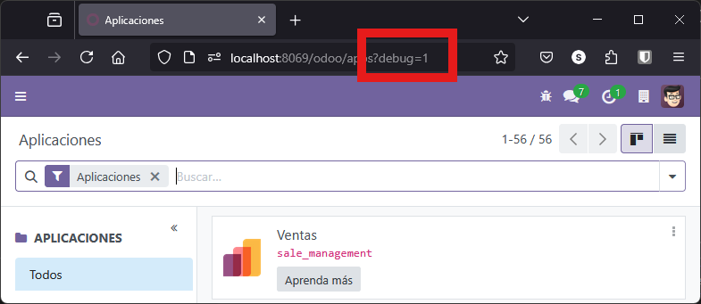

Una vez instalado y comprendida la arquitectura de de ***Odoo***, el siguiente objetivos será desarrollar nuestro primer módulo, el típico "Hola Mundo".

En este caso, vamos a desarrollar hasta 3 versiones diferentes del módulo, de forma que iremos profundizando en los elementos básicos de un módulo en ***Odoo***. 

## Hola Mundo. Versión 1.

Esta primera version, como tal, no tendrá ninguna utilidad mas allá de comprobar que somos capaces de crear e instalar un módulo (que no hace nada)

El **primer paso** siempre va a ser la creación de una carpeta en el directorio de `addons/`, a la que llamaremos igual que el nombre del módulo:

```bash
mkdir ./addons/HolaMundo_V1
```

Dentro de esta carpeta vamos a crear solo dos archivos `__init__.py` y `__manifest__.py` es una excelente forma de comenzar a entender la estructura de los módulos en Odoo. Aquí te muestro cómo hacerlo paso a paso:

### Estructura 

Los ficheros necesarios para esta primera versión serán: `__init__.py` y `__manifest__.py` y la estructura (mínima) sería:

```
addons/HolaMundo_V1/
├── __init__.py
└── __manifest__.py
```

Donde: 

### Paso 1. `__init__.py`

Básicamente le dice a Python que esa carpeta es un paquete, y además también sirve para indicar a ***Odoo*** los modelos que tiene que cargar y que están ubicado en la carpeta `models`

En nuestro caso, como no vamos a incluir ningún modelo o controlador en la carpeta `models` este archivo va a estar vacío. Solo sirve para indicar que este directorio es un paquete de Python.

```python
# HolaMundo_V1/__init__.py
```

---

### Paso 2. `__manifest__.py`

Este archivo contiene la descripción del módulo. Es como la ficha técnica del módulo. Ahí se le indica a ***Odoo*** cómo se llama, qué hace, qué necesita para funcionar y qué archivos debe cargar Aquí tienes un ejemplo básico:

```python
# HolaMundo_V1/__manifest__.py

{
    'name': 'Hola Mundo V1',
    'version': '1.0',
    'summary': 'Módulo básico de ejemplo',
    'description': 'Este es un módulo de ejemplo que no hace nada, solo sirve como plantilla.',
    'author': 'Sergio Rey',
    'category': 'Tools',
    'depends': [],
    'data': [],
    'installable': True,
    'application': False,
    'auto_install': False,
}
```

Como se puede observar, es un diccionario en formato Python que incluye varios campos clave. No es necesario poner todos, aunque para este ejemplo se han puesto lo más comunes:

- **`name`**: el nombre del módulo tal como aparecerá en la interfaz de Odoo.
- **`version`**: la versión del módulo, útil para actualizaciones.
- **`summary`**: una descripción corta que aparece en la lista de aplicaciones.
- **`description`**: una descripción más larga y detallada del módulo.
- **`author`**: quién lo ha creado.
- **`category`**: en qué sección de Odoo se clasifica (por ejemplo, "Tools", "Sales", "Inventory").
- **`depends`**: una lista de otros módulos que este necesita para funcionar. Por ejemplo, casi todos dependen de `base`.
- **`data`**: archivos XML, CSV, etc., que deben cargarse al instalar el módulo (vistas, menús, reglas de acceso…).
- **`demo`**: archivos que se cargan solo en modo demo.
- **`installable`**: si está en `True`, el módulo se puede instalar.
- **`application`**: si es `True`, se muestra como una aplicación en el panel principal.
- **`auto_install`**: si es `True`, se instala automáticamente si sus dependencias están presentes.

Hay más campos opcionales, pero con estos tienes lo básico para que el módulo funcione y se vea correctamente en Odoo.


### Paso 3. Reinicio del servidor

Para que el servidor reconozca el nuevo módulo, debemos reiniciar:

```bash
docker compose restart odoo
```

o pulsamos sobre el botón que hemos añadido en en VSCode mediante **VS Code Action Buttons*" en la sección anterior.

En estos momentos, también es aconsejable ver los *logs* que va generando ***Ddoo***, por lo que en un terminal es aconsejable ejecutar:

```bash
docker logs odoo -f
```


### Paso 4. Odoo en modo desarrollo

Debemos tener ***Odoo*** en modo desarrollo, para que el siguiente paso nos permita buscar el nuevo módulo.

Hay diferentes formas de hacerlo:

#### Activando desde menú de Ajustes

Desde el menú de ajustes, podemos activar el *modo desarrollador* directamente:

<figure markdown="span" align="center">
  { width="75%"  }
  <figcaption>Activar modo desarrollador por ajustes</figcaption>
</figure>


#### Usando la URL directamente

Puedes añadir **`?debug=1`** al final de la URL de ***Odoo*** para activar el modo desarrollador. Realmente, si observamos qué ha pasado en el método anterior, precisamente es lo que hace, añadir esto al final de la URL

Ejemplo:

```
http://localhost:8069/odoo?debug=1
```

<figure markdown="span" align="center">
  { width="75%"  }
  <figcaption>Entrar en modo desarrollo desde la URL</figcaption>
</figure>

También se puede usar:

  - `?debug=assets` para ver los archivos fuente (útil para desarrolladores).
  - `?debug=tests` para pruebas automatizadas.


#### Usando extensiones o herramientas del navegador

Aunque no es necesario, puedes usar herramientas como [`Odoo Debug`](https://addons.mozilla.org/es-ES/firefox/addon/odoo-debug/?utm_source=addons.mozilla.org&utm_medium=referral&utm_content=search) (extensión para Firefox o Chrome) que te permite activar el modo desarrollador con un clic.

<figure markdown="span" align="center">
  { width="75%"  }
  <figcaption>Entrar en modo desarrollo con Add-on</figcaption>
</figure>

Hay otras formas, pero de momento con esta tenemos suficiente para comenzar a trabajar.

Una vez entras en modo desarrollo, verás que aparecen nuevas opciones, por ejemplo al entrar en *Aplicaciones*

<figure markdown="span" align="center">
  { width="75%"  }
  <figcaption>Nuevas opciones al entrar en Desarrollo.</figcaption>
</figure>

Como puedes ver en esta imagen, han aparecido nuevas opciones y tenemos un nuevo menú con la forma de una cucaracha que nos permite realizar funcionalidades de desarrollador.


### Paso 5. Actualizar, buscar e instalar.

Una vez llegado a este punto, entonces debemos:

  1. **Actualizar** e listado de módulos que nos aparece en pantalla pulsando el botón de **Actualizar lista de aplicaciones** que podemos ver en la figura anterior.
  2. **Buscamos** el módulo que queremos instalar, utilizando la herramientas de búsqueda. Si ponemos "Hola" no nos encontrará nada, a no ser que le quitemos el filtro para que haga búsquedas solo de aplicaciones.
  3. **Instalamos** Una vez, hemos encontrado el módulo, pulsamos el botón de instalar y aparecerá como que se ha instalado. Si hay algún problema no se instalará correctamente y debemos recurrir a los *logs* de ***Odoo*** para investigar qué es lo que ha pasado.

<figure markdown="span" align="center">
  { width="75%"  }
  <figcaption>Módulo buscado y encontrado.</figcaption>
</figure>


Con estos pasos, si todo ha funcionado correctamente, ya tenemos el módulo instalado y listo para ser usado. En nuestro caso, como no lo hemos dotado de funcionalidad, no aparecerá en ningún sitio, pero entrando en la **Información del módulo** podemos ver que esta instalado y que por tanto podemos **Actualizar** o **Desinstalar** el módulo.

<figure markdown="span" align="center">
  { width="75%"  }
  <figcaption>Información del módulo.</figcaption>
</figure>


### Resumen de todos los pasos 

Estos pasos los debemos tener muy claros, puesto que siempre van a ser los mismos a la hora de añadir un nuevo módulo:

!!! Quote "Resumen pasos para instalación"

     1. Creamos o modificamos los ficheros necesarios de nuestro módulo
     2. Reinicia el servidor de Odoo.
     3. Activa el modo desarrollador (si no lo tienes activado).
     4. Ve a Aplicaciones, actualiza la lista y busca el nuevo módulo.
     5. Instálalo y comprueba en los *logs* que no ha habido errores.


## Hola Mundo. Versión 2

La versión anterior ha sido demasiado básica, auqnue ha sido de gran utilidad porque hemos podido comprobar de forma muy simplificada cómo se puede implementar un módulo en ***Odoo***.

Ahora vamos a realizar de nuevo los mismo pasos con una nueva versión de nuestro módulo, pero vamos a añadir nuevos elementos de forma que podamos ver y utilizar esta nueva versión.

O sea, vamos a crear una versión que tras instalarla, nos aparecerá en el menú de aplicaciones y podremos entrar en el módulo, aunque de nuevo no tendrá funcionalidad alguna, aparte de aprender los pasos a realizar y comprobar que todo funciona correctamente.

Aquí tienes una guía paso a paso para crear un módulo básico de **"Hola Mundo"** en Odoo. Este módulo mostrará un mensaje simple en el backend, ideal para comenzar a familiarizarte con el desarrollo en Odoo.

### Estructura del módulo

Para esta nueva versión, la estructura mínima será:

```
HolaMundo_V2/
├── __init__.py
├── __manifest__.py
├── models/
│   ├── __init__.py
│   └── hola.py
├── views/
│   └── hola_view.xml
├── security/
│   └── ir.model.access.csv
```


Como podemos comprobar, por supuesto seguimos teniendo los fichero **`__init__.py`** y **`__manifest__.py`** y además añadimos nuevas carpetas y en ellas nuevos ficheros. 

Obviamente, en este punto, podemos deducir que vamos a incluir nuevos **modelos**, **vistas** para poder visualizar los datos del modelo y **seguridad** necesaria para otorgar permisos y poder utilizar las vistas y modelos definidos.

Veamos cómo quedarían cada uno de los ficheros

### Archivo `__init__.py`

Este archivo le dice a Python (y a Odoo) que esta carpeta es un paquete. 

```python
# HolaMundo_V2/__init__.py

from . import models
```

A diferencia de la primera versión, ahora si vamos a utilizar algún modelo, por lo que debemos importar desde el módulo base para ser utilizado posteriormente.

### Archivo `__manifest__.py`

Este archivo es el corazón del módulo. Le dice a **Odoo** cómo se llama el módulo, qué hace, qué necesita y qué archivos debe cargar.

```python
# HolaMundo_V2/__manifest__.py

{
  'name': 'Hola Mundo V2',
  'version': '2.0',
  'summary': 'Módulo de ejemplo Hola Mundo V2',
  'description': 'Este módulo muestra un mensaje básico en Odoo.',
  'author': 'Sergio Rey',
  'category': 'Tools',
  'depends': ['base'],
  'data': [
    'security/ir.model.access.csv',
    'views/hola_view.xml',
  ],

  'installable': True,
  'application': True,
}

```

Respecto a la primera versión, tenemos un cambio en la clave `data` donde ahora añadimos los archivos que van a cargar al iniciar.


### Archivo `models/__init__.py`

El archivo `__init__.py` dentro de la carpeta `models` es necesario para que **Python reconozca esa carpeta como un paquete**. 

El contenido será el siguiente:

```python
# HolaMundo_V2/models/__init__.py

from . import hola
```

Esto permite que Odoo pueda importar correctamente los archivos que hay dentro, como `hola.py`. 

Se trata pues de un archivo obligatorio para que ***Odoo*** pueda encontrar y cargar correctamente los modelos definidos en esa carpeta

!!! Nota 

    En concreto, cuando en el archivo principal `__init__.py` del módulo escribes:

    ```python
    # HolaMundo_V2/__init__.py

    from . import models
    ```

    Python busca un archivo `__init__.py` dentro de la carpeta `models`. Y dentro de ese archivo, normalmente se importa cada archivo de modelo, por ejemplo:

    ```python
    # HolaMundo_V2/models/__init__.py

    from . import hola
    ```

    Esto le dice a Odoo: “carga el modelo definido en `models/hola.py`”.

    Si no estuviera ese `__init__.py`, Python no sabría que debe tratar la carpeta `models` como un paquete, y no se cargarían los modelos al instalar el módulo.

---

### Archivo `models/hola.py`

Aquí se define el modelo de datos. Es como crear una tabla en la base de datos con un campo llamado *name*.

```python
# HolaMundo_V2/models/hola.py

from odoo import models, fields

class HolaMundo(models.Model):
    _name = 'hola.mundo.v2'
    _description = 'Modelo Hola Mundo V2'

    mensaje = fields.Char(string='Mensaje', default='¡Hola Mundo V2 desde Odoo!')
```

Nos detendremos más adelante en la estructura de este fichero, pero tenemos campos privados obligatorios (`_name`) que indica el nombre del modelo y que sirve a ***Odoo*** para elegir el nombre de la tabla en la que se almacenan los datos definidos en este modelo.

Después tenemos un único campo *mensaje* de tipo texto, que posteriormente se mostrará en la vista y al que se asigna un valor por defecto.


### Archivo `views/hola_view.xml`

Este archivo define la interfaz de usuario: cómo se ven los datos, cómo se accede a ellos y cómo se navega.

```xml
<!-- HolaMundo_V2/views/view.xml -->

<odoo>
    <record id="view_hola_mundo_v2_list" model="ir.ui.view">
        <field name="name">hola.mundo.v2.list</field>
        <field name="model">hola.mundo.v2</field>
        <field name="type">list</field>
        <field name="arch" type="xml">
            <list>
                <field name="mensaje"/>
            </list>
        </field>
    </record>

    <record id="view_hola_mundo_v2_form" model="ir.ui.view">
        <field name="name">hola.mundo.v2.form</field>
        <field name="model">hola.mundo.v2</field>
        <field name="type">form</field>
        <field name="arch" type="xml">
            <form>
                <sheet>
                    <field name="mensaje"/>
                </sheet>
            </form>
        </field>
    </record>

    <record id="action_hola_mundo_v2" model="ir.actions.act_window">
        <field name="name">Hola Mundo V2</field>
        <field name="res_model">hola.mundo.v2</field>
        <field name="view_mode">list,form</field>
    </record>

    <menuitem id="menu_hola_mundo_v2_root" name="Hola Mundo V2"/>
    <menuitem id="menu_hola_mundo_v2" name="Mensajes" parent="menu_hola_mundo_v2_root"/>
    <menuitem id="menu_hola_mundo_v2_items" name="Ver Mensajes" parent="menu_hola_mundo_v2" action="action_hola_mundo_v2"/>
</odoo>
```

!!! Warning

    En **Odoo 18.0**, el tipo de vista que antes se llamaba `tree` ahora se llama `list` tanto en el campo `type` como en el nombre de la etiqueta XML
    
    Esto quiere decir que si se utiliza este código en una versión anterior de ***Odoo***, entonces se debe sustituir el tipo `list` por `tree`


Como se puede ver define las *Vistas* tipo `list` y `form` para el modelo `hola.mundo.v2`, así como los *menús* y *acciones* para acceder al modelo desde el backend. Sin esto, el usuario no podría ver ni editar los datos del modelo desde la interfaz de Odoo.


### Archivo `security/ir.model.access.csv`

Este archivo define los permisos de acceso al modelo

```csv
id,name,model_id:id,group_id:id,perm_read,perm_write,perm_create,perm_unlink
access_hola_mundo_v2,hola.mundo.v2,model_hola_mundo_v2,,1,1,1,1
```

El contenido son las reglas que indican quién puede leer, escribir, crear o borrar registros del modelo. Este archivo es fundamental ya que sin este archivo, los usuarios no verán el menú ni podrán acceder al modelo, aunque esté instalado simplemente porque carecen de permisos.


###  Instalación

Para la instalación se siguen los mismos pasos que en la primera versión.

1. Crea todos los fichero en las ubicaciones indicadas.
2. Reinicia el servidor de Odoo.
3. Activa el modo desarrollador si no lo esta.
4. Ve a **Aplicaciones**, actualiza la lista y busca **Hola Mundo V2**.
5. Instálalo y verás el menú en la barra superior.


!!! Tip

    Observa que al hacer la búsqueda del módulo, si no le quitas el filtro de *Aplicación* solo verás el módulo *V2*, mientras que si quitas este filtro verás el *V1* y el *V2*. Esto es debido a que el el `__manifest__.py` le hemos dicho que es una aplicación y antes no.

## Hola Mundo. Version 3. `scaffold`

Un **scaffold** es una herramienta que te permite generar automáticamente la estructura básica de un módulo personalizado. Es como un "esqueleto" inicial que incluye todos los archivos y carpetas necesarios para empezar a desarrollar un módulo.

En otras palabras, nos crea las carpetas y clases básicas de nuestro modelo, simplemente indicando el nombre.

Para crear un móudulo ejecutamos hacemos un **scaffold** que hemos comentado antes, damos un nombre al módulo (en este caso *pruebas*) y le decimos que los vamos a ubicar en la carpeta `extra-addons` del contenedor que se encuentra redireccionada a la carpeta `./addons` que tenemos en la uticación del *docker-compose*

```bash
docker exec -ti odoo odoo scaffold HolaMundo_V3 /mnt/extra-addons
```

Podemos comprobar que efectivamente se ha creado todo la estructura del modelo:

<figure markdown="span" align="center">
  { width="75%"  }
  <figcaption>Carpetas y fichero creados por comando scaffold</figcaption>
</figure>

Posteriormente es aconsejable dar permisos para poder acceder a esta carpeta. Debemos tener en cuenta siempre los permisos para que tanto el proceso *docker* que se ejecuta como `root` como nosotros con nuestro usuario podemos acceder a la carpeta.

```bash
docker exec -ti odoo chmod 777 -R /mnt/extra-addons/HolaMundo
```

De hecho, con estos cambios tan simples, podemos volver a hacer todos los pasos que hemos hecho anteriormente e instalar nuestro nuevo módulo:

  - Reinicia Servidor
  - Actualiza lista de aplicaciones
  - Haz la búsqueda
  - Instala....

Esta primera versión no tiene nada, por lo tanto es muy similar a la versión 1, simplemente se instala sin mas.

Ahora es momento de ir revisando cada uno de los fichero que tenemos e ir descomentando todo el código comentado, con esto, volvemos a rehacer todo el proceso, y ya tenemos una aplicación con varias vistas.

Los ficheros a revisar y descomentar serán:

  - `__manyfest__py`: en este lo que se debe hacer es actualizar la información. Observar que los datos no son los mismos que nosotros hemos añadidos en nuestros anteriores versiones, de hecho es posible que sea interesante añadir alguna línea extra
  - `models/models.py`
  - `views/views.xml`
  - `controllers/controllers.py` : este es nuevo...
  - `demo/demo.xml`: estos son datos de *demostración* que se pueden cargar inicialmente. Es opcional, incluso desaconsejable en este caso

Observa que el fichero de seguridad no se hace nada, o más bien se indica en `__manifest__.py` que se debe cargar.

Por último, realiza todo el proceso y actualiza el módelo, podrás ver las vistas que se han definido.

<figure markdown="span" align="center">
  { width="75%"  }
  <figcaption>Hola Mundo V3 funcionando</figcaption>
</figure>


Hasta aquí la creación de modelos sencillos, ahora que hemos visto como crearlo y somos capaces de identificar estructuras y procesos para crear y actualizar módulos, vamos a profundizar en las características que los definen en las siguientes secciones.