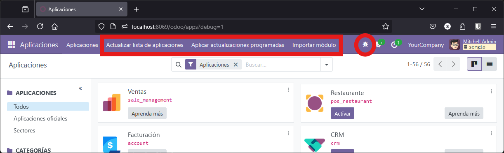
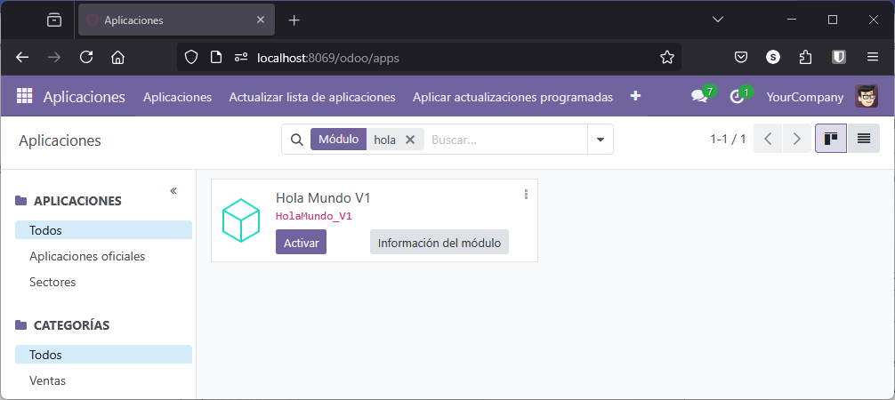

Una vez instalado Odoo y comprendida su arquitectura, el siguiente objetivo será desarrollar nuestro primer módulo: el típico "Hola Mundo".

Vamos a crear **tres versiones diferentes** del módulo, cada una más completa que la anterior, para ir profundizando progresivamente en los elementos básicos de un módulo en Odoo.

## Hola Mundo - Versión 1: Módulo Mínimo

Esta primera versión no tendrá ninguna utilidad más allá de comprobar que somos capaces de crear e instalar un módulo (aunque no haga nada).

El objetivo es aprender la estructura mínima necesaria para que Odoo reconozca algo como un módulo instalable.

El primer paso siempre será crear una carpeta en el directorio `addons/` con el nombre del módulo:

```bash
mkdir ./data/addons/HolaMundo_V1
```

Dentro de esta carpeta crearemos **solo dos archivos**: `__init__.py` y `__manifest__.py`

```
data/addons/HolaMundo_V1/
├── __init__.py
└── __manifest__.py
```

### Archivo `__init__.py`

Este archivo le indica a Python que esta carpeta es un paquete. En esta versión estará **vacío** porque no tenemos modelos ni controladores que cargar.

```python
# HolaMundo_V1/__init__.py
# Archivo vacío - solo indica que esto es un paquete Python
```

### Archivo `__manifest__.py`

Este archivo contiene la descripción del módulo. Es la **ficha técnica** que le indica a Odoo:

- Cómo se llama el módulo
- Qué hace
- Qué necesita para funcionar
- Qué archivos debe cargar

```python
# HolaMundo_V1/__manifest__.py

{
    'name': 'Hola Mundo V1',
    'version': '1.0',
    'summary': 'Módulo básico de ejemplo',
    'description': 'Este es un módulo de ejemplo que no hace nada, solo sirve como plantilla.',
    'author': 'Tu Nombre',
    'category': 'Tools',
    'depends': [],
    'data': [],
    'installable': True,
    'application': False,
    'auto_install': False,
}
```

Explicación de los Campos del Manifest: 

| Campo | Descripción |
|-------|-------------|
| `name` | Nombre del módulo tal como aparecerá en la interfaz |
| `version` | Versión del módulo, útil para actualizaciones |
| `summary` | Descripción corta que aparece en la lista de aplicaciones |
| `description` | Descripción larga y detallada del módulo |
| `author` | Quién lo ha creado |
| `category` | Categoría en Odoo ("Tools", "Sales", "Inventory", etc.) |
| `depends` | Lista de módulos necesarios (casi todos dependen de `base`) |
| `data` | Archivos XML/CSV a cargar (vistas, menús, datos, seguridad) |
| `demo` | Archivos que se cargan solo en modo demo |
| `installable` | Si es `True`, el módulo se puede instalar |
| `application` | Si es `True`, se muestra como aplicación en el panel principal |
| `auto_install` | Si es `True`, se instala automáticamente si sus dependencias están instaladas |

!!! info "Campos opcionales"
    Existen más campos opcionales, pero con estos tienes lo básico para que el módulo funcione correctamente.

### Proceso de Instalación

#### Paso 1: Reiniciar el Servidor

Para que el servidor reconozca el nuevo módulo:

```bash
docker compose restart odoo_dev_dam
```

O pulsa el botón que configuramos en VSCode con **Action Buttons**.

#### Paso 2: Ver los Logs

Es recomendable tener los logs visibles para detectar posibles errores:

```bash
docker logs odoo_dev_dam -f
```

#### Paso 3: Activar Modo Desarrollador

Hay varias formas de activar el modo desarrollador en Odoo:

**Opción A: Desde el menú de Ajustes**

Ve a **Ajustes** → **Activar el modo desarrollador**

<figure markdown="span" align="center">
  { width="75%" }
  <figcaption>Activar modo desarrollador desde ajustes</figcaption>
</figure>

**Opción B: Usando la URL directamente**

Añade `?debug=1` al final de la URL:

```
http://localhost:8069/web?debug=1
```

<figure markdown="span" align="center">
  { width="75%" }
  <figcaption>Activar modo desarrollador desde la URL</figcaption>
</figure>

Variantes de la URL:

- `?debug=1` - Modo desarrollador normal
- `?debug=assets` - Ver archivos fuente (útil para frontend)
- `?debug=tests` - Para pruebas automatizadas

**Opción C: Extensión del navegador**

Puedes usar la extensión [Odoo Debug](https://addons.mozilla.org/es-ES/firefox/addon/odoo-debug/) para Firefox o Chrome, que activa el modo con un solo clic.

<figure markdown="span" align="center">
  { width="75%" }
  <figcaption>Extensión para activar modo desarrollador</figcaption>
</figure>

Una vez en modo desarrollo, aparecerán nuevas opciones en la interfaz, como un menú con forma de cucaracha que permite acceder a funcionalidades de desarrollador.

<figure markdown="span" align="center">
  { width="75%" }
  <figcaption>Nuevas opciones disponibles en modo desarrollador</figcaption>
</figure>

#### Paso 4: Actualizar Lista de Aplicaciones

1. Ve a **Aplicaciones**
2. Pulsa el botón **Actualizar lista de aplicaciones**
3. Busca "Hola Mundo V1" en el buscador
4. Quita el filtro "Aplicaciones" si no aparece (porque `application: False`)
5. Haz clic en **Instalar**

<figure markdown="span" align="center">
  { width="75%" }
  <figcaption>Módulo buscado y listo para instalar</figcaption>
</figure>

Si todo ha ido bien, el módulo se instalará correctamente. Como no tiene funcionalidad, no aparecerá en ningún menú, pero puedes verificar su instalación viendo la información del módulo.

<figure markdown="span" align="center">
  { width="75%" }
  <figcaption>Información del módulo instalado</figcaption>
</figure>


!!! tip "Configuración de VSCode"

     Para no tener que estar reiniciando `docker` desde la línea de comando, podemos añadir a `Visual Studio Code` una extensión como **VS Code Action Buttons**. Una vez instalada esta extensión, vamos la configuración de la extensión y completamos el `json`  de configuración así:

     ```json
     "commands": [
     {
          "name": "$(triangle-right) Run Odoo",
          "color": "purple",
          "singleInstance": true,
          "command": "docker-compose down && docker-compose up -d && docker logs odoo -f"
     },
     {
          "name": "$(triangle-right) Rerun Odoo",
          "color": "purple",
          "singleInstance": true,
          "command": "docker-compose restart odoo && docker logs odoo -f"
     }
     ],
     ```

     El primer comando lo reinicia todo, tanto la base de datos como Odoo y elimina los contenedores para recrearlos. Esto puede solucionar algunos problemas. 
     
     El segundo reinicia solo el contenedor Odoo sin recrearlo. Es más rápido y también actualiza la base de datos en caso de haber modificado algún modelo. 
     
     El comando se puede utilizar en una terminal si no queremos hacer los botones o estamos en un entorno sin interfaz gráfica.


### Resumen de Pasos

!!! note "Proceso estándar de instalación"
    Estos pasos se repetirán cada vez que añadas o modifiques un módulo:
    
    1. Crear o modificar los archivos necesarios del módulo
    2. Reiniciar el servidor de Odoo
    3. Activar el modo desarrollador (si no está activo)
    4. Ir a **Aplicaciones** → **Actualizar lista de aplicaciones**
    5. Buscar e instalar el módulo
    6. Comprobar en los logs que no haya errores

---

## Hola Mundo - Versión 2: Módulo con Interfaz

La versión anterior fue muy básica pero útil para entender el proceso. Ahora vamos a crear una versión completa que:

- Aparezca en el menú de aplicaciones
- Tenga un modelo de datos
- Muestre vistas (lista y formulario)
- Tenga permisos de seguridad configurados

### Estructura del Módulo

```
data/addons/HolaMundo_V2/
├── __init__.py
├── __manifest__.py
├── models/
│   ├── __init__.py
│   └── hola.py
├── views/
│   └── hola_view.xml
└── security/
    └── ir.model.access.csv
```

Como puedes ver, ahora incluimos:

- **models/**: Carpeta con la definición del modelo de datos
- **views/**: Carpeta con las vistas (interfaz de usuario)
- **security/**: Carpeta con los permisos de acceso

### Archivo `__init__.py` (raíz)

Ahora el archivo raíz debe importar la carpeta `models`:

```python
# HolaMundo_V2/__init__.py

from . import models
```

### Archivo `__manifest__.py`

El manifest ahora incluye dependencias y archivos a cargar:

```python
# HolaMundo_V2/__manifest__.py

{
    'name': 'Hola Mundo V2',
    'version': '2.0',
    'summary': 'Módulo de ejemplo Hola Mundo V2',
    'description': 'Este módulo muestra un mensaje básico en Odoo con interfaz completa.',
    'author': 'Tu Nombre',
    'category': 'Tools',
    'depends': ['base'],
    'data': [
        'security/ir.model.access.csv',
        'views/hola_view.xml',
    ],
    'installable': True,
    'application': True,
}
```

!!! warning "Orden de carga"
    El orden de los archivos en `data` es importante. Los archivos de seguridad (`security/`) deben cargarse **antes** que las vistas, ya que si no, Odoo podría denegar el acceso a las vistas por falta de permisos.

### Archivo `models/__init__.py`

Este archivo permite a Python reconocer `models` como un paquete e importa el archivo del modelo:

```python
# HolaMundo_V2/models/__init__.py

from . import hola
```

!!! note "Importación en cadena"
    Cuando en el `__init__.py` raíz escribimos `from . import models`, Python busca el archivo `models/__init__.py`. Dentro de ese archivo, la línea `from . import hola` le dice a Odoo que cargue el modelo definido en `models/hola.py`.

### Archivo `models/hola.py`

Aquí se define el modelo de datos, que representa una tabla en la base de datos:

```python
# HolaMundo_V2/models/hola.py

from odoo import models, fields

class HolaMundo(models.Model):
    _name = 'hola.mundo.v2'
    _description = 'Modelo Hola Mundo V2'

    mensaje = fields.Char(string='Mensaje', default='¡Hola Mundo V2 desde Odoo!')
```

Explicación del Modelo: 

| Elemento | Descripción |
|----------|-------------|
| `_name` | Nombre técnico del modelo (obligatorio). Define el nombre de la tabla en PostgreSQL |
| `_description` | Descripción del modelo (recomendado) |
| `mensaje` | Campo de tipo texto que se mostrará en las vistas |
| `default` | Valor por defecto del campo |

La tabla en PostgreSQL se llamará `hola_mundo_v2` (los puntos se convierten en guiones bajos).

### Archivo `views/hola_view.xml`

Este archivo define cómo se visualizan los datos y cómo se accede al módulo:

```xml
<!-- HolaMundo_V2/views/hola_view.xml -->

<odoo>
    <!-- Vista de Lista -->
    <record id="view_hola_mundo_v2_list" model="ir.ui.view">
        <field name="name">hola.mundo.v2.list</field>
        <field name="model">hola.mundo.v2</field>
        <field name="type">list</field>
        <field name="arch" type="xml">
            <list>
                <field name="mensaje"/>
            </list>
        </field>
    </record>

    <!-- Vista de Formulario -->
    <record id="view_hola_mundo_v2_form" model="ir.ui.view">
        <field name="name">hola.mundo.v2.form</field>
        <field name="model">hola.mundo.v2</field>
        <field name="type">form</field>
        <field name="arch" type="xml">
            <form>
                <sheet>
                    <field name="mensaje"/>
                </sheet>
            </form>
        </field>
    </record>

    <!-- Acción que conecta las vistas con el menú -->
    <record id="action_hola_mundo_v2" model="ir.actions.act_window">
        <field name="name">Hola Mundo V2</field>
        <field name="res_model">hola.mundo.v2</field>
        <field name="view_mode">list,form</field>
    </record>

    <!-- Menús -->
    <menuitem id="menu_hola_mundo_v2_root" name="Hola Mundo V2"/>
    <menuitem id="menu_hola_mundo_v2" name="Mensajes" parent="menu_hola_mundo_v2_root"/>
    <menuitem id="menu_hola_mundo_v2_items" name="Ver Mensajes" parent="menu_hola_mundo_v2" action="action_hola_mundo_v2"/>
</odoo>
```

!!! warning "Cambio en Odoo 18"
    En **Odoo 18.0 y posteriores**, el tipo de vista que antes se llamaba `tree` ahora se llama `list`. Si usas versiones anteriores de Odoo, debes cambiar `type="list"` por `type="tree"` y la etiqueta `<list>` por `<tree>`.

Estructura de las Vistas. El archivo XML define:

1. **Vista de lista**: Cómo se muestra la tabla con todos los registros
2. **Vista de formulario**: Cómo se muestra el detalle de un registro individual
3. **Acción**: Conecta el modelo con las vistas
4. **Menús**: Estructura de navegación para acceder al módulo

### Archivo `security/ir.model.access.csv`

Este archivo define los permisos de acceso al modelo:

```csv
id,name,model_id:id,group_id:id,perm_read,perm_write,perm_create,perm_unlink
access_hola_mundo_v2,hola.mundo.v2,model_hola_mundo_v2,,1,1,1,1
```

Descripción del fichero de permisos:

| Columna | Descripción |
|---------|-------------|
| `id` | Identificador único del permiso |
| `name` | Nombre descriptivo |
| `model_id:id` | Referencia al modelo (formato: `model_<nombre_modelo>`) |
| `group_id:id` | Grupo al que se aplica (vacío = todos los usuarios) |
| `perm_read` | Permiso de lectura (1 = sí, 0 = no) |
| `perm_write` | Permiso de escritura |
| `perm_create` | Permiso de creación |
| `perm_unlink` | Permiso de eliminación |

!!! danger "Sin permisos, sin acceso"
    Si no incluyes este archivo, **ningún usuario podrá acceder al módulo**, aunque esté instalado. Odoo denegará el acceso por defecto por razones de seguridad.

### Instalación de la Versión 2

Sigue el mismo proceso que en la Versión 1:

1. Crea todos los archivos en las ubicaciones indicadas
2. Reinicia el servidor de Odoo
3. Activa el modo desarrollador (si no lo está)
4. Ve a **Aplicaciones** → **Actualizar lista de aplicaciones**
5. Busca **Hola Mundo V2**
6. Haz clic en **Instalar**

Esta vez, al instalar el módulo, aparecerá un nuevo menú en la barra superior llamado "Hola Mundo V2", y podrás acceder a las vistas y crear registros.

!!! tip "Diferencia con la V1"
    Si buscas módulos sin quitar el filtro "Aplicaciones", solo verás la V2 porque en su manifest tiene `'application': True`. La V1 solo aparecerá si quitas ese filtro.

---

## Hola Mundo - Versión 3: Usando Scaffold

Un **scaffold** es una herramienta que genera automáticamente la estructura básica de un módulo. Es como un "esqueleto" inicial que incluye todos los archivos y carpetas necesarios para empezar a desarrollar.

En lugar de crear manualmente cada archivo y carpeta, Odoo puede hacerlo por nosotros con un solo comando.

### Crear el Módulo con Scaffold

Para crear un módulo con scaffold, ejecutamos:

```bash
docker exec -it odoo_dev_dam odoo scaffold HolaMundo_V3 /mnt/extra-addons
```

Este comando:

- Ejecuta `odoo scaffold` dentro del contenedor
- Crea un módulo llamado `HolaMundo_V3`
- Lo ubica en `/mnt/extra-addons` (que está mapeado a `./data/addons/`)

<figure markdown="span" align="center">
  { width="75%" }
  <figcaption>Estructura creada por el comando scaffold</figcaption>
</figure>

### Ajustar Permisos

Después de crear el módulo, ajusta los permisos para poder editarlo:

Para dar permisos podemos hacer que el módulo sea propiedad del desarrollador, tal vez así evitaremos problemas en el futuro de acceso o copias de seguridad. Para ello:

```bash
sudo chown -R sergio:sergio hola_mundo__v3/
```

También se puede hacer desde el propio contenedor dando permisos a todos:

```bash
docker exec -it odoo_dev_dam chmod 777 -R /mnt/extra-addons/HolaMundo_V3
```

Esto permite que tanto el proceso Docker (que corre como `root`) como tu usuario local puedan modificar los archivos.

### Estructura Generada

Scaffold crea automáticamente:

```
HolaMundo_V3/
├── __init__.py
├── __manifest__.py
├── models/
│   ├── __init__.py
│   └── models.py           # Modelo de ejemplo (comentado)
├── views/
│   ├── views.xml           # Vistas de ejemplo (comentadas)
│   └── templates.xml       # Templates web (comentadas)
├── controllers/
│   ├── __init__.py
│   └── controllers.py      # Controladores web (comentados)
├── security/
│   └── ir.model.access.csv
├── demo/
│   └── demo.xml            # Datos de demostración (comentados)
└── static/
    └── description/
        └── icon.png        # Icono del módulo
```


**Instalación inicial**: En este estado, el módulo ya es instalable pero no hace nada (similar a la Versión 1):

1. Reinicia el servidor
2. Actualiza la lista de aplicaciones
3. Busca "HolaMundo_V3"
4. Instálalo

Para que el módulo funcione como la Versión 2, debes:

1. **Revisar `__manifest__.py`**: Actualiza la información del módulo y descomenta las líneas de `data` que necesites:

    ```python
    # __manifest__.py
    {
        'name': "HolaMundo_V3",
        'summary': "Módulo creado con scaffold",
        'description': """
            Módulo de ejemplo creado automáticamente con scaffold
        """,
        'author': "Tu Nombre",
        'category': 'Tools',
        'version': '3.0',
        'depends': ['base'],
        'data': [
            'security/ir.model.access.csv',
            'views/views.xml',
            # 'views/templates.xml',
        ],
        # 'demo': [
        #     'demo/demo.xml',
        # ],
    }
    ```

2. **Descomentar `models/models.py`**: Este archivo contiene un modelo de ejemplo. Descomenta el código y personalízalo:

    ```python
    # models/models.py
    from odoo import models, fields, api

    class HolaMundo_V3(models.Model):
        _name = 'holamundo_v3.holamundo_v3'
        _description = 'Ejemplo con Scaffold'

        name = fields.Char()
        value = fields.Integer()
        value2 = fields.Float(compute="_value_pc", store=True)
        description = fields.Text()

        @api.depends('value')
        def _value_pc(self):
            for record in self:
                record.value2 = float(record.value) / 100
    ```

3. **Descomentar `views/views.xml`**: Contiene las vistas de ejemplo:

    ```xml
    <!-- views/views.xml -->
    <odoo>
      <data>
        <!-- Vista de lista -->
        <record model="ir.ui.view" id="holamundo_v3.list">
          <field name="name">HolaMundo_V3 list</field>
          <field name="model">holamundo_v3.holamundo_v3</field>
          <field name="arch" type="xml">
            <list>
              <field name="name"/>
              <field name="value"/>
              <field name="value2"/>
            </list>
          </field>
        </record>

        <!-- Acción -->
        <record model="ir.actions.act_window" id="holamundo_v3.action_window">
          <field name="name">HolaMundo_V3 window</field>
          <field name="res_model">holamundo_v3.holamundo_v3</field>
          <field name="view_mode">list,form</field>
        </record>

        <!-- Menús -->
        <menuitem name="HolaMundo_V3" id="holamundo_v3.menu_root"/>
        <menuitem name="Menu 1" id="holamundo_v3.menu_1" parent="holamundo_v3.menu_root"/>
        <menuitem name="List" id="holamundo_v3.menu_1_list" parent="holamundo_v3.menu_1"
                  action="holamundo_v3.action_window"/>
      </data>
    </odoo>
    ```

4. **Archivo de seguridad**: Ya está creado por defecto, solo verifica que el contenido es correcto:

    ```csv
    id,name,model_id:id,group_id:id,perm_read,perm_write,perm_create,perm_unlink
    access_holamundo_v3_holamundo_v3,holamundo_v3.holamundo_v3,model_holamundo_v3_holamundo_v3,base.group_user,1,1,1,1
    ```

5. **Controladores (opcional)**: El archivo `controllers/controllers.py` contiene ejemplos de controladores web. Puedes descomentarlo si quieres crear páginas web personalizadas.

### Actualizar el Módulo

Una vez descomentado el código:

1. Reinicia el servidor Odoo
2. Ve a **Aplicaciones**
3. Busca "HolaMundo_V3"
4. Haz clic en los tres puntos del módulo
5. Selecciona **Actualizar**

Ahora el módulo tendrá funcionalidad completa con vistas, modelos y menús.

<figure markdown="span" align="center">
  { width="75%" }
  <figcaption>Módulo HolaMundo V3 funcionando con scaffold</figcaption>
</figure>

### Archivos Opcionales

- **`demo/demo.xml`**: Contiene datos de demostración que se cargan automáticamente si instalas el módulo con datos de prueba. Es útil para desarrollo pero generalmente se desactiva en producción.

- **`controllers/controllers.py`**: Permite crear rutas web personalizadas (páginas accesibles desde el navegador). No lo necesitamos para un módulo básico.

- **`views/templates.xml`**: Define templates QWeb para páginas web. Útil si quieres personalizar el frontend del módulo.

### Ventajas de Usar Scaffold

- Genera toda la estructura automáticamente
- Incluye ejemplos de código comentados
- Asegura que sigues las convenciones de Odoo
- Ahorra tiempo en la creación inicial
- Incluye archivos que podrías olvidar (como `__init__.py`)

También debemos tener en cuenta que hay ocasiones en que es aconsejable o no utilizar Scaffold

**Usa scaffold cuando**:

- Empiezas un módulo nuevo desde cero
- Quieres asegurarte de tener la estructura correcta
- Necesitas ejemplos de código para guiarte

**Crea manualmente cuando**:

- Estás aprendiendo y quieres entender cada archivo
- Necesitas solo una parte específica
- Quieres un módulo muy simple sin archivos extra

---

## Resumen de las Tres Versiones

| Versión | Archivos | Funcionalidad | Objetivo de la implementación |
|---------|----------|---------------|---------------------|
| **V1** | `__init__.py`<br>`__manifest__.py` | Ninguna | Estructura mínima de un módulo |
| **V2** | V1 + models + views + security | Completa con interfaz | Módulo funcional completo |
| **V3** | Generado con scaffold | Similar a V2 | Uso de herramientas de Odoo |


## Recursos Adicionales

- [Documentación oficial: Scaffolding](https://www.odoo.com/documentation/18.0/developer/reference/cli.html#scaffolding)
- [Documentación oficial: Module Manifest](https://www.odoo.com/documentation/18.0/developer/reference/backend/module.html)
- [Documentación oficial: Models](https://www.odoo.com/documentation/18.0/developer/reference/backend/orm.html)