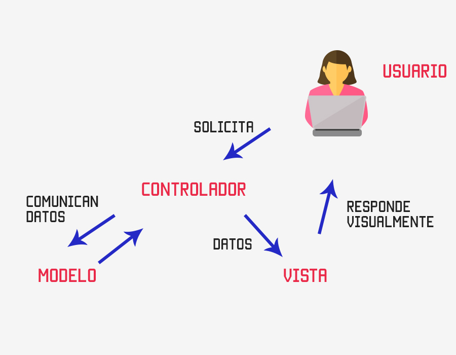

Antes de comenzar ha desarrollar en ***Odoo*** necesitamos conocer un poco de su arquitectura para comprender cómo trabaja y la forma en la que debemos programar y cómo poder utilizar el framework que nos facilitar para poder implementar nuestros propios módulos

# Arquitectura


***Odoo*** es un ERP con una arquitectura [de Tenencia Múltiple](http://es.wikipedia.org/wiki/Tenencia_M%C3%BAltiple). Es decir, tiene una base de datos y un servidor común para todos los clientes. Lo contrario sería tener un servidor o base de datos por cliente o virtualizar.

El *framework* de ***Odoo*** facilita diversos componentes que permiten construir la aplicación:

-   La capa **ORM** (Object Relational Mapping) entre los objetos Python y la base de datos **PostgreSQL**. El diseñador-programador no realiza el diseño de la base de datos; únicamente diseña clases, y la capa *ORM* de ***Odoo*** se encarga de mapearlas sobre el SGBD **PostgreSQL**. Mas info en [An overview of ORM Methods in Odoo](https://sdlccorp.com/post/an-overview-of-orm-methods-in-odoo-18/)

<figure markdown="span" align="center">
  { width="85%"  }
  <figcaption>Diagrama ***Odoo*** ORM (Object Relational Mapping)</figcaption>
</figure>

-   Una arquitectura **MVC** ([modelo-vista-controlador](http://es.wikipedia.org/wiki/Modelo_Vista_Controlador)), en la que el ***modelo*** reside en los datos de las clases diseñadas con Python, la ***vista*** reside en los formularios, listas, calendarios, gráficos... definidos en archivos *XML*, y el ***controlador*** reside en los métodos definidos en las clases que proporcionan la lógica de negocio.

<figure markdown="span" align="center">
  { width="65%"  }
  <figcaption>Diagrama Modelo - Vista - Controlador.</figcaption>
</figure>

-   Diseñadores de informes.
-   Facilidades para la traducción de la aplicación a varios idiomas.

El **servidor** ***Odoo*** proporciona acceso a la base de datos mediante **ORM**. El servidor necesita tener instalados **módulos**, ya que comienza vacío.

Por otro lado, el **cliente** se comunica con el servidor mediante **XML-RPC**, y los clientes web por **JSON-RPC**. El cliente solo tiene que mostrar lo que proporciona el servidor o solicitar correctamente los datos. Por tanto, un cliente puede ser muy simple y desarrollarse en cualquier lenguaje de programación. ***Odoo*** proporciona un cliente web, aunque se puede crear un cliente en cualquier plataforma.

Los datos están almacenados en una **base de datos relacional** como es *PostgreSQL* y gracias al **ORM**, no es necesario realizar consultas SQL directamente. El **ORM** proporciona una serie de métodos para trabajar de manera más rápida y segura. En lugar de hablar de tablas, se habla de **modelos**. Estos son "mapeados" por el ORM en tablas. Sin embargo, un modelo es más que datos en una tabla. Un modelo se comporta como un objeto al tener campos funcionales, restricciones y campos relacionales que dejan la normalización de la base de datos en manos de ***Odoo***.

El acceso del cliente a los datos se realiza mediante un servicio. Este puede ser **[WSGI](http://en.wikipedia.org/wiki/Web_Server_Gateway_Interface)**. WSGI es una solución estándar para crear servidores y clientes HTTP en Python. En el caso de Odoo, este utiliza `Werkzeug`, que interpreta las peticiones y las transforma en funciones que ***Odoo*** puede entender.

Otro concepto dentro de ***Odoo*** son los **Business Objects**. Se implementan con `models` y contienen tanto datos como lógica de negocio.

Odoo también proporciona los llamados **Wizards**, que funcionan como asistentes para introducir datos de una manera más sencilla para el usuario.

El cliente web es fácil de desarrollar gracias a los **Widgets** o Window GaDGETS. Estos proporcionan un comportamiento y visualización adecuados para cada tipo de dato. Por ejemplo, si el campo es para definir una fecha, mostrará un calendario. Algunos tienen diferentes visualizaciones según el tipo de vista y se pueden definir Widgets personalizados. Los Widgets y demás interfaz web funcionan gracias a `OWL`, un framework de cliente web desarrollado en el proyecto `Odoo` y similar a `React`.

Resumiendo todos estos conceptos: 

| Componente         | Descripción |
|------|-----------------|
| Base de Datos (PostgreSQL)   | Donde se almacenan los datos de forma relacional.   |
| ORM   | Traduce modelos Python a tablas SQL, gestionando relaciones y lógica.      |
| Business Objects    | Modelos que contienen datos y lógica de negocio.                           |
| WSGI/Werkzeug      | Intermediario que convierte peticiones HTTP en funciones de ***Odoo***.          |
| Wizards   | Asistentes que facilitan la introducción de datos.                         |
| Cliente Web (OWL + Widgets)    | Interfaz interactiva que adapta la visualización según el tipo de dato.    |

## La base de datos de Odoo

En ***Odoo*** no existe un diseño explícito de la base de datos, si no que la base de datos de una empresa en ***Odoo*** es el resultado del mapeo del diseño de clases del ERP hacia el SGBD PostgreSQL, que es el que proporciona la persistencia necesaria para los objetos. Esto es el **ORM**.

En consecuencia, ***Odoo*** no facilita ningún diseño entidad-relación sobre la base de datos de una empresa ni tampoco ningún diagrama del modelo relacional.

***Odoo*** permite, mediante el cliente web, recuperar el nombre de la clase Python que define la información que se introduce a través de un formulario y el nombre del dato miembro de la clase correspondiente a cada campo del formulario. Esta información permite llegar a la tabla y columna afectadas, teniendo en cuenta dos cuestiones:

- El nombre de las clases Python de ***Odoo*** siempre está en minúsculas (se utiliza el guion bajo para hacer legibles las palabras compuestas) y sigue la nomenclatura `nombre_del_modulo.nom1.nom2.nom3...` en la cual se utiliza el punto para indicar un cierto nivel de jerarquía. Cada clase Python de ***Odoo*** se mapea en una tabla de *PostgreSQL* con muchas posibilidades de que su nombre coincida con el de la clase, sustituyendo los puntos por guiones bajos.

- Los nombres de los atributos de una clase Python también están siempre en minúsculas (se utiliza el guion bajo para hacer legibles las palabras compuestas). Cada dato miembro de una clase Python de ***Odoo*** que sea persistente (una clase puede tener datos miembros calculados no persistentes) se mapea como un atributo en la correspondiente tabla de PostgreSQL con el mismo nombre.

!!! Ejemplo

    La clase Python `sale.order` de ***Odoo*** está pensada para describir la cabecera de los pedidos de venta y la correspondiente tabla en PostgreSQL es `sale_order`.

De esta manera, conociendo el nombre de la clase y el nombre del dato miembro, es muy posible conocer el nombre de la tabla y de la columna correspondientes. Se puede configurar el cliente web para que informe del nombre de la clase y del dato miembro al situar el ratón sobre las etiquetas de los campos de los formularios.


## Estructura de carpetas de Odoo

La estructura de carpetas está organizada para facilitar el desarrollo, mantenimiento y extensión de funcionalidades. 

De esta forma, a continuación tenemos el listado de las carpetas más importantes dentro del código fuente de Odoo:

- **`addons/`** : Contiene todos los módulos estándar y personalizados de Odoo. Cada módulo tiene su propia carpeta con modelos, vistas, controladores, datos, etc. Ejemplos: `sale`, `account`, `crm`, `inventory`.

- **`config/`**: Contiene archivos de configuración del servidor Odoo, como `odoo.conf`. Es esencial para iniciar Odoo correctamente en entornos de producción o desarrollo.

- **`data/`**: Carpeta opcional usada para almacenar datos persistentes o archivos cargados por el usuario. Aunque no es parte del core, es común en despliegues personalizados o cuando se configura `filestore` fuera de la base de datos.

- `odoo/`:  Núcleo del framework. Aquí se encuentran los componentes esenciales como el ORM, controladores, herramientas de seguridad, y utilidades. Subcarpetas importantes:
     * `odoo/models/`: Definición del ORM y clases base.
     * `odoo/addons/`: Módulos integrados directamente en el core.
     * `odoo/tools/`: Funciones auxiliares (utilidades, validaciones, etc.).
     * `odoo/http.py`: Manejo de peticiones HTTP y controladores web.

- `setup/`: Archivos de configuración para la instalación del entorno de desarrollo y despliegue.

- `tests/`: Pruebas automatizadas para asegurar la calidad del código. Incluye pruebas unitarias y de integración.

- `doc/`: Documentación técnica del framework y sus componentes.

- `static/`:  Archivos estáticos como CSS, JS e imágenes utilizados por la interfaz web.

- `web/`: Módulo base para la interfaz web de Odoo. Incluye componentes JavaScript, vistas web, y widgets.

- `custom_addons/` *(opcional)*: Carpeta comúnmente usada para módulos personalizados fuera del core. Se configura en el archivo de inicio (`odoo.conf`).

Si observamos, las tres primera carpetas son las que hemos definido en el `docker-compose.yml` del punto anterior, por lo que ahora ya conocemos su cometido: 

```yml
services:
  odoo:
    container_name: odoo
    image: odoo:18.0
    depends_on:
      - db
    ports:
      - "8069:8069"
    volumes:
      - odoo-web-data:/var/lib/odoo
      - ./config:/etc/odoo
      - ./addons:/mnt/extra-addons
    environment:
      - HOST=db
      - USER=odoo
      - PASSWORD=odoo
    command: --dev=all
    tty: true
```


## Módulos

Tanto el servidor como los clientes son módulos. Todos están guardados en una base de datos. Todo lo que se pueda hacer para modificar ***Odoo*** se hace en módulos.

### Composición de un módulo

Los módulos de Odoo amplían o modifican partes del *Modelo-Vista-Controlador*. De esta manera, un módulo puede tener:

-   **Objetos de negocio**: Son la parte del modelo, definidos en clases de Python según una sintaxis propia del ORM de ***Odoo***.
-   **Archivos de datos**: Son archivos XML que pueden definir datos, vistas o configuraciones.
-   **Controladores web**: Gestionan las peticiones de los navegadores web.
-   **Datos estáticos**: Imágenes, CSS o JavaScript utilizados por la interfaz web. Es necesario que los datos estáticos se guarden en el directorio **static**. Por ejemplo, el icono del módulo va en `static/description/icon.png`.

### Estructura de archivos de un módulo

-   Todos los módulos están en un directorio definido en la opción **--addons-path** o en el archivo de configuración, normalmente `addons`. Cada módulo esta un un subdirectorio dentro de esta carpeta y por lo que puede haber más de un directorio.
-   Un módulo de Python se declara en un archivo de **manifest** que da información sobre el módulo, lo que hace, los módulos de los que depende y cómo se debe instalar o actualizar. [Manifest in Odoo](https://www.odoo.com/documentation/8.0/reference/module.html#reference-module-manifest)
-   Un módulo es un paquete de Python que necesita un archivo **\_\_init\_\_.py** para instanciar todos los archivos Python.

### Creación de módulos

Para ayudar al programador, ***Odoo*** contiene un comando para crear módulos vacíos. Este crea la estructura de archivos necesaria para empezar a trabajar:

```bash
     $ odoo scaffold <nombre_del_módulo> <dónde_crearlo>
```

Posteriormente veremos más sobre `scaffold`, pero si quieres más información puedes recurrir al [Manual oficial Scaffolding](https://www.odoo.com/documentation/8.0/reference/cmdline.html#scaffolding)

El parámetro **scaffold** puede tener la opción **-t** para indicar el directorio de la *plantilla*. Esta está hecha utilizando **jinja2**, que es un motor de plantillas para Python.

Las *plantillas* están en el directorio de instalación de Odoo, en el directorio **cli**. En nuestro caso: **cli/templates/** dentro del directorio de instalación de ***Odoo***.

Podemos crear una *plantilla* copiando el directorio default o theme y modificando los archivos. Esto puede ser útil si siempre hacemos módulos con la misma plantilla. Por ejemplo, para poner nuestro logo, copyright, etc.

## ORM

***Odoo*** mapea sus objetos en una base de datos mediante **ORM**, evitando al programador la mayoría de consultas SQL. De esta manera, el desarrollo de los módulos es muy rápido y se evitan errores de programación.

Los modelos se crean como clases de Python que extienden la clase **[models.Model](https://www.odoo.com/documentation/master/developer/reference/backend/orm.html)**, que contiene los campos y métodos útiles para trabajar con el ORM.

!!! Nota

    Los modelos, al heredar de **models.Model**, necesitan obligatoriamente asignar valores a algunas variables, como por ejemplo **\_name**.

***Odoo*** considera que un modelo es la referencia a una o más tablas en la base de datos. Un modelo no es una fila en la tabla, es toda la tabla.

> En programación, el **Modelo** es una forma de relacionar el programa con la base de datos. Es de más alto nivel que las consultas directas a la base de datos y que las **clases y objetos** respecto a la programación orientada a objetos. El modelo une en un único concepto las **estructuras de datos**, las **restricciones de integridad** y las opciones de **manipulación** de los datos.

Los modelos en ***Odoo*** pueden

 - Heredar de **models.Model** y ser los normales, mapeados y permanentes en la base de datos. 
 - Pueden ser **models.TransientModel**, que son iguales pero no tienen persistencia definitiva en la base de datos. Estos son los recomendados para crear `wizards`. 
 - También pueden ser **models.AbstractModel** para definir modelos abstractos que luego serán heredados.

En Odoo, existen tres tipos principales de modelos que heredan de clases base diferentes según su propósito, se trata de `models.Model`, `models.TransientModel` y `models.AbstractModel`:

- `models.Model` se trata de Modelos persistentes. Representa una tabla real en la base de datos. Los datos almacenados en este modelo son permanentes. Por ejemplo Clientes, productos, facturas, etc.
- `models.TransientModel` son datos temporales (como asistentes o formularios rápidos), por lo tanto es un modelo no persistente. Los registros se eliminan automáticamente después de un tiempo (por defecto, 7 días). Se utilizan para Wizards, asistentes de importación/exportación, formularios temporales.
- `models.AbstractModel` que son modelos base reutilizables, o sea, se trata de modelos abstractos que no crea una tabla en la base de datos. Se utiliza para definir funcionalidades comunes que pueden ser heredadas por otros modelos.

Comparativa rápida

| Característica         | `models.Model` | `models.TransientModel` | `models.AbstractModel` |
|------------------------|----------------|--------------------------|-------------------------|
| Persistencia           | Sí             | No (temporal)            | No                      |
| Crea tabla en BD       | Sí             | Sí                       | No                      |
| Uso típico             | Datos reales   | Formularios/Wizards      | Funcionalidad común     |
| Eliminación automática | No             | Sí                       | No                      |

Documentación oficial: [Odoo ORM Reference](https://www.odoo.com/documentation/master/developer/reference/backend/orm.html)
