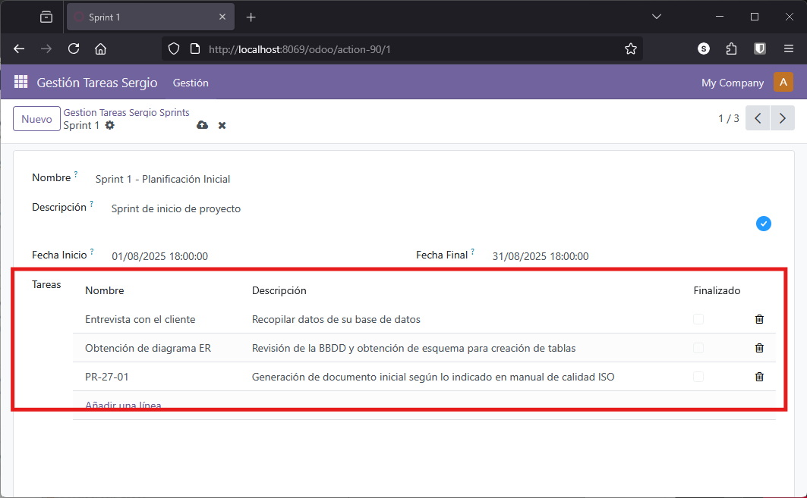

# Campos Básicos y Relacionales

Seguimos con el ejemplo creado en la sección anterior y en este apartado veremos cómo añadir distintos [campos básicos y relaciones](https://www.odoo.com/documentation/18.0/es/applications/studio/fields.html) a nuestros modelos en Odoo. No nos centraremos en vistas avanzadas, sino en ver la relación entre modelos y cómo Odoo toma vistas por defecto, además de cómo podemos modificarlas.

Tenemos un modelo `tareas_sergio` con dos campos propios de tipo carácter llamados `nombre` y `descripcion`.

!!! note "Documentación de desarrollo ORM"
    Puedes consultar la [documentación de desarrollo de Odoo](https://www.odoo.com/documentation/18.0/developer/reference/orm.html) para más información sobre el ORM y los campos disponibles.

## Campos Básicos y Parámetros

Al crear un campo, puedes añadir parámetros que modifican su comportamiento:

- **string**: Etiqueta que se muestra en la interfaz. Si no se indica, se usa el nombre del campo
- **readonly**: Hace el campo de solo lectura (no editable)
- **required**: Hace el campo obligatorio
- **help**: Mensaje de ayuda que aparece al pasar el cursor sobre el campo

Cuando modificas el modelo, debes reiniciar el servidor y actualizar el módulo para aplicar los cambios.

### Ejemplo de Campos Básicos

Vamos a añadir los siguientes campos al modelo `tareas_sergio`:

- `fecha_creacion`: tipo `Date`
- `fecha_ini`: tipo `Datetime`
- `fecha_fin`: tipo `Datetime`
- `finalizado`: tipo `Boolean`

Además, añadiremos parámetros a todos los campos (tanto los nuevos como los existentes) para mejorar la usabilidad.

??? note "models.py"
    ```python
    from odoo import models, fields, api
    
    class tareas_sergio(models.Model):
        _name = 'gestion_tareas_sergio.tareas_sergio'
        _description = 'Modelo de Tareas para Gestión de Proyectos'

        nombre = fields.Char(
            string="Nombre", 
            required=True, 
            help="Introduzca el nombre de la tarea")
        
        descripcion = fields.Text(
            string="Descripción", 
            help="Breve descripción de la tarea")
        
        fecha_creacion = fields.Date(
            string="Fecha Creación", 
            required=True, 
            help="Fecha en la que se dio de alta la tarea")
        
        fecha_ini = fields.Datetime(
            string="Fecha Inicio", 
            required=True, 
            help="Fecha y hora de inicio de la tarea")
        
        fecha_fin = fields.Datetime(
            string="Fecha Final", 
            help="Fecha y hora de finalización de la tarea")
        
        finalizado = fields.Boolean(
            string="Finalizado", 
            help="Indica si la tarea ha sido finalizada o no")
    ```

Una vez añadidos, comprobamos que todo funciona bien:

1. Reinicia el servidor
2. Actualiza el módulo
3. Comprueba que aparecen los nuevos campos
4. Verifica que sale la ayuda al pasar el cursor
5. Comprueba que los campos obligatorios funcionan correctamente

### Actualizando las Vistas

Por defecto, Odoo crea una vista de tipo formulario con todos los campos, pero suele ser muy básica y poco organizada.

Para personalizar la vista, vamos a editar el archivo `views/views.xml` y definir explícitamente qué campos queremos mostrar y cómo organizarlos.

**Estrategia**: Copiar la vista `list` existente y adaptarla para crear una vista `form`:

- Cambiar `<list>` por `<form>`
- Añadir `<sheet>` y `<group>` para organizar los campos
- Seleccionar qué campos mostrar en cada vista

??? note "views/views.xml"
    ```xml
    <!-- Vista de Lista -->
    <record model="ir.ui.view" id="tareas_list">
        <field name="name">gestion_tareas_sergio.tareas_sergio.list</field>
        <field name="model">gestion_tareas_sergio.tareas_sergio</field>
        <field name="arch" type="xml">
            <list>
                <field name="nombre"/>
                <field name="descripcion"/>
                <field name="finalizado"/>
            </list>
        </field>
    </record>

    <!-- Vista de Formulario -->
    <record model="ir.ui.view" id="tareas_form">
        <field name="name">gestion_tareas_sergio.tareas_sergio.form</field>
        <field name="model">gestion_tareas_sergio.tareas_sergio</field>
        <field name="arch" type="xml">
            <form>
                <sheet>
                    <group>
                        <field name="nombre"/>
                        <field name="descripcion"/>
                        <field name="fecha_creacion"/>
                        <field name="fecha_ini"/>
                        <field name="fecha_fin"/>
                        <field name="finalizado"/>
                    </group>
                </sheet>
            </form>
        </field>
    </record>
    ```

Observa que no todos los campos aparecen en todas las vistas. En este ejemplo:
- **Vista lista**: 3 campos (nombre, descripción, finalizado)
- **Vista formulario**: 6 campos (todos)

!!! warning "Nombre del modelo"
    Es fundamental que el valor del campo `model` coincida exactamente con el `_name` del modelo Python. Si te equivocas, Odoo mostrará vistas genéricas por defecto.

Comprueba que todo funciona correctamente y que puedes introducir valores en todos los campos.

## Relaciones Entre Modelos

Las relaciones entre modelos (y por tanto entre tablas de la base de datos) se simplifican gracias al **ORM**. Odoo proporciona tres tipos de campos relacionales:

| Tipo | Uso | Ejemplo |
|------|-----|---------|
| **Many2one** | Muchos a uno | Muchas tareas → 1 sprint |
| **One2many** | Uno a muchos | 1 sprint → muchas tareas |
| **Many2many** | Muchos a muchos | Tareas ↔ Tecnologías |

!!! info "Gestión automática"
    Las relaciones **Many2many** requieren una tabla intermedia en la base de datos, pero Odoo la crea automáticamente. No tienes que preocuparte por las claves foráneas ni las restricciones de integridad.

## Campos Relacionales: Many2one

Vamos a crear una relación **Many2one** entre tareas y sprints. Primero necesitamos entender qué es un sprint:

!!! note "Sprints y Tareas"
    Un **sprint** es un ciclo de trabajo corto y repetitivo, típicamente de 1 a 4 semanas, en el que:
    
    - Se planifican tareas específicas (historias de usuario, bugs, mejoras)
    - Se ejecutan esas tareas con un objetivo claro
    - Se revisa el trabajo realizado al final del sprint
    - Se reflexiona sobre cómo mejorar en el siguiente sprint
    
    Un sprint contiene varias tareas (también llamadas issues, tickets o historias de usuario) que son las unidades de trabajo que deben completarse dentro del sprint.

### Crear el Modelo Sprint

Vamos a crear un nuevo modelo `sprint` con los siguientes campos:

- `nombre`
- `descripcion`
- `fecha_ini`
- `fecha_fin`

Intenta generar el código tú mismo antes de mirar la solución. Es muy sencillo porque la mayoría de los campos son iguales a los del modelo de tareas.

??? note "Modelo Sprint en models.py"
    ```python
    class sprints_sergio(models.Model):
        _name = 'gestion_tareas_sergio.sprints_sergio'
        _description = 'Modelo de Sprints para Gestión de Proyectos'

        nombre = fields.Char(
            string="Nombre", 
            required=True, 
            help="Introduzca el nombre del sprint")
        
        descripcion = fields.Text(
            string="Descripción", 
            help="Breve descripción del sprint")
        
        fecha_ini = fields.Datetime(
            string="Fecha Inicio", 
            required=True, 
            help="Fecha y hora de inicio del sprint")
        
        fecha_fin = fields.Datetime(
            string="Fecha Final", 
            help="Fecha y hora de finalización del sprint")
    ```

!!! warning "Antes de continuar"
    Reinicia el servidor y actualiza el módulo para asegurarte de que el nuevo modelo se crea correctamente en la base de datos.

### Crear la Relación Many2one

Una vez tenemos el modelo Sprint, podemos relacionarlo con Tareas. Añadimos un campo `sprint` en el modelo `tareas_sergio`:

```python
sprint = fields.Many2one(
    'gestion_tareas_sergio.sprints_sergio', 
    string='Sprint relacionado', 
    ondelete='set null', 
    help='Sprint al que pertenece esta tarea')
```

**Explicación de los parámetros**:

- `sprint`: Nombre del campo en el modelo actual
- `fields.Many2one(...)`: Define una relación de muchos a uno
- `'gestion_tareas_sergio.sprints_sergio'`: Modelo destino de la relación
- `string='Sprint relacionado'`: Etiqueta en la interfaz de usuario
- `ondelete='set null'`: Si se elimina el sprint, este campo se pone a `null` (la tarea no se elimina)
- `help`: Texto de ayuda

**Opciones de `ondelete`**:

| Valor | Comportamiento |
|-------|----------------|
| `set null` | Pone el campo a NULL (por defecto) |
| `cascade` | Elimina también el registro relacionado |
| `restrict` | Impide eliminar si hay registros relacionados |
| `set default` | Pone el valor por defecto |
| `no action` | No hace nada (puede causar errores) |

Con esta simple línea, el **ORM** gestiona automáticamente toda la relación entre los modelos.

### Configurar Permisos y Vistas

Para que el nuevo modelo sea accesible, debemos:

1. **Añadir permisos en `security/ir.model.access.csv`**:

    ??? note "ir.model.access.csv"
        ```csv
        id,name,model_id:id,group_id:id,perm_read,perm_write,perm_create,perm_unlink
        access_gestion_tareas_sergio_tareas_sergio,acceso_tareas_sergio,model_gestion_tareas_sergio_tareas_sergio,base.group_user,1,1,1,1
        access_gestion_tareas_sergio_sprints_sergio,acceso_sprints_sergio,model_gestion_tareas_sergio_sprints_sergio,base.group_user,1,1,1,1
        ```

2. **Añadir el campo `sprint` en la vista de formulario de Tareas**:

    ```xml
    <field name="sprint"/>
    ```

3. **Opcional**: Crear vistas y menús para el modelo Sprint (si no, Odoo usará vistas por defecto)

Prueba y observa que:
- Ya tienes el nuevo campo `sprint` en el formulario de tareas
- Puedes seleccionar un sprint existente
- Puedes crear nuevos sprints directamente desde el formulario de tareas (botón "+")

## Campos Relacionales: One2many

La relación **One2many** es la inversa de **Many2one**. Permite que desde un registro padre (sprint) podamos ver y gestionar todos sus registros hijos (tareas).

En la práctica, esto significa que desde el formulario de un sprint podremos ver todas las tareas que le pertenecen.

### Crear la Relación One2many

Añadimos un campo `tareas` en el modelo `sprint`:

```python
tareas = fields.One2many(
    'gestion_tareas_sergio.tareas_sergio', 
    'sprint', 
    string='Tareas del Sprint')
```

**Explicación de los parámetros**:

- `tareas`: Nombre del campo en el modelo actual
- `'gestion_tareas_sergio.tareas_sergio'`: Modelo relacionado (tareas)
- `'sprint'`: **Campo inverso** en el modelo de tareas (el Many2one que creamos antes)
- `string='Tareas del Sprint'`: Etiqueta en la interfaz

!!! warning "Campo inverso obligatorio"
    El segundo parámetro (`'sprint'`) es **imprescindible** y debe coincidir exactamente con el nombre del campo Many2one en el modelo de tareas. Si no existe o está mal escrito, dará error.

Gracias a esta definición, desde el formulario de un sprint podemos:
- Ver todas las tareas relacionadas
- Crear nuevas tareas directamente
- Editar o eliminar tareas existentes

Ejemplo visual de la relación:

<figure markdown="span" align="center">
  { width="75%" }
  <figcaption>Ejemplo de relación One2many: desde un Sprint se ven todas sus Tareas</figcaption>
</figure>

## Campos Relacionales: Many2many

Los **campos relacionales Many2many** permiten establecer una relación de muchos a muchos entre dos modelos. Esto significa que un registro de un modelo puede estar vinculado a varios registros de otro modelo, y viceversa.

**Ejemplo**: Un estudiante puede estar inscrito en varios cursos, y cada curso puede tener varios estudiantes.

### Caso de Uso: Tecnologías

Vamos a crear un modelo **Tecnologías** que liste las diferentes tecnologías que pueden aplicarse a un proyecto (Python, Java, JavaScript, etc.). De esta forma:

- Un proyecto puede implementarse usando muchas tecnologías
- Cada tecnología puede ser usada en muchos proyectos

### Crear el Modelo Tecnología

Crea un modelo **Tecnología** con los siguientes campos:

- `nombre`
- `descripcion`
- `logo`: Campo de tipo imagen de 256x256 píxeles máximo

??? note "Modelo Tecnología en models.py"
    ```python
    class tecnologias_sergio(models.Model):
        _name = 'gestion_tareas_sergio.tecnologias_sergio'
        _description = 'Modelo de Tecnologías'

        nombre = fields.Char(
            string="Nombre", 
            required=True, 
            help="Nombre de la tecnología")
        
        descripcion = fields.Text(
            string="Descripción", 
            help="Breve descripción de la tecnología")
        
        logo = fields.Image(
            string="Logo", 
            max_width=256, 
            max_height=256,
            help="Logo de la tecnología")
    ```

!!! note "Campo Image"
    El campo `Image` almacena imágenes en base64. Los parámetros `max_width` y `max_height` redimensionan automáticamente la imagen si es mayor.

### Crear la Relación Many2many

Ahora creamos campos en ambos modelos para establecer la relación bidireccional.

**En el modelo Tareas**:

```python
rel_tecnologias = fields.Many2many(
    comodel_name='gestion_tareas_sergio.tecnologias_sergio',
    relation='relacion_tareas_tecnologias',
    column1='rel_tareas',
    column2='rel_tecnologias',
    string='Tecnologías')
```

**Explicación de los parámetros**:

- `comodel_name`: Modelo con el que se relaciona
- `relation`: Nombre de la tabla intermedia en la base de datos
- `column1`: Nombre de la columna en la tabla intermedia que referencia al modelo actual (tareas)
- `column2`: Nombre de la columna que referencia al otro modelo (tecnologías)
- `string`: Etiqueta en la interfaz

**En el modelo Tecnologías** (relación inversa):

```python
rel_tareas = fields.Many2many(
    comodel_name='gestion_tareas_sergio.tareas_sergio',
    relation='relacion_tareas_tecnologias',
    column1='rel_tecnologias',
    column2='rel_tareas',
    string='Tareas')
```

!!! warning "Mismo nombre de tabla"
    El parámetro `relation` debe ser **idéntico** en ambos modelos. Así Odoo sabe que es la misma relación.

### Configurar Permisos, Vistas y Menús

Para que funcione correctamente:

1. Añadir permisos en `security/ir.model.access.csv`
2. Añadir el campo en las vistas correspondientes
3. Opcional: Crear menús para acceder al modelo Tecnologías
4. Reiniciar y actualizar el módulo

### Widgets para Many2many

Al añadir el campo en la vista, puedes usar diferentes widgets para cambiar su apariencia:

**Widget por defecto**:
```xml
<field name="rel_tecnologias"/>
```

**Widget de tags** (recomendado para Many2many):
```xml
<field name="rel_tecnologias" widget="many2many_tags"/>
```

El widget `many2many_tags` muestra cada tecnología como una etiqueta (tag) de colores, siendo más visual y compacto.

!!! tip "Más widgets disponibles"
    Puedes consultar todos los [widgets disponibles en la documentación oficial](https://www.odoo.com/documentation/18.0/es/applications/studio/fields.html?highlight=widgets#many2many-many2many).

Gracias a esta configuración, es posible seleccionar y gestionar fácilmente las tecnologías asociadas a una tarea desde el formulario correspondiente, permitiendo una administración flexible y eficiente de las relaciones entre tareas y tecnologías.

---

## 🧩 Tu Turno: Gestor de Restaurante

Ahora vas a aplicar todo lo aprendido sobre campos básicos y relaciones al proyecto del restaurante.

### Objetivos y Contexto

En esta sesión ampliarás el modelo **Plato** con más campos y crearás dos nuevos modelos relacionados:

- **Menús**: Agrupaciones de platos (menú del día, menú de fin de semana, etc.)
- **Ingredientes**: Ingredientes/alérgenos que contiene cada plato

Aplicarás los tres tipos de relaciones:
- **Many2one**: Plato → Menú
- **One2many**: Menú → Platos
- **Many2many**: Plato ↔ Ingredientes

### Pasos a Realizar

1. **Ampliar el modelo Plato con nuevos campos básicos**
    - `precio`: tipo `Float` (obligatorio)
    - `tiempo_preparacion`: tipo `Integer` (en minutos)
    - `disponible`: tipo `Boolean` (por defecto True)
    - `categoria`: tipo `Selection` con opciones: 'entrante', 'principal', 'postre', 'bebida'
    
    Añade parámetros `string`, `required` y `help` a todos los campos.

2. **Actualizar las vistas de Plato**
    - Vista lista: nombre, categoria, precio, disponible
    - Vista formulario: todos los campos organizados en un `<group>`

3. **Crear el modelo Menú**
    - `nombre`: Char (obligatorio)
    - `descripcion`: Text
    - `fecha_inicio`: Date (obligatorio)
    - `fecha_fin`: Date
    - `activo`: Boolean

4. **Crear relación Many2one: Plato → Menú**
    - Campo `menu` en el modelo Plato
    - Tipo `Many2one` apuntando a `gestion_restaurante_tunombre.menus_tunombre`
    - `ondelete='set null'`

5. **Crear relación One2many: Menú → Platos**
    - Campo `platos` en el modelo Menú
    - Tipo `One2many` apuntando a platos usando el campo inverso `menu`

6. **Crear el modelo Ingrediente**
    - `nombre`: Char (obligatorio)
    - `es_alergeno`: Boolean
    - `descripcion`: Text

7. **Crear relación Many2many bidireccional**
    
    En Plato:
    ```python
    rel_ingredientes = fields.Many2many(
        comodel_name='gestion_restaurante_tunombre.ingredientes_tunombre',
        relation='relacion_platos_ingredientes',
        column1='plato_id',
        column2='ingrediente_id',
        string='Ingredientes')
    ```
    
    En Ingrediente:
    ```python
    rel_platos = fields.Many2many(
        comodel_name='gestion_restaurante_tunombre.platos_tunombre',
        relation='relacion_platos_ingredientes',
        column1='ingrediente_id',
        column2='plato_id',
        string='Platos')
    ```

8. **Configurar permisos para los nuevos modelos**
    
    Añadir en `ir.model.access.csv`:
    ```csv
    access_menus,acceso_menus,model_gestion_restaurante_tunombre_menus_tunombre,base.group_user,1,1,1,1
    access_ingredientes,acceso_ingredientes,model_gestion_restaurante_tunombre_ingredientes_tunombre,base.group_user,1,1,1,1
    ```

9. **Crear vistas y menús para los nuevos modelos**
    
    Estructura de menús sugerida:
    ```
    Gestión Restaurante
    ├── Menú
    │   ├── Platos
    │   ├── Menús
    │   └── Ingredientes
    ```

10. **Probar el widget many2many_tags**
    
    En la vista de Plato:
    ```xml
    <field name="rel_ingredientes" widget="many2many_tags"/>
    ```

### Verificaciones y Resultado Esperado

Comprueba que:

- Los nuevos campos aparecen correctamente en los formularios
- Los campos obligatorios funcionan
- Puedes seleccionar un menú desde un plato
- Desde un menú ves todos sus platos
- Puedes asociar múltiples ingredientes a un plato
- Los ingredientes se muestran como tags de colores

!!!example "Por ejemplo puedes utilizar estos datos de prueba"

    **Menú de Mediodía**:

    - Fecha inicio: Hoy
    - Platos: Ensalada César, Pizza Margarita

    **Ingredientes**:

    - Tomate (no alérgeno)
    - Gluten (alérgeno)
    - Huevo (alérgeno)
    - Lechuga (no alérgeno)

    **Pizza Margarita actualizada**:

    - Precio: 12.50
    - Tiempo preparación: 15 minutos
    - Categoría: Principal
    - Disponible: Sí
    - Menú: Menú de Mediodía
    - Ingredientes: Tomate, Gluten

    **Resultado final**: Tres modelos relacionados (Plato, Menú, Ingrediente) con los tres tipos de relaciones funcionando correctamente.