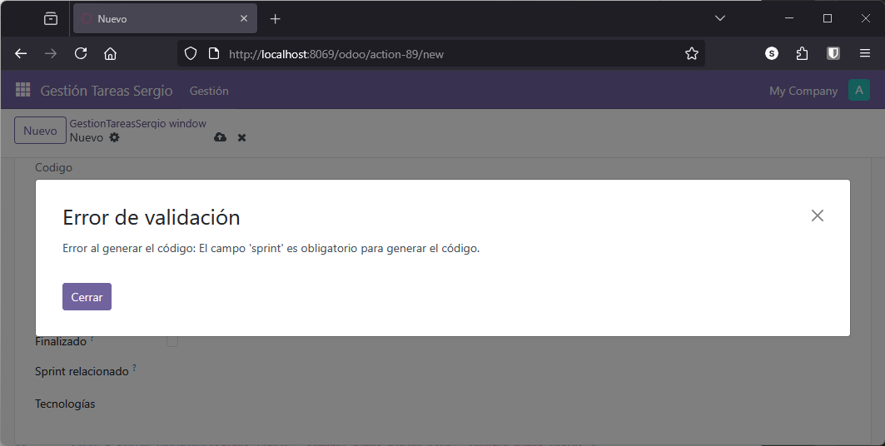
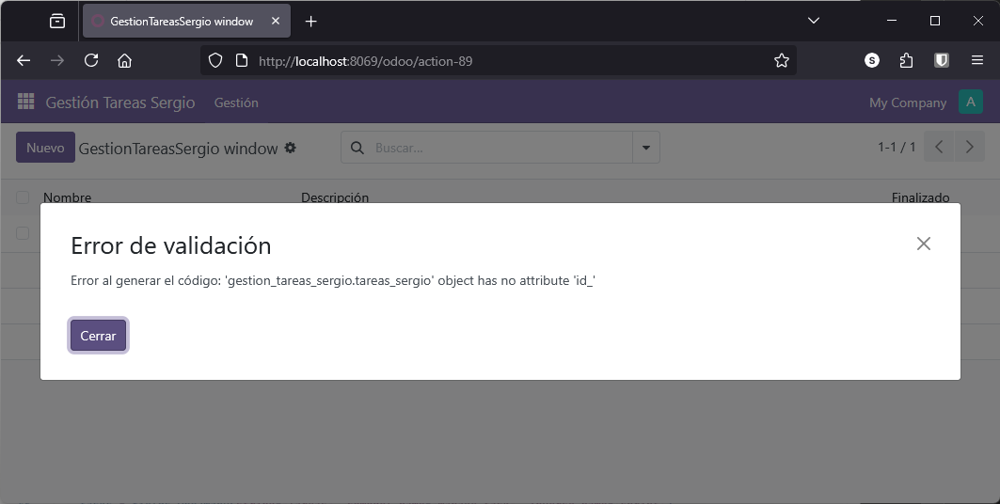

# Excepciones y Mensajes de Log

En este apartado abordaremos el manejo de excepciones y la gestión de mensajes de log en Odoo, aspectos fundamentales para garantizar la robustez y mantenibilidad del código. Aprenderemos a lanzar excepciones de manera controlada y a registrar información relevante en el log, utilizando los distintos niveles de severidad que ofrece el framework.

## Manejar Excepciones

El manejo adecuado de excepciones permite:

- Proporcionar mensajes claros al usuario cuando algo va mal
- Evitar que la aplicación se comporte de forma inesperada
- Facilitar la depuración durante el desarrollo
- Mantener la integridad de los datos
- Mejorar la experiencia de usuario

**Sin manejo de excepciones**:
```
Error interno del servidor
Traceback (most recent call last):
  File "/usr/lib/python3/...", line 1234, in method
    result = object.field.name
AttributeError: 'NoneType' object has no attribute 'name'
```

**Con manejo de excepciones**:
```
Validación fallida
Debe asignar un sprint antes de guardar la tarea.
```

## Excepciones en Odoo

Odoo proporciona excepciones específicas para diferentes situaciones. Para más información, consulta la [documentación oficial sobre gestión de errores](https://www.odoo.com/documentation/18.0/es/developer/reference/frontend/error_handling.html).

### Tipos de Excepciones Principales

| Excepción | Uso | Cuándo Usarla |
|-----------|-----|---------------|
| **ValidationError** | Errores de validación | Datos incorrectos o reglas de negocio violadas |
| **UserError** | Errores del usuario | Acciones no permitidas o datos faltantes |
| **AccessError** | Errores de permisos | Usuario sin permisos para la acción |
| **Warning** | Advertencias | Situaciones que no son errores pero requieren atención |

### Importar Excepciones

Primero, importa las excepciones necesarias al inicio de `models.py`:

```python
from odoo import models, fields, api
from odoo.exceptions import ValidationError, UserError
```

## Ejemplo Práctico: Validación en Campo Computado

Vamos a mejorar el método `_get_codigo` del modelo de Tareas para manejar correctamente los errores.

### Sin Manejo de Excepciones (Problemático)

```python
def _get_codigo(self):
    for tarea in self:
        # Si no hay sprint, esto fallará con un error críptico
        tarea.codigo = str(tarea.sprint.nombre).upper() + "_" + str(tarea.id)
```

**Problema**: Si `tarea.sprint` es `None` (no hay sprint asignado), obtendremos un error poco claro.

### Con Manejo de Excepciones (Correcto)

```python
def _get_codigo(self):
    for tarea in self:
        try:
            # Verificamos que tenga sprint asignado
            if not tarea.sprint:
                raise ValueError("El campo 'sprint' es obligatorio para generar el código.")
            
            # Generamos el código
            tarea.codigo = str(tarea.sprint.nombre).upper() + "_" + str(tarea.id)
            
        except Exception as e:
            raise ValidationError(f"Error al generar el código: {str(e)}")
```

<figure markdown="span" align="center">
  { width="75%" }
  <figcaption>Mensaje de excepción por validación</figcaption>
</figure>

**Ventajas**:

- Mensaje claro al usuario
- Control explícito del flujo de errores
- Fácil de depurar

### Provocar un Error para Pruebas

Si quieres probar el manejo de excepciones, puedes forzar un error. Por ejemplo, cambiando:

```python
tarea.codigo = str(tarea.sprint.nombre).upper() + "_" + str(tarea.id)
```

por (error intencional):

```python
tarea.codigo = str(tarea.sprint.nombre).upper() + "_" + str(tarea.id_)  # id_ no existe
```

Esto provocará un error que será capturado por el `except` y mostrado al usuario de forma controlada.

<figure markdown="span" align="center">
  { width="75%" }
  <figcaption>Mensaje de excepción capturando un error</figcaption>
</figure>

## Validaciones con Decorador `@api.constrains`

Otra forma de validar datos es usando el decorador `@api.constrains`, que se ejecuta automáticamente cuando cambian ciertos campos.

### Ejemplo: Validar Fechas de Sprint

```python
@api.constrains('fecha_ini', 'fecha_fin')
def _check_fechas(self):
    for sprint in self:
        if sprint.fecha_fin and sprint.fecha_ini:
            if sprint.fecha_fin < sprint.fecha_ini:
                raise ValidationError(
                    "La fecha de fin no puede ser anterior a la fecha de inicio."
                )
```

**Características**:

- Se ejecuta automáticamente al guardar
- Solo cuando cambian los campos especificados
- Lanza `ValidationError` si algo está mal

### Ejemplo: Validar Precio Positivo

```python
@api.constrains('precio')
def _check_precio(self):
    for plato in self:
        if plato.precio and plato.precio < 0:
            raise ValidationError("El precio debe ser mayor o igual a cero.")
```

## Mensajes de Log

El registro de mensajes en el log es esencial para el seguimiento y diagnóstico de la aplicación. Odoo utiliza el módulo estándar de Python `logging`.

### Niveles de Log

| Nivel | Uso | Cuándo Usarlo |
|-------|-----|---------------|
| **DEBUG** | Información detallada | Depuración durante desarrollo |
| **INFO** | Mensajes informativos | Eventos importantes del flujo normal |
| **WARNING** | Advertencias | Situaciones anormales pero no críticas |
| **ERROR** | Errores | Fallos que impiden completar una operación |
| **CRITICAL** | Errores críticos | Fallos graves que pueden detener el sistema |

### Configurar el Logger

Al inicio del archivo `models.py`, después de las importaciones:

```python
from odoo import models, fields, api
from odoo.exceptions import ValidationError
import logging

_logger = logging.getLogger(__name__)
```

**Explicación**:
- `logging.getLogger(__name__)`: Crea un logger con el nombre del módulo actual
- `_logger`: Variable para acceder al logger en todo el archivo
- Permite identificar fácilmente de dónde provienen los mensajes

### Usar el Logger

```python
def _get_codigo(self):
    _logger.info("Iniciando generación de códigos de tareas")
    
    for tarea in self:
        try:
            if not tarea.sprint:
                _logger.warning(f"Tarea {tarea.id} sin sprint asignado")
                raise ValueError("El campo 'sprint' es obligatorio.")
            
            tarea.codigo = str(tarea.sprint.nombre).upper() + "_" + str(tarea.id)
            _logger.debug(f"Código generado: {tarea.codigo}")
            
        except Exception as e:
            _logger.error(f"Error generando código para tarea {tarea.id}: {str(e)}")
            raise ValidationError(f"Error al generar el código: {str(e)}")
```

### Configurar Nivel de Log

Por defecto, Odoo solo muestra mensajes de nivel `INFO` o superior. Para ver mensajes `DEBUG`, modifica el archivo `odoo.conf`:

```ini
[options]
log_level = debug
```

Después de modificar el archivo, reinicia el servidor:

```bash
docker compose restart odoo_dev_dam
```

### Ver los Logs

Los logs se muestran en la consola o en archivos según tu configuración:

**Ver logs en tiempo real**:
```bash
docker logs odoo_dev_dam -f
```

**Filtrar logs de tu módulo**:
```bash
docker logs odoo_dev_dam -f | grep "gestion_tareas"
```

### Ejemplo de Salida de Logs

```
2024-11-24 10:23:45,123 12345 INFO gestion_tareas_sergio.models.tareas: Iniciando generación de códigos
2024-11-24 10:23:45,145 12345 WARNING gestion_tareas_sergio.models.tareas: Tarea 42 sin sprint asignado
2024-11-24 10:23:45,167 12345 ERROR gestion_tareas_sergio.models.tareas: Error generando código para tarea 42: El campo 'sprint' es obligatorio
```

!!!tip "Buenas Prácticas"

    **Usa Excepciones Específicas**

        ```python
        # Mal
        raise Exception("Error")

        # Bien
        raise ValidationError("La fecha de fin debe ser posterior a la fecha de inicio")
        ```

    **Mensajes Claros y Útiles**

        ```python
        # Mal
        raise ValidationError("Error en los datos")

        # Bien
        raise ValidationError(
            f"El sprint '{sprint.nombre}' ya ha finalizado. "
            "No se pueden añadir tareas a sprints finalizados."
        )
        ```

    **Registra Información Relevante**

        ```python
        # Registra antes de operaciones importantes
        _logger.info(f"Creando sprint: {sprint.nombre}, duración: {sprint.duracion} días")

        # Registra advertencias ante situaciones anormales
        if not tarea.descripcion:
            _logger.warning(f"Tarea {tarea.id} creada sin descripción")

        # Registra errores con contexto
        _logger.error(f"Fallo al calcular fecha_fin para sprint {sprint.id}: {str(e)}")
        ```

    **No Registres Información Sensible**

        ```python
        # Mal - expone contraseñas
        _logger.info(f"Usuario login: {user.login}, password: {user.password}")

        # Bien
        _logger.info(f"Usuario login exitoso: {user.login}")
        ```

    **Usa el Nivel Apropiado**

        ```python
        # DEBUG - solo en desarrollo
        _logger.debug(f"Valor de variable x: {x}")

        # INFO - eventos normales importantes
        _logger.info("Módulo inicializado correctamente")

        # WARNING - situación anormal pero no crítica
        _logger.warning("Base de datos sin datos de demo")

        # ERROR - operación fallida
        _logger.error("No se pudo conectar al servidor externo")
        ```

!!!example "Validaciones Comunes"

    **Validar Campos Obligatorios**

    ```python
    @api.constrains('nombre')
    def _check_nombre(self):
        for record in self:
            if not record.nombre or not record.nombre.strip():
                raise ValidationError("El nombre no puede estar vacío")
    ```

    **Validar Rangos Numéricos**

    ```python
    @api.constrains('duracion')
    def _check_duracion(self):
        for sprint in self:
            if sprint.duracion and (sprint.duracion < 1 or sprint.duracion > 30):
                raise ValidationError(
                    "La duración del sprint debe estar entre 1 y 30 días"
                )
    ```

    **Validar Unicidad**

    ```python
    @api.constrains('nombre')
    def _check_nombre_unico(self):
        for sprint in self:
            duplicado = self.search([
                ('nombre', '=', sprint.nombre),
                ('id', '!=', sprint.id)
            ])
            if duplicado:
                raise ValidationError(
                    f"Ya existe un sprint con el nombre '{sprint.nombre}'"
                )
    ```

---

## 🧩 Tu Turno: Gestor de Restaurante

Ahora aplicarás validaciones y logging al proyecto del restaurante.

### Objetivos y Contexto

Añadirás validaciones para asegurar la integridad de los datos y agregarás mensajes de log para facilitar la depuración y el seguimiento de operaciones.

Implementarás:
- Validaciones de campos obligatorios
- Validaciones de rangos numéricos
- Manejo de excepciones en campos computados
- Logging de operaciones importantes

### Pasos a Realizar

1. **Importar excepciones y logging**
    
    Al inicio de `models.py`:
    ```python
    from odoo.exceptions import ValidationError, UserError
    import logging
    
    _logger = logging.getLogger(__name__)
    ```

2. **Validar que el precio sea positivo**
    
    En el modelo Plato, crea un método con `@api.constrains('precio')` que:

    - Verifique que el precio sea mayor o igual a 0
    - Lance `ValidationError` si no cumple
    
    Pistas:

    - El mensaje debe ser claro para el usuario
    - Recuerda iterar sobre `self`

3. **Validar que el tiempo de preparación sea razonable**
    
    En el modelo Plato, valida que `tiempo_preparacion`:

    - Si existe, esté entre 1 y 240 minutos (4 horas)
    - Lance `ValidationError` con mensaje descriptivo

4. **Validar fechas del menú**
    
    En el modelo Menú, valida que:

    - Si existe `fecha_fin`, sea posterior a `fecha_inicio`
    - Use `@api.constrains` con ambos campos
    
    Pista: Compara fechas con operadores `<` y `>`

5. **Añadir manejo de excepciones al campo computado `codigo`**
    
    Modifica el método `_get_codigo` del modelo Plato:

    - Envuélvelo en un bloque `try-except`
    - Verifica que la categoría existe antes de usarla
    - Lanza `ValidationError` si algo falla
    
    Pista: Usa `if not plato.categoria` para verificar

6. **Añadir logging a operaciones importantes**
    
    En el modelo Plato, añade logs en momentos clave:

    - `_logger.debug()` al generar códigos
    - `_logger.info()` cuando se validan precios correctamente
    - `_logger.warning()` si un plato no tiene categoría
    - `_logger.error()` cuando falla una operación

7. **Validar que un menú tenga al menos un plato**
    
    En el modelo Menú, crea una validación que:

    - Verifique que el menú tenga al menos un plato cuando esté activo
    - Use `@api.constrains('platos', 'activo')`
    - Lance `ValidationError` si está activo sin platos
    
    Pista: Usa `len(menu.platos)` para contar platos

8. **Configurar nivel de log en debug**
    
    En `data/odoo_config/odoo.conf`, añade o modifica:
    ```ini
    log_level = debug
    ```

9. **Probar las validaciones**
    
    Intenta crear:

    - Un plato con precio negativo (debe fallar)
    - Un plato con tiempo de preparación de 300 minutos (debe fallar)
    - Un menú con fecha_fin anterior a fecha_inicio (debe fallar)
    - Un menú activo sin platos (debe fallar)

10. **Ver los logs generados**
    
    Ejecuta:
    ```bash
    docker logs odoo_dev_dam -f | grep "restaurante"
    ```
    
    Verifica que aparecen tus mensajes de log.

### Verificaciones y Resultado Esperado

Comprueba que:

- No puedes guardar un plato con precio negativo
- No puedes guardar un plato con tiempo de preparación fuera del rango
- No puedes guardar un menú con fechas inconsistentes
- No puedes activar un menú sin platos
- Los mensajes de error son claros y útiles para el usuario
- Los logs muestran información relevante de las operaciones

**Pruebas sugeridas**:

1. Intenta crear un plato con precio -5€ → *Debe mostrar error de validación*
2. Intenta crear un plato con tiempo de preparación de 500 minutos → *Error*
3. Crea un menú con fecha_fin antes de fecha_inicio → *Error*
4. Activa un menú vacío → *Error*
5. Verifica que en los logs aparece información de cada operación
