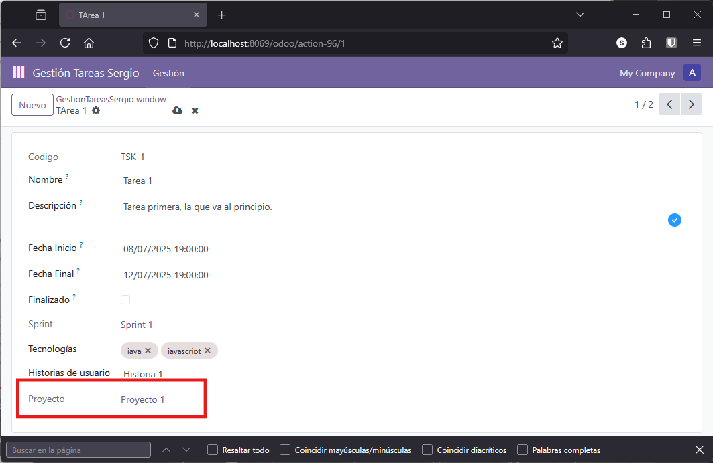

# Campos Computados Relacionales

En este apartado abordaremos el desarrollo de **campos computados relacionales** en Odoo, es decir, campos cuyo valor se calcula automáticamente basándose en información de modelos relacionados.

Los campos computados relacionales son fundamentales cuando necesitamos que ciertos datos se mantengan actualizados automáticamente en función de la información de otros modelos. Por ejemplo, permiten que un campo refleje siempre el estado más reciente de una relación, sin necesidad de intervención manual.

## Concepto de Campo Computado Relacional

Un **campo computado relacional** es aquel que:

- Se calcula automáticamente mediante código Python
- Su valor depende de datos de modelos relacionados
- Puede ser de tipo Many2one, One2many o Many2many
- Actualiza su valor cuando cambian los datos relacionados

**Ventajas**:

- Automatiza la gestión de relaciones complejas
- Reduce errores manuales
- Mantiene la coherencia de los datos
- Simplifica la lógica de negocio
- Mejora la experiencia de usuario

## Contexto: Ampliación del Modelo

Hasta ahora, nuestro módulo cuenta con:

**Modelos existentes**:

- **Tarea**
- **Sprint**
- **Tecnología**

**Relaciones existentes**:

- Tarea → Sprint (Many2one)
- Sprint → Tareas (One2many)
- Tarea ↔ Tecnología (Many2many)

Ahora vamos a ampliar el modelo siguiendo la metodología Scrum:

!!! note "Metodología Ágil Scrum"
    En la metodología **Scrum**, un **proyecto** se organiza en ciclos cortos llamados **sprints**, durante los cuales se desarrollan incrementos funcionales del producto. El trabajo se descompone en **historias de usuario**, que representan funcionalidades desde la perspectiva del usuario final. Cada **historia de usuario** se divide en **tareas** más pequeñas que son asignadas al equipo durante el sprint.
    
    De este modo, Scrum facilita la planificación iterativa, la adaptación continua y la entrega incremental de valor.
    
    Más info: [Flowlu: Guía para Proyectos Ágiles](https://www.flowlu.com/es/blog/project-management/agile-planning-step-by-step-guide-for-agile-projects-and-sprints/)

## Nuevos Modelos y Relaciones

Vamos a añadir dos nuevos modelos:

### Modelo Proyecto

Representa un proyecto de software.

**Campos**:

- `nombre`: Nombre del proyecto
- `descripcion`: Descripción del proyecto
- `historias`: Relación One2many con historias de usuario. *"Cada historia tiene un proyecto, pero un proyecto tiene muchas historias."*

**Relación con Historias**:
```
Proyecto (1) ----< Historias (N)
```

### Modelo Historia de Usuario

Representa una funcionalidad desde la perspectiva del usuario.

**Campos**:

- `nombre`: Nombre de la historia
- `descripcion`: Descripción detallada
- `proyecto`: Relación Many2one con proyecto. *"Un proyecto tiene muchas historias y cada historia tiene un proyecto"*
- `tareas`: Relación One2many con tareas. *"Una historia tiene muchos tareas y cada tarea tiene un proyecto"*

**Relaciones**:
```
Proyecto (1) ----< Historia (N) ----< Tarea (N)
```

### Modificación del Modelo Tarea

Añadimos una nueva relación:

- `historia`: Relación Many2one con historia de usuario. *"Una tarea pertenece a una historia de usuario y una historia tiene muchas tareas"*


### Modificación del Modelo Sprint

Añadimos una nueva relación:

- `proyecto`: Relación Many2one con proyecto. *"Un proyecto se divide en varios Sprints"*

## Implementación de los Nuevos Modelos

??? example "models.py - Nuevos modelos"
    ```python
    # PROYECTO
    class proyectos_sergio(models.Model):
        _name = 'gestion_tareas_sergio.proyectos_sergio'
        _description = 'Modelo de Proyectos'

        name = fields.Char(
            string="Nombre", 
            required=True, 
            help="Nombre del proyecto")
        
        descripcion = fields.Text(
            string="Descripción", 
            help="Descripción del proyecto")
        
        historias = fields.One2many(
            'gestion_tareas_sergio.historias_sergio', 
            'proyecto', 
            string='Historias de Usuario')

    # HISTORIA DE USUARIO
    class historias_sergio(models.Model):
        _name = 'gestion_tareas_sergio.historias_sergio'
        _description = 'Modelo de Historias de Usuario'

        name = fields.Char(
            string="Nombre", 
            required=True, 
            help="Nombre de la historia")
        
        descripcion = fields.Text(
            string="Descripción", 
            help="Descripción de la historia")
        
        proyecto = fields.Many2one(
            'gestion_tareas_sergio.proyectos_sergio', 
            string='Proyecto')
        
        tareas = fields.One2many(
            'gestion_tareas_sergio.tareas_sergio', 
            'historia', 
            string='Tareas')

    # TAREA (modificación)
    class tareas_sergio(models.Model):
        _name = 'gestion_tareas_sergio.tareas_sergio'
        # ... campos existentes ...
        
        historia = fields.Many2one(
            'gestion_tareas_sergio.historias_sergio', 
            string='Historia de Usuario')

    # SPRINT (modificacion)
    class sprints_sergio(models.Model):
        _name = 'gestion_tareas_sergio.sprints_sergio'
        # ... campos existentes ...

        proyecto = fields.Many2one(
            'gestion_tareas_sergio.proyectos_sergio', 
            string="Proyecto")    

    ```

!!! tip "Recuerda : Relación One2many"
    Cuando defines una relación One2many en un modelo, el segundo parámetro debe ser el nombre del campo Many2one en el modelo relacionado. Por ejemplo:
    ```python
    # En Proyecto
    historias = fields.One2many('historias_sergio', 'proyecto', ...)
    # Significa: busca en el modelo historias_sergio un campo llamado 'proyecto'
    ```

## Configuración Adicional

### Permisos de Seguridad

Añade en `security/ir.model.access.csv` las líneas necesarias para permite acceso a los nuevos modelos.

??? example "security/ir.model.access.csv - Nuevos modelos. Intenta hacerlo sin mirar"
    ```csv
    access_proyectos,acceso_proyectos,model_gestion_tareas_sergio_proyectos_sergio,base.group_user,1,1,1,1
    access_historias,acceso_historias,model_gestion_tareas_sergio_historias_sergio,base.group_user,1,1,1,1
    ```

### Vistas y Menús

Añade en `views/views.xml` los menús y acciones necesarios:

??? example "views/views.xml - Nuevos menús. Intenta hacerlo sin mirar"
    ```xml
    <!-- Actions para los nuevos modelos -->
    <record model="ir.actions.act_window" id="gestion_tareas_sergio.proyectos_action_window">
        <field name="name">Proyectos</field>
        <field name="res_model">gestion_tareas_sergio.proyectos_sergio</field>
        <field name="view_mode">list,form</field>
    </record>

    <record model="ir.actions.act_window" id="gestion_tareas_sergio.historias_action_window">
        <field name="name">Historias de Usuario</field>
        <field name="res_model">gestion_tareas_sergio.historias_sergio</field>
        <field name="view_mode">list,form</field>
    </record>


    <!-- Menús -->
    <!-- Nuevas Categorias -->
    <menuitem name="Proyectos" 
              id="gestion_tareas_sergio.proyectos" 
              parent="gestion_tareas_sergio.menu_root" 
              sequence="10"/>
    <menuitem name="Historias" 
              id="gestion_tareas_sergio.historias" 
              parent="gestion_tareas_sergio.menu_root" 
              sequence="20"/>
    <!-- Nuevas acciones -->
    <menuitem name="Listado" 
              id="gestion_tareas_sergio.proyectos_list" 
              parent="gestion_tareas_sergio.proyectos"
              action="gestion_tareas_sergio.proyectos_action_window"/>
    <menuitem name="Listado" 
              id="gestion_tareas_sergio.historias_list" 
              parent="gestion_tareas_sergio.historias"
              action="gestion_tareas_sergio.historias_action_window"/>
    ```
    Observa que en los `<menuitem>` se ha introducido un valor para `sequence` para asegurar el orden correcto

## Campo Computado Relacional Many2one

Supongamos que en las tareas queremos asignar automáticamente el spring activo, pero basándonos en el proyecto de su historia de usuario

Esto lo implementaremos mediante un campo al que llamaremos `spring_computado` en el modelo tarea, que 
Ahora implementaremos un campo computado que asigna automáticamente una tarea al sprint activo, basándose en el proyecto de su historia de usuario.

**Objetivo**: Queremos que cada tarea se asigne automáticamente al sprint que:

- Pertenece al mismo proyecto que la historia de usuario
- Está actualmente abierto (fecha de fin posterior a hoy)

Recapitulando vamos a obtener las siguientes relaciones:

```textplain
PROYECTO (1) 
   └──< HISTORIA (N) 
          └──< TAREA (N)
                 ├──< SPRINT (Computado/Relacionado)
                 └──< TECNOLOGÍAS (M:N)
```

!!! example "Implementación"
    ```python
    from datetime import datetime

    class tareas_sergio(models.Model):
        _name = 'gestion_tareas_sergio.tareas_sergio'
        # ... campos existentes ...


        # Quitamos la anterior relación
        # sprint = fields.Many2one(
        #     'gestion_tareas_sergio.sprints_sergio', 
        #     string='Sprint relacionado', 
        #     ondelete='set null', 
        #     help='Sprint al que pertenece esta tarea')

        # Lo hacemos computado
        sprint = fields.Many2one(
            'gestion_tareas_sergio.sprints_sergio', 
            string='Sprint Activo', 
            compute='_compute_sprint', 
            store=True)    

        @api.depends('historia', 'historia.proyecto')
        def _compute_sprint(self):
            for tarea in self:
                tarea.sprint = False
                
                # Verificar que la tarea tiene historia y proyecto
                if tarea.historia and tarea.historia.proyecto:
                    # Buscar sprints del proyecto
                    sprints = self.env['gestion_tareas_sergio.sprints_sergio'].search([
                        ('proyecto.id', '=', tarea.historia.proyecto.id)
                    ])
                    
                    # Buscar el sprint activo (fecha_fin > ahora) 
                    # de entre todos los sprints asociados al proyecto
                    # en teoría solo hay un sprint activo, por eso es el que no ha vencido
                    for sprint in sprints:
                        if (isinstance(sprint.fecha_fin, datetime) and 
                                sprint.fecha_ini <= datetime.now() and   
                                sprint.fecha_fin > datetime.now()):
                            tarea.sprint = sprint.id
                            break
    ```

    Cuidado, debemos importar la función datetime en el módulo datetime


!!!note "Explicación Detallada"

    **1. Definición del campo**:
    ```python
    sprint = fields.Many2one(
        'gestion_tareas_sergio.sprints_sergio',  # Modelo destino
        compute='_compute_sprint',                 # Método que lo calcula
        store=True)                                # Se almacena en BD
    ```

    **2. Decorador de dependencias**:
    ```python
    @api.depends('historia', 'historia.proyecto')
    ```

    - Se recalcula cuando cambia `historia`
    - O cuando cambia el `proyecto` de la `historia`
    - Uso de notación punto para dependencias anidadas

    **3. Lógica del método**:

    - Itera sobre todas las tareas
    - Inicializa el sprint a `False`
    - Verifica que tenga historia y proyecto
    - Busca todos los sprints del proyecto
    - Asigna el primer sprint que esté activo (fecha_fin > ahora >= fecha_ini)

    **4. Búsqueda con `self.env`**:
    ```python
    sprints = self.env['modelo'].search([dominio])
    ```

    - `self.env`: Acceso al entorno de Odoo
    - `search()`: Busca registros que cumplan el dominio
    - Dominio: lista de tuplas (campo, operador, valor)

## Campo Computado Relacional Many2many

Ahora implementaremos un campo que `tecnologías` en las *historias de usuario* que recopilará automáticamente todas las tecnologías utilizadas en las tareas asociadas a una historia de usuario.

**Objetivo**: Queremos que cada historia de usuario muestre automáticamente:

- Todas las tecnologías de todas sus tareas
- Sin duplicados
- Actualizado automáticamente

!!! example "Implementación"

    ```python
    class historias_sergio(models.Model):
        _name = 'gestion_tareas_sergio.historias_sergio'
        # ... campos existentes ...
        
        tecnologias = fields.Many2many(
            "gestion_tareas_sergio.tecnologias_sergio", 
            compute="_compute_tecnologias", 
            string="Tecnologías Utilizadas")

        @api.depends('tareas', 'tareas.rel_tecnologias')
        def _compute_tecnologias(self):
            for historia in self:
                tecnologias_acumuladas = self.env['gestion_tareas_sergio.tecnologias_sergio']
                
                # Recorrer todas las tareas de la historia
                for tarea in historia.tareas:
                    # Sumar (concatenar) tecnologías de cada tarea
                    tecnologias_acumuladas = tecnologias_acumuladas + tarea.rel_tecnologias
                
                # Asignar el resultado
                historia.tecnologias = tecnologias_acumuladas
    ```

!!!note "Explicación Detallada"

    **1. Definición del campo**:
    ```python
    tecnologias = fields.Many2many(
        "gestion_tareas_sergio.tecnologias_sergio",
        compute="_compute_tecnologias")
    ```

    - No lleva `store=True` porque es Many2many computado
    - Se recalcula dinámicamente

    **2. Dependencias anidadas**:
    ```python
    @api.depends('tareas', 'tareas.rel_tecnologias')
    ```

    - Se recalcula cuando cambian las tareas
    - O cuando cambian las tecnologías de cualquier tarea

    **3. Lógica del método**:

    - Inicializa un recordset vacío de tecnologías
    - Itera sobre todas las tareas de la historia
    - Suma (concatena) las tecnologías de cada tarea
    - Asigna el resultado final

    **4. Concatenación de recordsets**:

    ```python
    recordset1 + recordset2  # Unión
    ```

    - Los recordsets en Odoo se pueden sumar
    - Automáticamente elimina duplicados
    - Mantiene el orden

## Campos Related (Relacionados No Computados)

A veces necesitamos mostrar un campo que ya existe en un modelo relacionado, sin duplicar datos ni calcular nada.

Supongamos que en la **tarea**, donde hemos seleccionado la **historia** que esta implementando, queremos mostrar el **proyecto** al que esta asociada dicha **historia** y por tanto la **tarea**, pero:

- La tarea no tiene relación directa con proyecto
- La tarea → historia → proyecto
- No queremos duplicar la relación en BD

Y la ***solución***: **Campo Related**

!!! example "Implementación"

    ```python
    class tareas_sergio(models.Model):
        _name = 'gestion_tareas_sergio.tareas_sergio'
        # ... campos existentes ...
        
        historia = fields.Many2one('gestion_tareas_sergio.historias_sergio', string='Historia')
        
        proyecto = fields.Many2one(
            'gestion_tareas_sergio.proyectos_sergio',
            string='Proyecto',
            related='historia.proyecto',
            readonly=True)
    ```

**Ventajas del Campo Related**:

- No requiere código Python
- No se almacena en BD (no duplica datos)
- Se actualiza automáticamente
- Sintaxis muy simple

**Limitaciones del Campo Related**:

- Solo lectura (generalmente)
- No puede tener lógica personalizada
- Solo sigue cadenas de relaciones existentes

**Sintaxis**:
```python
campo = fields.Tipo(
    related='campo_relacion.campo_destino',
    readonly=True)
```

**Uso en Vistas**

Simplemente añádelo a la vista como cualquier otro campo:

```xml
<field name="proyecto"/>
```

<figure markdown="span" align="center">
  { width="75%" }
  <figcaption>Campo related mostrando el proyecto automáticamente</figcaption>
</figure>

Cuando selecciones una historia de usuario, el campo proyecto se actualizará automáticamente sin que el usuario pueda modificarlo.

## Resumen de Conceptos

Tipos de Campos Relacionales: 

| Tipo | Almacenado | Requiere Código | Uso |
|------|-----------|----------------|-----|
| **Relacional simple** | Sí | No | Relación directa entre modelos |
| **Computado relacional** | Opcional | Sí | Cálculo basado en otros modelos |
| **Related** | No | No | Mostrar campo de modelo relacionado |

Cuándo Usar Cada Tipo: 

**Campo relacional simple** (Many2one, One2many, Many2many):

- Relación directa entre modelos
- El usuario establece manualmente la relación

**Campo computado relacional**:

- La relación se determina automáticamente
- Basada en lógica de negocio compleja
- Ejemplo: Asignar sprint según fechas y proyecto

**Campo related**:

- Mostrar información de modelo relacionado
- Sin duplicar datos
- Solo lectura
- Ejemplo: Mostrar proyecto desde tarea→historia→proyecto

!!! tip "Buenas Prácticas"

    **1. Dependencias Completas**

    ```python
    # Mal - falta dependencia anidada
    @api.depends('historia')

    # Bien - incluye dependencia anidada
    @api.depends('historia', 'historia.proyecto')
    ```

    **2. Inicializar Siempre**

    ```python
    def _compute_campo(self):
        for record in self:
            record.campo = False  # Inicializar antes de calcular
            # ... lógica de cálculo
    ```

    **3. Verificar Existencia**

    ```python
    if tarea.historia and tarea.historia.proyecto:
        # Ahora es seguro acceder a proyecto
    ```

    **4. Usar `self.env` para Búsquedas**

    ```python
    # Buscar en otro modelo
    registros = self.env['nombre.modelo'].search([dominio])
    ```

    **5. Store Solo Cuando Sea Necesario**

    ```python
    # Con store - para búsquedas y filtros
    campo = fields.Many2one(..., compute='...', store=True)

    # Sin store - para cálculos simples
    campo = fields.Many2many(..., compute='...')
    ```

---

## 🧩 Tu Turno: Gestor de Restaurante

Ahora ampliarás el proyecto del restaurante con nuevos modelos y campos computados relacionales.

### Objetivos y Contexto

Vamos a expandir el modelo añadiendo:

- **Categorías de Platos**: Para organizar los platos (Entrantes, Principales, Postres)
- **Chefs**: Personas que preparan los platos
- Campos computados que relacionen estos nuevos modelos

Implementarás:

- Campo computado Many2one: Asignar chef especializado según categoría
- Campo computado Many2many: Ingredientes usados en una categoría
- Campo related: Mostrar categoría desde menú→platos→categoría

### Pasos a Realizar

1. **Crear modelo Categoría**
    
    Campos necesarios:

    - `nombre`: Char, obligatorio
    - `descripcion`: Text
    - `platos`: One2many a platos
    
    Pistas:

    - El campo One2many necesita el nombre del campo Many2one inverso
    - Ejemplo: `fields.One2many('modelo.plato', 'categoria', ...)`

2. **Crear modelo Chef**
    
    Campos necesarios:

    - `nombre`: Char, obligatorio
    - `especialidad`: Many2one a Categoría
    - `platos_asignados`: One2many a platos
    
    Pistas:

    - La especialidad indica en qué tipo de platos es experto el chef

3. **Modificar modelo Plato**
    
    Añadir campos:

    - `categoria`: Many2one a Categoría (reemplaza el Selection)
    - `chef`: Many2one a Chef
    
    Pistas:

    - Recuerda actualizar las vistas para usar el nuevo campo

4. **Actualizar permisos**
    
    Añade en `ir.model.access.csv`:

    ```csv
    access_categoria,acceso_categoria,model_..._categoria,base.group_user,1,1,1,1
    access_chef,acceso_chef,model_..._chef,base.group_user,1,1,1,1
    ```

5. **Crear vistas y menús para los nuevos modelos**
    
    Estructura sugerida:
    ```
    Gestión Restaurante
    ├── Menú
    │   ├── Platos
    │   ├── Menús
    │   ├── Ingredientes
    │   ├── Categorías
    │   └── Chefs
    ```

6. **Actualizar vista de Plato**
    
    Añade los nuevos campos:

    - `categoria` (en lugar del Selection anterior)
    - `chef_especializado`
    
    Elimina el campo `categoria` tipo Selection si lo tenías.

7. **Campo computado Many2one: Asignar chef automáticamente**
    
    En el modelo Plato, crea un campo `chef_especializado` que:

    - Sea de tipo Many2one a Chef
    - Se compute con método `_compute_chef_especializado`
    - Se almacene en BD (`store=True`)
    - Dependa del campo `categoria`
    
    La lógica debe:

    - Buscar un chef cuya especialidad coincida con la categoría del plato
    - Asignar el primer chef encontrado
    
    Pistas:

    - Usa `self.env['modelo.chef'].search([dominio], limit=1)`
    - Dominio: `[('especialidad', '=', plato.categoria.id)]`
    - `limit=1`, porque al ser una relación Many2one, solo necesitamos un chef (en caso se haber más), así que solo seleccionamos el primero.
    - No olvides verificar que existe categoría

8. **Campo computado Many2many: Ingredientes por categoría**
    
    En el modelo Categoría, crea un campo `ingredientes_comunes` que:

    - Sea de tipo Many2many a Ingrediente
    - Se compute con método `_compute_ingredientes_comunes`
    - Muestre todos los ingredientes usados en platos de esa categoría
    
    La lógica debe:

    - Iterar sobre todos los platos de la categoría
    - Acumular todos los ingredientes
    
    Pistas:

    - Inicializa un recordset vacío: `self.env['modelo.ingrediente']`
    - Suma recordsets: `acumulado = acumulado + plato.rel_ingredientes`
    - Depende de: `@api.depends('platos', 'platos.rel_ingredientes')`

9. **Campo related: Especialidad del chef desde Plato**
    
    En el modelo Plato, añade un campo `especialidad_chef` que:
íia
    - Use `related` para mostrar las categorías de todos los platos del menú
    - Sea readonly
    
    Pistas:

    - Debes obtener la especialidad del chef


10. **Probar el comportamiento**
    
    - Crea categorías: "Entrantes", "Principales", "Postres"
    - Crea chefs con especialidades
    - Crea platos con categorías
    - Verifica que se asigna el chef automáticamente
    - Verifica que las categorías muestran sus ingredientes comunes

### Verificaciones y Resultado Esperado

Comprueba que:

- Al asignar una categoría a un plato, se asigna automáticamente un chef especializado
- Las categorías muestran todos los ingredientes usados en sus platos
- Desde un menú puedes ver las categorías de todos sus platos (campo related)
- Los campos computados se actualizan cuando cambian los datos relacionados

!!!example "Datos de prueba sugeridos"

    Crea estos datos para probar:

    **Categorías**:

    1. Entrantes
    2. Principales
    3. Postres

    **Chefs**:

    1. Juan - Especialidad: Entrantes
    2. María - Especialidad: Principales
    3. Pedro - Especialidad: Postres

    **Platos**:
    
    1. Ensalada César - Categoría: Entrantes → Chef asignado: Juan
    2. Pizza Margarita - Categoría: Principales → Chef asignado: María
    3. Tiramisú - Categoría: Postres → Chef asignado: Pedro

    Verifica que el chef se asigna automáticamente al seleccionar la categoría.

