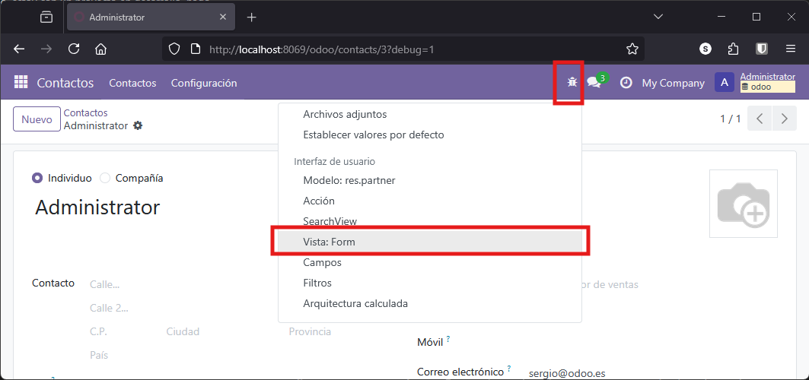
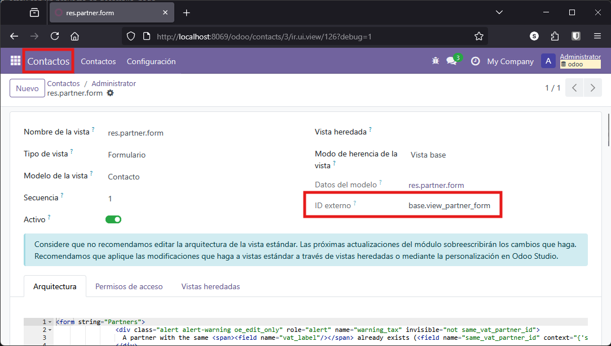
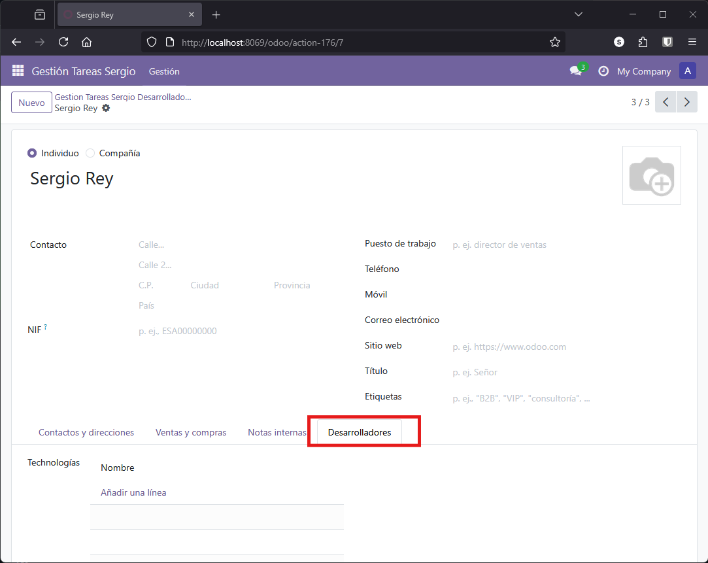

# Herencias

La herencia es uno de los mecanismos más potentes de Odoo para extender funcionalidad existente sin modificar el código original. Permite reutilizar y adaptar modelos, vistas y lógica de negocio de módulos estándar, facilitando la evolución y el mantenimiento de las aplicaciones desarrolladas sobre la plataforma.

En este apartado veremos los principales tipos de herencia disponibles en Odoo y trabajaremos un ejemplo práctico completo de herencia de clase, extendiendo el modelo de contactos para gestionar desarrolladores en nuestro sistema de proyectos.

## Tipos de Herencia en Odoo

Según la [documentación oficial de Odoo](https://www.odoo.com/documentation/18.0/es/developer/reference/backend/orm.html#inheritance-and-extension), existen varios tipos de herencia:

**Herencia de clase (clásica)**

Permite extender un modelo existente añadiendo nuevos campos o métodos, o sobrescribiendo los ya existentes. Los datos se almacenan en la misma tabla que el modelo original, y las vistas existentes pueden mostrar los nuevos campos añadidos. Es el tipo de herencia más utilizado en Odoo.

**Herencia por prototipo**

Se crea un nuevo modelo que hereda los atributos del modelo original, pero los datos se almacenan en tablas diferentes. Este tipo de herencia es útil cuando se requiere crear variantes de un modelo base, manteniendo la independencia de los datos.

**Herencia por delegación**

Se crea un nuevo modelo que contiene una relación con el modelo original. Cada vez que se crea un registro en el modelo hijo, se crea también un registro asociado en el modelo padre, sincronizando los datos entre ambos. Este enfoque permite implementar herencia múltiple y mantener la separación de datos en tablas distintas.

<figure markdown="span" align="center">
  { width="85%" }
  <figcaption>Tipos de herencia en Odoo</figcaption>
</figure>

En Odoo, la **herencia de clase** es **la más utilizada**, ya que permite ampliar o adaptar modelos existentes a nuevas necesidades sin duplicar información ni perder compatibilidad con las vistas y funcionalidades ya implementadas.

## Situación Actual en los Modelos del Proyecto

Actualmente, el módulo de gestión de proyectos cuenta con los siguientes modelos:

- **Proyecto**: Representa un proyecto y está relacionado con varias historias
- **Historia**: Cada historia puede contener varias tareas
- **Tarea**: Las tareas están asociadas a las tecnologías necesarias para su desarrollo, pertenecen a una historia y se desarrollan en un sprint
- **Sprint**: Relacionado con las tareas que se desarrollan durante el mismo
- **Tecnología**: Representa las tecnologías empleadas en las distintas tareas

**Elemento faltante**: Hasta el momento, no se ha implementado ningún modelo para representar a las personas involucradas en el desarrollo (desarrolladores) ni a los clientes relacionados con los proyectos. Es momento de abordar este aspecto, pero ayudándonos de la herencia.

## Herencia de Clase en Odoo

Odoo incluye un modelo nativo llamado `res.partner` que almacena todos los contactos del sistema: empleados, compañías, clientes, proveedores, etc. Crear un modelo completamente nuevo para desarrolladores no tiene sentido, ya que un desarrollador es, en esencia, un tipo de contacto.

La solución óptima es extender el modelo `res.partner` mediante herencia de clase, añadiendo los campos y funcionalidades específicas que necesitamos para gestionar desarrolladores.

### Implementación del Modelo

Para crear un modelo que represente a los desarrolladores y permita asociarles tecnologías, se define una clase que hereda de `res.partner` utilizando el atributo `_inherit`. De este modo, cualquier campo añadido en la nueva clase se incorporará directamente a la tabla de `res.partner`.

Por ejemplo, para asociar tecnologías a los desarrolladores, se añade un campo `Many2many` relacionado con el modelo de tecnologías:

!!! example "models.py"

    ```python
    # DESARROLLADOR, Hereda de res.partner
    class desarrollador_sergio(models.Model):
        _name = 'res.partner'
        _inherit = 'res.partner'                                    # Hereda toda la estructura de contactos

        tecnologia_ids = fields.Many2many(
            comodel_name='gestion_tareas_sergio.tecnologias_sergio',# Modelo destino
            relation='rel_dev_tec',                                 # Tabla intermedia
            column1='desarrollador_id',                             # Columna para esta clase
            column2='tecnologia_id',                                # Columna para tecnologías
            string="Tecnologías"
        )
    ```

!!! example "models.py - Tecnologías"

    ```python
    # TECNOLOGIAS   
    class tecnologias_sergio(models.Model):
        _name = 'gestion_tareas_sergio.tecnologias_sergio'
        ....

        # Nueva relación con desarrolladorees
        desarrolladores_ids = fields.Many2many(
            comodel_name='res.partner',                             # Modelo destino
            relation='rel_dev_tec',                                 # Tabla intermedia
            column1='tecnologia_id',                                # Columna para tecnologías
            column2='desarrollador_id',                             # Columna para esta clase
            string="Tecnologías")


    ```

**Aspectos clave de la implementación**:


- `_name`: No es imprescindible especificarlo al heredar, pero es común incluirlo por claridad y hábito
- `_inherit`: Fundamental, indica el modelo del que heredamos (`res.partner`)
- `tecnologia_ids`: Nuevo campo Many2many que se añade al modelo heredado

Con esta implementación, no se crea una nueva tabla para desarrolladores. El campo `tecnologias` se añade directamente a la tabla `res_partner` existente.


!!! Tip "Estructura Many2many en Odoo"
    Para configurar un campo Many2many seguimos este esquema de 4 parámetros:

    ```Python
    campo_ids = fields.Many2many(
        'modelo.destino',      # 1. ¿Con qué modelo conecto?
        'tabla_intermedia',    # 2. Nombre de la tabla física en la BD
        'mi_id',               # 3. Mi ID en esa tabla
        'su_id',               # 4. El ID del otro modelo en esa tabla
        string="Etiqueta"
    )
    ```

### Verificación en Base de Datos

Tras actualizar el módulo, podemos verificar que el nuevo campo se ha añadido correctamente al modelo `res.partner`. Usa cualquiera de los métodos descritos en el apartado [Revisión de la base de datos](6_1_creacion_modelo_basico.md#revision-de-la-base-de-datos) del primer ejemplo.

Desde el entorno de Odoo en modo desarrollo, ve a **Ajustes → Técnico → Estructura de la base de datos → Modelos** y busca `res.partner`. Si buscas `desarrollador` no lo encontrarás, ya que no es un modelo independiente.

<figure markdown="span" align="center">
  { width="85%" }
  <figcaption>Nuevo campo añadido mediante herencia al modelo res.partner</figcaption>
</figure>

El modelo `res.partner` contiene muchos campos adicionales de diferentes módulos instalados. Esto es precisamente la potencia de la herencia: múltiples módulos pueden extender el mismo modelo sin interferir entre sí.

### Acceso Mediante Menú

Para facilitar el acceso a los desarrolladores desde nuestro módulo, creamos una acción y una opción de menú que apunten al modelo `res.partner`:

!!! Example "views.xml"
    ```xml
    <!-- Nueva acción -->
    <record model="ir.actions.act_window" id="desarrolladores_action_window">
        <field name="name">Desarrolladores</field>
        <field name="res_model">res.partner</field>
        <field name="view_mode">list,form</field>
    </record>

    <!-- Nuevo menú -->
    <menuitem name="Desarrolladores" 
              id="gestion_tareas_sergio.gestion_desarrolladores" 
              action="desarrolladores_action_window"
              parent="gestion_tareas_sergio.menu_root" 
              sequence="50"/>
    ```

Con esta configuración básica, al acceder al menú "Desarrolladores" veremos todos los contactos del sistema, no solo los desarrolladores. Necesitamos personalizar las vistas y añadir filtros para mostrar únicamente los contactos que nos interesan.

## Herencia y Modificación de Vistas

Para visualizar correctamente los desarrolladores, debemos heredar y modificar las vistas existentes del modelo `res.partner`. Esto nos permite añadir nuestros campos personalizados sin crear vistas desde cero.

### Heredar el Formulario de Contactos

Vamos a heredar el formulario de `res.partner` y añadir una nueva pestaña para mostrar el campo de tecnologías. Usaremos `mode="primary"` para crear una vista alternativa sin sobrescribir la original.

En este punto es esencial comprender que por una parte estamos trabajando sobre un modelo que ya existe, por lo que debemos redefinir sus vistas y adaptarlas a nuestras necesidades y **nunca tocar las vistas del modelo heredado**.

Por lo tanto, lo que debemos es separa por una parte la vista del listado y la vista del formulario para poder trabajar con ellas de forma independiente, y para ello **necesitamos conocer cómo se llaman estas vistas**. Para ello, entrando en el **modo desarrollador** pulsamos sobre la `cucarachita` de la barra superior estando en el listado que queremos investigar y pulsamos sobre **Vista: List**

<figure markdown="span" align="center">
  { width="80%" }
  <figcaption>Acceso a la información de modelos y vistas</figcaption>
</figure>

Ahí podemos comprobar las características de este listado, especialmente los datos que más nos interesan:

1. Nombre de la vista
2. ID externo: Este se asociará a una nueva propiedad llamada `view_id` de la vista para indicar que se usa esa vista en concreto

<figure markdown="span" align="center">
  { width="80%" }
  <figcaption>Acceso a la información listado res.partner.list</figcaption>
</figure>

y con estos datos, podemos añadir en nuestro fichero `views.xml` un acceso explicito a la vista en concreto:

!!! example "views.xml"

    Añadimos el siguiente código para determinar que vamos a invocar el listado concreto"

    ```xml
    <record model="ir.actions.act_window.view" id="action_view_desarrollador_list">
        <field name="sequence" eval="1"/>
        <field name="view_mode">list</field>
        <field name="view_id" ref="base.view_partner_tree"/>
        <field name="act_window_id" ref="desarrolladores_action_window"/>
    </record>
    ```
donde: 

- `sequence`: Orden de aplicación (1 = primero)
- `view_mode`: Tipo de vista (list)
- `view_id`: Referencia a la vista de árbol estándar de contactos
- `act_window_id`: Enlace con la acción principal

Ahora repetimos la misma operación para el formulario. Debemos averiguar el `view_id` para indicar que cuando queremos mostrar un formulario, queremos mostrar ese en concreto. 

<figure markdown="span" align="center">
  { width="80%" }
  <figcaption>Acceso a la información listado res.partner.form</figcaption>
</figure>

!!! example "views.xml"

    ```xml
    <record model="ir.actions.act_window.view" id="action_view_desarrollador_form">
      <field name="sequence" eval="2"></field>
      <field name="view_mode">form</field>
      <field name="view_id" ref="base.view_partner_form"></field>
      <field name="act_window_id" ref="gestion_tareas_sergio.desarrollador"></field>
    </record>
    ```


Esto tiene sentido porque estamos indicando de forma explicita el formulario que se utiliza, en un primer paso a modo de prueba, utilizaremos el mismo que los contactos básicos de odoo, pero después **crearemos uno nuevo** y le diremos que lo vamos a utilizar. Debemos tener en cuenta que hasta ahora para un modelo dado, teníamos una vista para el formulario y otra para la vista, pero ahora al heredar, para el mismo modelo tenemos varias vistas del formulario y debemos indicar el que nos interesa.


Si probamos nuestra aplicación, de momento no hay ningún cambio, pero ha llegado el momento de **modificar el formulario, sin afectar al original**. Para ello, como hemos hemos hecho siempre, definimos una nueva vista, que en este caso servirá para **modificar la vista del formulario** de `res.partner`. 

Comenzamos reescribiendo como siempre, pero añadiendo nuevas propiedades: 

- `inherit_it`: que nos indica de qué vista vamos a heredar
- `mode`: que tendrá el valor `primary` e indicará que vamos a hacer cambios que no van a afectar a la vista heredada, solo a la nueva vista que estamos definiendo.

Además tenemos que tener en cuenta que ahora el `action` que lanza el formulario es la nueva vista que estamos creando, en este caso `gestion_tareas_sergio_view_partner_form_inherit`

Recapitulemos con todo el código completo para las vista de los desarrolladores.

!!! example "views.xml"

    ```xml

    <!-- DESAROOLADORES - VISTAS -->
    <!-- FORMULARIO DESARROLLADORES -->
    <record id="gestion_tareas_sergio_view_partner_form_inherit" model="ir.ui.view">
        <field name="name">res.partner.form.inherit.tareas_sergio</field>
        <field name="model">res.partner</field>
        <field name="inherit_id" ref="base.view_partner_form"/>
        <field name="mode">primary</field> 
        <field name="arch" type="xml">
            <sheet>
                <group>
                <field name="tecnologia_ids" widget="many2many_tags"/>
                </group>
            </sheet>
        </field> 
    </record>

    <!-- ACTION GENÉRICA PARA FORM Y LIST -->
    <record model="ir.actions.act_window" id="desarrolladores_action_window">
        <field name="name">Desarrolladores</field>
        <field name="res_model">res.partner</field>
        <field name="view_mode">list,form</field>
    </record>

    <!-- ACTION ESPECIFICA PARA EL LISTADO -->
    <record model="ir.actions.act_window.view" id="action_view_desarrollador_list">
        <field name="sequence" eval="1"/>
        <field name="view_mode">list</field>
        <field name="view_id" ref="base.view_partner_tree"/>
        <field name="act_window_id" ref="desarrolladores_action_window"/>
    </record>

    <!-- ACTION ESPECIFICA PARA EL FORMULARIO -->
    <record model="ir.actions.act_window.view" id="action_view_desarrollador_form">
        <field name="sequence" eval="2"/>
        <field name="view_mode">form</field>
        <field name="view_id" ref="gestion_tareas_sergio_view_partner_form_inherit"/>
        <field name="act_window_id" ref="desarrolladores_action_window"/>
    </record>
    ```

**Elementos clave del código**:

- `inherit_id`: Referencia la vista base que vamos a extender (`base.view_partner_form`)
- `mode="primary"`: Indica que es una vista alternativa, no una modificación de la original
- `xpath`: Expresión XPath que localiza dónde insertar nuestro contenido


!!!tip "Regenerar la base de datos si hay inconsistencias"

    En ocasiones, al hacer tanto cambio podemos generar inconsistencias en la base de datos. 

    Para ello lo mejor es renombrar las vistas o modelos que están generando esas inconsistencias y ejecutar el comando:

    ```bash
    docker exec -u 0 -it odoo_dev_dam odoo -u gestion_tareas_sergio -d odoo --stop-after-init
    ```

Con esto, hemos puesto el campo al final del formulario, ahora el objetivo es ponerlo en el lugar específico que queramos.

La localización de elementos dentro de la vista se realiza mediante expresiones **XPath**, que permiten ubicar el punto exacto donde insertar nuevos campos. Por ejemplo, para añadir una nueva pestaña después de la última existente, localizamos la página con nombre `internal_notes` y añadimos una nueva página a continuación.

Antes de escribir el código, necesitamos saber el nombre exacto de la vista a heredar. En modo desarrollador, accede al formulario estándar de contactos y consulta la información de la vista:

<figure markdown="span" align="center">
  { width="60%" }
  <figcaption>Acceso a la información de modelos y vistas</figcaption>
</figure>

En la información de la vista encontrarás el **ID externo**, que es el identificador que necesitamos para heredar:

<figure markdown="span" align="center">
  { width="60%" }
  <figcaption>ID externo de la vista a heredar: base.view_partner_form</figcaption>
</figure>

Ahora ya podemos escribir de nuevo nuestra vista heredada, pero añadiendo el campo en un lugar concreto:

!!! example "view.xml"

    ```xml

    <record id="gestion_tareas_sergio_view_partner_form_inherit" model="ir.ui.view">
        <field name="name">res.partner.form.inherit.tareas_sergio</field>
        <field name="model">res.partner</field>
        <field name="inherit_id" ref="base.view_partner_form"/>
        <field name="mode">primary</field> 
        <field name="arch" type="xml">
            <xpath expr="//sheet/notebook/page[@name='internal_notes']" position="after">
                <page name="devs" string="Datos Desarrollador">
                    <group>
                        <group>
                            <field name="tecnologia_ids" widget="many2many_tags"/>
                        </group>
                    </group>
                </page>
            </xpath>
        </field> 
    </record>
    ```

**Elementos clave del código**:

- `inherit_id`: Referencia la vista base que vamos a extender (`base.view_partner_form`)
- `mode="primary"`: Indica que es una vista alternativa, no una modificación de la original
- `xpath`: Expresión XPath que localiza dónde insertar nuestro contenido
- `position="after"`: Añade nuestra pestaña después del elemento localizado

La expresión XPath `//sheet/notebook/page[@name='internal_notes']` busca la pestaña de notas internas y nuestra nueva pestaña se añadirá justo después de ella.

<figure markdown="span" align="center">
  { width="60%" }
  <figcaption>Nueva pestaña "Desarrolladores" añadida al formulario de contactos</figcaption>
</figure>

## Filtrado de Registros: Solo Desarrolladores

Actualmente, al acceder al menú de desarrolladores vemos todos los contactos del sistema. Necesitamos una forma de identificar y filtrar únicamente los contactos que son desarrolladores.

### Campo Identificador de Desarrolladores

Para distinguir los desarrolladores del resto de contactos, añadimos un campo booleano `es_desarrollador` al modelo heredado:

!!! Example "models.py - desarrollador"

    ```python
    # DESARROLLADORES
    class desarrollador(models.Model):
        _name = 'res.partner'
        _inherit = 'res.partner'

        es_desarrollador = fields.Boolean(
            string="Es Desarrollador")

        tecnologias = fields.Many2many(
            'gestion_tareas_sergio.tecnologias_sergio',
            relation='relacion_desarrollador_technologies',
            column1='rel_desarrollador',
            column2='rel_tecnologias',
            string='Tecnologías'
        )
    ```

Ahora modificamos la vista para mostrar este campo en la pestaña de desarrolladores:

!!! Example "views.xml"
    ```xml
    <record id="gestion_tareas_sergio_view_partner_form_inherit" model="ir.ui.view">
        <field name="name">res.partner.form.inherit.tareas_sergio</field>
        <field name="model">res.partner</field>
        <field name="inherit_id" ref="base.view_partner_form"/>
        <field name="mode">primary</field> 
        <field name="arch" type="xml">
          <xpath expr="//sheet/notebook/page[@name='internal_notes']" position="after">
              <page name="devs" string="Datos Desarrollador">
                  <group>
                      <group>
                          <field name="es_desarrollador"/>
                          <field name="tecnologia_ids" widget="many2many_tags"/>
                      </group>
                  </group>
              </page>
          </xpath>
        </field> 
    </record>
    ```

### Filtrado en la Acción

Para mostrar únicamente los desarrolladores en nuestro menú, utilizamos dos atributos en la acción:

**Domain**: Filtra los registros mostrados

**Context**: Establece valores por defecto al crear nuevos registros

!!! example "views.xml"

    ```xml
        <record model="ir.actions.act_window" id="desarrolladores_action_window">
            <field name="name">Desarrolladores</field>
            <field name="res_model">res.partner</field>
            <field name="view_mode">list,form</field>
            <field name="domain">[('es_desarrollador', '=', True)]</field>
            <field name="context">{'default_es_desarrollador': True}</field>        
        </record>
    ```

**Detalles importantes de la sintaxis**:

- `domain`: Utiliza sintaxis de dominio de Odoo (lista de tuplas). El filtro `[('es_desarrollador', '=', True)]` se evalúa en Python para mostrar solo registros donde este campo sea verdadero
- `context`: Es un diccionario que se pasa al cliente web. El prefijo `default_` seguido del nombre del campo establece su valor por defecto al crear nuevos registros

Con estos cambios:

- El listado mostrará únicamente desarrolladores
- Al crear un nuevo desarrollador, el campo `es_desarrollador` estará activado automáticamente

### Visibilidad Condicional de la Pestaña

Para que la pestaña de desarrollador solo sea visible cuando un contacto tiene marcado el campo `es_desarrollador`, utilizamos el atributo `invisible`:

!!! example "views.xml"

    ```xml
        <record id="gestion_tareas_sergio_view_partner_form_inherit" model="ir.ui.view">
            <field name="name">res.partner.form.inherit.tareas_sergio</field>
            <field name="model">res.partner</field>
            <field name="inherit_id" ref="base.view_partner_form"/>
            <field name="mode">primary</field> 
            <field name="arch" type="xml">
            <xpath expr="//sheet/notebook/page[@name='internal_notes']" position="after">
                <page name="devs" 
                        string="Datos Desarrollador"
                        invisible="not es_desarrollador">
                    <group>
                        <group>
                            <field name="es_desarrollador"/>
                            <field name="tecnologia_ids" widget="many2many_tags"/>
                        </group>
                    </group>
                </page>
            </xpath>
            </field> 
        </record>
    ```

El atributo `invisible` es una propiedad de las vistas que permite ocultar o mostrar elementos de la interfaz (campos, botones, pestañas o grupos) de forma dinámica, basándose en los valores de otros campos del modelo. En este caso también podría ser `invisible="es_desarrollador == False"`

Este último paso garantiza que la pestaña solo se muestre para contactos que sean desarrolladores, mejorando la experiencia de usuario y evitando confusiones.

## Relación Entre Tareas y Desarrolladores

Ahora que tenemos desarrolladores en nuestro sistema, estableceremos la relación lógica entre tareas y desarrolladores. Cada tarea será realizada por un desarrollador, y cada desarrollador podrá tener múltiples tareas asignadas.

### Añadir Relación Many2one en Tareas

Añadimos un campo de relación Many2one en el modelo de tareas para asociar cada tarea a un desarrollador:


!!! example "models.py - tareas"

    ```python
    class tareas_sergio(models.Model):
        _name = 'gestion_tareas_sergio.tareas_sergio'
        # ... campos existentes ...
        
        desarrollador_ids = fields.Many2one(
            'res.partner', 
            string='Desarrollador')

    ``` 

Dado que los desarrolladores son contactos (`res.partner`), la relación se establece directamente con este modelo.

### Actualizar Vista de Tareas

Añadimos el nuevo campo en la vista de formulario de tareas:

!!! Example "views.xml"
    ```xml
    <record model="ir.ui.view" id="tareas_form">
        <field name="name">gestion_tareas_sergio.tareas_sergio.form</field>
        <field name="model">gestion_tareas_sergio.tareas_sergio</field>
        <field name="arch" type="xml">
            <form>
                <sheet>
                    <group>
                        <!-- campos existentes -->
                        <field name="desarrollador_ids"/>
                    </group>
                </sheet>
            </form>
        </field>
    </record>
    ```

Si pruebas ahora la aplicación, verás que el campo funciona correctamente mostrando un desplegable con todos los contactos. Sin embargo, esto no es óptimo: deberíamos mostrar únicamente los contactos que son desarrolladores.

### Filtrar Solo Desarrolladores

Para que el campo muestre únicamente desarrolladores y además use nuestra vista personalizada al acceder al formulario, aplicamos `domain` y `context`:

!!! Example "views.xml"

    ```xml
    <record model="ir.ui.view" id="tareas_form">
        <field name="name">gestion_tareas_sergio.tareas_sergio.form</field>
        <field name="model">gestion_tareas_sergio.tareas_sergio</field>
        <field name="arch" type="xml">
            <form>
                <sheet>
                    <group>
                        <!-- campos existentes -->
                        <field name="desarrollador_ids" 
                                domain="[('es_desarrollador', '=', True)]"
                                context="{
                                            'form_view_ref': 'gestion_tareas_sergio.gestion_tareas_sergio_view_partner_form_inherit',
                                            'default_es_desarrollador': True
                                        }"/>
                    </group>
                </sheet>
            </form>
        </field>
    </record>
    ```

**Mejoras aplicadas**:

- `domain`: Filtra el desplegable para mostrar solo contactos con `es_desarrollador = True`
- `context`: Especifica que al abrir el formulario desde este campo, se use la vista `desarrolladores_form`
    - Observar que en `form_view_ref` se ha indicado la vista anteponiendo el nombre del proyecto `gestion_tareas_sergio` al nombre de la vista para indicar qué es esta en concreto, si no, usará la vista por defecto.
    - Para asignar un valor por defecto se antepone `default_` al nombre del campo que se desea asignar por defecto, por eso tenemos `default_es_desarrollador`, porque el campos es `es_desarrollador`.

### Ocultar Campo es_desarrollador

Una mejora adicional es hacer que el campo `es_desarrollador` no sea modificable desde el formulario. Si un usuario desmarca este campo, la pestaña desaparecerá automáticamente al dejar de ser desarrollador, lo cual puede resultar confuso.

Podemos hacer el campo invisible:

!!! Example "views.xml"

    ```xml
        <record id="gestion_tareas_sergio_view_partner_form_inherit" model="ir.ui.view">
            <field name="name">res.partner.form.inherit.tareas_sergio</field>
            <field name="model">res.partner</field>
            <field name="inherit_id" ref="base.view_partner_form"/>
            <field name="mode">primary</field> 
            <field name="arch" type="xml">
            <xpath expr="//sheet/notebook/page[@name='internal_notes']" position="after">
                <page name="devs" 
                        string="Datos Desarrollador"
                        invisible="not es_desarrollador">
                    <group>
                        <group>
                            <!-- Opción 1: Solo lectura -->
                            <!-- <field name="es_desarrollador" readonly="1"/> -->
                            
                            <!-- Opción 2: Invisible (recomendado) -->
                            <field name="es_desarrollador" invisible="1"/>
                            <field name="tecnologia_ids" widget="many2many_tags"/>
                        </group>
                    </group>
                </page>
            </xpath>
            </field> 
        </record>
    ```

La opción `invisible="1"` evita que el usuario pueda modificar el campo accidentalmente, manteniendo la coherencia del formulario. También se puede poner `invisible="true"`

### Ocultar campo de formulario inicial

En muchas ocasiones, los contactos de tipo "Empleado" o "Desarrollador" no necesitan ver pestañas contables o comerciales. Vamos a ocultar el campo **Sitio Web** y la pestaña completa de **Venta y Compra** para dejar una ficha mucho más limpia.

#### Código XML para la vista heredada:

!!! Example "views.xml"

    ```xml
    <record id="gestion_tareas_sergio_view_partner_form_inherit" model="ir.ui.view">
            <field name="name">res.partner.form.inherit.tareas_sergio</field>
            <field name="model">res.partner</field>
            <field name="inherit_id" ref="base.view_partner_form"/>
            <field name="mode">primary</field> 
            <field name="arch" type="xml">

            <xpath expr="//field[@name='website']" position="attributes">
                <attribute name="invisible">1</attribute>
            </xpath>

            <xpath expr="//page[@name='sales_purchases']" position="attributes">
                <attribute name="invisible">1</attribute>
            </xpath>

            <xpath expr="//sheet/notebook/page[@name='internal_notes']" position="after">
                <page name="devs" 
                        string="Datos Desarrollador"
                        invisible="not es_desarrollador">
                    <group>
                        <group>
                            <field name="es_desarrollador" invisible="1"/>
                            <field name="tecnologia_ids" widget="many2many_tags"/>
                        </group>
                    </group>
                </page>
            </xpath>
            </field> 
        </record>
    ```

## Asignación Automática de Categoría

Como funcionalidad adicional, vamos a asignar automáticamente la etiqueta "Desarrollador" cuando marquemos un contacto como desarrollador. Las etiquetas (tags) son categorías predefinidas en Odoo que permiten clasificar contactos.

Esto se implementa mediante un método decorado con `@api.onchange`, que se ejecuta automáticamente cuando el usuario modifica el campo `es_desarrollador`:

!!! example "models.py" 
    ```python
    # DESARROLLADOR, Hereda de res.partner
    class desarrollador_sergio(models.Model):
        _name = 'res.partner'
        _inherit = 'res.partner'                                    # Hereda toda la estructura de contactos

        es_desarrollador = fields.Boolean(
            string="Es Desarrollador")

        tecnologia_ids = fields.Many2many(
            comodel_name='gestion_tareas_sergio.tecnologias_sergio',# Modelo destino
            relation='rel_dev_tec',                                 # Tabla intermedia
            column1='desarrollador_id',                             # Columna para esta clase
            column2='tecnologia_id',                                # Columna para tecnologías
            string="Tecnologías"
        )


        @api.onchange('es_desarrollador')
        def _onchange_es_desarrollador(self):
            # Buscar la categoría "Desarrollador"
            categorias = self.env['res.partner.category'].search([('name', '=', 'Desarrollador')])
            
            if len(categorias) > 0:
                # Si existe, usar la primera encontrada
                category = categorias[0]
            else:
                # Si no existe, crearla
                category = self.env['res.partner.category'].create({'name': 'Desarrollador'})
            
            # Asignar la categoría al contacto
            self.category_id = [(4, category.id)]
    ```

**Explicación del código**:

- `@api.onchange('es_desarrollador')`: Ejecuta el método cada vez que cambia el campo
- `self.env['res.partner.category']`: Accede al modelo de categorías de contactos
- `search([('name', '=', 'Desarrollador')])`: Busca una categoría con ese nombre
- `create({'name': 'Desarrollador'})`: Crea la categoría si no existe
- `[(4, category.id)]`: Sintaxis de Odoo para añadir un registro a una relación Many2many sin eliminar los existentes

Con esta implementación, al marcar un contacto como desarrollador, automáticamente se le asigna la etiqueta correspondiente, facilitando su identificación y clasificación en el sistema.

---

## 🧩 Tu Turno: Gestor de Restaurante

Ahora aplicarás la herencia de modelos y vistas en tu proyecto del restaurante.

### Objetivos y Contexto

Vas a extender el modelo `res.partner` de Odoo para gestionar **Camareros** en tu restaurante. Los camareros son contactos del sistema con información específica adicional: turno de trabajo, sección asignada y menús que pueden recomendar.

### Pasos a Realizar

1. **Crear modelo Camarero heredando de res.partner**
    
    Crea una clase que herede de `res.partner` con campos específicos para camareros.
    
    Campos a añadir:
    
    - `es_camarero`: Boolean para identificar camareros
    - `turno`: Selection con opciones ('mañana', 'tarde', 'noche')
    - `seccion`: Char para la zona asignada (terraza, sala, bar, etc.)
    - `menus_especialidad`: Many2many con tus menús

2. **Crear vista heredada del formulario de contactos**
    
    Hereda `base.view_partner_form` y añade una pestaña "Camarero" con los campos específicos.
    
    Pistas:
    
    - Averigua el ID de la vista base desde modo desarrollador
    - Usa XPath para localizar donde insertar la pestaña
    - Usa `mode="primary"` para vista alternativa

3. **Configurar acciones y menús**
    
    Crea acción y menú para acceder a camareros, configurando vistas específicas de lista y formulario.
    
    Pistas:
    
    - Acción principal con `res.partner`
    - Dos acciones de vista: una para list, otra para form
    - Menú que use la acción principal

4. **Filtrar solo camareros**
    
    Añade `domain` y `context` a la acción para mostrar y crear solo camareros.
    
    Sintaxis del filtro: `[('es_camarero', '=', True)]`

5. **Hacer pestaña visible solo para camareros**
    
    Usa `invisible` en la pestaña para ocultarla cuando no sea camarero.

6. **Ocultar campo es_camarero en formulario**
    
    Haz el campo invisible para evitar que se modifique accidentalmente.

7. **Ocultar campos innecesarios**

    Oculta la pestaña de **"Contactos"** y el campo **NIF** de la ficha del camarero .

8. **Poner campo "sección" en la pantalla principal**

    Pon el campo `Sección` debajo de **Puesto de trabajo**, donde antes estaba **NIF**.

9. **Asignación automática de categoría**
    
    Implementa `@api.onchange` para asignar etiqueta "Camarero" automáticamente.


### Verificaciones

Comprueba que:

- Aparece menú "Camareros" en tu aplicación
- Solo se muestran contactos marcados como camareros
- Al crear camarero, el campo `es_camarero` está marcado por defecto
- La pestaña "Camarero" aparece solo en camareros
- El campo `seccion` aparece en la pantalla principal de usuarios.
- Puedes asignar turno, sección y menús de especialidad

!!!example "Datos de Prueba"

    **Camarero 1**: Juan López - Turno: Mañana, Sección: Terraza
    
    **Camarero 2**: María García - Turno: Tarde, Sección: Sala Principal
    
    **Camarero 3**: Pedro Martínez - Turno: Noche, Sección: Bar
    
    **Contacto Normal**: Cliente Prueba - NO camarero (verificar que no aparece la pestaña)