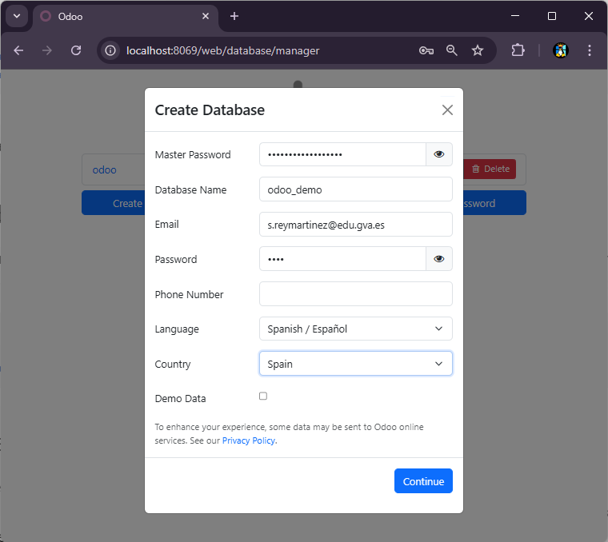

# Datos de Demostración

Cuando desarrollamos un módulo, es muy útil contar con datos de ejemplo que permitan probar la funcionalidad sin tener que crearlos manualmente cada vez. Los datos de demostración son registros predefinidos que se cargan automáticamente al instalar un módulo, facilitando las pruebas, las presentaciones y el aprendizaje del sistema.

En este apartado aprenderemos a crear datos de demostración para nuestro módulo de gestión de tareas, incluyendo tanto la creación manual de registros simples como la generación automática de grandes volúmenes de datos mediante scripts.

## ¿Qué son los Datos de Demostración?

Los datos de demostración (demo data) son registros de ejemplo que se cargan automáticamente cuando:

- Se instala un módulo por primera vez
- La base de datos fue creada con la opción "Load demonstration data" activada

Estos datos son especialmente útiles para:

- **Desarrolladores**: Probar funcionalidades sin crear datos manualmente
- **Formación**: Proporcionar ejemplos realistas a los alumnos
- **Presentaciones**: Demostrar el módulo con datos representativos
- **Testing**: Verificar que todo funciona correctamente

A diferencia de los datos de producción, los datos de demostración son opcionales y pueden omitirse en instalaciones reales simplemente no marcando la casilla correspondiente al crear la base de datos.

## Configuración Inicial: Base de Datos con Datos Demo

Para que los datos de demostración se carguen, la base de datos debe crearse con la opción correspondiente activada.

### Crear Base de Datos con Datos Demo

Al crear una nueva base de datos en Odoo (por ejemplo, accediendo a `http://localhost:8069/web/database/manager`):

- Completa los datos básicos (nombre, contraseña, etc.)
- **Marca la casilla "Load demonstration data"**
- Crea la base de datos

<figure markdown="span" align="center">
  { width="60%" }
  <figcaption>Opción para cargar datos de demostración al crear la base de datos</figcaption>
</figure>

!!! warning "Importante: Opción al crear la base de datos"
    La opción de datos de demostración solo está disponible al **crear** la base de datos, no puede activarse después. Si tu base de datos actual no tiene esta opción activada, deberás crear una nueva base de datos para poder usar datos demo.

### Verificar si tu Base de Datos Tiene Datos Demo Activos

Para comprobar si tu base de datos actual tiene los datos demo activados:

- Instala cualquier módulo estándar de Odoo (por ejemplo, Ventas)
- Si se cargan automáticamente clientes, productos, etc., la opción está activa
- Si el módulo se instala vacío, la opción no está activa

## Estructura de Archivos para Datos Demo

Los datos de demostración se definen en archivos XML dentro de una carpeta específica del módulo.

### Estructura Recomendada

```
gestion_tareas_sergio/
├── __init__.py
├── __manifest__.py
├── models/
├── views/
├── security/
└── demo/
    ├── demo.xml              # Datos demo básicos
    ├── desarrolladores.xml   # Desarrolladores de ejemplo
    ├── proyectos.xml         # Proyectos de ejemplo
    └── sprints.xml           # Sprints de ejemplo
```

### Configurar el Manifest

En el archivo `__manifest__.py`, existe una sección específica para datos de demostración:

```python
{
    'name': 'Gestión de Tareas',
    # ... otros campos ...
    
    'data': [
        'security/ir.model.access.csv',
        'views/views.xml',
        'views/templates.xml',
    ],
    
    'demo': [
        'demo/demo.xml',
        'demo/desarrolladores.xml',
        'demo/proyectos.xml',
        'demo/sprints.xml',
    ],
}
```

La clave `demo` especifica qué archivos contienen datos de demostración. Estos archivos solo se cargarán si la base de datos tiene los datos demo activados.

## Crear Datos Demo Manualmente

Para cantidades pequeñas de datos, podemos crear los registros manualmente en archivos XML.

### Estructura Básica de un Archivo Demo

Un archivo de datos demo tiene la siguiente estructura:

```xml
<?xml version="1.0" encoding="utf-8"?>
<odoo>
    <data>
        <!-- Aquí van los registros -->
    </data>
</odoo>
```

### Ejemplo: Crear Desarrolladores de Demo

Vamos a crear algunos desarrolladores de ejemplo. En `demo/desarrolladores.xml`:

```xml
<?xml version="1.0" encoding="utf-8"?>
<odoo>
    <data>
        <!-- Desarrollador 1 -->
        <record id="desarrollador_juan" model="res.partner">
            <field name="name">Juan Pérez</field>
            <field name="es_desarrollador">True</field>
            <field name="email">juan.perez@example.com</field>
            <field name="phone">+34 600 123 456</field>
        </record>

        <!-- Desarrollador 2 -->
        <record id="desarrollador_maria" model="res.partner">
            <field name="name">María García</field>
            <field name="es_desarrollador">True</field>
            <field name="email">maria.garcia@example.com</field>
            <field name="phone">+34 600 234 567</field>
        </record>

        <!-- Desarrollador 3 -->
        <record id="desarrollador_pedro" model="res.partner">
            <field name="name">Pedro López</field>
            <field name="es_desarrollador">True</field>
            <field name="email">pedro.lopez@example.com</field>
            <field name="phone">+34 600 345 678</field>
        </record>
    </data>
</odoo>
```

**Elementos clave**:

- `<record id="..." model="...">`: Define un registro con un ID único
- `id`: Identificador único del registro (se usa para referenciar desde otros registros)
- `model`: Modelo en el que se crea el registro
- `<field name="...">`: Cada campo del modelo con su valor

### Ejemplo: Crear Proyectos con Relaciones

Los datos demo pueden tener relaciones entre sí. En `demo/proyectos.xml`:

```xml
<?xml version="1.0" encoding="utf-8"?>
<odoo>
    <data>
        <record id="proyecto_tienda_online" model="gestion_tareas_sergio.proyectos_sergio">
            <field name="nombre">Tienda Online</field>
            <field name="descripcion">Desarrollo de e-commerce con carrito de compra</field>
        </record>

        <record id="proyecto_app_movil" model="gestion_tareas_sergio.proyectos_sergio">
            <field name="nombre">App Móvil</field>
            <field name="descripcion">Aplicación móvil para gestión de pedidos</field>
        </record>
    </data>
</odoo>
```

### Ejemplo: Crear Sprints Referenciando Proyectos

En `demo/sprints.xml`:

```xml
<?xml version="1.0" encoding="utf-8"?>
<odoo>
    <data>
        <record id="sprint_1_tienda" model="gestion_tareas_sergio.sprints_sergio">
            <field name="nombre">Sprint 1 - Backend</field>
            <field name="descripcion">Desarrollo de la API REST</field>
            <field name="duracion">14</field>
            <field name="fecha_ini">2024-01-15 09:00:00</field>
            <field name="proyecto" ref="proyecto_tienda_online"/>
        </record>

        <record id="sprint_2_tienda" model="gestion_tareas_sergio.sprints_sergio">
            <field name="nombre">Sprint 2 - Frontend</field>
            <field name="descripcion">Desarrollo de la interfaz de usuario</field>
            <field name="duracion">14</field>
            <field name="fecha_ini">2024-01-29 09:00:00</field>
            <field name="proyecto" ref="proyecto_tienda_online"/>
        </record>
    </data>
</odoo>
```

**Nota sobre relaciones**:

- `ref="proyecto_tienda_online"`: Referencia el ID del proyecto creado anteriormente
- Odoo resuelve automáticamente estas referencias al cargar los datos

### Ejemplo: Relaciones Many2many

Para campos Many2many, usamos una sintaxis especial:

```xml
<record id="tarea_login" model="gestion_tareas_sergio.tareas_sergio">
    <field name="nombre">Implementar login de usuarios</field>
    <field name="descripcion">Sistema de autenticación con JWT</field>
    <field name="sprint" ref="sprint_1_tienda"/>
    <field name="desarrollador_mo" ref="desarrollador_juan"/>
    <field name="rel_tecnologias" eval="[(6, 0, [ref('tecnologia_python'), ref('tecnologia_jwt')])]"/>
</record>
```

La sintaxis `eval="[(6, 0, [...])]"` es específica de Odoo:

- `6`: Comando para "reemplazar todos los registros relacionados"
- `0`: No usado en este comando
- `[ref('id1'), ref('id2')]`: Lista de IDs a relacionar

## Generación Automática de Datos Demo

Cuando necesitamos crear muchos registros (por ejemplo, 50 desarrolladores o 100 tareas), crear los archivos XML manualmente es tedioso y propenso a errores. En estos casos, usamos scripts para generar los datos automáticamente.

### Herramienta: Mockaroo

[Mockaroo](https://mockaroo.com/) es una herramienta web gratuita que genera datos aleatorios realistas en varios formatos.

**Características**:

- Genera datos en CSV, JSON, SQL, XML, etc.
- Múltiples tipos de datos: nombres, emails, teléfonos, direcciones, etc.
- Permite patrones personalizados con expresiones regulares
- Puede generar hasta 1000 registros en la versión gratuita

### Paso 1: Configurar Campos en Mockaroo

Vamos a generar 50 desarrolladores con datos realistas.

Configuración en Mockaroo:

| Campo | Tipo | Opciones |
|-------|------|----------|
| id | Row Number | Desde 1 |
| name | Full Name | - |
| email | Email Address | - |
| phone | Phone | Formato español |
| ciudad | City | - |

**Configuración adicional**:

- Número de filas: 50
- Formato: CSV
- Sin encabezados (desmarca "include header row")

Descarga el archivo como `desarrolladores.csv`.

### Paso 2: Script Python para Convertir CSV a XML

Creamos un script que lee el CSV y genera el archivo XML correspondiente. Crea un archivo `scripts/generar_demo.py`:

```python
import csv
import os

def escribir_texto(texto, archivo):
    """Escribe texto en un archivo (modo append)"""
    with open(archivo, 'a', encoding='utf-8') as f:
        f.write(texto)

def generar_desarrollador(fila, archivo):
    """Genera un registro XML para un desarrollador"""
    id_dev, nombre, email, telefono, ciudad = fila
    
    xml = f'''
    <record id="desarrollador_demo_{id_dev}" model="res.partner">
        <field name="name">{nombre}</field>
        <field name="es_desarrollador">True</field>
        <field name="email">{email}</field>
        <field name="phone">{telefono}</field>
        <field name="city">{ciudad}</field>
    </record>
'''
    escribir_texto(xml, archivo)

def generar_xml_desarrolladores(archivo_csv, archivo_xml):
    """Genera archivo XML completo desde CSV"""
    
    # Eliminar archivo XML si existe
    if os.path.exists(archivo_xml):
        os.remove(archivo_xml)
    
    # Escribir cabecera XML
    escribir_texto('<?xml version="1.0" encoding="utf-8"?>\n', archivo_xml)
    escribir_texto('<odoo>\n    <data>\n', archivo_xml)
    
    # Leer CSV y generar registros
    with open(archivo_csv, 'r', encoding='utf-8') as csv_file:
        lector = csv.reader(csv_file)
        for fila in lector:
            if fila:  # Ignorar líneas vacías
                generar_desarrollador(fila, archivo_xml)
    
    # Escribir cierre XML
    escribir_texto('    </data>\n</odoo>\n', archivo_xml)
    
    print(f"✓ Archivo generado: {archivo_xml}")

# Ejecutar el script
if __name__ == "__main__":
    generar_xml_desarrolladores(
        'scripts/desarrolladores.csv',
        'demo/desarrolladores.xml'
    )
```

**Explicación del script**:

- `escribir_texto()`: Función auxiliar para escribir en archivos
- `generar_desarrollador()`: Genera el XML de un registro individual
- `generar_xml_desarrolladores()`: Función principal que:
    - Borra el archivo destino si existe
    - Escribe la cabecera XML
    - Lee cada fila del CSV
    - Genera un registro por cada fila
    - Escribe el cierre XML

### Paso 3: Ejecutar el Script

Desde la raíz de tu módulo:

```bash
cd gestion_tareas_sergio
python scripts/generar_demo.py
```

Esto generará el archivo `demo/desarrolladores.xml` con 50 desarrolladores.

### Paso 4: Verificar el Archivo Generado

Abre `demo/desarrolladores.xml` y verifica que tiene la estructura correcta:

```xml
<?xml version="1.0" encoding="utf-8"?>
<odoo>
    <data>
        <record id="desarrollador_demo_1" model="res.partner">
            <field name="name">Juan Carlos Rodríguez</field>
            <field name="es_desarrollador">True</field>
            <field name="email">jc.rodriguez@example.com</field>
            <field name="phone">+34 612 345 678</field>
            <field name="city">Madrid</field>
        </record>
        
        <!-- ... más registros ... -->
    </data>
</odoo>
```

### Paso 5: Añadir al Manifest

Añade el nuevo archivo en el `__manifest__.py`:

```python
'demo': [
    'demo/demo.xml',
    'demo/desarrolladores.xml',  # <- Añadido
],
```

## Cargar los Datos Demo

Para que Odoo cargue los datos de demostración:

### Opción 1: Nueva Instalación

Si aún no has instalado el módulo:

- Actualiza la lista de módulos
- Instala tu módulo
- Los datos demo se cargarán automáticamente

### Opción 2: Módulo Ya Instalado

Si el módulo ya está instalado, los datos demo **no se cargarán automáticamente** al actualizar. Debes:

**Método 1: Desinstalar y reinstalar**

- Desinstala el módulo completamente
- Reinicia el servidor Odoo: `docker compose restart odoo_dev_dam`
- Reinstala el módulo

**Método 2: Forzar carga desde línea de comandos**

```bash
docker exec -it odoo_dev_dam odoo -d nombre_bd -u gestion_tareas_sergio --load-language=es_ES
```

!!! warning "Datos Demo se Cargan Una Vez"
    Los datos demo solo se cargan durante la instalación del módulo. Si modificas los archivos demo después de instalar, necesitas desinstalar y reinstalar el módulo para ver los cambios.

## Buenas Prácticas para Datos Demo

### Organización de Archivos

Estructura tus datos demo de forma lógica:

```
demo/
├── 01_desarrolladores.xml    # Contactos base
├── 02_tecnologias.xml         # Tecnologías (sin dependencias)
├── 03_proyectos.xml           # Proyectos
├── 04_sprints.xml             # Sprints (dependen de proyectos)
└── 05_tareas.xml              # Tareas (dependen de sprints y desarrolladores)
```

El orden en el manifest debe respetar las dependencias:

```python
'demo': [
    'demo/01_desarrolladores.xml',
    'demo/02_tecnologias.xml',
    'demo/03_proyectos.xml',
    'demo/04_sprints.xml',
    'demo/05_tareas.xml',
],
```

### IDs Descriptivos

Usa IDs descriptivos que faciliten referencias:

```xml
<!-- Mal -->
<record id="rec1" model="...">

<!-- Bien -->
<record id="proyecto_tienda_online" model="...">
```

### Datos Realistas

Usa datos que parezcan reales:

- Nombres completos, no "Test 1", "Test 2"
- Emails con dominios válidos
- Fechas coherentes (sprints pasados, actuales y futuros)
- Descripciones con sentido

### Cantidad Apropiada

No exageres con la cantidad de datos:

- 10-20 registros por modelo suele ser suficiente
- Suficiente para probar, pero no abrumador
- Considera el rendimiento al cargar

### Documentación

Documenta el propósito de los datos demo en un README:

```markdown
# Datos de Demostración

Este módulo incluye datos demo para facilitar las pruebas:

- 20 desarrolladores con datos completos
- 5 proyectos de diferentes tipos
- 15 sprints distribuidos en los proyectos
- 50 tareas asignadas a desarrolladores
- 10 tecnologías comunes

Para usar los datos demo, crea la base de datos con
la opción "Load demonstration data" activada.
```

## Solución de Problemas Comunes

### Los datos demo no se cargan

**Causas posibles**:

- Base de datos creada sin la opción "Load demonstration data"
- Errores en la sintaxis XML
- Referencias a IDs que no existen
- Módulo ya instalado (los datos demo solo se cargan en la instalación)

**Solución**:

- Verifica los logs de Odoo: `docker logs odoo_dev_dam -f`
- Comprueba la sintaxis XML
- Desinstala y reinstala el módulo

### Error: "External ID not found"

**Causa**: Intentas referenciar un ID que no existe o no se ha cargado aún.

**Solución**:

- Verifica que el ID existe en algún archivo demo
- Asegura el orden correcto en el manifest (dependencias primero)
- Comprueba que no hay errores tipográficos en los IDs

### Los datos se duplican

**Causa**: Los IDs no son únicos o estás cargando el mismo archivo varias veces.

**Solución**:

- Asegura que cada `id` es único en todo el módulo
- Verifica que no tienes el mismo archivo listado dos veces en el manifest

### Errores de campos requeridos

**Causa**: Faltan campos obligatorios en los registros.

**Solución**:

- Revisa la definición del modelo para ver campos con `required=True`
- Añade esos campos en los datos demo

---

## 🧩 Tu Turno: Gestor de Restaurante

Ahora crearás datos de demostración completos para tu proyecto del restaurante.

### Objetivos y Contexto

Vas a crear datos demo que incluyan platos, menús, ingredientes, camareros y otras entidades de tu restaurante. Esto te permitirá probar fácilmente todas las funcionalidades sin tener que crear datos manualmente cada vez que reinstales el módulo.

Crearás tanto datos simples manualmente como datos masivos usando scripts de generación automática.

### Pasos a Realizar

1. **Verificar que tu base de datos tiene datos demo activos**
    
    Si no los tiene, crea una nueva base de datos marcando "Load demonstration data".
    
    Pistas:
    
    - Accede al gestor de bases de datos
    - Crea una nueva base de datos o verifica la actual instalando un módulo estándar

2. **Crear estructura de carpetas para datos demo**
    
    Crea una carpeta `demo/` en tu módulo si no existe.
    
    Estructura sugerida:
    
    ```
    demo/
    ├── 01_categorias.xml
    ├── 02_ingredientes.xml
    ├── 03_platos.xml
    ├── 04_menus.xml
    └── 05_camareros.xml
    ```

3. **Crear datos demo de categorías manualmente**
    
    En `demo/01_categorias.xml`, crea 4-5 categorías de platos.
    
    Pistas:
    
    - Categorías sugeridas: Entrantes, Principales, Postres, Bebidas
    - Usa IDs descriptivos como `categoria_entrantes`
    - Incluye nombre y descripción

4. **Crear datos demo de ingredientes manualmente**
    
    En `demo/02_ingredientes.xml`, crea 15-20 ingredientes comunes.
    
    Pistas:
    
    - Incluye alergenos y no alergenos
    - Ejemplos: Tomate, Gluten, Huevo, Leche, Lechuga, etc.
    - Marca correctamente el campo `es_alergeno`
    - Usa IDs como `ingrediente_tomate`, `ingrediente_gluten`

5. **Crear script para generar platos masivamente**
    
    Crea `scripts/generar_demo_platos.py` que genere 30-40 platos desde un CSV.
    
    Pistas:
    
    - Campos CSV: id, nombre, descripcion, precio, tiempo_preparacion, categoria_id
    - Usa Mockaroo para generar nombres de platos creativos
    - Precios entre 5 y 35 euros
    - Tiempos de preparación entre 10 y 60 minutos
    - Asigna categorías usando `ref()`

6. **Configurar Mockaroo para platos**
    
    Configuración sugerida:
    
    | Campo | Tipo | Opciones |
    |-------|------|----------|
    | id | Row Number | 1-40 |
    | nombre | Custom List | Lista de nombres de platos |
    | descripcion | Sentences | 1-2 oraciones |
    | precio | Number | Min: 5, Max: 35, Decimales: 2 |
    | tiempo | Number | Min: 10, Max: 60 |
    | categoria | Number | Min: 1, Max: 4 |
    
    Descarga como CSV sin encabezados.

7. **Ejecutar el script de generación de platos**
    
    Ejecuta tu script para generar `demo/03_platos.xml`.
    
    Pistas:
    
    - Verifica que el XML generado tiene la estructura correcta
    - Comprueba que las referencias a categorías son válidas
    - El script debe ser similar al ejemplo de desarrolladores

8. **Crear relaciones Many2many entre platos e ingredientes**
    
    Modifica el script de platos para añadir ingredientes aleatorios.
    
    Pistas:
    
    - Cada plato debería tener 3-6 ingredientes
    - Usa la sintaxis: `eval="[(6, 0, [ref('ingrediente_1'), ref('ingrediente_2')])]"`
    - Genera combinaciones aleatorias pero lógicas (no mezcles todo con todo)

9. **Crear datos demo de menús manualmente**
    
    En `demo/04_menus.xml`, crea 5-6 menús con diferentes características.
    
    Pistas:
    
    - Menús: Menú del Día, Menú Fin de Semana, Menú Degustación, etc.
    - Incluye menús con diferentes estados: activos, finalizados, próximos
    - Asigna 3-5 platos a cada menú
    - Usa fechas realistas (algunos actuales, otros pasados, otros futuros)

10. **Crear datos demo de camareros usando script**
    
    Similar al script de desarrolladores, genera 15-20 camareros.
    
    Pistas:
    
    - Usa Mockaroo para generar nombres, emails, teléfonos
    - Campos adicionales: turno (mañana/tarde/noche), seccion
    - Asigna turnos de forma equilibrada
    - Secciones: Terraza, Sala Principal, Bar, VIP

11. **Relacionar camareros con menús de especialidad**
    
    Modifica el script de camareros para asignar 1-3 menús a cada uno.
    
    Pistas:
    
    - No todos los camareros necesitan menús de especialidad
    - Usa relación Many2many similar a platos-ingredientes

12. **Añadir todos los archivos al manifest**
    
    Actualiza `__manifest__.py` con todos los archivos demo en orden correcto.
    
    ```python
    'demo': [
        'demo/01_categorias.xml',
        'demo/02_ingredientes.xml',
        'demo/03_platos.xml',
        'demo/04_menus.xml',
        'demo/05_camareros.xml',
    ],
    ```
    
    El orden es importante por las dependencias.

13. **Probar la carga de datos demo**
    
    Desinstala tu módulo completamente, reinicia el servidor y reinstala.
    
    Pistas:
    
    - Antes de reinstalar, verifica que no hay errores en los XMLs
    - Observa los logs durante la instalación: `docker logs odoo_dev_dam -f`
    - Si hay errores, corrígelos y vuelve a intentar

14. **Verificar las relaciones**
    
    Comprueba que todas las relaciones se cargaron correctamente.
    
    Verifica:
    
    - Platos tienen ingredientes asignados
    - Menús tienen platos asignados
    - Camareros tienen menús de especialidad
    - Las categorías de platos son correctas

15. **Crear datos adicionales opcionales (avanzado)**
    
    Si has creado otros modelos (Pedidos, Mesas, etc.), genera datos demo para ellos.
    
    Pistas:
    
    - Pedidos: Relaciona con camareros y menús
    - Mesas: Asigna números y estados
    - Usa el mismo enfoque de scripts para cantidades grandes

### Verificaciones y Resultado Esperado

Comprueba que:

- Al instalar el módulo, se cargan automáticamente todos los datos
- Tienes 4-5 categorías de platos
- Tienes 15-20 ingredientes (algunos marcados como alergenos)
- Tienes 30-40 platos con categorías, precios y tiempos asignados
- Los platos tienen ingredientes relacionados
- Tienes 5-6 menús con diferentes estados y fechas
- Los menús tienen platos asignados
- Tienes 15-20 camareros con turnos y secciones
- Algunos camareros tienen menús de especialidad
- No hay errores en los logs de Odoo
- Las vistas lista muestran los datos correctamente con las decoraciones

!!!example "Estructura Final Esperada"

    Después de instalar el módulo con datos demo:
    
    **Categorías**: 4 categorías básicas
    
    **Ingredientes**: 20 ingredientes variados
    
    - 8 alergenos: Gluten, Huevo, Leche, Frutos secos, Soja, Pescado, Marisco, Mostaza
    - 12 no alergenos: Tomate, Lechuga, Cebolla, Aceite, etc.
    
    **Platos**: 40 platos distribuidos
    
    - 10 Entrantes
    - 15 Principales
    - 10 Postres
    - 5 Bebidas
    - Cada uno con 3-6 ingredientes
    
    **Menús**: 6 menús variados
    
    - 2 activos (fechas actuales)
    - 2 finalizados (fechas pasadas)
    - 2 futuros (fechas próximas)
    - Cada uno con 3-5 platos
    
    **Camareros**: 20 camareros
    
    - Distribuidos equitativamente en 3 turnos
    - 4 secciones diferentes
    - 60% con menús de especialidad asignados

### Pruebas Adicionales Recomendadas

1. **Desinstalación limpia**: Desinstala el módulo y verifica que los datos demo se eliminan
    
2. **Reinstalación**: Reinstala y verifica que los datos se cargan de nuevo correctamente
    
3. **Referencias**: Abre varios registros y verifica que las relaciones funcionan (plato → ingredientes, menú → platos, etc.)
    
4. **Decoraciones**: Verifica que las decoraciones de las vistas lista funcionan con los datos demo
    
5. **Filtros**: Prueba los filtros en las vistas (solo disponibles, solo alergenos, etc.)
    
6. **Scripts**: Modifica el CSV, regenera el XML con el script y verifica que los cambios se aplican
    
7. **Base de datos sin demo**: Crea una base de datos SIN datos demo, instala tu módulo y verifica que no se cargan los datos (el módulo funciona pero vacío)

Con estos datos demo completos, tendrás un restaurante totalmente funcional y listo para demostrar o probar todas las características de tu módulo.