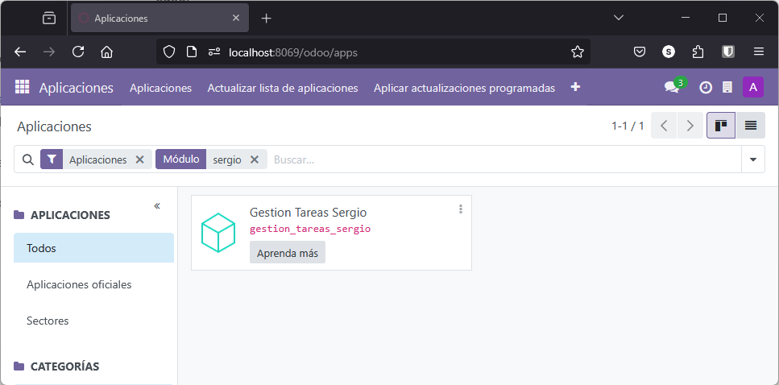
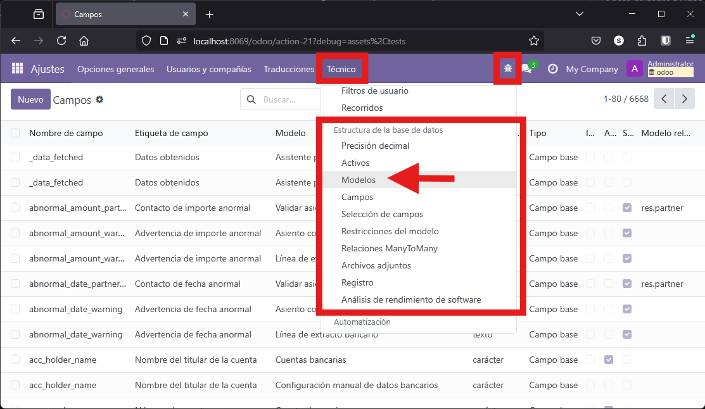
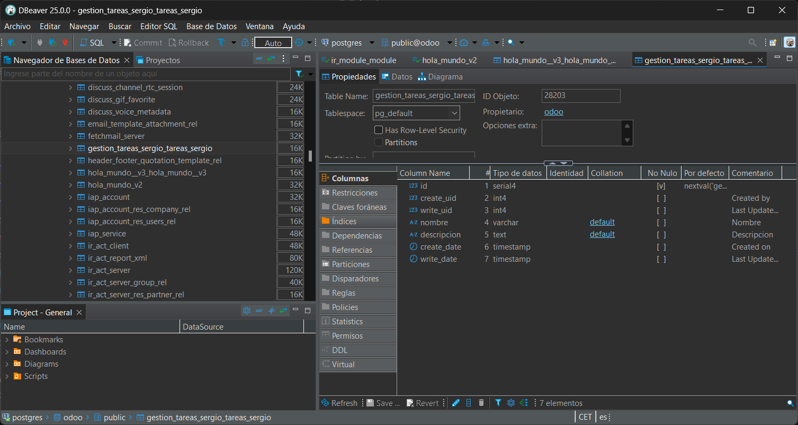
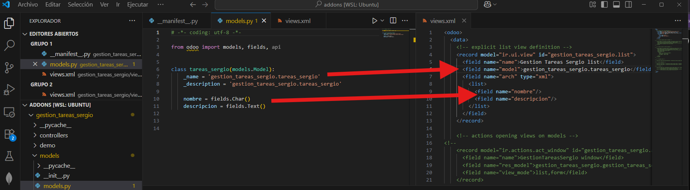
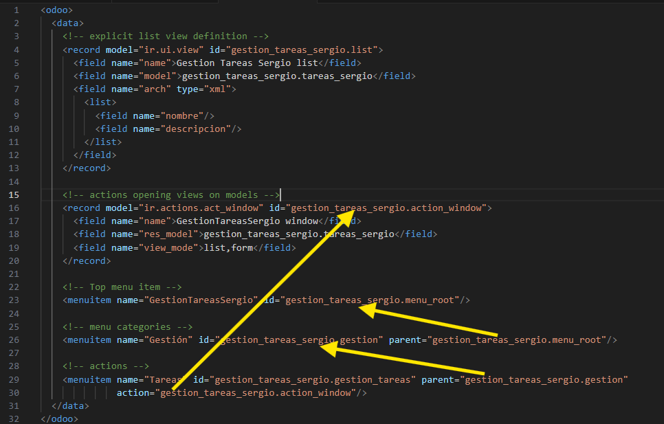
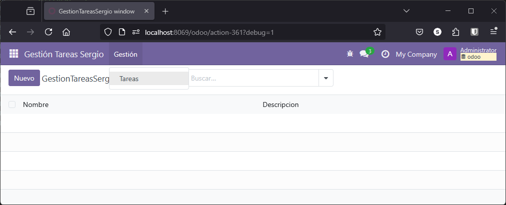

## Introducción

En esta sección vamos a realizar de forma guiada un ejemplo de desarrollo de un módulo que nos permitirá gestionar la realización de proyectos de desarrollo informático. 

Básicamente, los elementos que vamos a tener en cuenta para nuestro módulo básicamente son los siguientes:

- **Proyectos**: Cada desarrollo de una aplicación diferente, será un proyecto
- **Tareas**: El desarrollo se basa en la realización de tareas
- **Sprints**: Dividimos la fase de desarrollo en *sprints* temporales que agrupan una serie de tareas a realizar
- **Desarrolladores**: son las personas que realizan cada una de las tareas del proyecto 

## Creación de la aplicación

Para comenzar, puesto que ya tenemos el sistema configurado, procedemos a la creación de la estructura de la aplicación mediante **scaffold**.

Debemos tener claro el nombre de nuestra aplicación que será **Gestion_Tareas_Sergio** en mi caso.

```bash
docker exec -ti odoo odoo scaffold GestionTareasSergio /mnt/extra-addons
```

Comprobamos que se ha generado toda la estructura

<figure markdown="span" align="center">
  { width="75%"  }
  <figcaption>Creación de la estructura del módulo</figcaption>
</figure>


!!! Tip

    En caso de tener problemas de permisos, recordad añadir permisos a todos los elementos

    ```bash
    sudo chmod -R 777 ./gestion_tareas_sergio/
    ```


y ahora configuramos el **__manifest__.py** para dar descripción de nuestra aplicación lo vamos a **instalar** para comprobar que todo funciona correctamente.

<figure markdown="span" align="center">
  { width="70%"  }
  <figcaption>Comprobamos que la aplicación esta instalada correctamente</figcaption>
</figure>

Estaría bonito, crear un logotipo para nuestra aplicación y así identificarla rápidamente.

!!! Tip "¿Reiniciar o reinstalar?"

    Debes **reiniciar el servidor de Odoo** cuando:

    - Modificas **modelos Python** (`models/*.py`), ya que el código se carga al iniciar el servidor.
    - Cambias el archivo `__manifest__.py`, porque Odoo lo lee al cargar los módulos.

    Puedes **actualizar el módulo sin reiniciar el servidor** si:

    - Solo modificas **vistas XML** (como formularios, listas, etc.).
    - Cambias **archivos de datos estáticos** (como `views/*.xml`, `security/*.xml`, etc.).
    - Ajustas **controladores web** (`controllers/*.py`), aunque en este caso, si el código ya está cargado en memoria, puede requerir reinicio dependiendo del entorno (por ejemplo, en producción).

    En ocasiones si los cambios realizados en los módulos es muy grande, la aplicación puede fallar y es mejor *desinstalar* y volver a *instalar* la aplicación, aunque esto conlleve a la perdida de datos.


## Creación de módulo básico de *Tareas*

Comenzaremos creando un módulo básico que contendrá información de las **tareas** en las que se dividirá nuestro desarrollo completa.

### Añadir el modelo

Lo primer de todo será ir al fichero `models/models.py` y comenzar a modificar el fichero existente para crear el modelo según nuestras necesidades. 

Recordad que tenemos por una parte `__init__.py` donde se importan los modelos que hay en `./models`, y que aquí tenemos otro `models/__init__.py` que nos indica los ficheros modelos concretos a importar, en este caso `models/models.py`.

<figure markdown="span" align="center">
  { width="60%"  }
  <figcaption>Comprobamos que la aplicación esta instalada correctamente</figcaption>
</figure>

En principio, los campos que vamos a necesitar van a ser los siguientes:

- nombre de tareas, de tipo texto corto (`fields.Char()`)
- descripción, de tipo texto largo (`fields.Text()`)

Así pues, comencemos modificando el modelo, para lo cual damos un nombre a la clase de la tarea y le asignamos un nombre y una descripción.

El nombre que le vamos a dar a la clase es `tareas_sergio` en mi caso, que me llamo así, y después en el nombre debemos especificar de nuevo este nombre precedido de forma correcta por el nombre de la aplicación.

??? note "models.py"

    ```py
    from odoo import models, fields, api

    class tareas_sergio(models.Model):
        _name = 'gestion_tareas_sergio.tareas_sergio'
        _description = 'gestion_tareas_sergio.tareas_sergio'

        nombre = fields.Char()
        descripcion = fields.Text()
    ```

Intenta hacer esta parte sin mirar la solución....

Vamos a comenzar poco a poco, de forma que tras cada modificación vamos a reinstalar la aplicación para comprobar que todo funciona correctamente. **Si hacemos muchos cambios a la vez sin reinstalar ni verificar nos encontraremos con problemas** errores *arrastrados* que serán muy difíciles de solucionar. 

### Revisión de la base de datos

En Odoo, la estructura de las tablas creadas depende del modelo (model) definido en el sistema. Odoo utiliza el **ORM** (*Object-Relational Mapping*) de Python para mapear clases a tablas en la base de datos PostgreSQL.

Así pues, Una vez instalada, si no hemos tenido ningún problema, podemos comprobar *cómo ha trabajado* este **ORM** y cómo debe haberse creado el modelo y por tanto deben haber cambios en la base de datos. 

Vamos a revisar estos cambios y comprobar que todo cambio en el modelo repercute en un cambio en las tablas.

Para comprobar los cambios realizados en la base de datos, tenemos tres opciones: 

  - desde el propio interfaz de odoo en modo desarrollo
  - desde la línea de comandos usando el interfaz de PostgreSQL
  - o desde una herramienta de administración de base de datos con interfaz gráfico como puede ser [dbeaver](https://dbeaver.io/)

#### Desde el interfaz de odoo


Para revisar los modelos desde el interfaz de Odoo, una vez en modo *desarrollo*, accedemos a *Ajustes* -> *Técnico* y ahí tenemos una sección dedicada a la *Estructura de la base de datos*:

<figure markdown="span" align="center">
  { width="70%"  }
  <figcaption>Revisión de base de datos desde odoo</figcaption>
</figure>

Aquí podemos ver un listado de todas las tablas tanto del propio sistema Odoo como de todas las aplicaciones que tenemos instaladas. 

En Odoo, el nombre de la tabla que se crea en la base de datos se determina principalmente por el atributo `_name` del modelo:

- Si defines `_name = 'mi.modelo'`, la tabla se llamará `mi_modelo`.
- Odoo reemplaza los puntos (.) por guiones bajos (_) para formar el nombre de la tabla.

Si buscamos el modelo que hemos creado, en mi caso *tareas_sergio*, clicamos sobre el y podemos ver sus características así como los campos que tiene: 

<figure markdown="span" align="center">
  { width="60%"  }
  <figcaption>Revisión de base de datos desde odoo. Campos modelo</figcaption>
</figure>

Como se puede ver en la anterior figura, además de los dos campos que hemos creado para el modelo, Odoo crea una serie de campos para llevar control de versiones y añadir sus propios índices.

#### Desde la línea de comandos.

Como somos unos apasionados de los sistemas, nos gusta comprobar que todo funciona sin entorno gráfico, por lo que podemos por una parte entrar en la interfaz de *PostgreSQL* y desde ahí, revisar tanto la existencia de la tabla asociada al modelo, como de sus campos.

Para ello, entramos en el terminal del contenedor:

```bash
docker exec -it postgresql bash
```

Accedemos al interfaz de comando de PostgreSQL

```bash
psql -U odoo
```

Una vez en el interfaz, comprobamos las bases de datos existentes y cambiamos a la correspondiente

```bash
\l
\c odoo
```

buscamos la tabla con una de las siguientes opciones

```sql
\dt *sergio*

SELECT * FROM pg_tables WHERE tablename LIKE '%sergio%';
```
En el primer caso, el * (asterisco) sirve como comodín. 

y finalmente, listamos los campos de la tabla:

```sql
\d \d gestion_tareas_sergio_tareas_sergio

SELECT column_name, data_type 
FROM information_schema.columns 
WHERE table_name = 'gestion_tareas_sergio_tareas_sergio';
```

y para salir del interfaz de PosgreSQL:

```sql
\q
```

<figure markdown="span" align="center">
  { width="90%"  }
  <figcaption>Revisión de base de datos desde odoo. Campos modelo desde interfaz PosgreSQL</figcaption>
</figure>

#### Desde **dbeaver**

Tambíén podemos utilizar esta aplicación de gestión de base de datos para acceder y comprobar las tablas y campos de nuestro modelo:

Para ello, tras instalar la aplicación, creamos una nueva conexión a la base de datos; como hemos abierto el puerto del contenedor en la definición del `docker-compose.yml`, podemos acceder como si se tratara de una base de datos en local.

Creamos y configuramos una conexión: 

<figure markdown="span" align="center">
  { width="75%"  }
  <figcaption>Configuración conexión en dbeaver</figcaption>
</figure>

Si todo funciona bien podemos ver también la tabla y su estructura.

<figure markdown="span" align="center">
  { width="80%"  }
  <figcaption>Tabla y su estructura</figcaption>
</figure>


### Vistas, menú y action

Ahora que ya tenemos el modelo definido, lo hemos revisado en la base de datos, es momento de continuar trabajando con nuestra módulo y hacer que sea visible desde el menú de Odoo.

Para ello, tal y como hemos visto en el ejemplo de "Hola Mundo 3" tenemos que definir las vistas que queremos publicar, tenemos que mostrar una opción en el menú para poder ver estas vistas y activar las acciones para dar funcionalidad al menú.

#### Configurando vistas

De momento, este modelo no es accesible desde ningún sitio: no tenemos ninguna vista. Por defecto, Odoo crea unas vistas básicas si no haces nada, pero vamos a ver dónde están y cómo personalizarlas.

Las vistas están en el directorio `views`, en un documento XML. 

En este fichero comentado tenemos algunos bloques que van a ser: 

- uno de vista, 
- uno de action (que veremos más adelante), 
- uno de server action y 
- uno de menús. 

Vamos a ir viéndolos poco a poco, porque se trata de ir definiendo cada uno de esos bloques

Realmente, un bloque `<record>` implica que va a ser un registro en la base de datos. Este registro necesita saber dónde se va a guardar, en el primer caso en el modelo `ir.ui.view` (las vistas también son modelos en Odoo).

Así pues comenzamos descomentando el primer bloque y ponemos un `id` único, en mi caso, por ejemplo `gestion_tareas_sergio.list`, que será la vista en modo **lista** (anteriormente *Tree*) de las tareas.

Establecemos un nombre (no es lo más importante, pero hay que establecerlo), por ejemplo `Gestion Tareas Sergio list`. El modelo sobre el que va a actuar esta vista será el de tareas. 

Después establecemos el **modelo** que debe coincidir con el nombre del modelo que hemos establecido al definir el modelo, en mi caso "gestion_tareas_sergio.tareas_sergio". Esto si es fundamental

A continuación, añadimos el listado de campos que mostrará la vista. En este caso, solo tenemos dos campos creado, `nombre` y `descripcion`. De nuevo son los mismos que hemos establecido en el modelo.

<figure markdown="span" align="center">
  { width="80%"  }
  <figcaption>Definiendo la vista de un modelo</figcaption>
</figure>

Este XML indica que es una vista de tipo **List** y que mostrará el campo `name` del modelo. Este campo debe existir en el fichero Python, como hemos visto antes.


!!! nota "Revisando la vista definida"

    Una vez definida la vista, ahora deberíamos poder encontrar la vista si consultamos desde la aplicación el listado de vistas. Recordamos que nuestra vista se llama `manage_task_list`. Si actualizamos el módulo, la podremos encontrar. En este caso, no hemos tenido que reiniciar el servicio. 

    <figure markdown="span" align="center">
      { width="80%"  }
      <figcaption>Listado de vistas</figcaption>
    </figure>


#### Actions

La vista aún es inaccesible porque no hay ningún menú que permita acceder a ella. Para relacionarlo y ver una lista de tareas, vamos a activar el action correspondiente.

Un action permite abrir, cuando se relacione con una opción de menú, la vista correspondiente. Será un registro del modelo de acciones de ventana (`ir.actions.act_window`).

Continuamos pues descomentando el siguiente bloque de código y asignado un `id` único por ejemplo `GestionTareasSergio window`. Le ponemos un nombre, importante el modelo sobre el que actúa y el orden en el que queremos que se muestren las vistas (primero la *list* que acabamos de crear y después la *form*, que Odoo generará automáticamente si no la hemos definido).

??? Note "ir.actions.act_window"

    ```xml
    <record model="ir.actions.act_window" id="gestion_tareas_sergio.action_window">
      <field name="name">GestionTareasSergio window</field>
      <field name="res_model">gestion_tareas_sergio.tareas_sergio</field>
      <field name="view_mode">list,form</field>
    </record>
    ```

Una acción relaciona un menú o botón con una acción que se desencadena en el cliente y se convierte en una petición al servidor. En este caso, el action se transforma en una petición que demanda al servidor las vistas *list* y *torm* del modelo de tareas, y el servidor devolverá la vista *list* creada y una vista *form* generada automáticamente.

#### Menús 

Para que este action funcione, el cliente debe tener un menú. 

Así que seguimos descomentando el bloque de código de menú y vamos a crear una opción de menú principal, por ejemplo `Tareas Sergio`, y de ahí colgará un submenú llamado `Gestión`, y finalmente otro llamado `Tareas`. El action del menú `Tareas` será el que hemos definido antes, para que al pulsar se cargue la vista de tareas, o sea la `action` de este menú, será el `id` del `ir.action.act_window` que hemos definido antes

Por una parte tenemos el código 

??? Note "Bloques de menú"

    ```xml
    <!-- Top menu item -->
    <menuitem name="Gestión Tareas Sergio" id="gestion_tareas_sergio.menu_root"/>

    <!-- menu categories -->
    <menuitem name="Gestión" id="gestion_tareas_sergio.gestion" parent="gestion_tareas_sergio.menu_root"/>

    <!-- actions -->
    <menuitem name="Tareas" id="gestion_tareas_sergio.gestion_tareas" parent="gestion_tareas_sergio.gestion"
              action="gestion_tareas_sergio.action_window"/>
    ```

y por otra tenemos el esquema de cómo debe estar todo conectado:

<figure markdown="span" align="center">
  { width="80%"  }
  <figcaption>Estructura de la configuración del menú</figcaption>
</figure>

Ahora ya tenemos definido el menú y antes de seguir sería aconsejable volver a reinstalar el módulo para asegurarnos que no tenemos ningún error y comprobar si sale o no el menú.

Si revisamos, sigue sin salir nuestra aplicación en el menú tras haberlo definido. Esto es debido a un tema de permisos que abordamos en el siguiente punto.


### Permisos

En **Odoo**, para que un usuario pueda **ver un menú** y **acceder a listas o formularios** de un modelo, se deben cumplir ciertos requisitos de **permisos y configuraciones**. 

Se debe definir un archivo *XML* o *CSV* con los permisos para el modelo. Esto se hace en un archivo como `ir.model.access.csv`.

Cada línea define:

- **Modelo**, 
- **Grupo**
- **Permisos**: leer (`read`), escribir (`write`), crear (`create`), borrar (`unlink`)

Ejemplo:

```csv
id,name,model_id:id,group_id:id,perm_read,perm_write,perm_create,perm_unlink
access_gestion_tareas_sergio_tareas_sergio,acceso_tareas_sergio,model_gestion_tareas_sergio_tareas_sergio,base.group_user,1,1,1,1
```

donde cada línea representa un conjunto de permisos para un grupo sobre un modelo. Los campos son:

- **id**: Identificador único del registro (puede ser cualquier nombre único).
- **name**: Nombre legible del permiso, puede ser cualquiera
- **model_id:id**:  hace referencia al **modelo** al que se aplican los permisos. La forma estándar de referenciarlo es `model_<nombre_del_modelo>`, donde `<nombre_del_modelo>` es el valor de `_name` del modelo, sustituyendo los puntos (`.`) por guiones bajos (`_`). Puede parecer poco intuitivo, pero es el formato que exige Odoo.
- **group_id:id**: Grupo de usuarios al que se le asignan los permisos (puede ser base.group_user, base.group_system, etc.). Si se deja vacío, aplica a todos los usuarios.
- **perm_read**: 1 si puede leer, 0 si no.
- **perm_write**: 1 si puede modificar, 0 si no.
- **perm_create**: 1 si puede crear, 0 si no.
- **perm_unlink**: 1 si puede borrar, 0 si no.

De esta forma, para que un menú sea visible:

- El usuario debe tener acceso al **grupo** asignado al menú. Para simplificar de momento van a ser todos los usuarios: `base.group_user`
- El menú debe estar vinculado a una **acción**, aspecto que en nuestro caso ya hemos hecho
- Se debe tener al menos una vista de tipo `list` o `form` para que la acción funcione correctamente.

#### Manifest

En el fichero `__manifest__.py` hay que habilitar estos permisos para que se carguen. Esta línea suele venir comentada por defecto y hay que descomentarla.

```py
'security/ir.model.access.csv',
```

Ahora ya deberíamos verlo todo: reiniciamos Docker o el servicio, actualizamos el módulo y ya aparece la opción de menú principal `Manage`. Si la cargamos, tenemos `Gestión` y `Tareas`. Al pulsar en `Tareas` aparece la vista con el campo `name`. Si pulsamos en "Nuevo", podemos crear tareas (esto es una vista formulario generada por defecto).


#### Verificación rápida

Para comprobar si todo está bien configurado:

1. Activa el **modo desarrollador**.
2. Ve a **Ajustes > Técnico > Seguridad > Reglas de acceso** y **Reglas de registro**.
3. Asegúrate de que el usuario pertenece al grupo correcto.
4. Verifica que el menú tiene una acción válida y que el modelo tiene permisos definidos.

o directamente, podemos ver que ya aparece en el menú de aplicacion todos los elementos que hemos definido

<figure markdown="span" align="center">
  { width="80%"  }
  <figcaption>Vsita de menú y aplicación</figcaption>
</figure>

En esta imagen estamos viendo la vista tipo listado con los dos campos, y además se ha accedido al menú y se puede ver los 3 niveles de menú que hemos definido: **Gestión Tareas Sergio -> Gestión -> Tareas**

De esta manera, hemos visto cómo crear un módulo básico con funcionalidad básica: un modelo, vistas, permisos, opciones de menú y cómo relacionarlo todo.

