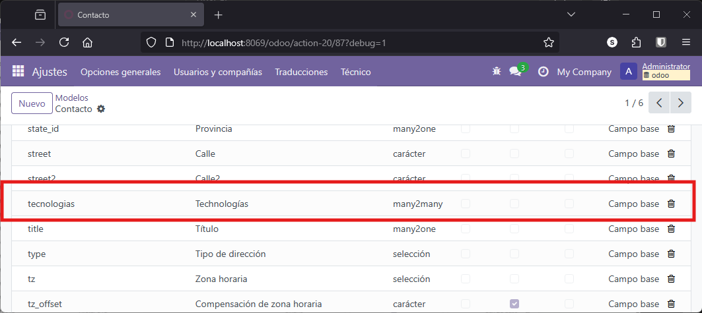
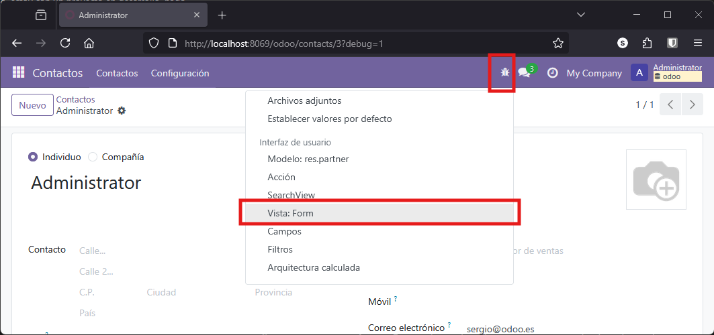

Odoo ofrece diferentes mecanismos de herencia, que permiten extender o modificar la funcionalidad de los modelos existentes de manera flexible y eficiente.

La herencia en Odoo permite reutilizar, ampliar o personalizar la funcionalidad de modelos ya existentes sin necesidad de reescribir todo el código. Gracias a estos mecanismos, los desarrolladores pueden adaptar los módulos estándar a las necesidades específicas de cada proyecto, añadiendo nuevos campos, métodos o modificando el comportamiento de los modelos de forma estructurada y mantenible. Esto facilita la evolución y el mantenimiento de las aplicaciones desarrolladas sobre la plataforma Odoo.

En este apartado se abordarán los principales tipos de herencia que pueden implementarse en Odoo, centrándonos especialmente en la herencia de clase mediante un ejemplo práctico. 


## Tipos de herencia en Odoo

Según la [documentación oficial de Odoo](https://www.odoo.com/documentation/18.0/es/developer/reference/backend/orm.html#inheritance-and-extension), existen varios tipos de herencia:

- **Herencia de clase (clásica):** Permite extender un modelo existente añadiendo nuevos campos o métodos, o sobrescribiendo los ya existentes. Los datos se almacenan en la misma tabla que el modelo original, y las vistas existentes pueden mostrar los nuevos campos añadidos.
- **Herencia por prototipo:** Se crea un nuevo modelo que hereda los atributos del modelo original, pero los datos se almacenan en tablas diferentes. Este tipo de herencia es útil cuando se requiere crear variantes de un modelo base, manteniendo la independencia de los datos.
- **Herencia por delegación:** Se crea un nuevo modelo que contiene una relación con el modelo original. Cada vez que se crea un registro en el modelo hijo, se crea también un registro asociado en el modelo padre, sincronizando los datos entre ambos. Este enfoque permite implementar herencia múltiple y mantener la separación de datos en tablas distintas.

<figure markdown="span" align="center">
  { width="85%"  }
  <figcaption>Tipos de herencia</figcaption>
</figure>

En Odoo, la **herencia de clase** es **la más utilizada**, ya que permite ampliar o adaptar modelos existentes a nuevas necesidades sin duplicar información ni perder compatibilidad con las vistas y funcionalidades ya implementadas.

## Situación actual en los modelos del proyecto

Actualmente, el módulo de gestión de proyectos cuenta con los siguientes modelos:

- **Proyecto:** Representa un proyecto y está relacionado con varias historias.
- **Historia:** Cada historia puede contener varias tareas.
- **Tarea:** Las tareas están asociadas a las tecnologías necesarias para su desarrollo, pertenecen a una historia y se desarrollan en un sprint.
- **Sprint:** Relacionado con las tareas que se desarrollan durante el mismo.
- **Tecnología:** Representa las tecnologías empleadas en las distintas tareas.

Hasta el momento, no se ha implementado ningún modelo para representar a las personas involucradas en el desarrollo (desarrolladores) ni a los clientes relacionados con los proyectos, es momento de abordar este aspecto, pero ayudándonos de la herencia.

## Herencia de clase en Odoo

Odoo dispone de un modelo nativo denominado `res.partner`, que almacena todos los contactos del sistema (empleados, compañías, clientes, etc.). Crear un modelo nuevo para desarrolladores no tendría sentido, ya que un desarrollador es, en esencia, un tipo de contacto. Por tanto, se opta por extender el modelo `res.partner` mediante herencia de clase.

### Implementación

Para crear un modelo que represente a los desarrolladores y permita asociarles tecnologías, se define una clase que hereda de `res.partner` utilizando el atributo `inherit`. De este modo, cualquier campo añadido en la nueva clase se incorporará directamente a la tabla de `res.partner`.

Por ejemplo, para asociar tecnologías a los desarrolladores, se añade un campo `Many2many` relacionado con el modelo de tecnologías:

```python
# *******************************************************
# DESARROLADORES
class desarrollador(models.Model):
  _name = 'res.partner'
  _inherit = 'res.partner'

  tecnologias = fields.Many2many( 'gestion_tareas_sergio.tecnologias_sergio',
                                  relation='relacion_desarrollador_technologies',
                                  column1='rel_desarrollador',
                                  column2='rel_tecnologias',
                                  string='Technologías'
  )
```

Donde 

  - `-name` no es imprescindible identificarlo. Lo podemos poner por habito o costubre, pero al ser heredado, lo importante es de **qué** modelo hereda
  - `inherit` este si es básico e indica el modelo del que hereda.
Con esta implementación, no se crea una nueva tabla para desarrolladores, sino que se amplía la existente de contactos. Si se añade un campo que ya existe en `res.partner`, este será sobrescrito.
  - `tecnologias` de momento solo definimos un nuevo campo que será una relación muchos a muchos con tecnologías

### Verificación

Tras actualizar el módulo, se puede comprobar que el modelo `desarrollador` no existe como tal, sino que los nuevos campos aparecen en el modelo `res.partner`.

Hagamos una verificación de qué ha pasado en la base de datos usando cualquiera de los métodos descritos en el apartado [Revisión de la base de datos](7_1_EjemploCreacionModeloBasico.md#revision-de-la-base-de-datos) del primer punto del ejemplo. 

Por ejemplo, desde el propio entorno de Odoo en desarrollo, vamos a **Ajustes** -> **Técnico** y ahí buscamos el modelo **`res.partner`** ( si buscas `desarrollador` como hemos comentado, no lo encontrarás). Entrando en este modelo, accedemos al listado de campos y si buscamos nuestro nuevo campo debe estar ahí.

<figure markdown="span" align="center">
  { width="85%"  }
  <figcaption>Herencia de modelo. Nuevo campo definido.</figcaption>
</figure>

Como podemos ver, se trata de un modelo que guarda los *contactos* pero realmente contiene todos los campos extra que son necesarios para reutilizar este modelo el cualquier aplicación instalada.

Para hacer visible el nuevo campo en la interfaz, es necesario modificar las vistas correspondientes, lo cual se abordará en el siguiente apartado.

### Acceso desde el menú

Para facilitar el acceso a los desarrolladores desde el menú, se puede crear una nueva acción y una opción de menú que apunten al modelo `res.partner`, aprovechando las vistas ya existentes. 


??? Example "views.xml"

    ```xml
    <-- Nueva acción -->
    <record model="ir.actions.act_window" id="gestion_tareas_sergio.action_desarrolladores">
      <field name="name">Gestion Tareas Sergio Desarrolladores</field>
      <field name="res_model">res.partner</field>
      <field name="view_mode">list,form</field>
    </record>


    <-- Nuevo menú -->
    <menuitem name="Desarrolladores" id="gestion_tareas_sergio.gestion_desarrolladores" 
      parent="gestion_tareas_sergio.gestion" 
      action="gestion_tareas_sergio.action_desarrolladores"/>
    ```
Sin embargo, es importante tener en cuenta que, por defecto, se mostrarán todos los contactos, no solo los desarrolladores. Necesitamos personalizar vistas y filtros para poder añadir el nuevo campo que hemos establecido y filtrar solo los *contactos* que nos interesen.


## Herencia y modificación de vistas en Odoo

Para la correcta visualización de los desarrolladores, debemos reutilizar las vistas que ya existen en el sistema de Contactos y sobre ella realizar modificaciones.

Los pasos a seguir serían los siguientes

### Herencia del formulario de contactos

Para heredar y modificar una vista en Odoo, se debe crear una nueva vista XML que extienda la vista base, n este caso, se hereda el formulario de `res.partner` y lo que haremos es añadir una nueva pestaña para mostrar el campo de tecnologías. 

Al importante utilizar el atributo `mode="primary"` para que la nueva vista no sobrescriba la original, sino que se trate como una vista alternativa.

La localización de los elementos dentro de la vista se realiza mediante expresiones **XPath**, que permiten ubicar el punto exacto donde insertar nuevos campos o modificar los existentes. Por ejemplo, para añadir una nueva pestaña después de la última existente, se puede localizar la página con nombre `internal_notes` y añadir una nueva página a continuación.

Veamos el código necesario y después comentamos punto por punto:

```xml
    <record model="ir.ui.view" id="desarrolladores_form">
      <field name="name">gestion_tareas_sergio.Desarrolladores</field>
      <field name="model">res.partner</field>
      <field name="inherit_id" ref="base.view_partner_form"></field>
      <field name="mode">primary</field>
      <field name="arch" type="xml">
        <xpath expr="//sheet/notebook/page[@name='internal_notes']" position="after">
          <page name="desarrolladores" string="Desarrolladores" >
            <group>
              <group>
                <field name="tecnologias"></field>
              </group>
            </group>
          </page>
        </xpath>
      </field>
    </record>
```

Con este código redefinimos el formulario para la visualización de contactos añadiendo una nueva pestaña que contendrá las tecnologías que domina el desarrollador. 

- Se modifica el formulario del modelo `res.partner` (contactos) mediante herencia de vistas. Se utiliza el atributo `inherit_id` para indicar que se extiende la vista base `base.view_partner_form`.

Aquí hay mucho más que explicar, por una parte, debemos saber cómo se llama la vista base a heredar. Esto lo podemos conseguir si estamos en modo desarrollador y vamos al formulario estándar de contactos y desde ahí accedemos a la información de la vista

<figure markdown="span" align="center">
  { width="60%"  }
  <figcaption>Acceso a la información de modelos y vistas</figcaption>
</figure>

Una vez en la información de la vista, ya tenemos todos los datos de la misma, y en concreto el que nos interesa, su `id externo` que es el que vamos a utilizar para heredar

<figure markdown="span" align="center">
  { width="60%"  }
  <figcaption>Obtención del nombre de la vista a heredar</figcaption>
</figure>

- Dentro del campo `arch`, se emplea una expresión `xpath` para insertar una nueva pestaña llamada "Desarrolladores" justo después de la pestaña de notas internas (`internal_notes`). En esta nueva pestaña se añade un grupo que contiene el campo `tecnologias`. De este modo, al editar un contacto, los usuarios verán una pestaña adicional donde podrán gestionar las tecnologías asociadas al desarrollador, sin modificar la estructura original de la vista, aprovechando así el mecanismo de herencia de vistas de Odoo.

Con todo esto finalmente, obtenemos una vista heredada, en la que hemos introducido una nueva pestaña.

<figure markdown="span" align="center">
  { width="60%"  }
  <figcaption>Nueva pestaña en contactos</figcaption>
</figure>

### Acceso al nuevo formulario

Para acceder al nuevo formulario, deberíamos modificar también las acciones, de forma que vamos a especificar una acción para mostrar el listado y otra para el formulario.

El código necesario sería el siguiente: 

```xml

    <!-- Action desarrolladores -->
    <record model="ir.actions.act_window" id="gestion_tareas_sergio.action_desarrolladores">
      <field name="name">Gestion Tareas Sergio Desarrolladores</field>
      <field name="res_model">res.partner</field>
      <field name="view_mode">list,form</field>
    </record>
    <!-- Mostrando los desarrolladores heredados de res.partner, pero especificamente listado -->
    <record model="ir.actions.act_window.view" id="gestion_tareas_sergio.action_desarrolladores_list">
      <field name="sequence" eval="1"></field>
      <field name="view_mode">list</field>
      <field name="view_id" ref="base.view_partner_tree"></field>
      <field name="act_window_id" ref="gestion_tareas_sergio.action_desarrolladores"></field>
    </record>

    <!-- Mostrando los desarrolladores heredados de res.partner, pero especificamente formulario -->
    <record model="ir.actions.act_window.view" id="gestion_tareas_sergio.action_desarrolladores_form">
      <field name="sequence" eval="2"></field>
      <field name="view_mode">form</field>
      <field name="view_id" ref="desarrolladores_form"></field>
      <field name="act_window_id" ref="gestion_tareas_sergio.action_desarrolladores"></field>
    </record> 
```

El primer bloque ya lo teníamos en la versión anterior, es la acción típica que hemos utilizado para acceso a los diferentes menús, en este caso los asociados a los desarrolladores.

El segundo y tercer bloques tienen como objetivo redefinir los accesos específicos al listado y formulario. 

En concreto el segundo `record` tiene como  propósito asociar una vista de tipo lista. De esta forma 

  - `sequence` con valor `1` determina el orden en que se aplican las vistas si hay varias asociadas a la misma acción. 
  - `view_mode` igual a `list` que especifica que es una lista
  - `view_id` referencia la vista de árbol estándar de contactos (`base.view_partner_tree`), lo que indica que se reutiliza esa vista para mostrar los registros. El nombre de esta vista lo podemos saber según lo indicado anteriormente desde entorno de desarrollador.
  - `act_window_id` enlaza este registro con la acción de ventana `gestion_tareas_sergio.action_desarrolladores` especificada en el primer bloque, asegurando que al ejecutar dicha acción se muestre la vista de lista especificada. Este mecanismo permite personalizar cómo se presentan los datos al usuario en las distintas acciones del sistema.

Referente al tercer y último de los bloques, es similar al anterior con alguna diferencia que pasamos a explicar:

  - `view_mode` igual a `form` que especifica que es un formulario
  - `view_id` referencia la vista definida anteriormente `desarrolladores_form`. En esta propia vista ya se definía la herencia tal y como e vió en el anterior subapartado.

Con todo esto, ahora si tenemos redefinidas las acciones para mostrar el formulario especifico (y heredado) que hemos desarrollado.

---

## Filtrado de registros: solo desarrolladores

Con lo realizado, no tenemos suficiente, puesto que cada vez que accedemos a desarrolladores vemos el listado de todos los contactos, sean o no desarrolladores. Realmente no hemos especificado una forma de identificar si un contacto es o no desarrollador, por lo tanto debemos solucionar este problema.

### Contactos que son desarrolladores

Para distinguir los desarrolladores del resto de contactos, se añade un campo booleano `es_desarrollador` al modelo `res.partner`. Este campo actúa como bandera para identificar si un contacto es desarrollador. Al crear un nuevo desarrollador desde el menú correspondiente, este campo se establece automáticamente a `True`.

Añadamos pues este nuevo campo a nuestro modelo `desarrollador`.

??? Example "models.py - desarrollador"

    ```py
    # *******************************************************
    # DESARROLADORES
    class desarrollador(models.Model):
      _name = 'res.partner'
      _inherit = 'res.partner'

      es_desarrollador = fields.Boolean()  
      tecnologias = fields.Many2many( 'gestion_tareas_sergio.tecnologias_sergio',
                                      relation='relacion_desarrollador_technologies',
                                      column1='rel_desarrollador',
                                      column2='rel_tecnologias',
                                      string='Technologías'
      )
    ```

Ahora debemos modificar la vista para poder mostar el campo desarrollador, añadamos pues en la vista encima de *tecnologías* el nuevo campo para poder indicar si es o no desarrollador.

??? Example "views.xml"

    ```xml
        <record model="ir.ui.view" id="desarrolladores_form">
        . . . 
                <group>
                  <field name="es_desarrollador" ></field>
                  <field name="tecnologias"></field>
                </group>
        . . .
        </record>
    ```

Ahora que ya hemos indicado que un contacto res un desarrollador, deberíamos tener algún filtro para que si estamos dentro de nuestra aplicación y mostramos los contactos con nuestro menú, solo aparezcan usuarios desarrolladores.

### Filtrado de la acción

Para poder filtrar, en la acción de menú que muestra los desarrolladores vamos a cambiar la acción generica de acceso a *desarrolladores*, o sea, primero definimos una genérica y despues especificas para listado y formulario, pues escogemos la primera y la modificamos.

Así pues, se utiliza el atributo `domain` para filtrar los registros y mostrar únicamente aquellos con `es_desarrollador=True`. Simplemente con esta línea, hacemos un filtrado de los elementos del listado (por lo tanto los accesobles) son únicamente lo que tienen este nuevo campo a `True`

Además, vamos a utilizar el atributo `context` para establecer el valor por defecto de este campo al crear nuevos registros desde esta acción. `context` es como un diccionario de elementos que se le pasan al servidor, y en este caso se utiliza este elemento para expecificar al servidor que en el caso de que se cree un elemento nuevo, entonces establezca el valor de `es_desarrollador` a `True`.

Veamos en código cómo se aplican estos cambios: 

```xml
<record model="ir.actions.act_window" id="gestion_tareas_sergio.action_desarrolladores">
  <field name="name">Gestion Tareas Sergio Desarrolladores</field>
  <field name="res_model">res.partner</field>
  <field name="view_mode">list,form</field>
  <field name="domain">[('es_desarrollador', '=', True)]</field>
  <field name="context">{'default_es_desarrollador': True}</field>
</record>
```

**Es importante observar la sintaxis** que se utiliza en el ejemplo, por una parte en `domain` generamos un filtro que realmente se lo pasamos a *python*  para que lo evalue (por eso esta todo enrre corchetes `[]`), por eso tiene esa sintáxis tan especifica y por otra parte también podemos ver que en `context` indicamos anteponiendo `default_` el nombre del campo al cual vamos a asignar un valor por defecto. y además en este caso de nuevo la sintaxis es diferente, porque los especificamos mediante un diccionario que se parará al cliente web.

Ahora al acceder al listado nos aparecerán solo los desarrolladores, y si cremos un desarrollador nuevo veremos que esta activo por defecto el indicador de que es desarrollador.

---

### Visibilidad condicional de la pestaña de desarrollador

Para asegurar que la pestaña de desarrollador solo sea visible para los contactos que realmente sean desarrolladores, se utiliza el atributo `modifiers` en la definición de la página tal y como se muestra a continuación:

```xml

```xml
    <record model="ir.ui.view" id="desarrolladores_form">
    . . .
          <page name="desarrolladores" string="Desarrolladores" modifiers="{'invisible':[('es_desarrollador', '=', False)]}">
            <group>
              <group>
                <field name="es_desarrollador" ></field>
                <field name="tecnologias"></field>
              </group>
            </group>
          </page>
    . . . 
    </record>
```

Vemos que la sintasis es imilar a la vista anteriormente. Mediante `modifiers`  indicamos una serie de condiciones que deben cumplir los atributos, en este caso, el campo `es_desarrollador` debe ser `True` para mostrar la pestaña, por lo que mediante una condicion (`('es_desarrollador', '=', False)`) que le pasamos a *python*, comprobamos o no si mostramos el elemento

!!! Note "`modifiers` y `attrs`"

    Odoo ha cambiado en la version 18 la forma en la que identifica los atributos de una vista, ha pasado de llamarlos atributos (identificados por `attrs`) a modificadores (identificados por `modifiers`), por lo que si encuentras código con `attrs` debes cambiarlo por `modifiers`

Este último paso puede ser prescindible, pero nos asegura que esta pestaña se muestra únicamente para desarrollares, y con ella hemos teminado lo que sería puramente la herencia de una vista como la de *Contactos* para gestionar únicamente los *Desarolladores*

---

## Relación entre tareas y desarrolladores

Llegados a este punto, vamos a mejorar nuestra aplicación generando una relacón obvia entre desarrolladores y tareas, de forma que cada tarea tendrá un desarrollador asociado, y cada desarrolador podrá realizar diferntes tareas durante el transcurso del proyecto. 

Así pues, se añade un campo de relación en el modelo de tareas para asociar cada tarea a un desarrollador. Dado que los desarrolladores son contactos (`res.partner`), la relación se establece directamente con este modelo. 

```py
class tareas_sergio(models.Model):
    _name = 'gestion_tareas_sergio.tareas_sergio'
    #...
    desarrollador_mo = fields.Many2one('res.partner', string='Desarrollador')
```

Ahora, deberíamos modificar nuestra vista de tareas para mostrar el nuevo campo en cada tareas. 


??? Example "views.xml"

    ```xml
    <record model="ir.ui.view" id="tareas_form">
    . . . 
               <field name="desarrollador_mo" />
    . . . 
    </record>
    ```


Si lo hacemos observaremos que funciona correctamente mostrando la relación establecida por lo que tenemo un desplegable para seleccionar el desarrollador, pero aquí observaremos que hay algo que no funciona correctamente y es que se muestran de nuevo todos los contactos, por lo tanto, lo adecuado sería que en la vista de tareas, se filtrara el campo para que solo muestren los contactos que sean desarrolladores y además, puesto que desde este desplegable podemos acceder al formulario de contactos, también se especifica la vista de formulario personalizada al acceder desde este campo.

```xml
    <record model="ir.ui.view" id="tareas_form">
    . . . 
              <field 
                name="desarrollador_mo" 
                domain="[('es_desarrollador', '=', True)]"
                context="{'form_view_ref': 'desarrolladores_form'}"/>
    . . . 
    </record>
```

### Ocultamos campo de `es_desarrollador` en formulario

Otra mejora que podríamos plantear es ocultar un campo dentro del formualrio de *desarrolladores*. Si vamos es ese formulario, creamo un nuevo desarrollador y pulsamos cobre el *check* del valor boleano, el efecto que nos encontramos es que al indicar a `es_desarrollador` a `False` automáticamente desaparece del formulario la pestaña que hemos añadido, puesto que ese contacto ha dejado de ser un programador. 

Una solución posible es hacer el campo inivisble, de forma que no se pueda modificar. También serviría directamente no mostrar el campo, pero por motivos didácicos veamos el código que realizaría la accion de ocultar:

```xml
   <record model="ir.ui.view" id="desarrolladores_form">
      <field name="name">gestion_tareas_sergio.Desarrolladores</field>
      <field name="model">res.partner</field>
      <field name="inherit_id" ref="base.view_partner_form"></field>
      <field name="mode">primary</field>
      <field name="arch" type="xml">
        <xpath expr="//sheet/notebook/page[@name='internal_notes']" position="after">
          <page name="desarrolladores" string="Desarrolladores" modifiers="{'invisible':[('es_desarrollador', '=', False)]}">
            <group>
              <group>
                <!-- <field name="es_desarrollador" readonly="1"></field> -->
                <field name="es_desarrollador" invisible="1"></field>
                <field name="tecnologias"></field>
              </group>
            </group>
          </page>
        </xpath>
      </field>
    </record>
```

Como se puede ver en este caso, el campo se ha *modificado* para que sea *invisible* aunque también se ha dejado comentado el código para hacerlo de solo lectura. Comprueba que esto te funciona.

---

## Asignación automática de la categoría "Desarrolladores"

Realizaremos un último cambio en nuestro modelo para ver una nueva posibilidad dentro de la herencia de modelo y vista que estamos realizado.

Cualquier contacto tiene un campo llamado `etiquetas` o `tags` que permiten asignar caractarísticas a los contactos como pueden ser "consultor", "VIP", "Temporal", etc..., a partir de aquí, nuestro comentido será asignar de forma automática la etiqueta "Desarrollador" al crear un nuevo desarrollador. 

Esto se realiza mediante un método decorado con `@api.onchange`, que comprueba si la categoría existe y la asigna al campo `category_id` del contacto. Si la categoría no existe, se crea automáticamente.

Veamos el código resultante cómo sería:

```python
class desarrollador(models.Model):
    _name = 'res.partner'
    # ...
    es_desarrollador = fields.Boolean( string='Desarrollador') 
    # ...

    # Asignar una etiqueta como desarrollador al marcar como desarrollador a un usuario
    @api.onchange('es_desarrollador')
    def _onchange_es_desarrollador(self):
        categorias = self.env['res.partner.category'].search([('name','=','Desarrollador')])
        if len(categorias) > 0:
            category = categorias[0]
        else:
            category = self.env['res.partner.category'].create({'name':'Desarrollador'})
        self.category_id = [(4, category.id)]    
```

Y con esto conseguimos que al asignar la varible `es_desarrollador` se añada directamente la categoría de `Desarrollador`.

Cabe resalta, que el decorador `@api.onchange('es_desarrollador')` indica a Odoo que debe llamar al método `_onchange_es_desarrollador` cada vez que el usuario modifique ese campo en la interfaz. Es algo que ya hemos visto anteiormente.


