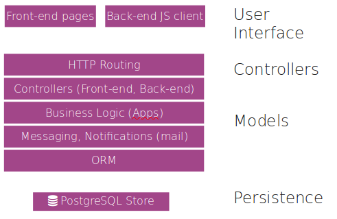

Hemos hecho una introducción creando unos módulos de prueba en Odoo. Ahora vamos a profundizar y explicar qué es cada uno de los elementos y cómo se utilizar, al menos con una profundidad mínima para poder desarrollar módulos básicos.

## Los módulos

Tanto el servidor como los clientes son módulos. Todos están guardados en una base de datos. Todo lo que se pueda hacer para modificar ***Odoo*** se hace en módulos.

### Composición de un módulo

Los módulos de ***Odoo*** amplían o modifican partes del *Modelo-Vista-Controlador*. De esta manera, un módulo puede tener:

- **Objetos de negocio**: Son la parte del modelo, definidos en clases de Python según una sintaxis propia del ORM de ***Odoo***.
- **Archivos de datos**: Son archivos XML que pueden definir datos, vistas o configuraciones.
- **Controladores web**: Gestionan las peticiones de los navegadores web.
- **Datos estáticos**: Imágenes, CSS o JavaScript utilizados por la interfaz web. Es necesario que los datos estáticos se guarden en el directorio **static**. Por ejemplo, el icono del módulo va en `static/description/icon.png`.

### Estructura de archivos de un módulo

Ya vimos en la sección anterior alguna de las características de los módulos: 

- Todos los módulos están en un directorio definido en la opción **--addons-path** o en el archivo de configuración, normalmente `addons`. Cada módulo esta un un subdirectorio dentro de esta carpeta y por lo que puede haber más de un directorio.
- Un módulo de Python se declara en un archivo de **manifest** (`__manigest__.py`) que da información sobre el módulo, lo que hace, los módulos de los que depende y cómo se debe instalar o actualizar. [Manifest in Odoo](https://www.odoo.com/documentation/8.0/reference/module.html#reference-module-manifest)
- Un módulo es un paquete de Python que necesita un archivo **\_\_init\_\_.py** para instanciar todos los archivos Python.

### Creación de módulos

También hemos visto que podemos crear un módulo de forma manual añadiendo cada una de las carpetas y ficheros de configuración o vimos que para ayudar al programador, ***Odoo*** contiene le comando `scaffold` para crear módulos vacíos. Este crea la estructura de archivos necesaria para empezar a trabajar:

    $ odoo scaffold <nombre_del_módulo> <dónde_crearlo>

Posteriormente veremos más sobre `scaffold`, pero si quieres más información puedes recurrir al [Manual oficial Scaffolding](https://www.odoo.com/documentation/8.0/reference/cmdline.html#scaffolding)

El parámetro **scaffold** puede tener la opción **-t** para indicar el directorio de la *plantilla*. Esta está hecha utilizando **jinja2**, que es un motor de plantillas para Python.

Las *plantillas* están en el directorio de instalación de Odoo, en el directorio **cli**. En nuestro caso: **cli/templates/** dentro del directorio de instalación de ***Odoo***.

<figure markdown="span" align="center">
  { width="75%"  }
  <figcaption>Plantillas de módulos Odoo utilizadas por `scaffold`.</figcaption>
</figure>

Como podemos observar, el ejemplo de la sección anterior *HolaMundo_V3" tiene exactamente esta estructura.

Podemos crear una nueva *plantilla* copiando el directorio `default` o `theme` y modificando los archivos. Esto puede ser útil si siempre hacemos módulos con la misma plantilla. Por ejemplo, para poner nuestro logo, copyright, etc.

## ORM

El **ORM** ("*Object-Relational Mapping*" o "*Mapeo Objeto-Relacional*") es una técnica de programación que permite convertir datos entre sistemas incompatibles utilizando lenguajes de programación orientados a objetos. En ***Odoo***, el **ORM** permite a los desarrolladores trabajar con la base de datos de manera más intuitiva y eficiente, sin necesidad de escribir consultas SQL directamente.

El **ORM** es como una capa de abstracción que mapea las tablas de la base de datos a clases de Python y las filas de esas tablas a instancias de esas clases. Esto significa que puedes manipular los datos de la base de datos utilizando objetos y métodos de Python, lo que simplifica enormemente el desarrollo y mantenimiento del código.

<figure markdown="span" align="center">
  { width="75%"  }
  <figcaption>ORM dentro de la arquitectura de Odoo.</figcaption>
</figure>


Con ORM en Odoo se puede 
- **Definición de modelos**: Puedes definir modelos de datos utilizando clases de Python. Cada modelo corresponde a una tabla en la base de datos.
- **Operaciones CRUD**: El ORM proporciona métodos para realizar operaciones CRUD (Crear, Leer, Actualizar, Eliminar) de manera sencilla. Por ejemplo, puedes crear un nuevo registro utilizando el método `create()`, leer registros con el método `search()`, actualizar registros con el método `write()`, y eliminar registros con el método `unlink()`.
- **Relaciones entre modelos**: Puedes definir relaciones entre modelos, como relaciones uno a muchos, muchos a uno, y muchos a muchos, utilizando campos específicos como `One2many`, `Many2one`, y `Many2many`.
- **Validaciones y restricciones**: Puedes definir validaciones y restricciones en los modelos para asegurar la integridad de los datos. Por ejemplo, puedes utilizar el decorador `@api.constrains` para definir restricciones personalizadas.

A continuación se muestra un **ejemplo** sencillo de cómo definir un modelo en ***Odoo*** utilizando el **ORM**:

```python
from odoo import models, fields, api

class ModeloEjemplo(models.Model):
    _name = 'modelo.ejemplo'
    _description = 'Descripción de modelo de ejemplo'

    name = fields.Char(string='Nombre', required=True)
    descripcion = fields.Text(string='Descripción')
    fecha = fields.Date(string='Fecha')

    @api.constrains('name')
    def _check_nombre(self):
       for record in self:
          if len(record.name) < 3:
             raise ValidationError('El nombre debe tener al menos 3 caracteres.')
```

En este ejemplo:

- Definimos un modelo llamado `ModeloEjemplo` que corresponde a una tabla en la base de datos.
- El modelo tiene tres campos: `nombre`, `descripcion`, y `fecha`.
- Utilizamos el decorador `@api.constrains` para definir una restricción que asegura que el campo `nombre` tenga al menos 3 caracteres.

Mediante **ORM**, ***Odoo*** mapea sus objetos en una base de datos, evitando al programador la mayoría de consultas SQL. De esta manera, el desarrollo de los módulos es muy rápido y se evitan errores de programación.

Los modelos se crean como clases de Python que extienden la clase **[models.Model](https://www.odoo.com/documentation/master/developer/reference/backend/orm.html)**, que contiene los campos y métodos útiles para trabajar con el ORM.

!!! Nota

    Los modelos, al heredar de **models.Model**, necesitan obligatoriamente asignar valores a algunas variables, como por ejemplo **\_name**.

***Odoo*** considera que un modelo es la referencia a una o más tablas en la base de datos. Un modelo no es una fila en la tabla, es toda la tabla.

> En programación, el **Modelo** es una forma de relacionar el programa con la base de datos. Es de más alto nivel que las consultas directas a la base de datos y que las **clases y objetos** respecto a la programación orientada a objetos. El modelo une en un único concepto las **estructuras de datos**, las **restricciones de integridad** y las opciones de **manipulación** de los datos.

Los modelos en ***Odoo*** pueden

- Heredar de **models.Model** y ser los normales, mapeados y permanentes en la base de datos. 
- Pueden ser **models.TransientModel**, que son iguales pero no tienen persistencia definitiva en la base de datos. Estos son los recomendados para crear `wizards`. 
- También pueden ser **models.AbstractModel** para definir modelos abstractos que luego serán heredados.

En Odoo, existen tres tipos principales de modelos que heredan de clases base diferentes según su propósito, se trata de `models.Model`, `models.TransientModel` y `models.AbstractModel`:

- `models.Model` se trata de Modelos persistentes. Representa una tabla real en la base de datos. Los datos almacenados en este modelo son permanentes. Por ejemplo Clientes, productos, facturas, etc.
- `models.TransientModel` son datos temporales (como asistentes o formularios rápidos), por lo tanto es un modelo no persistente. Los registros se eliminan automáticamente después de un tiempo (por defecto, 7 días). Se utilizan para Wizards, asistentes de importación/exportación, formularios temporales.
- `models.AbstractModel` que son modelos base reutilizables, o sea, se trata de modelos abstractos que no crea una tabla en la base de datos. Se utiliza para definir funcionalidades comunes que pueden ser heredadas por otros modelos.

Comparativa rápida

| Característica         | `models.Model` | `models.TransientModel` | `models.AbstractModel` |
|------------------------|----------------|--------------------------|-------------------------|
| Persistencia           | Sí             | No (temporal)            | No                      |
| Crea tabla en BD       | Sí             | Sí                       | No                      |
| Uso típico             | Datos reales   | Formularios/Wizards      | Funcionalidad común     |
| Eliminación automática | No             | Sí                       | No                      |

## Inspeccionar los modelos

Para ver los modelos existentes, se puede acceder a la base de datos PostgreSQL o consultar en *Configuración > Estructura de la base de datos > Modelos* dentro del modo desarrollador.

Cabe destacar el campo *modules*, donde se indican los módulos instalados en los que se define o hereda el modelo observado.

