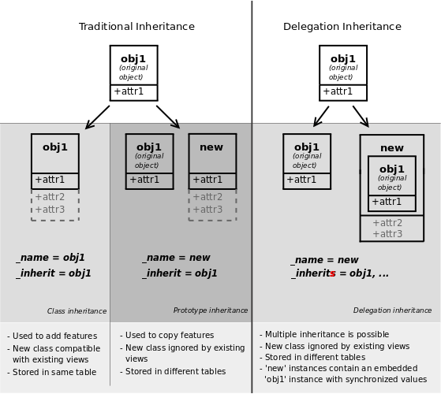

## Herencia

El framework de Odoo facilita el mecanismo de herencia para que los programadores puedan adaptar módulos existentes y, al mismo tiempo, garantizar que las actualizaciones de los módulos no rompan las personalizaciones desarrolladas.

La herencia se puede aplicar en los tres componentes del patrón MVC:

- **En el modelo**: permite ampliar clases existentes o diseñar nuevas clases a partir de las existentes.
- **En la vista**: permite modificar el comportamiento de vistas existentes o diseñar nuevas vistas.
- **En el controlador**: permite sobrescribir métodos existentes o diseñar nuevos.

Odoo proporciona tres mecanismos de herencia: herencia de clase, herencia por prototipo y herencia por delegación.

| **Mecanismo**      | **Características**         | **Cómo se define**  |
| --- | --- | --- | 
| **De clase**       | - Herencia simple.<br>- La clase original queda sustituida o ampliada.<br>- Añade nuevas funcionalidades (atributos y/o métodos) a la clase original.<br>- Las vistas definidas sobre la clase original siguen funcionando.<br>- Permite sobrescribir métodos de la clase original.<br>- En PostgreSQL, sigue mapeada en la misma tabla que la clase original, ampliada con los nuevos atributos. | - Se utiliza el atributo `_inherit` en la definición de la nueva clase Python: `_inherit = 'obj'`.<br>- El nombre de la nueva clase debe ser el mismo que el de la clase original: `_name = 'obj'`. |
| **Por prototipo**  | - Herencia simple.<br>- Aprovecha la definición de la clase original (como si fuera un "prototipo").<br>- La clase original sigue existiendo.<br>- Añade nuevas funcionalidades (atributos y/o métodos) a las de la clase original.<br>- Las vistas definidas sobre la clase original no existen (hay que diseñarlas de nuevo).<br>- Permite sobrescribir métodos de la clase original.<br>- En PostgreSQL, se mapea en una nueva tabla. | - Se utiliza el atributo `_inherit` en la definición de la nueva clase Python: `_inherit = 'obj'`.<br>- Se debe indicar el nombre de la nueva clase: `_name = 'nuevo_nombre'`.                   |
| **Por delegación** | - Herencia simple o múltiple.<br>- La nueva clase "delega" ciertos comportamientos a otras clases que incorpora internamente.<br>- Los recursos de la nueva clase contienen un recurso de cada clase de la que derivan.<br>- Las clases base siguen existiendo.<br>- Añade sus propias funcionalidades (atributos y/o métodos).<br>- Las vistas definidas sobre las clases base no existen en la nueva clase.<br>- En PostgreSQL, se mapea en diferentes tablas: una para los atributos propios y otras para los recursos de las clases base. | - Se utiliza el atributo `_inherits` en la definición de la nueva clase Python: `_inherits = {'obj': 'field_id'}`.<br>- Se debe indicar el nombre de la nueva clase: `_name = 'nuevo_nombre'`.     |

<figure markdown="span" align="center">
  { width="75%"  }
  <figcaption>Herencia en Odoo</figcaption>
</figure>

### Herencia en el Modelo

El diseño de un modelo heredado en Odoo es similar al de un modelo no heredado, con dos diferencias principales:

- Aparece el atributo **_inherit** o **_inherits** para indicar el objeto (herencia simple) o los objetos (herencia múltiple) de los que deriva el nuevo objeto. La sintaxis es:

    ```python
    _inherit = 'nombre.objeto.del.que.se.hereda'
    _inherits = {'nombre.objeto1': 'nombre_campo_FK1', ...}
    ```

- En caso de herencia simple, el nombre (atributo `_name`) del objeto derivado puede coincidir o no con el del objeto padre. Si no se indica el atributo `_name`, el nuevo objeto mantiene el nombre del objeto padre.

#### Herencia de clase

La herencia simple (`_inherit`) con atributo `_name` idéntico al del objeto padre se denomina **herencia de clase**. En este caso, el nuevo objeto sustituye al objeto padre, aunque las vistas sobre el objeto padre siguen funcionando. Es el tipo de herencia más habitual y se utiliza para añadir campos y/o modificar propiedades o métodos existentes. Los nuevos campos se añaden a la tabla de la base de datos donde estaba mapeado el objeto padre.

**Ejemplo de herencia de clase:**

```python
class ResPartner(models.Model):
        _inherit = 'res.partner'
        debit_limit = fields.Float('Límite de crédito')
        # ...
```

Puedes comprobar que la tabla `res_partner` de una empresa sin el módulo de contabilidad instalado no contiene el campo `debit_limit`, pero sí aparece una vez instalado el módulo.

#### Herencia por prototipo

La herencia simple (`_inherit`) con atributo `_name` diferente al del objeto padre se denomina **herencia por prototipo**. En este caso, se crea un nuevo objeto que agrupa los datos y métodos del objeto del que deriva, junto con los nuevos datos y métodos que incorpore. Siempre se crea una nueva tabla en la base de datos para mapear el nuevo objeto.

**Ejemplo de herencia por prototipo:**

```python
class ResAlarm(models.Model):
        _name = 'res.alarm'
        # ...

class CalendarAlarm(models.Model):
        _name = 'calendar.alarm'
        _inherit = 'res.alarm'
        # ...
```

En este ejemplo, la tabla `calendar_alarm` tendrá los campos de `res_alarm` más los propios.

> **Nota:** La herencia por prototipo es la tradicional en los lenguajes orientados a objetos, ya que crea una nueva clase vinculada.

#### Herencia por delegación

La herencia múltiple (`_inherits`) se denomina **herencia por delegación** y siempre crea una nueva tabla en la base de datos. El objeto derivado debe incluir, por cada derivación, un campo Many2one apuntando al objeto del que deriva, con la propiedad `ondelete='cascade'`. Cada recurso del objeto derivado apunta a un recurso de cada uno de los objetos de los que deriva.

**Ejemplo de herencia por delegación:**

```python
class ResAlarm(models.Model):
        _name = 'res.alarm'
        # ...

class CalendarAlarm(models.Model):
        _name = 'calendar.alarm'
        _inherits = {'res.alarm': 'alarm_id'}
        alarm_id = fields.Many2one('res.alarm', required=True, ondelete='cascade')
        # ...
```

---

### Herencia en la Vista

La herencia de clase permite seguir utilizando las vistas definidas sobre el objeto padre, pero a menudo interesa disponer de una versión modificada. En este caso, es mejor heredar de las vistas existentes (para añadir, modificar o eliminar campos) que reemplazarlas completamente.

Para heredar una vista, se utiliza el campo `inherit_id`:

```xml
<field name="inherit_id" ref="id_xml_vista_padre"/>
```

Si la vista está en otro módulo, se debe anteponer el nombre del módulo:

```xml
<field name="inherit_id" ref="modulo.id_xml_vista_padre"/>
```

El motor de herencia de Odoo procesa el contenido del elemento `arch` y, por cada hijo con atributos, busca en la vista padre una etiqueta con atributos coincidentes (excepto el de posición). Luego, combina los campos de la vista padre con los de la vista heredada y establece la posición de los nuevos elementos según los siguientes valores:

- **inside** (por defecto): los valores se añaden "dentro" de la etiqueta.
- **after**: añade el contenido después de la etiqueta.
- **before**: añade el contenido antes de la etiqueta.
- **replace**: reemplaza el contenido de la etiqueta.
- **attributes**: modifica solo los atributos de la etiqueta.

**Ejemplos:**

- **Reemplazar un campo:**

    ```xml
    <field name="arch" type="xml">
        <field name="campo" position="replace">
            <field name="nuevo_campo" ... />
        </field>
    </field>
    ```

- **Eliminar un campo:**

    ```xml
    <field name="arch" type="xml">
        <field name="campo" position="replace"/>
    </field>
    ```

- **Insertar nuevos campos:**

    ```xml
    <field name="arch" type="xml">
        <field name="campo" position="before">
            <field name="nuevo_campo" .../>
        </field>
    </field>
    ```

- **Combinaciones:**

    ```xml
    <field name="arch" type="xml">
        <data>
            <field name="campo1" position="after">
                <field name="nuevo_campo1"/>
            </field>
            <field name="campo2" position="replace"/>
            <field name="campo3" position="before">
                <field name="nuevo_campo3"/>
            </field>
        </data>
    </field>
    ```

- **Usar expresiones XPath:**

    ```xml
    <xpath expr="//field[@name='order_line']/tree/field[@name='price_unit']" position="before"/>
    <xpath expr="//form/*" position="before">
        <header>
            <field name="status" widget="statusbar"/>
        </header>
    </xpath>
    ```

- **Vista personalizada en una acción:**

    ```xml
    <record model="ir.actions.act_window" id="mi_accion">
        <field name="name">Mi Acción</field>
        <field name="res_model">mi.modelo</field>
        <field name="view_mode">tree,form</field>
        <field name="view_ids" eval="[(5, 0, 0),
            (0, 0, {'view_mode': 'tree', 'view_id': ref('mi_modulo.mi_vista_tree')}),
            (0, 0, {'view_mode': 'form', 'view_id': ref('mi_modulo.mi_vista_form')}),
        ]"/>
    </record>
    ```

- **Vista de búsqueda personalizada:**

    ```xml
    <field name="search_view_id" ref="mi_modulo.mi_vista_search"/>
    ```

- **Domain en la acción:**

    ```xml
    <field name="domain">[('is_player','=',True)]</field>
    ```

- **Contexto por defecto:**

    ```xml
    <field name="context">{'default_is_player': True}</field>
    ```

- **Filtro por defecto en la vista search:**

    ```xml
    <search>
        <filter name="player_partner" string="Es jugador" domain="[('is_player','=',True)]"/>
    </search>
    <field name="context">{'default_is_player': True, 'search_default_player_partner': 1}</field>
    ```

---

### Herencia en el Controlador

La herencia en el controlador es habitual cuando necesitamos sobrescribir métodos de la capa ORM de Odoo en el diseño de módulos.

```tip
**Función `super()`**

Python recomienda utilizar la función `super()` para invocar el método de la clase base al sobrescribirlo, en lugar de usar la sintaxis `NombreClaseBase.metodo(self, ...)`.
```

Al sobrescribir un método en el objeto derivado, se pueden dar dos situaciones:

- A veces queremos sustituir completamente el método de la clase base: el método derivado **no** invoca al método sobrescrito.
- Otras veces queremos aprovechar la funcionalidad del método base: el método derivado **sí** invoca al método sobrescrito usando `super()`.

**Ejemplo sobrescribiendo el método `create`:**

```python
class ResPartner(models.Model):
        _inherit = 'res.partner'
        passed_override_write_function = fields.Boolean(string='Ha pasado por nuestro método super')

        @api.model
        def create(self, values):
                # Sobrescribimos la función create original del modelo res.partner
                record = super(ResPartner, self).create(values)
                # Modificamos el valor de un campo en este método
                record.passed_override_write_function = True
                print('Ha pasado por esta función. Valor de passed_override_write_function: ' + str(record.passed_override_write_function))
                # Devolvemos el registro para que se apliquen los cambios
                return record
```
