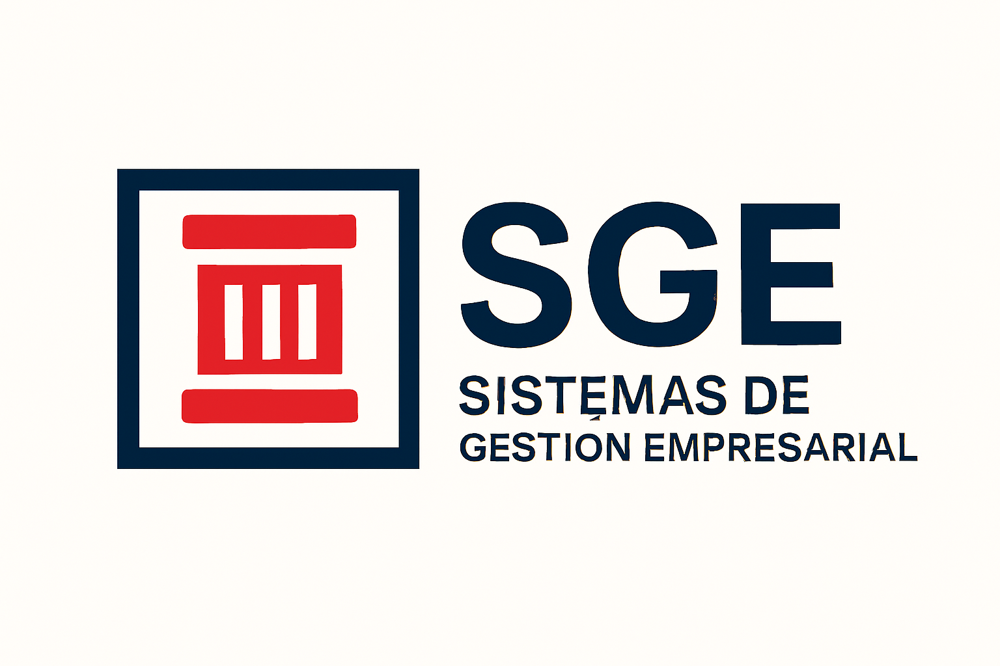

Apuntes del módulo de **SGE** (Sistemas de Gestión Empresarial) para el ciclo formativo de grado superior de **DAM** (Desarrollo de Aplicaciones Multimedia)

<figure markdown="span" align="center">
  { width="25%"  }
</figure>

En este espacio encontrarás los apuntes básicos sobre el módulo pasando por la descripción y caracterización de ERPs (***Enterprise Resource Planning*** o *Planificación de Recursos Empresariales*), así como la posterior preparación del entorno de trabajo para instalar, configurar y desarrollar en Odoo. 

Muchas instrucciones están adaptadas para el funcionamiento de Odoo en un entorno de aprendizaje. El objetivo es desarrollar módulos para ampliar las funcionalidades del ERP según las necesidades de la empresa.

Esta documentación, esencialmente la parte de ODOO, se ha realizado teniendo como base el siguiente material:

 - [Odoo: Technical Training - Introducing to development](https://www.odoo.com/slides/technical-training-introduction-to-development-318)
 - [Odoo: Tutorial Server framework 101](https://www.odoo.com/documentation/18.0/es/developer/tutorials/server_framework_101.html)
 - [Odoo: Referencia](https://www.odoo.com/documentation/18.0/es/developer/reference.html)
- Apuntes de SGE de los siguientes profesores/as
    - [Jose Castillo](https://es.linkedin.com/in/jose-castillo-11a02b66)
    - [Alberto Aparicio](https://es.linkedin.com/in/alberto-aparicio-vila-26923753)
    - [Inma Gijón](https://es.linkedin.com/in/inmaculada-gij%C3%B3n-cardos-38651656)
    - Alfredo Oltra

Apuntes desarrollados por ***Sergio Rey Martinez***

---

_Licenciado bajo la [Licencia Creative Commons Atribución Compartir Igual 4.0](http://creativecommons.org/licenses/by-sa/4.0/)_

